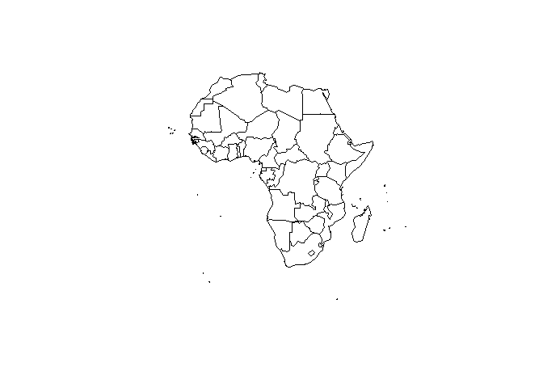
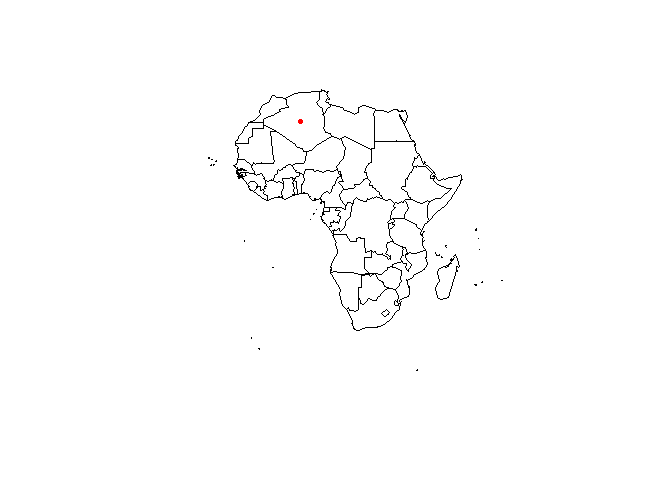
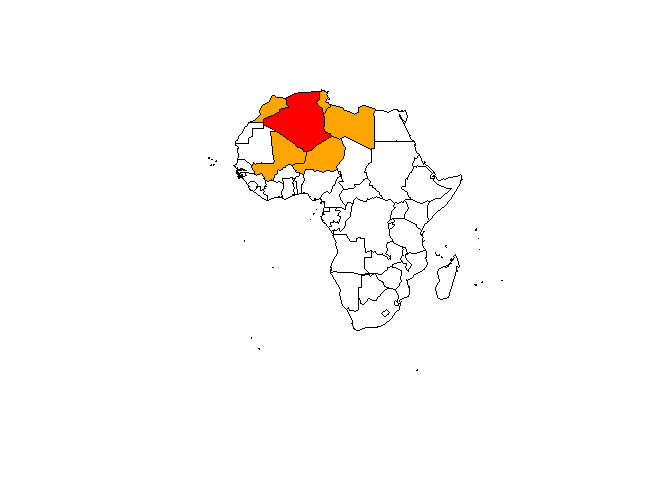
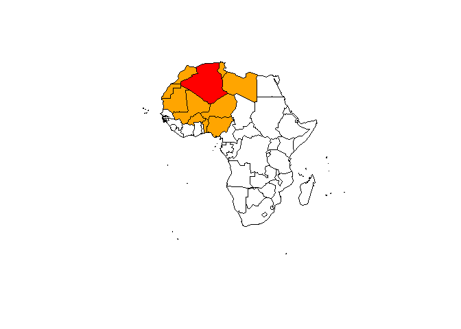
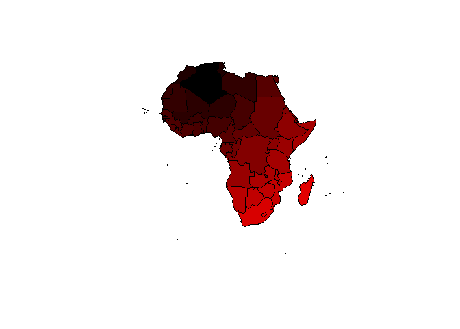

Get a map of Africa
-------------------

    library(maptools)
    data(wrld_simpl)
    Africa <- wrld_simpl[wrld_simpl@data$REGION==2,]
    plot(Africa)

Get the center of a polygon
---------------------------

    library(sp)
    Af <- coordinates(Africa)
    plot(Africa)
    points(x=Af[1,1],y=Af[1,2],col="red",pch=20)

Find the nearest neighbours
---------------------------

    library(spdep)
    Af_nb <- tri2nb(Af)

The neighbours for the first country:

    Af_nb[1]

    ## [[1]]
    ## [1] 24 26 27 32 48

Find the nearest neighbours
---------------------------

    plot(Africa)
    plot(Africa[1,],col="red",add=T)
    plot(Africa[Af_nb[1][[1]],],col="orange",add=T)

Find the nearest 10 neighbours
------------------------------

    IDs <- row.names(as(Africa, "data.frame"))
    Af10_nb <- knn2nb(knearneigh(Af, k = 10), row.names = IDs)
    plot(Africa)
    plot(Africa[1,],col="red",add=T)
    plot(Africa[Af10_nb[1][[1]],],col="orange",add=T)

Compute the distance
--------------------

    Af <- coordinates(Africa) # get centroid
    library(raster)
    pointDistance(Af[1:4,], lonlat=TRUE) # compute distance

    ##         [,1]    [,2]    [,3] [,4]
    ## [1,]       0      NA      NA   NA
    ## [2,] 4763231       0      NA   NA
    ## [3,] 2055609 2954497       0   NA
    ## [4,] 3484053 1295173 1839191    0

Compute/plot a distance matrix
------------------------------

    Dist_Af <- pointDistance(Af, lonlat=TRUE)
    Af_color <- Dist_Af[,1]
    Af_color <- Af_color/max(Af_color)
    Af_color <- rgb(Af_color,0,0)
    plot(Africa,col=Af_color)

Links
-----

-   [Raster, CMSAF and
    solaR](https://procomun.wordpress.com/2011/06/17/raster-cmsaf-and-solar/)

-   [Getting rasters into shape from
    R](https://johnbaumgartner.wordpress.com/2012/07/26/getting-rasters-into-shape-from-r/)
