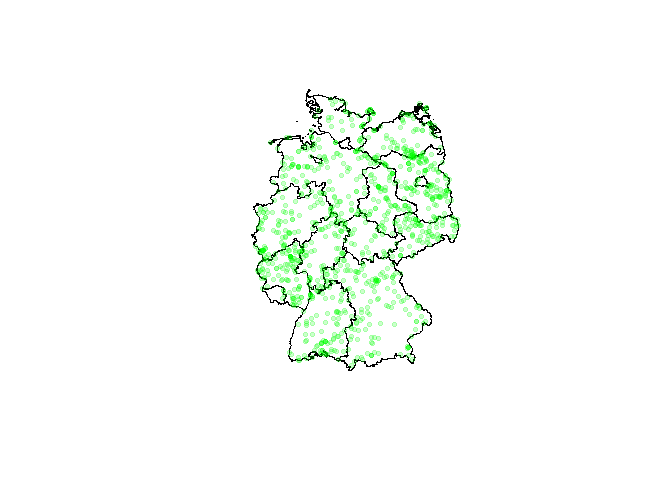
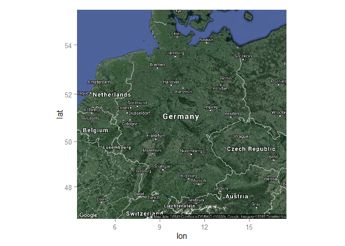
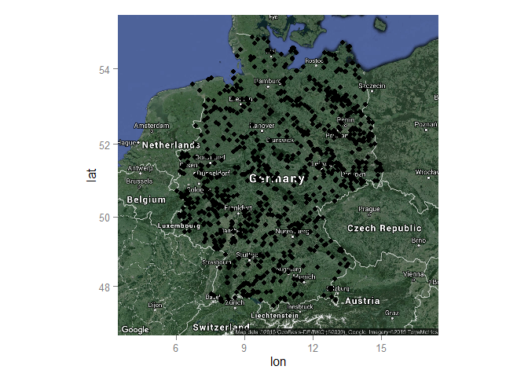
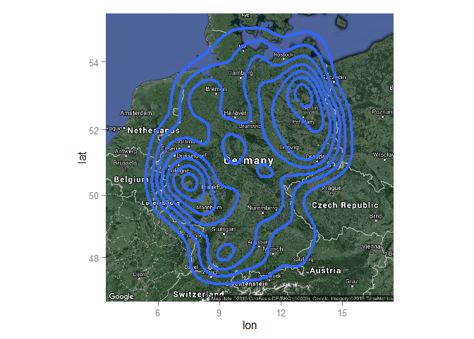
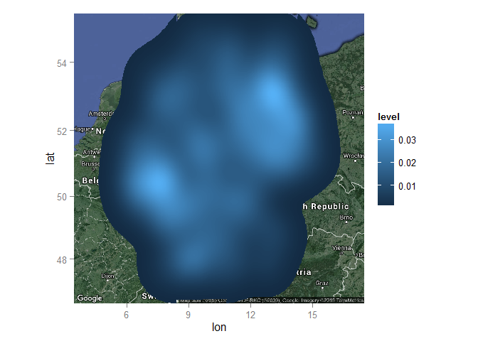
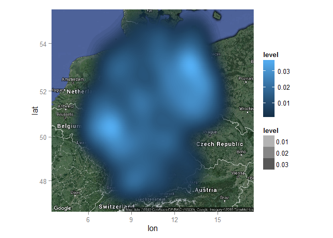
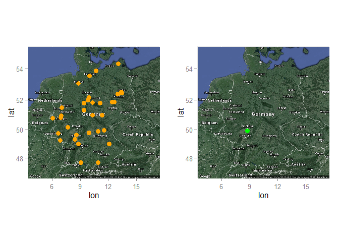
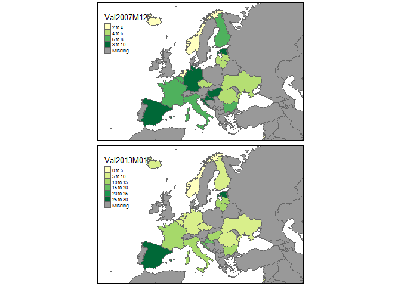
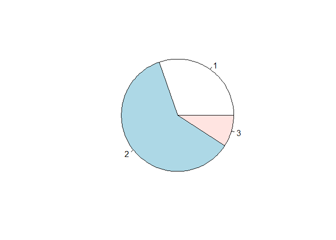

Organisation
------------

-   Send me your presentation until November 17.
-   If you have interactive graphs please be shure to have also an
    offline version
-   If you use data please provide the source (OpenStreetMap, Google
    etc.)
-   Please give some background information also about the source
-   If you use R to produce maps please send me your code (myCode.R)

Presentation techniques
-----------------------

-   You can use LaTeX Beamer/Powerpoint/Rstudio
-   If you use Powerpoint please produce also a pdf version
-   You can also use Rstudio to produce presentations (makes sense for
    interactive maps)

Presentations with Rstudio I
----------------------------

Presentations with Rstudio II
-----------------------------

Presentations with Rstudio III
------------------------------

Questions
---------

-   How to plot two maps side by side?
-   How to save plots?
-   How to get popups in interactive plots?

Example on Campsites
--------------------

-   Data downloaded from:

<http://www.openstreetmap.de/>

-   With usage of:

<http://wiki.openstreetmap.org/wiki/Overpass_API>

    url <- "https://raw.githubusercontent.com/Japhilko/
    GeoData/master/2015/data/CampSites_Germany.csv"
    CampSites <- read.csv(url)

Overview of Campsite data
-------------------------

    kable(CampSites[1:8,1:4])

<table>
<thead>
<tr class="header">
<th align="right">X</th>
<th align="left">name</th>
<th align="left">tourism</th>
<th align="left">website</th>
</tr>
</thead>
<tbody>
<tr class="odd">
<td align="right">1</td>
<td align="left">Campingplatz Winkelbachtal</td>
<td align="left">camp_site</td>
<td align="left"><a href="http://www.gruibingen.de/campingplatz.html" class="uri">http://www.gruibingen.de/campingplatz.html</a></td>
</tr>
<tr class="even">
<td align="right">2</td>
<td align="left">Radler-Zeltplatz</td>
<td align="left">camp_site</td>
<td align="left">NA</td>
</tr>
<tr class="odd">
<td align="right">3</td>
<td align="left">Campingplatz des Naturfreundehauses</td>
<td align="left">camp_site</td>
<td align="left">NA</td>
</tr>
<tr class="even">
<td align="right">4</td>
<td align="left">Campingplatz Am Aichstruter Stausee</td>
<td align="left">camp_site</td>
<td align="left">NA</td>
</tr>
<tr class="odd">
<td align="right">5</td>
<td align="left">NA</td>
<td align="left">camp_site</td>
<td align="left">NA</td>
</tr>
<tr class="even">
<td align="right">6</td>
<td align="left">Kandern</td>
<td align="left">camp_site</td>
<td align="left">NA</td>
</tr>
<tr class="odd">
<td align="right">7</td>
<td align="left">Campingplatz Baiersbronn-Obertal</td>
<td align="left">camp_site</td>
<td align="left">NA</td>
</tr>
<tr class="even">
<td align="right">8</td>
<td align="left">Campingplatz Schwabenmühle</td>
<td align="left">camp_site</td>
<td align="left">NA</td>
</tr>
</tbody>
</table>

Get a map for Germany
---------------------

    library(raster)
    DEU1 <- getData('GADM', country='DEU', level=1)
    plot(DEU1)

Add Campsites
-------------

    plot(DEU1)
    points(y=CampSites$lat,x=CampSites$lon,col="red",pch=20)

Change the alpha level
----------------------

    plot(DEU1)
    points(y=CampSites$lat,x=CampSites$lon,col=rgb(0,1,0,.2),
           pch=20)

Get a google map for Germany
----------------------------

    library(ggmap)
    DE_Map <- qmap("Germany", zoom=6, maptype="hybrid")
    DE_Map

Plot points on google map
-------------------------

    DE_Map + geom_point(aes(x = lon, y = lat),
                        data = CampSites)

Density plot
------------

    DE_Map + geom_density2d(data = CampSites,                  aes(x = lon, y = lat),lwd=1.5)

Another density plot
--------------------

    DE_Map + stat_density2d(data = CampSites, 
    aes(x = lon, y = lat,fill = ..level..), bins = 100, 
    geom = 'polygon')

Another density plot
--------------------

    DE_Map + stat_density2d(data=CampSites, 
                            aes(x=lon,y=lat,fill=..level..,
    alpha = ..level..),bins=80,geom='polygon')

Make the interactive map
------------------------

Prepare an interactive map

    library(magrittr)
    library(leaflet)

    m <- leaflet() %>%
      addTiles() %>%  
      addMarkers(lng=CampSites$lon, 
                 lat=CampSites$lat, 
                 popup=CampSites$name)
    m

Push more information
---------------------

    popupInfo <- paste(CampSites$name,"\n",CampSites$website)

    m <- leaflet() %>%
      addTiles() %>%  # Add default OpenStreetMap map tiles
      addMarkers(lng=CampSites$lon, 
                 lat=CampSites$lat, 
                 popup=popupInfo)
    m

Result is here:

<http://rpubs.com/Japhilko82/CampSitesHL>

The resulting map
-----------------

Popups in interactive map
-------------------------

I uploaded the result to Rpubs: <http://rpubs.com/Japhilko82/Campsites>

How to publish on Rpubs
-----------------------

ggmap: two plots side by side
-----------------------------

    url <- "https://raw.githubusercontent.com/Japhilko/
    GeoData/master/2015/data/whcSites.csv"
    UNESCO <- read.csv(url)

<table>
<thead>
<tr class="header">
<th align="left">name_en</th>
<th align="right">latitude</th>
<th align="right">longitude</th>
</tr>
</thead>
<tbody>
<tr class="odd">
<td align="left">Cultural Landscape and Archaeological Remains of the Bamiyan Valley</td>
<td align="right">34.84694</td>
<td align="right">67.82525</td>
</tr>
<tr class="even">
<td align="left">Minaret and Archaeological Remains of Jam</td>
<td align="right">34.39656</td>
<td align="right">64.51606</td>
</tr>
<tr class="odd">
<td align="left">Historic Centres of Berat and Gjirokastra</td>
<td align="right">40.06944</td>
<td align="right">20.13333</td>
</tr>
<tr class="even">
<td align="left">Butrint</td>
<td align="right">39.75111</td>
<td align="right">20.02611</td>
</tr>
</tbody>
</table>

Get sites for Germany
---------------------

    library(ggmap)
    ind <- UNESCO$states_name_en=="Germany"
    UNESCO_DE <- UNESCO[ind,]

Plot first map
--------------

    library(ggplot2)
    DE_Map + geom_point(aes(x = longitude, y = latitude),
                        data = UNESCO_DE)

Produce two maps
----------------

    library(ggplot2)
    DNunesco <- UNESCO_DE[UNESCO_DE$category=="Natural",]
    DCunesco <- UNESCO_DE[UNESCO_DE$category=="Cultural",]

    Csites <- DE_Map + geom_point(aes(x = longitude, 
                                      y = latitude),
                                  data =DCunesco,
                                  col="orange", size= 3)

    Nsites <- DE_Map + geom_point(aes(x = longitude, 
                                      y = latitude),
                                  data = DNunesco,
                                  col="green", size= 3)

Two plots [side by side](http://stackoverflow.com/questions/1249548/side-by-side-plots-with-ggplot2)
----------------------------------------------------------------------------------------------------

    library(gridExtra)
    grid.arrange(Csites, Nsites, ncol=2)

Load the data
-------------

    url <- "https://raw.githubusercontent.com/Japhilko/
    GeoData/master/2015/data/Unemployment07a13.csv"

    Unemp <- read.csv(url) 

Overview data
-------------

<table>
<thead>
<tr class="header">
<th align="left">GEO</th>
<th align="right">Val2007M12</th>
<th align="right">Val2013M01</th>
</tr>
</thead>
<tbody>
<tr class="odd">
<td align="left">EU28</td>
<td align="right">6.9</td>
<td align="right">10.9</td>
</tr>
<tr class="even">
<td align="left">EU27</td>
<td align="right">6.9</td>
<td align="right">10.9</td>
</tr>
<tr class="odd">
<td align="left">EU25</td>
<td align="right">6.9</td>
<td align="right">11.0</td>
</tr>
<tr class="even">
<td align="left">EU15</td>
<td align="right">6.9</td>
<td align="right">11.1</td>
</tr>
<tr class="odd">
<td align="left">EA</td>
<td align="right">7.3</td>
<td align="right">12.0</td>
</tr>
<tr class="even">
<td align="left">EA19</td>
<td align="right">7.3</td>
<td align="right">12.0</td>
</tr>
<tr class="odd">
<td align="left">EA18</td>
<td align="right">7.4</td>
<td align="right">12.0</td>
</tr>
<tr class="even">
<td align="left">EA17</td>
<td align="right">7.4</td>
<td align="right">12.0</td>
</tr>
</tbody>
</table>

Usage of package tmap
---------------------

    library(tmap)
    data(Europe)

Match the data
--------------

    iso_a2<- substr(Europe@data$iso_a3,1,2)
    ind <- match(iso_a2,Unemp$GEO)
    Europe@data$Val2007M12 <- Unemp$Val2007M12[ind]
    Europe@data$Val2013M01 <- Unemp$Val2013M01[ind]

Make the map
------------

    qtm(Europe,c("Val2007M12","Val2013M01"))

A pie chart
-----------

    Students <- c(100, 200,30)
    pie(Students)

Save graphics
-------------

    pdf("pie_Students.pdf")
    pie(Students)
    dev.off()

    ## png 
    ##   2
