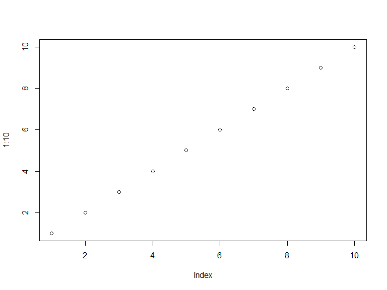
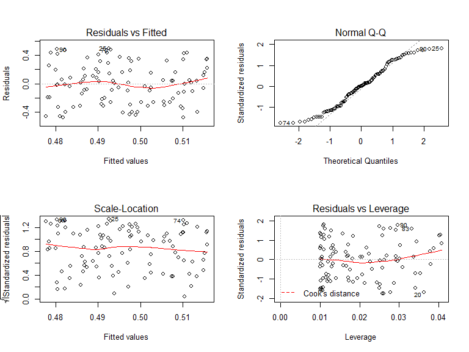
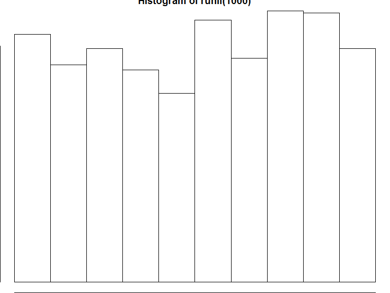
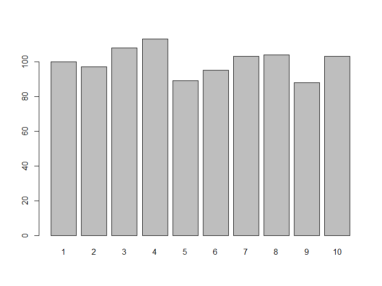
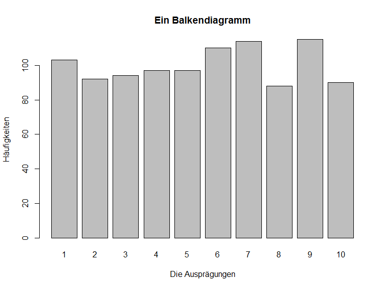

# Nutzung von GeoDaten in den Sozialwissenschaften - Datentypen, Graphiken, Schleifen etc.
Jan-Philipp Kolb  
07 April 2016  


## Ein `data.frame`


```r
?data.frame
```


```r
L3 <- LETTERS[1:3]
fac <- sample(L3, 10, replace = TRUE)
d <- data.frame(x = 1, y = 1:10, fac = fac)
```


  x    y  fac 
---  ---  ----
  1    1  C   
  1    2  B   
  1    3  A   
  1    4  B   
  1    5  C   
  1    6  A   
  1    7  B   
  1    8  B   
  1    9  B   
  1   10  A   

## Einen Überblick über die Daten


```r
head(d)
```

```
##   x y fac
## 1 1 1   C
## 2 1 2   B
## 3 1 3   A
## 4 1 4   B
## 5 1 5   C
## 6 1 6   A
```

## Datentypen

- Wenn ein Vektor als `factor` dargestellt wird, gibt es manchmal Probleme diesen mit einem anderen Vektor zu matchen.

- Deshalb muss man den Datentyp verändern.

- Am Besten ist es `character` zu matchen.


## `integer` in `character` umwandeln


```r
A <- 1:10
A
```

```
##  [1]  1  2  3  4  5  6  7  8  9 10
```

```r
str(A)
```

```
##  int [1:10] 1 2 3 4 5 6 7 8 9 10
```


```r
B <- as.character(A)
B
```

```
##  [1] "1"  "2"  "3"  "4"  "5"  "6"  "7"  "8"  "9"  "10"
```

```r
str(B)
```

```
##  chr [1:10] "1" "2" "3" "4" "5" "6" "7" "8" "9" ...
```

## Ein `factor`


```r
AB <- sample(LETTERS,4)
AB <- as.factor(AB)
levels(AB) <- LETTERS
table(AB)
```

```
## AB
## A B C D E F G H I J K L M N O P Q R S T U V W X Y Z 
## 1 1 1 1 0 0 0 0 0 0 0 0 0 0 0 0 0 0 0 0 0 0 0 0 0 0
```

## Das Matchen


```r
?match
```


```r
1:10 %in% c(1,3,5,9)
```

```
##  [1]  TRUE FALSE  TRUE FALSE  TRUE FALSE FALSE FALSE  TRUE FALSE
```

- Ergebnis ist ein `logical`.
- Man bekommt die Aussagen wahr und falsch.


```r
match(1:10,c(1,3,5,9))
```

```
##  [1]  1 NA  2 NA  3 NA NA NA  4 NA
```

- Als Ergebnis bekommt man die Stelle an der sich die Zahl im zweiten Vektor wiederfindet.

## Fehlende Werte

- Fehlende Werte sind in R mit `NA` definiert.
- Man bekommt die Information, ob es sich um einen fehlenden Wert handelt mit der Funktion `is.na`.


```r
A <- 1:10
is.na(A)
```

```
##  [1] FALSE FALSE FALSE FALSE FALSE FALSE FALSE FALSE FALSE FALSE
```


```r
A[5] <- NA
is.na(A)
```

```
##  [1] FALSE FALSE FALSE FALSE  TRUE FALSE FALSE FALSE FALSE FALSE
```

## Die Länge eines Vektors


```r
A <- 1:10
length(A)
```

```
## [1] 10
```


## if-Abfrage

- Nur wenn Bedingung erfüllt ist, wird das Statement in den geschweiften Klammern ausgeführt.


```r
a <- 5
if (a>4){
  cat("Dies stimmt")
}
```

```
## Dies stimmt
```


```r
a <- 3
if (a>4){
  cat("Dies stimmt")
}
```


## Schleifen


```r
A <- 1
for (i in 1:5){
  A <- A + i
  cat(A,"\n")
}
```

```
## 2 
## 4 
## 7 
## 11 
## 16
```

## Matchen mit `agrep`


```r
?agrep
```


```r
agrep("lasy", "1 lazy 2")
```

```
## [1] 1
```

## Die Funktion `which`


```r
A <- 1:10
A
```

```
##  [1]  1  2  3  4  5  6  7  8  9 10
```

```r
which(A==5)
```

```
## [1] 5
```

```r
which(A>5)
```

```
## [1]  6  7  8  9 10
```

## Tabellieren


```r
A <- sample(1:10,100,replace=T)
table(A)
```

```
## A
##  1  2  3  4  5  6  7  8  9 10 
##  9  4 10 15  9 10 11 11 10 11
```

## Die Funktion cut

- Diese Funktion kann verwendet werden um zu kategorisieren


```r
?cut
```


```r
Z <- rnorm(10000)
head(Z)
```

```
## [1] -0.4730251 -1.3230740  0.3184654  0.4738812 -1.0084212 -0.4392871
```


```r
Zc <- cut(Z, breaks = -6:6)
head(Zc)
```

```
## [1] (-1,0]  (-2,-1] (0,1]   (0,1]   (-2,-1] (-1,0] 
## 12 Levels: (-6,-5] (-5,-4] (-4,-3] (-3,-2] (-2,-1] (-1,0] (0,1] ... (5,6]
```


```r
table(Zc)
```

```
## Zc
## (-6,-5] (-5,-4] (-4,-3] (-3,-2] (-2,-1]  (-1,0]   (0,1]   (1,2]   (2,3] 
##       0       0       7     238    1391    3422    3374    1341     212 
##   (3,4]   (4,5]   (5,6] 
##      15       0       0
```

## Die Funktion `plot`

- `plot` ist eine generische Funktion 
- d.h. je nachdem welches Objekt man rein steckt kommt ein anderes Ergebnis heraus.


```r
plot(1:10)
```

<!-- -->

## Ein weiterer plot


```r
A <- runif(100)
B <- runif(100)
mod1 <- lm(A~B)

par(mfrow=c(2,2))
plot(mod1)
```

<!-- -->

## Eine Graphik ohne Rand

- Optionen bei der Gestaltung von Basis-Graphiken


```r
?par
```


```r
par(mai=c(0,0,0,0))
plot(hist(runif(1000)))
```

<!-- --><!-- -->

## Ein Balkendiagramm


```r
A <- sample(1:10,1000,replace=T)
tabA <- table(A)

barplot(tabA)
```

<!-- -->

## Die Achsenbezeichnung


```r
barplot(tabA,xlab="Die Ausprägungen",
        ylab="Häufigkeiten",
        main="Ein Balkendiagramm")
```

<!-- -->

