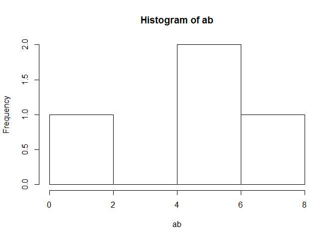
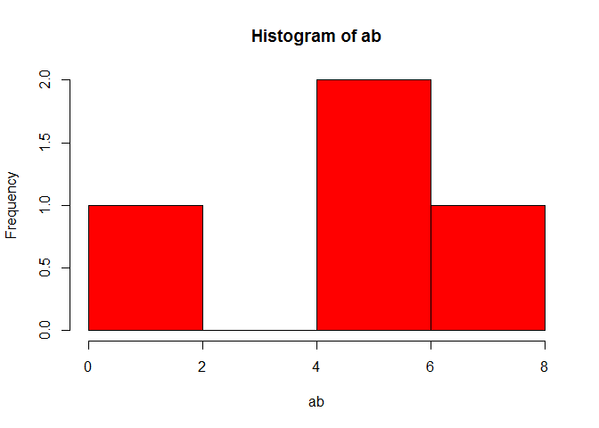

Pakete installieren und laden
-----------------------------

Ein Paket installieren

    install.packages("ggmap")

Ein Paket laden

    library(ggmap)

    ## Loading required package: ggplot2

Funktionen durchführen
----------------------

    # BSP Funktion die kein Argument braucht:
    date()

    ## [1] "Tue Apr 05 08:12:22 2016"

    # BSP Funktion mit einem Argument
    sqrt(5)

    ## [1] 2.236068

    # BSP Funktion mit mehr Argumenten
    sample(1:10,3)

    ## [1] 2 6 8

Der Zuweisungspfeil
-------------------

So wird ein Objekt a erzeugt:

    a <- 5

Dieses Objekt befindet sich dann im Workspace.

Objekt b - Zahlen von 1 bis 10:

    b <- 1:10

So bekommt man Hilfe
--------------------

Mit einem Fragezeichen vor dem Befehlsnamen bekommt man die Hilfe
angezeigt.

    ?mean

Mehrere Zahlen zu einem Vektor verbinden
----------------------------------------

    ab <- c(1,5,6,7)

Eine Graphik erzeugen
---------------------

    hist(ab)

<!-- -->

Farbe hinzu
-----------

    hist(ab,col="red")

<!-- -->
