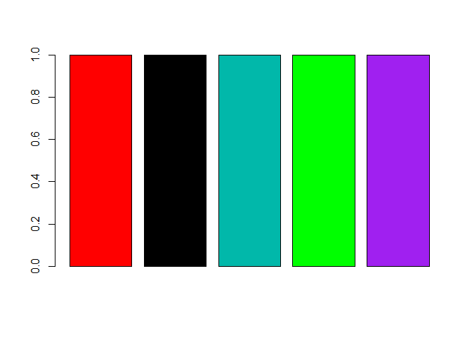

Rstudio installieren/updaten
----------------------------

Die aktuellste Version von Rstudio kann man hier herunterladen:

<https://www.rstudio.com/products/rstudio/download/>

Nutzung von AddIns in Rstudio
-----------------------------

<https://rstudio.github.io/rstudioaddins/>

Um den Colourpicker zu nutzen muss bspw. folgendes Paket installiert
werden:

    install.packages("shinyjs")

Objekttypen
-----------

    a <- c(1,2,3,4)
    str(a)

    ##  num [1:4] 1 2 3 4

    b <- c("red","green","blue")
    str(b)

    ##  chr [1:3] "red" "green" "blue"

    d <- c(1,2,"green")
    str(d)

    ##  chr [1:3] "1" "2" "green"

Sequenzen
---------

    1:4

    ## [1] 1 2 3 4

    4:1

    ## [1] 4 3 2 1

    seq(1,4,by=.5)

    ## [1] 1.0 1.5 2.0 2.5 3.0 3.5 4.0

    rep(1,5)

    ## [1] 1 1 1 1 1

Farben in R
-----------

    barplot(rep(1,5),
            col=c("red",1,"#01B8AA",
                  rgb(0,1,0),"purple"))

<!-- -->

Logische Abfragen
-----------------

    vector1 <- 1:10
    vector1==5

    ##  [1] FALSE FALSE FALSE FALSE  TRUE FALSE FALSE FALSE FALSE FALSE

    vector1>5

    ##  [1] FALSE FALSE FALSE FALSE FALSE  TRUE  TRUE  TRUE  TRUE  TRUE

    vector1<5

    ##  [1]  TRUE  TRUE  TRUE  TRUE FALSE FALSE FALSE FALSE FALSE FALSE

Ein `data.frame`
----------------

    A <- 1:6
    B <- rep(1:2,3)
    C <- runif(6)

    ABC <- data.frame(A,B,C)
    ABC

    ##   A B          C
    ## 1 1 1 0.06829395
    ## 2 2 2 0.24212702
    ## 3 3 1 0.01060434
    ## 4 4 2 0.81195285
    ## 5 5 1 0.35490212
    ## 6 6 2 0.14360994

Auswahl auf einem `data.frame`
------------------------------

Nur eine Zeile:

    ABC[1,]

    ##   A B          C
    ## 1 1 1 0.06829395

Nur eine Spalte:

    ABC[,1]

    ## [1] 1 2 3 4 5 6

Gleiches Ergebnis:

    ABC$A

    ## [1] 1 2 3 4 5 6

Darstellung ohne erste Zeile
----------------------------

    ABC[-1,]

    ##   A B          C
    ## 2 2 2 0.24212702
    ## 3 3 1 0.01060434
    ## 4 4 2 0.81195285
    ## 5 5 1 0.35490212
    ## 6 6 2 0.14360994

Indizierung
-----------

    ABC[ABC$B==2,]

    ##   A B         C
    ## 2 2 2 0.2421270
    ## 4 4 2 0.8119529
    ## 6 6 2 0.1436099

Manuals zur Einführung in R
---------------------------

-   [R-Intro](http://cran.r-project.org/doc/manuals/R-intro.html)
    auf cran.

<http://cran.r-project.org/doc/manuals/R-intro.html>

-   [Kurs auf
    Github](https://github.com/Japhilko/IntroR/tree/master/2016)

<https://github.com/Japhilko/IntroR/tree/master/2016>

-   [Sehr kurze Einführung in
    R](https://cran.r-project.org/doc/contrib/Torfs+Brauer-Short-R-Intro.pdf)

<https://cran.r-project.org/doc/contrib/Torfs+Brauer-Short-R-Intro.pdf>

-   [Youtube zur Einführung in
    R](https://www.youtube.com/watch?v=7cGwYMhPDUY)

<https://www.youtube.com/watch?v=7cGwYMhPDUY>

Reference Card und Chaetsheet
-----------------------------

-   Wenn man die R-Befehle noch nicht so gut kennt bietet es sich an ein
    Cheatsheet auszudrucken und neben den Bildschirm zu legen

<https://cran.r-project.org/doc/contrib/Short-refcard.pdf>

<http://www.rstudio.com/wp-content/uploads/2016/01/rstudio-IDE-cheatsheet.pdf>

<http://www.rstudio.com/wp-content/uploads/2015/12/ggplot2-cheatsheet-2.0.pdf>

Schleifen
---------

    for (i in 1:4){
      paste(i,"\n")
    }
