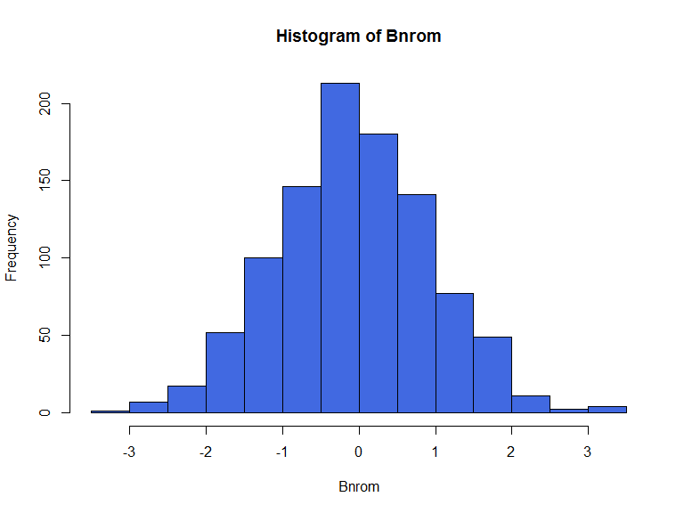
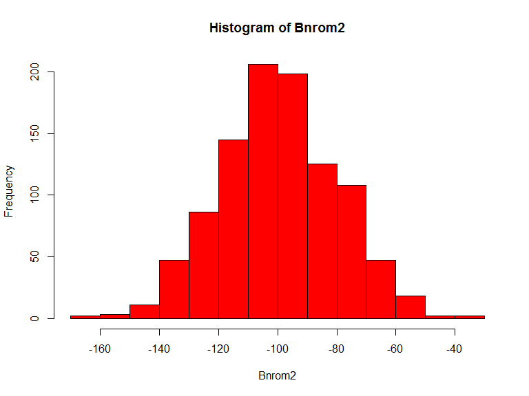
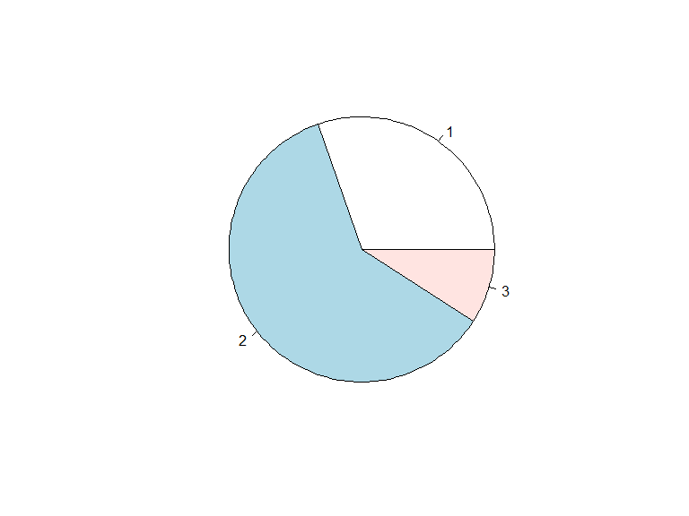

# Nutzung von GeoDaten in den Sozialwissenschaften - Zufallszahlen
Jan-Philipp Kolb  
08 April 2016  


## Erzeugung von ganzzahligen Zufallszahlen


```r
Asample <- sample(1:5,1000,replace=T)
head(Asample)
```

```
## [1] 3 4 5 4 4 2
```

```r
table(Asample)
```

```
## Asample
##   1   2   3   4   5 
## 196 179 216 214 195
```

## Gleichverteilte Zufallszahlen


```r
A <- runif(100)
head(A)
hist(A)
```

## Gleichverteilte Zufallszahlen in einem Rahmen


```r
A2 <- runif(100,100,200)
head(A2)
hist(A2)
```

## Normalverteilte Zufallszahlen


```r
Bnrom <- rnorm(1000)
hist(Bnrom,col="royalblue")
```

<!-- -->

## Normalverteilte Zufallszahlen


```r
?rnorm
```


```r
Bnrom2 <- rnorm(1000,mean=-100,sd=20)
hist(Bnrom2,col="red")
```

<!-- -->

## Das Runden

Zahlen runden:


```r
(A <- rnorm(10))
```

```
##  [1]  0.2171446 -0.5485507 -0.3913620  0.2295255  0.1241608 -2.5799743
##  [7] -0.6635406 -1.2929358 -0.4003972 -0.4541735
```


```r
round(A)
```

```
##  [1]  0 -1  0  0  0 -3 -1 -1  0  0
```


```r
round(A,digits=2)
```

```
##  [1]  0.22 -0.55 -0.39  0.23  0.12 -2.58 -0.66 -1.29 -0.40 -0.45
```

## R als Taschenrechner


```r
2/4
```

```
## [1] 0.5
```


```r
2*4
```

```
## [1] 8
```


```r
sqrt(5)
```

```
## [1] 2.236068
```

## Ein Kreisdiagramm


```r
Students <- c(100, 200,30)
pie(Students)
```

<!-- -->

## Graphiken speichern


```r
pdf("pie_Students.pdf")
pie(Students)
dev.off()
```

```
## png 
##   2
```
