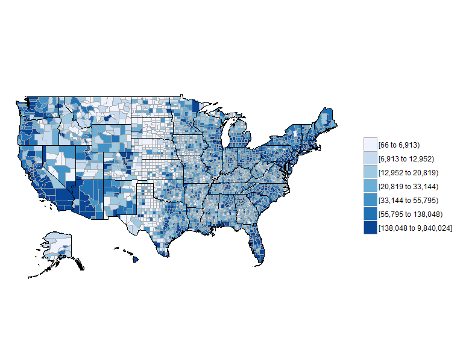

Einleitung
----------

-   [`choroplethr`](https://cran.r-project.org/web/packages/choroplethr/index.html) -
    Vereinfachung der Erstellung von Choroplethen in R

-   Paket von [Ari Lamstein](http://www.arilamstein.com/)

-   [`WDI`](https://cran.r-project.org/web/packages/WDI/index.html)
-   World Development Indicators (World Bank)

-   Folgendes basiert auf der
    [Vignette](https://cran.r-project.org/web/packages/choroplethr/index.html)
    des `choroplethr`-Paketes

Was ist ein Choropleth
----------------------

Ein Choropleth ist eine Karte, die

-   geografische Grenzen zeigt.
-   bei denen Bereiche basierend auf Metriken eingefärbt werden.

Choroplethen sind nützlich für die Visualisierung von Daten, wo
geografische Grenzen eine natürliche Einheit der Aggregation sind.

Bevölkerungsschätzungen für den US-Staaten
------------------------------------------

`df_pop_state` ist ein Datensatz , der in dem Paket `choroplethr`
enthalten ist, es enthält Schätzungen zu den US-Staaten für das Jahr
2012.

    library("choroplethrMaps")

    ## Warning: package 'choroplethrMaps' was built under R version 3.2.4

<table>
<thead>
<tr class="header">
<th align="left">region</th>
<th align="right">value</th>
</tr>
</thead>
<tbody>
<tr class="odd">
<td align="left">alabama</td>
<td align="right">4777326</td>
</tr>
<tr class="even">
<td align="left">alaska</td>
<td align="right">711139</td>
</tr>
<tr class="odd">
<td align="left">arizona</td>
<td align="right">6410979</td>
</tr>
<tr class="even">
<td align="left">arkansas</td>
<td align="right">2916372</td>
</tr>
<tr class="odd">
<td align="left">california</td>
<td align="right">37325068</td>
</tr>
<tr class="even">
<td align="left">colorado</td>
<td align="right">5042853</td>
</tr>
</tbody>
</table>

`choroplethr` - [Hallo Welt](http://mirrors.softliste.de/cran/web/packages/choroplethr/vignettes/a-introduction.html)
---------------------------------------------------------------------------------------------------------------------

Die Karte zeigt die US Bevölkerungsschätzung für die US-Staaten und das
Jahr 2012:

Wir bekommen eine Choroplethenkarte mit nur einem Argument:

    state_choropleth(df_pop_state)

<!-- -->

Aber wir können auch einen Titel erstellen und die Legende benennen:

    state_choropleth(df_pop_state, title="2012 US State Population Estimates", legend="Population")

<!-- -->

[Nur drei Staaten darstellen](http://mirrors.softliste.de/cran/web/packages/choroplethr/vignettes/b-state-choropleth.html)
--------------------------------------------------------------------------------------------------------------------------

    state_choropleth(df_pop_state,
                     title      = "2012 Population Estimates",
                     legend     = "Population",
                     num_colors = 1,
                     zoom       = c("california", "washington", "oregon"))

<!-- -->

US County Chroplethen
---------------------

[Choroplethen der US
Counties](http://mirrors.softliste.de/cran/web/packages/choroplethr/vignettes/c-county-choropleth.html)

<http://mirrors.softliste.de/cran/web/packages/choroplethr/vignettes/c-county-choropleth.html>

    ?df_pop_county
    ?county_choropleth

Eine Karte der US Counties
--------------------------

    data(df_pop_county)
    county_choropleth(df_pop_county)

<!-- -->

[Country Choroplethen](http://mirrors.softliste.de/cran/web/packages/choroplethr/vignettes/d-country-choropleth.html)
---------------------------------------------------------------------------------------------------------------------

    data(df_pop_country)
    country_choropleth(df_pop_country,
                  title      = "2012 Population Estimates",
                  legend     = "Population",
                  num_colors = 1,
                  zoom       = c("united states of america",
                                 "mexico", "canada"))

<!-- -->

Weltbank Daten
--------------

    library(choroplethr)
    library(WDI) 
    choroplethr_wdi(code="SP.POP.TOTL", year=2012, 
                    title="2012 Population", 
                    num_colors=1)

<!-- -->

[Lebenserwartung](http://mirrors.softliste.de/cran/web/packages/choroplethr/vignettes/f-world-bank-data.html)
-------------------------------------------------------------------------------------------------------------

    library(WDI) 
    choroplethr_wdi(code="SP.DYN.LE00.IN", year=2012,
                    title="2012 Life Expectancy")

<!-- -->

Ein weiterer Datensatz
----------------------

    data(df_president_ts)

Mit dem Fragezeichen bekommen wir Hilfe

    ?df_president_ts

    kable(df_president_ts[1:8,1:8])

<table>
<thead>
<tr class="header">
<th align="left">region</th>
<th align="left">1789</th>
<th align="left">1792</th>
<th align="left">1796</th>
<th align="left">1800</th>
<th align="left">1804</th>
<th align="left">1808</th>
<th align="left">1812</th>
</tr>
</thead>
<tbody>
<tr class="odd">
<td align="left">alabama</td>
<td align="left">NA</td>
<td align="left">NA</td>
<td align="left">NA</td>
<td align="left">NA</td>
<td align="left">NA</td>
<td align="left">NA</td>
<td align="left">NA</td>
</tr>
<tr class="even">
<td align="left">alaska</td>
<td align="left">NA</td>
<td align="left">NA</td>
<td align="left">NA</td>
<td align="left">NA</td>
<td align="left">NA</td>
<td align="left">NA</td>
<td align="left">NA</td>
</tr>
<tr class="odd">
<td align="left">arizona</td>
<td align="left">NA</td>
<td align="left">NA</td>
<td align="left">NA</td>
<td align="left">NA</td>
<td align="left">NA</td>
<td align="left">NA</td>
<td align="left">NA</td>
</tr>
<tr class="even">
<td align="left">arkansas</td>
<td align="left">NA</td>
<td align="left">NA</td>
<td align="left">NA</td>
<td align="left">NA</td>
<td align="left">NA</td>
<td align="left">NA</td>
<td align="left">NA</td>
</tr>
<tr class="odd">
<td align="left">california</td>
<td align="left">NA</td>
<td align="left">NA</td>
<td align="left">NA</td>
<td align="left">NA</td>
<td align="left">NA</td>
<td align="left">NA</td>
<td align="left">NA</td>
</tr>
<tr class="even">
<td align="left">colorado</td>
<td align="left">NA</td>
<td align="left">NA</td>
<td align="left">NA</td>
<td align="left">NA</td>
<td align="left">NA</td>
<td align="left">NA</td>
<td align="left">NA</td>
</tr>
<tr class="odd">
<td align="left">connecticut</td>
<td align="left">GW</td>
<td align="left">GW</td>
<td align="left">F</td>
<td align="left">F</td>
<td align="left">F</td>
<td align="left">F</td>
<td align="left">F</td>
</tr>
<tr class="even">
<td align="left">delaware</td>
<td align="left">GW</td>
<td align="left">GW</td>
<td align="left">F</td>
<td align="left">F</td>
<td align="left">F</td>
<td align="left">F</td>
<td align="left">F</td>
</tr>
</tbody>
</table>

Resourcen
---------

    citation("choroplethr")

    ## Warning in .canonicalize_person_role(role): Invalid role specification:
    ## 'frontendanimationcode'.

    ## 
    ## To cite package 'choroplethr' in publications use:
    ## 
    ##   Ari Lamstein and Brian P Johnson (2016). choroplethr: Simplify
    ##   the Creation of Choropleth Maps in R. R package version 3.5.0.
    ##   https://CRAN.R-project.org/package=choroplethr
    ## 
    ## A BibTeX entry for LaTeX users is
    ## 
    ##   @Manual{,
    ##     title = {choroplethr: Simplify the Creation of Choropleth Maps in R},
    ##     author = {Ari Lamstein and Brian P Johnson},
    ##     year = {2016},
    ##     note = {R package version 3.5.0},
    ##     url = {https://CRAN.R-project.org/package=choroplethr},
    ##   }
    ## 
    ## ATTENTION: This citation information has been auto-generated from
    ## the package DESCRIPTION file and may need manual editing, see
    ## 'help("citation")'.

Resources / Links
-----------------

-   [Einführung - Was sind
    Choroplethen](https://cran.r-project.org/web/packages/choroplethr/vignettes/a-introduction.html)

<https://cran.r-project.org/web/packages/choroplethr/vignettes/a-introduction.html>

-   [Beschreibung](http://radar.oreilly.com/2014/01/new-choropleth-package-in-r.html)
    der Nutzung des `choroplethr` Paketes

<http://radar.oreilly.com/2014/01/new-choropleth-package-in-r.html> -
Plot the [US
states](https://cran.r-project.org/web/packages/choroplethr/vignettes/b-state-choropleth.html)
with `choroplethr`

-   [Weltbankdaten in Karten
    darstellen](https://cran.r-project.org/web/packages/choroplethr/vignettes/f-world-bank-data.html)
    mit `choroplethr`

<https://cran.r-project.org/web/packages/choroplethr/vignettes/f-world-bank-data.html>

-   [Revolutions-blog](http://blog.revolutionanalytics.com/2014/01/easy-data-maps-with-r-the-choroplethr-package-.html)
    über das `choroplethr` Paket

<http://blog.revolutionanalytics.com/2014/01/easy-data-maps-with-r-the-choroplethr-package-.html>

-   [trulia](http://www.trulia.com/tech/2014/01/15/the-choroplethr-package-for-r/)-blog
    über das `choroplethr` Paket

<http://www.trulia.com/tech/2014/01/15/the-choroplethr-package-for-r/>

-   [Präsentation von Ari
    Lamstein](http://www.r-bloggers.com/slides-for-my-upcoming-talk-mapping-census-data-in-r/)
    über das `choroplethr` Paket

<http://www.r-bloggers.com/slides-for-my-upcoming-talk-mapping-census-data-in-r/>
