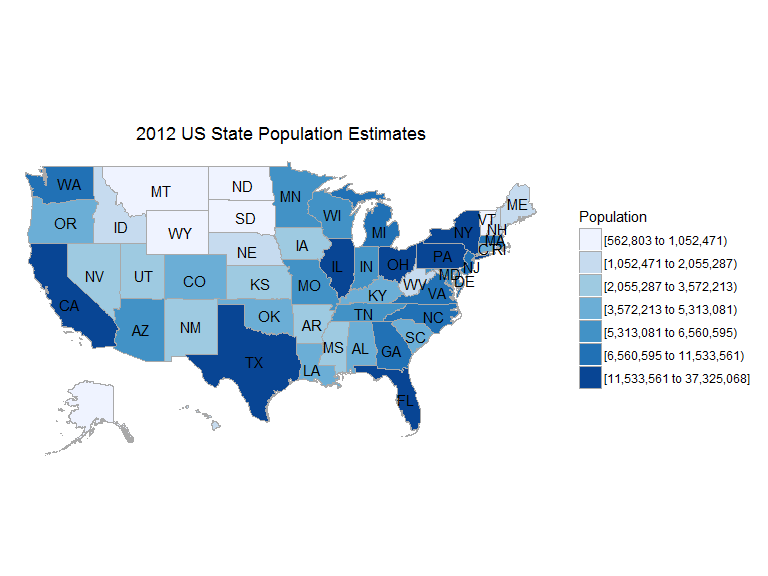
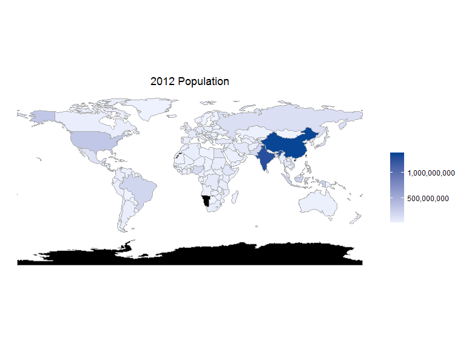

Introduction
------------

[`choroplethr`](https://cran.r-project.org/web/packages/choroplethr/index.html) -
Simplify the Creation of Choropleth Maps in R

Package by [Ari Lamstein](http://www.arilamstein.com/)

[`WDI`](https://cran.r-project.org/web/packages/WDI/index.html) - World
Development Indicators (World Bank)

The following relies heavily on the
[vignette](https://cran.r-project.org/web/packages/choroplethr/index.html)
of the `choroplethr`-package

What is a choropleth map
------------------------

A choropleth is a map which

-   shows geographic boundaries.
-   colors those regions based on some metric.

Choropleths are useful for visualizing data where geographic boundaries
are a natural unit of aggregation.

Population estimates for US States
----------------------------------

`df_pop_state` is a dataset which is included in the package
`choroplethr`, containing population estimates for US States in 2012.

<table>
<thead>
<tr class="header">
<th align="left">region</th>
<th align="right">value</th>
</tr>
</thead>
<tbody>
<tr class="odd">
<td align="left">alabama</td>
<td align="right">4777326</td>
</tr>
<tr class="even">
<td align="left">alaska</td>
<td align="right">711139</td>
</tr>
<tr class="odd">
<td align="left">arizona</td>
<td align="right">6410979</td>
</tr>
<tr class="even">
<td align="left">arkansas</td>
<td align="right">2916372</td>
</tr>
<tr class="odd">
<td align="left">california</td>
<td align="right">37325068</td>
</tr>
<tr class="even">
<td align="left">colorado</td>
<td align="right">5042853</td>
</tr>
<tr class="odd">
<td align="left">connecticut</td>
<td align="right">3572213</td>
</tr>
<tr class="even">
<td align="left">delaware</td>
<td align="right">900131</td>
</tr>
<tr class="odd">
<td align="left">district of columbia</td>
<td align="right">605759</td>
</tr>
<tr class="even">
<td align="left">florida</td>
<td align="right">18885152</td>
</tr>
</tbody>
</table>

`choroplethr` - Hello World
---------------------------

For example, here is a
[choropleth](http://mirrors.softliste.de/cran/web/packages/choroplethr/vignettes/a-introduction.html)
that shows 2012 US State Population Estimates:

We get a choropleth map with only one argument:

    state_choropleth(df_pop_state)

<!-- -->

But we can also create a title and name the legend:

    state_choropleth(df_pop_state, title="2012 US State Population Estimates", legend="Population")

<!-- -->

Show only three states
----------------------

[US State
Chropleths](http://mirrors.softliste.de/cran/web/packages/choroplethr/vignettes/b-state-choropleth.html)

    state_choropleth(df_pop_state,
                     title      = "2012 Population Estimates",
                     legend     = "Population",
                     num_colors = 1,
                     zoom       = c("california", "washington", "oregon"))

<!-- -->

US County Chropleths
--------------------

[Choropleth of US
Counties](http://mirrors.softliste.de/cran/web/packages/choroplethr/vignettes/c-county-choropleth.html)

    ?df_pop_county

    ?county_choropleth

    data(df_pop_county)

    county_choropleth(df_pop_county)

<!-- -->

[Country Choropleths](http://mirrors.softliste.de/cran/web/packages/choroplethr/vignettes/d-country-choropleth.html)
--------------------------------------------------------------------------------------------------------------------

    data(df_pop_country)

    country_choropleth(df_pop_country,
                     title      = "2012 Population Estimates",
                     legend     = "Population",
                     num_colors = 1,
                     zoom       = c("united states of america", "mexico", "canada"))

<!-- -->

World Bank data
---------------

    library(choroplethr)
    library(WDI) 

    choroplethr_wdi(code="SP.POP.TOTL", year=2012, title="2012 Population", num_colors=1)

<!-- -->

[Life Expectancy](http://mirrors.softliste.de/cran/web/packages/choroplethr/vignettes/f-world-bank-data.html)
-------------------------------------------------------------------------------------------------------------

    library(WDI) 
    choroplethr_wdi(code="SP.DYN.LE00.IN", year=2012, title="2012 Life Expectancy")

<!-- -->

Animated
--------

    data(df_president_ts)

With the questionmark we get help

    ?df_president_ts

The datatable
-------------

-   [datatable](http://www.htmlwidgets.org/showcase_datatables.html)

Reference
---------

    citation("choroplethr")

    ## Warning in .canonicalize_person_role(role): Invalid role specification:
    ## 'frontendanimationcode'.

    ## 
    ## To cite package 'choroplethr' in publications use:
    ## 
    ##   Ari Lamstein and Brian P Johnson (2016). choroplethr: Simplify
    ##   the Creation of Choropleth Maps in R. R package version 3.4.0.
    ##   https://CRAN.R-project.org/package=choroplethr
    ## 
    ## A BibTeX entry for LaTeX users is
    ## 
    ##   @Manual{,
    ##     title = {choroplethr: Simplify the Creation of Choropleth Maps in R},
    ##     author = {Ari Lamstein and Brian P Johnson},
    ##     year = {2016},
    ##     note = {R package version 3.4.0},
    ##     url = {https://CRAN.R-project.org/package=choroplethr},
    ##   }
    ## 
    ## ATTENTION: This citation information has been auto-generated from
    ## the package DESCRIPTION file and may need manual editing, see
    ## 'help("citation")'.

Reference
---------

    citation("DT")

    ## 
    ## To cite package 'DT' in publications use:
    ## 
    ##   Yihui Xie (2015). DT: A Wrapper of the JavaScript Library
    ##   'DataTables'. R package version 0.1.
    ##   https://CRAN.R-project.org/package=DT
    ## 
    ## A BibTeX entry for LaTeX users is
    ## 
    ##   @Manual{,
    ##     title = {DT: A Wrapper of the JavaScript Library 'DataTables'},
    ##     author = {Yihui Xie},
    ##     year = {2015},
    ##     note = {R package version 0.1},
    ##     url = {https://CRAN.R-project.org/package=DT},
    ##   }

Resources / Links
-----------------

-   [Intro - What is a
    choropleth](https://cran.r-project.org/web/packages/choroplethr/vignettes/a-introduction.html)

-   [Description](http://radar.oreilly.com/2014/01/new-choropleth-package-in-r.html)
    on the usage of the `choroplethr` package

-   Plot the [US
    states](https://cran.r-project.org/web/packages/choroplethr/vignettes/b-state-choropleth.html)
    with `choroplethr`

-   [Mapping World Bank
    Data](https://cran.r-project.org/web/packages/choroplethr/vignettes/f-world-bank-data.html)
    with `choroplethr`

-   [Revolutions-blog](http://blog.revolutionanalytics.com/2014/01/easy-data-maps-with-r-the-choroplethr-package-.html)
    on the `choroplethr` package

-   [trulia](http://www.trulia.com/tech/2014/01/15/the-choroplethr-package-for-r/)-blog
    on the `choroplethr` package

-   [Presentation Ari
    Lamstein](http://www.r-bloggers.com/slides-for-my-upcoming-talk-mapping-census-data-in-r/)
    on the `choroplethr` package
