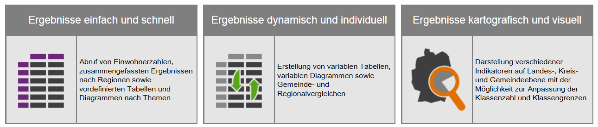

Datenzugang
-----------

-   Public-Use-File (PUF) Datei zur öffentlichen Nutzung - meist stark
    anonymisierte Daten (Beispiele:
    [FDZ](www.forschungsdatenzentrum.de), [Statistik
    Portal](www.statistik-portal.de), [Meine
    Region](www.infothek.statistik.rlp.de/lis/MeineRegion/index.asp) )

-   Scientific-Use-File (SUF) - Datei zur wissenschaftlichen Nutzung -
    anonymisierte Daten, die zu wissenschaftlichen Zwecken und zur
    Sekundäranalyse genutzt werden können.

-   On-Site-Nutzung - Arbeitsplätze für Gastwissenschaftler -
    Kontrollierte Datenfernverarbeitung

Zensus Atlas
------------

<https://ergebnisse.zensus2011.de/>

Forschungsdatenzentren
----------------------

-   Bspw. FDZ der statistischen Ämter:

<http://www.forschungsdatenzentrum.de/>

-   Es werden hauptsächlich Public Use Files angeboten,

-   teilweise können Gewichtungsfaktoren verwendet werden um regionale
    Ergebnisse zu bekommen

-   In der Regel ist Darstellung in Karten aber schwierig

Weitere Amtliche Datenquellen
-----------------------------

-   Genesis

<https://www-genesis.destatis.de/genesis/online>

-   Daneben gibt es Angebote der Landesämter bspw:

<https://www.statistik.rlp.de/regionaldaten/>

Eurostat Daten
--------------

Sie können eine Statistik der Sparquote bei
[Eurostat](http://ec.europa.eu/eurostat/web/euro-indicators/peeis)
downloaden.

<http://ec.europa.eu/eurostat/web/euro-indicators/peeis>

    library(xlsx)
    HHsr <- read.xlsx2("HHsavingRate.xls",1)

<table>
<thead>
<tr class="header">
<th align="left">geo</th>
<th align="left">X2012Q3</th>
<th align="left">X2012Q4</th>
<th align="left">X2013Q1</th>
<th align="left">X2013Q2</th>
<th align="left">X2013Q3</th>
</tr>
</thead>
<tbody>
<tr class="odd">
<td align="left">Euro area (19 countries)</td>
<td align="left">9.82</td>
<td align="left">11.86</td>
<td align="left">11.37</td>
<td align="left">16.28</td>
<td align="left">10.34</td>
</tr>
<tr class="even">
<td align="left">EU (28 countries)</td>
<td align="left">8.67</td>
<td align="left">10.92</td>
<td align="left">9.42</td>
<td align="left">14.63</td>
<td align="left">8.38</td>
</tr>
<tr class="odd">
<td align="left">Belgium</td>
<td align="left">12.52</td>
<td align="left">9.33</td>
<td align="left">13.99</td>
<td align="left">19.03</td>
<td align="left">12.07</td>
</tr>
<tr class="even">
<td align="left">Czech Republic</td>
<td align="left">10.16</td>
<td align="left">14.81</td>
<td align="left">9.46</td>
<td align="left">10.44</td>
<td align="left">10.12</td>
</tr>
</tbody>
</table>

Datahub.io
----------

Viele Daten vorhanden, bspw. zum UNESCO Weltkulturerbe - [Link
datahub.io](http://datahub.io/dataset/unesco-world-heritage-sites/resource/d4116195-44d8-4bc1-9f91-9b570870dc19)

<table>
<thead>
<tr class="header">
<th align="left"></th>
<th align="left">name_en</th>
<th align="right">longitude</th>
<th align="right">latitude</th>
<th align="left">category_short</th>
</tr>
</thead>
<tbody>
<tr class="odd">
<td align="left">4</td>
<td align="left">Butrint</td>
<td align="right">20.03</td>
<td align="right">39.75</td>
<td align="left">C</td>
</tr>
<tr class="even">
<td align="left">5</td>
<td align="left">Al Qal'a of Beni Hammad</td>
<td align="right">4.79</td>
<td align="right">35.82</td>
<td align="left">C</td>
</tr>
<tr class="odd">
<td align="left">6</td>
<td align="left">M'Zab Valley</td>
<td align="right">3.68</td>
<td align="right">32.48</td>
<td align="left">C</td>
</tr>
<tr class="even">
<td align="left">7</td>
<td align="left">Djémila</td>
<td align="right">5.74</td>
<td align="right">36.32</td>
<td align="left">C</td>
</tr>
<tr class="odd">
<td align="left">8</td>
<td align="left">Timgad</td>
<td align="right">6.63</td>
<td align="right">35.45</td>
<td align="left">C</td>
</tr>
</tbody>
</table>
