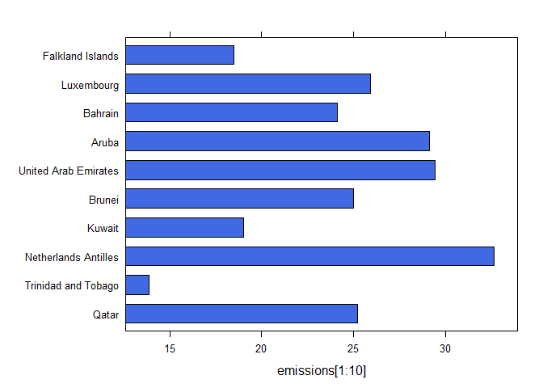

Die Daten editieren
-------------------

    load("data/refugeeTab.RData")

    mean(refugeeTab[,2])

    ## Warning in mean.default(refugeeTab[, 2]): argument is not numeric or
    ## logical: returning NA

    ## [1] NA

um dies zu ändern ist ein wenig Kosmetik notwendig:

    refugeeTab[,2] <- as.numeric(refugeeTab[,2])

    mean(refugeeTab[,2])

    ## [1] 17.16129

Die weiteren Spalten bearbeiten
-------------------------------

-   In R wird der Punkt als Dezimaltrennzeichen verwendet.
-   Wenn ein Komma im Ausdruck ist, wird der Eintrag als `character`
    behandelt
-   dann kann bspw. kein Mittelwert berechnet werden

<!-- -->

    refugeeTab[,3] <- gsub(",",".",refugeeTab[,3])
    refugeeTab[,3] <- as.numeric(refugeeTab[,3])

Erste Spalte bearbeiten und Daten speichern
-------------------------------------------

    ab <- as.character(refugeeTab[,1])
    info <- round(nchar(ab)/2)
    Namen <- substr(ab,1,info)
    Namen[1:29] <- gsub(" ","",Namen[1:29])
    Namen[31]  <- "Zypern"
    refugeeTab[,1] <- Namen

Spaltennamen verändern

    colnames(refugeeTab) <- c("Land","2015",
                              "pro_tsd_Einwohner")

Die Daten abspeichern

    save(refugeeTab,file="refugeeTab_final.RData")

Das Ergebnis
------------

<table>
<thead>
<tr class="header">
<th></th>
<th align="left">Land</th>
<th align="right">2015</th>
<th align="right">pro_tsd_Einwohner</th>
</tr>
</thead>
<tbody>
<tr class="odd">
<td>3</td>
<td align="left">Bulgarien</td>
<td align="right">14</td>
<td align="right">2.83</td>
</tr>
<tr class="even">
<td>4</td>
<td align="left">Danemark</td>
<td align="right">15</td>
<td align="right">3.70</td>
</tr>
<tr class="odd">
<td>5</td>
<td align="left">Deutschland</td>
<td align="right">29</td>
<td align="right">5.87</td>
</tr>
<tr class="even">
<td>6</td>
<td align="left">Estland</td>
<td align="right">16</td>
<td align="right">0.18</td>
</tr>
<tr class="odd">
<td>7</td>
<td align="left">Finnland</td>
<td align="right">20</td>
<td align="right">5.91</td>
</tr>
<tr class="even">
<td>8</td>
<td align="left">Frankreich</td>
<td align="right">30</td>
<td align="right">1.14</td>
</tr>
</tbody>
</table>

Das Editing ist also aufwändiger als das eigentliche Scraping

CO2 Verbrauch
-------------

    link <- "https://en.wikipedia.org/wiki/
    List_of_countries_by_carbon_dioxide_
    emissions_per_capita"

    link_data <- read_html(link)
    doc <- htmlParse(link_data)
    tab <- readHTMLTable(doc)

    save(tab,file="co2tab.RData")

    str(tab)

    ## List of 20
    ##  $ NULL: NULL
    ##  $ NULL:'data.frame':    219 obs. of  25 variables:
    ##   ..$ V1 : Factor w/ 213 levels "","-","1.","10.",..: 3 113 139 150 161 171 182 192 203 4 ...
    ##   ..$ V2 : Factor w/ 219 levels "Afghanistan",..: 157 198 137 105 29 205 10 15 113 64 ...
    ##   ..$ V3 : Factor w/ 90 levels "","-","0","0.1",..: 48 28 57 37 47 51 50 46 49 36 ...
    ##   ..$ V4 : Factor w/ 93 levels "","-","0","0.1",..: 63 40 52 70 50 62 54 51 53 41 ...
    ##   ..$ V5 : Factor w/ 102 levels "","-","0","0.1",..: 78 40 52 21 51 54 53 50 63 41 ...
    ##   ..$ V6 : Factor w/ 98 levels "","-","0","0.1",..: 82 32 62 37 49 61 50 52 51 35 ...
    ##   ..$ V7 : Factor w/ 97 levels "","-","0","0.1",..: 75 35 62 48 38 61 49 51 50 34 ...
    ##   ..$ V8 : Factor w/ 108 levels "-","0","0.1",..: 82 40 68 67 42 66 55 56 54 39 ...
    ##   ..$ V9 : Factor w/ 102 levels "","-","0","0.1",..: 78 39 65 56 42 38 54 55 53 40 ...
    ##   ..$ V10: Factor w/ 97 levels "","-","0","0.1",..: 82 36 63 62 42 39 52 53 43 41 ...
    ##   ..$ V11: Factor w/ 94 levels "","-",".03","0",..: 72 34 19 59 40 60 41 49 38 32 ...
    ##   ..$ V12: Factor w/ 101 levels "","-","0","0.1",..: 75 37 29 62 33 51 39 50 38 30 ...
    ##   ..$ V13: Factor w/ 95 levels "-","0","0.1",..: 76 38 61 62 39 63 50 60 38 31 ...
    ##   ..$ V14: Factor w/ 99 levels "","-","0","0.1",..: 71 39 62 52 38 63 51 50 41 35 ...
    ##   ..$ V15: Factor w/ 103 levels "","-","0","0.1",..: 74 51 65 56 41 53 54 55 52 39 ...
    ##   ..$ V16: Factor w/ 105 levels "","-","0","0.1",..: 76 52 67 57 42 56 54 55 53 41 ...
    ##   ..$ V17: Factor w/ 104 levels "","-","0","0.1",..: 80 53 65 64 40 56 52 55 54 42 ...
    ##   ..$ V18: Factor w/ 110 levels "-","0","0.1",..: 89 52 63 64 38 55 51 54 53 40 ...
    ##   ..$ V19: Factor w/ 107 levels "","-","0","0.1",..: 74 53 56 64 36 55 51 54 52 42 ...
    ##   ..$ V20: Factor w/ 101 levels "","-","0","0.1",..: 78 52 60 59 51 51 49 50 48 41 ...
    ##   ..$ V21: Factor w/ 64 levels "1.4","10.0","10.4",..: 35 29 28 27 26 25 22 24 23 21 ...
    ##   ..$ V22: Factor w/ 35 levels "1.5","10.0","10.1",..: 32 30 29 28 27 26 25 24 23 22 ...
    ##   ..$ V23: Factor w/ 5 levels "1.6","4.8","6.6",..: NA NA NA NA NA NA NA NA NA NA ...
    ##   ..$ V24: Factor w/ 4 levels "4.9","7.2","8.6",..: NA NA NA NA NA NA NA NA NA NA ...
    ##   ..$ V25: Factor w/ 1 level "8.8": NA NA NA NA NA NA NA NA NA NA ...
    ##  $ NULL:'data.frame':    3 obs. of  2 variables:
    ##   ..$                      : Factor w/ 1 level "": 1 1 1
    ##   ..$ Global warming portal: Factor w/ 3 levels "Ecology portal",..: 1 3 2
    ##  $ NULL:'data.frame':    11 obs. of  2 variables:
    ##   ..$ V1: Factor w/ 7 levels "","Emissions",..: 7 1 4 1 5 1 2 1 6 1 ...
    ##   ..$ V2: Factor w/ 4 levels "Aluminium\nAl2O3\nBauxite\nBismuth\nCopper\nsmelter\n\nGold\nIron ore\nLithium\nMagnesium\nManganese\nPlatinum\nSilver\nSteel\n"| __truncated__,..: NA NA 1 NA 2 NA 3 NA 4 NA ...
    ##  $ NULL:'data.frame':    10 obs. of  2 variables:
    ##   ..$ V1: Factor w/ 6 levels "","Emissions",..: 1 4 1 5 1 2 1 6 1 3
    ##   ..$ V2: Factor w/ 4 levels "Aluminium\nAl2O3\nBauxite\nBismuth\nCopper\nsmelter\n\nGold\nIron ore\nLithium\nMagnesium\nManganese\nPlatinum\nSilver\nSteel\n"| __truncated__,..: NA 1 NA 2 NA 3 NA 4 NA NA
    ##  $ NULL:'data.frame':    67 obs. of  2 variables:
    ##   ..$ V1: Factor w/ 41 levels "","Anthropogenic",..: 41 40 1 39 38 1 4 1 8 7 ...
    ##   ..$ V2: Factor w/ 13 levels "Abrupt climate change\nAnoxic event\nArctic dipole anomaly\nArctic haze\nArctic methane release\nClimate change and agriculture"| __truncated__,..: NA NA NA NA NA NA NA NA NA NA ...
    ##  $ NULL:'data.frame':    65 obs. of  2 variables:
    ##   ..$ V1: Factor w/ 39 levels "","Anthropogenic",..: 1 39 38 1 4 1 8 7 1 3 ...
    ##   ..$ V2: Factor w/ 13 levels "Abrupt climate change\nAnoxic event\nArctic dipole anomaly\nArctic haze\nArctic methane release\nClimate change and agriculture"| __truncated__,..: NA NA NA NA NA NA NA NA NA NA ...
    ##  $ NULL:'data.frame':    2 obs. of  1 variable:
    ##   ..$  
    ## Temperatures
    ## : Factor w/ 2 levels "","Brightness temperature\nGeologic record\nHiatus\nHistorical climatology\nInstrumental record\nPaleoclimatology\nPaleotempestolo"| __truncated__: 1 2
    ##  $ NULL:'data.frame':    7 obs. of  2 variables:
    ##   ..$ V1: Factor w/ 5 levels "","Anthropogenic",..: 1 3 2 1 5 1 4
    ##   ..$ V2: Factor w/ 3 levels "Albedo\nBond events\nClimate oscillations\nClimate sensitivity\nCloud forcing\nCosmic rays\nFeedbacks\nGlaciation\nGlobal cooli"| __truncated__,..: NA NA 2 NA 1 NA 3
    ##  $ NULL:'data.frame':    4 obs. of  2 variables:
    ##   ..$ Anthropogenic                                                                                                                                                                                                                                                                                                                                                                                  : Factor w/ 3 levels "","Models","Natural": 1 3 1 2
    ##   ..$ Attribution of recent climate change
    ## Aviation
    ## Biofuel
    ## Black carbon
    ## Carbon dioxide
    ## Deforestation
    ## Earth's energy budget
    ## Earth's radiation balance
    ## Ecocide
    ## Fossil fuel
    ## Global dimming
    ## Global warming potential
    ## Greenhouse effect
    ## (Infrared window)
    ## Greenhouse gases
    ## (Halocarbons)
    ## Land use, land-use change and forestry
    ## Radiative forcing
    ## Tropospheric ozone
    ## Urban heat island: Factor w/ 2 levels "Albedo\nBond events\nClimate oscillations\nClimate sensitivity\nCloud forcing\nCosmic rays\nFeedbacks\nGlaciation\nGlobal cooli"| __truncated__,..: NA 1 NA 2
    ##  $ NULL:'data.frame':    2 obs. of  1 variable:
    ##   ..$  
    ## History
    ## : Factor w/ 2 levels "","History of climate change science\nAtmospheric thermodynamics\nSvante Arrhenius\nJames Hansen\nCharles David Keeling": 1 2
    ##  $ NULL:'data.frame':    2 obs. of  1 variable:
    ##   ..$  
    ## Opinion and climate change
    ## : Factor w/ 2 levels "","Environmental ethics\nMedia coverage of climate change\nPublic opinion on climate change\n(Popular culture)\nScientific opinion"| __truncated__: 1 2
    ##  $ NULL:'data.frame':    3 obs. of  1 variable:
    ##   ..$  
    ## Politics
    ## : Factor w/ 2 levels "","Clean Power Plan\nClimate change denial\n(Manufactured controversy)\nIntergovernmental Panel on Climate Change (IPCC)\nUnited N"| __truncated__: 1 2 2
    ##  $ NULL: NULL
    ##  $ NULL:'data.frame':    5 obs. of  2 variables:
    ##   ..$ V1: Factor w/ 4 levels "","By country",..: 1 4 3 1 2
    ##   ..$ V2: Factor w/ 2 levels "Abrupt climate change\nAnoxic event\nArctic dipole anomaly\nArctic haze\nArctic methane release\nClimate change and agriculture"| __truncated__,..: NA NA 1 NA 2
    ##  $ NULL:'data.frame':    2 obs. of  2 variables:
    ##   ..$ General                                                                                                                                                                                                                                                                                                                                                                                                                                                                                                                                                                                                                                                                                                     : Factor w/ 2 levels "","By country": 1 2
    ##   ..$ Abrupt climate change
    ## Anoxic event
    ## Arctic dipole anomaly
    ## Arctic haze
    ## Arctic methane release
    ## Climate change and agriculture
    ## Climate change and ecosystems
    ## Climate change and poverty
    ## Current sea level rise
    ## Drought
    ## Economics of global warming
    ## Effect on plant biodiversity
    ## Effects on health
    ## Effects on humans
    ## Effects on marine mammals
    ## Environmental migrant
    ## Extinction risk from global warming
    ## Fisheries and climate change
    ## Forest dieback
    ## Iris hypothesis
    ## Megadrought
    ## Ocean acidification
    ## Ozone depletion
    ## Physical impacts
    ## Polar stratospheric cloud
    ## Regime shift
    ## Retreat of glaciers since 1850
    ## Runaway climate change
    ## Season creep
    ## Shutdown of thermohaline circulation: Factor w/ 1 level "Australia\nIndia\nNepal\n(South Asia)\nUnited States": NA 1
    ##  $ NULL:'data.frame':    13 obs. of  2 variables:
    ##   ..$ V1: Factor w/ 8 levels "","Carbon-free energy",..: 1 6 5 1 4 1 3 1 2 1 ...
    ##   ..$ V2: Factor w/ 6 levels "Carbon capture and storage\nEfficient energy use\nLow-carbon economy\nNuclear power\nRenewable energy",..: NA NA 4 NA 5 NA 2 NA 1 NA ...
    ##  $ NULL:'data.frame':    10 obs. of  2 variables:
    ##   ..$ Kyoto Protocol                                                                                                 : Factor w/ 6 levels "","Carbon-free energy",..: 1 4 1 3 1 2 1 6 1 5
    ##   ..$ Clean Development Mechanism
    ## Joint Implementation
    ## Bali Road Map
    ## 2009 United Nations Climate Change Conference: Factor w/ 5 levels "Carbon capture and storage\nEfficient energy use\nLow-carbon economy\nNuclear power\nRenewable energy",..: NA 4 NA 2 NA 1 NA 5 NA 3
    ##  $ NULL:'data.frame':    5 obs. of  2 variables:
    ##   ..$ V1: Factor w/ 4 levels "","Programmes",..: 1 4 3 1 2
    ##   ..$ V2: Factor w/ 2 levels "Avoiding dangerous climate change\nLand Allocation Decision Support System",..: NA NA 2 NA 1
    ##  $ NULL:'data.frame':    2 obs. of  2 variables:
    ##   ..$ Strategies                                                                                                                                     : Factor w/ 2 levels "","Programmes": 1 2
    ##   ..$ Damming glacial lakes
    ## Desalination
    ## Drought tolerance
    ## Irrigation investment
    ## Rainwater storage
    ## Sustainable development
    ## Weather modification: Factor w/ 1 level "Avoiding dangerous climate change\nLand Allocation Decision Support System": NA 1

Die Elemente des Objektes
-------------------------

    tab[[1]]

    ## NULL

    head(tab[[2]][,1:7])

    ##   V1                   V2   V3   V4   V5   V6   V7
    ## 1 1.                Qatar 25.2 36.7 54.3 60.9 58.7
    ## 2 2.  Trinidad and Tobago 13.9 17.1 17.0 13.5 15.8
    ## 3 3. Netherlands Antilles 32.6 26.9 22.6 35.0 34.3
    ## 4 4.               Kuwait 19.0  5.1 10.0 16.9 20.8
    ## 5 5.               Brunei 25.0 22.0 21.4 20.0 18.8
    ## 6 6. United Arab Emirates 29.4 30.2 29.5 31.1 33.1

Auf die Daten schauen
---------------------

    co2<- tab[[2]]
    Cnames <- c("Rank","Country",paste("j",1990:2011,sep=""))
    colnames(co2) <- Cnames 

Haben die Daten die richtige Struktur?
--------------------------------------

    mean(co2[,3])

    ## [1] NA

    co2[,3] <- as.numeric(as.character(co2[,3]))

    for (i in 3:ncol(co2)){
      co2[,i] <- as.numeric(as.character(co2[,i]))
    }

Daten speichern

    save(co2,file="CO2emissions.RData")

Eine Graphik
------------

    library(lattice)
    emissions <- as.numeric(co2[,3])
    names(emissions) <- co2[,2]
    barchart(emissions[1:10],col="royalblue")

<!-- -->

Take Home Message
-----------------

-   Mit Webscraping können sehr viele Daten gewonnen werden.
-   Allerdings kann die Datenaufbereitung sehr aufwändig sein.
-   Oftmals ist viel rumprobieren notwendig.
