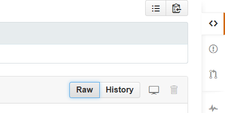

## Github Seite

-   Die folgende Seite ist die Startseite für den Kurs:

<https://github.com/Japhilko/GeoData/tree/master/2016>

- Es lohnt sich immer wieder zu dieser Seite zurückzukehren, weil hier alle relevanten Dokumente verlinkt sind.

- Grundsätzlich bietet es sich an, den einzelnen Teilen der Veranstaltung mit dem File zu folgen, dass mit dem Begriff _Browser_ verlinkt ist.

## Informationen audrucken

-   Zum Ausdrucken eignen sich die pdf-Dateien besser. 

-   Diese können mit dem Raw Button heruntergeladen werden. 

## Weitere Dateien herunterladen

- Begleitend zu den Folien wird meistens auch ein R-File angeboten. 

- Hier können Sie entweder das gesamte R-File herunterladen und in R ausführen oder einzelne Befehle per Copy/Paste übernehmen.

- Vereinzelt sind auch Datensätze vorhanden. 

- `.csv` Dateien können direkt von R eingelesen werden (wie das geht werde ich noch zeigen).

- Wenn die `.csv` Dateien heruntergeladen werden sollen auch den Raw Button verwenden.

- Alle anderen Dateien (bspw. `.RData`) auch mittels Raw Button herunterladen.

## Links und Quellen

Wen Github näher interessiert:

- [Hello World](https://guides.github.com/activities/hello-world/)

- [Understanding the GitHub](https://guides.github.com/introduction/flow/)