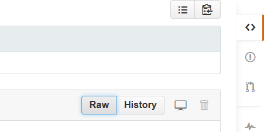

Github Seite
------------

-   Die folgende Seite ist die Startseite für den Kurs:

<https://github.com/Japhilko/GeoData/tree/master/2016>

-   Es lohnt sich immer wieder zu dieser Seite zurückzukehren, weil hier
    alle relevanten Dokumente verlinkt sind.

-   Grundsätzlich bietet es sich an, den einzelnen Teilen der
    Veranstaltung mit dem File zu folgen, dass mit dem Begriff *Browser*
    verlinkt ist.

Informationen audrucken
-----------------------

-   Zum Ausdrucken eignen sich die pdf-Dateien besser.

-   Diese können mit dem Raw Button heruntergeladen werden.

Weitere Dateien herunterladen
-----------------------------

-   Begleitend zu den Folien wird meistens auch ein R-File angeboten.

-   Hier können Sie entweder das gesamte R-File herunterladen und in R
    ausführen oder einzelne Befehle per Copy/Paste übernehmen.

-   Vereinzelt sind auch Datensätze vorhanden.

-   `.csv` Dateien können direkt von R eingelesen werden (wie das geht
    werde ich noch zeigen).

-   Wenn die `.csv` Dateien heruntergeladen werden sollen auch den Raw
    Button verwenden.

-   Alle anderen Dateien (bspw. `.RData`) auch mittels Raw
    Button herunterladen.

Organisatorisches
-----------------

-   Am Ende jeden Kapitels gibt es eine kurze Auffrischung von
    R-Befehlen die im Folgenden verwendet werden.

-   Zusätzlich gibt es für jedes Kapitel eine Aufgabe, da man nur durch
    eigenes Trainieren auf der Lernkurve vorankommt.

Links und Quellen
-----------------

Wen Github näher interessiert:

-   [Hello World](https://guides.github.com/activities/hello-world/)

-   [Understanding the
    GitHub](https://guides.github.com/introduction/flow/)
