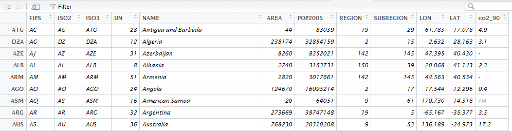

```{r,echo=F,warning=F}
library(knitr)
# data.path <- "J:/Work/Statistik/Kolb/Workshops/2015/Spatial_MA/Folien/dataImport/data"
Ex2 <- F
```


## Die `wrld_simpl` Daten 

```{r,warning=F,message=F}
library("maptools")
data("wrld_simpl")
```

Datensatz in die Daten-Registerkarte von Rstudio schreiben

```{r}
df_ws <- data.frame(wrld_simpl@data)
```


## Rstudio Data Browser

Jetzt können wir den Rstudio Daten-Browser verwenden

 


## Der wrld_simpl Datensatz

Holen Sie sich die Ländernamen:

```{r}
CNames <- wrld_simpl@data$NAME
head(CNames)
```

```{r}
CNames <- as.character(CNames)
head(CNames)
```

## Substring eines Zeichen-Vektors

```{r}
CNames1 <- substr(CNames,1,1)
head(CNames1)
```

```{r}
CNames2 <- substr(CNames,1,2)
head(CNames2)
```

## Auswahl vornehmen

```{r}
CNames[CNames2=="An"]
```


## CO2 Emissionen

```{r^,eval=F,echo=F}
link <- "https://raw.githubusercontent.com/Japhilko/GeoData/master/data/CO2emissions.csv"
co2 <- read.csv(link)
```

```{r}
(load("data/CO2emissions.RData"))
```


```{r,echo=F}
kable(co2[1:4,1:8])
```

Wir müssen Länder in diesem Datensatz und Ländernamen in wrld_simpl-Datensatz zusammenbringen


## Vektoren zum Matching

Wie bringt man zwei Vektoren zusammen:

```{r}
A <- c(1,2,3,4)
B <- c(4,3)
match(A,B)
```

```{r}
match(B,A)
```

## Vektoren zum Matching

```{r}
D <- c(1,3,5,6,7)
E <- c("A",1,98,4)
match(D,E)
```

- Matching mit Ländernamen, um eine Karte mit CO2 Indikatoren zu produzieren

## Matching

```{r}
ind <- match(wrld_simpl@data$NAME,co2$Country)
ind
```


## Daten anspielen

```{r}
wrld_simpl@data$co2_90 <- co2$j1990[ind]
```

```{r}
library(sp)
spplot(wrld_simpl,"co2_90")
```

## Zusätzliche Länder matchen

```{r}
ind2 <- match(co2$Country,wrld_simpl@data$NAME)
fehlt <- co2$Country[is.na(ind2)]
fehlt
```

Die Funktion `agrep`

```{r}
fehlt[1]
ind3 <- agrep(fehlt[1],wrld_simpl@data$NAME)
ind3
```

```{r}
wrld_simpl@data$NAME[ind3]
```

## Matching mit agrep

```{r}
Namen_ws <- as.character(wrld_simpl@data$NAME)
Namen_co2 <- as.character(co2$Country)
for (i in 1:length(ind)){
  if(is.na(ind[i])){
    ind4 <- agrep(Namen_ws[i],Namen_co2)
    if(length(ind4)==1){
      ind[i] <- ind4
    }
  }
}
```

## Daten anspielen

```{r}
wrld_simpl@data$co2_91 <- co2$j1991[ind]
```

```{r}
spplot(wrld_simpl,"co2_91")
```


## Matching mit Eurostat Daten

Sie können Statistik für wichtige ökonomische Indikatoren bei [Eurostat](http://ec.europa.eu/eurostat/web/euro-indicators/peeis) downloaden.

<http://ec.europa.eu/eurostat/web/euro-indicators/peeis>

Beispiel Sparquote:

<http://ec.europa.eu/eurostat/tgm/download.do?tab=table&plugin=0&language=en&pcode=teina500>

```{r,echo=F,eval=Ex2}
setwd("J:/Work/Statistik/Kolb/Workshops/2015/Spatial_MA/Folien/dataImport/data/")
```

```{r,eval=Ex2}
library(xlsx)
HHsr <- read.xlsx2("HHsavingRate.xls",1)
```

```{r,echo=F,eval=Ex2}
kable(HHsr[1:6,1:4])
```

## Der wrld_simpl Datensatz

Wir brauchen nur den europäischen Kontinent

```{r}
EUR <- wrld_simpl[wrld_simpl$REGION==150,]
plot(EUR)
```

## Europa ohne Russland

- Russland ist zu groß für unsere Karte :

```{r}
EUR <- EUR[-which(EUR@data$NAME=="Russia"),]
plot(EUR)
```

## Matching Staaten

```{r,eval=Ex2}
as.character(HHsr[5:10,1])
```

```{r}
EUR_Names <- as.character(EUR@data$NAME)
head(EUR_Names)
```

```{r,eval=Ex2}
ind <- match(EUR_Names,HHsr[,1])
head(ind)
table(is.na(ind))
```

## Die Daten an Polygondaten anfügen

```{r,eval=Ex2}
EUR@data$HHsr <- as.numeric(as.character(HHsr[ind,2]))
```

```{r,eval=Ex2}
# Plot the map:
library(sp)
spplot(EUR,"HHsr")
```

