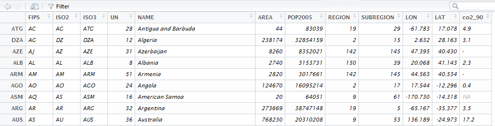

Die `wrld_simpl` Daten
----------------------

    library("maptools")
    data("wrld_simpl")

Datensatz in die Daten-Registerkarte von Rstudio schreiben

    df_ws <- data.frame(wrld_simpl@data)

Rstudio Data Browser
--------------------

Jetzt können wir den Rstudio Daten-Browser verwenden

Der wrld\_simpl Datensatz
-------------------------

Holen Sie sich die Ländernamen:

    CNames <- wrld_simpl@data$NAME
    head(CNames)

    ## [1] Antigua and Barbuda Algeria             Azerbaijan         
    ## [4] Albania             Armenia             Angola             
    ## 246 Levels: Aaland Islands Afghanistan Albania Algeria ... Zimbabwe

    CNames <- as.character(CNames)
    head(CNames)

    ## [1] "Antigua and Barbuda" "Algeria"             "Azerbaijan"         
    ## [4] "Albania"             "Armenia"             "Angola"

Substring eines Zeichen-Vektors
-------------------------------

    CNames1 <- substr(CNames,1,1)
    head(CNames1)

    ## [1] "A" "A" "A" "A" "A" "A"

    CNames2 <- substr(CNames,1,2)
    head(CNames2)

    ## [1] "An" "Al" "Az" "Al" "Ar" "An"

Auswahl vornehmen
-----------------

    CNames[CNames2=="An"]

    ## [1] "Antigua and Barbuda" "Angola"              "Anguilla"           
    ## [4] "Andorra"             "Antarctica"

CO2 Emissionen
--------------

    (load("data/CO2emissions.RData"))

    ## [1] "co2"

<table>
<thead>
<tr class="header">
<th align="left">Rank</th>
<th align="left">Country</th>
<th align="right">j1990</th>
<th align="right">j1991</th>
<th align="right">j1992</th>
<th align="right">j1993</th>
<th align="right">j1994</th>
<th align="right">j1995</th>
</tr>
</thead>
<tbody>
<tr class="odd">
<td align="left">1.</td>
<td align="left">Qatar</td>
<td align="right">25.2</td>
<td align="right">36.7</td>
<td align="right">54.3</td>
<td align="right">60.9</td>
<td align="right">58.7</td>
<td align="right">58.6</td>
</tr>
<tr class="even">
<td align="left">2.</td>
<td align="left">Trinidad and Tobago</td>
<td align="right">13.9</td>
<td align="right">17.1</td>
<td align="right">17.0</td>
<td align="right">13.5</td>
<td align="right">15.8</td>
<td align="right">16.6</td>
</tr>
<tr class="odd">
<td align="left">3.</td>
<td align="left">Netherlands Antilles</td>
<td align="right">32.6</td>
<td align="right">26.9</td>
<td align="right">22.6</td>
<td align="right">35.0</td>
<td align="right">34.3</td>
<td align="right">34.1</td>
</tr>
<tr class="even">
<td align="left">4.</td>
<td align="left">Kuwait</td>
<td align="right">19.0</td>
<td align="right">5.1</td>
<td align="right">10.0</td>
<td align="right">16.9</td>
<td align="right">20.8</td>
<td align="right">30.8</td>
</tr>
</tbody>
</table>

Wir müssen Länder in diesem Datensatz und Ländernamen in
wrld\_simpl-Datensatz zusammenbringen

Vektoren zum Matching
---------------------

Wie bringt man zwei Vektoren zusammen:

    A <- c(1,2,3,4)
    B <- c(4,3)
    match(A,B)

    ## [1] NA NA  2  1

    match(B,A)

    ## [1] 4 3

Vektoren zum Matching
---------------------

    D <- c(1,3,5,6,7)
    E <- c("A",1,98,4)
    match(D,E)

    ## [1]  2 NA NA NA NA

-   Matching mit Ländernamen, um eine Karte mit CO2 Indikatoren zu
    produzieren

Matching
--------

    ind <- match(wrld_simpl@data$NAME,co2$Country)
    ind

    ##   [1]  80  97  73 141 137 142  NA  84  11   8  77  69  65 180 143  47 144
    ##  [18]  NA 172 179 126  62  NA  14 181 171  NA 215 213  57 212 156  95  34
    ##  [35] 182 214 189 145 130 199 116 165 104  35  45 166 131 124 122 119  37
    ##  [52]  56  22 200 151 201  49  26  96  31 133  NA  NA 109  67 190 146 147
    ##  [69] 178 120  29  38  NA  41 154 202 125 192 150  79  72  58 136  NA  75
    ##  [86]  53  NA 105  39  92 101 184 152  NA 185  NA   4  19  NA 108 106  63
    ## [103]  90 193  61  NA  NA 203  85  98  20  NA 216 138 110 167  66  15 113
    ## [120]  93  52 205 204  21 115 207   7 102  36  71  NA  17  64  16  NA   9
    ## [137] 111  NA 170  NA  NA  NA  NA  NA  NA  NA  NA  NA  NA  NA  NA 175 169
    ## [154]  28  32 206  18  87 160  51 164 140 157  46 123  78 173 191   1  NA
    ## [171]  94  NA 161  NA  23 208  13  82  48  42  NA 114 174  44 194  60 209
    ## [188]  54 121 188  76  NA  74   2  99 153  NA 135 196  NA 118 100  NA  40
    ## [205]  NA 210  43  59  12 198 128  89 127  68  91  NA  NA 139  NA 158 159
    ## [222] 155 197 163 132  86   3  NA 195  NA  33 134  24  NA  NA  83 176  81
    ## [239]  NA  NA  NA  NA  NA  NA  NA  NA

Daten anspielen
---------------

    wrld_simpl@data$co2_90 <- co2$j1990[ind]

    library(sp)
    spplot(wrld_simpl,"co2_90")

<!-- -->

Zusätzliche Länder matchen
--------------------------

    ind2 <- match(co2$Country,wrld_simpl@data$NAME)
    fehlt <- co2$Country[is.na(ind2)]
    fehlt

    ##  [1] Brunei                                      
    ##  [2] United Arab Emirates                        
    ##  [3] Falkland Islands                            
    ##  [4] South Korea                                 
    ##  [5] Taiwan[4][5]                                
    ##  [6] Libya                                       
    ##  [7] European Union                              
    ##  [8] Iran                                        
    ##  [9] Macedonia                                   
    ## [10] World                                       
    ## [11] Réunion                                     
    ## [12] Syria                                       
    ## [13] North Korea                                 
    ## [14] Saint Helena, Ascension and Tristan da Cunha
    ## [15] Wallis and Futuna                           
    ## [16] Moldova                                     
    ## [17] Vietnam                                     
    ## [18] São Tomé and Príncipe                       
    ## [19] Federated States of Micronesia              
    ## [20] Republic of the Congo                       
    ## [21] Ivory Coast                                 
    ## [22] Laos                                        
    ## [23] Myanmar                                     
    ## [24] Tanzania                                    
    ## [25] Soviet Union                                
    ## [26] Czechoslovakia                              
    ## [27] Yugoslavia                                  
    ## 219 Levels: Afghanistan Albania Algeria Andorra Angola ... Zimbabwe

Die Funktion `agrep`

    fehlt[1]

    ## [1] Brunei
    ## 219 Levels: Afghanistan Albania Algeria Andorra Angola ... Zimbabwe

    ind3 <- agrep(fehlt[1],wrld_simpl@data$NAME)
    ind3

    ## [1] 23

    wrld_simpl@data$NAME[ind3]

    ## [1] Brunei Darussalam
    ## 246 Levels: Aaland Islands Afghanistan Albania Algeria ... Zimbabwe

Matching mit agrep
------------------

    Namen_ws <- as.character(wrld_simpl@data$NAME)
    Namen_co2 <- as.character(co2$Country)
    for (i in 1:length(ind)){
      if(is.na(ind[i])){
        ind4 <- agrep(Namen_ws[i],Namen_co2)
        if(length(ind4)==1){
          ind[i] <- ind4
        }
      }
    }

Daten anspielen
---------------

    wrld_simpl@data$co2_91 <- co2$j1991[ind]

    spplot(wrld_simpl,"co2_91")

<!-- -->

Matching mit Eurostat Daten
---------------------------

Sie können Statistik für wichtige ökonomische Indikatoren bei
[Eurostat](http://ec.europa.eu/eurostat/web/euro-indicators/peeis)
downloaden.

<http://ec.europa.eu/eurostat/web/euro-indicators/peeis>

Beispiel Sparquote:

<http://ec.europa.eu/eurostat/tgm/download.do?tab=table&plugin=0&language=en&pcode=teina500>

    library(xlsx)
    HHsr <- read.xlsx2("HHsavingRate.xls",1)

Der wrld\_simpl Datensatz
-------------------------

Wir brauchen nur den europäischen Kontinent

    EUR <- wrld_simpl[wrld_simpl$REGION==150,]
    plot(EUR)

<!-- -->

Europa ohne Russland
--------------------

-   Russland ist zu groß für unsere Karte :

<!-- -->

    EUR <- EUR[-which(EUR@data$NAME=="Russia"),]
    plot(EUR)

<!-- -->

Matching Staaten
----------------

    as.character(HHsr[5:10,1])

    EUR_Names <- as.character(EUR@data$NAME)
    head(EUR_Names)

    ## [1] "Albania"                "Bosnia and Herzegovina"
    ## [3] "Bulgaria"               "Denmark"               
    ## [5] "Ireland"                "Estonia"

    ind <- match(EUR_Names,HHsr[,1])
    head(ind)
    table(is.na(ind))

Die Daten an Polygondaten anfügen
---------------------------------

    EUR@data$HHsr <- as.numeric(as.character(HHsr[ind,2]))

    # Plot the map:
    library(sp)
    spplot(EUR,"HHsr")
