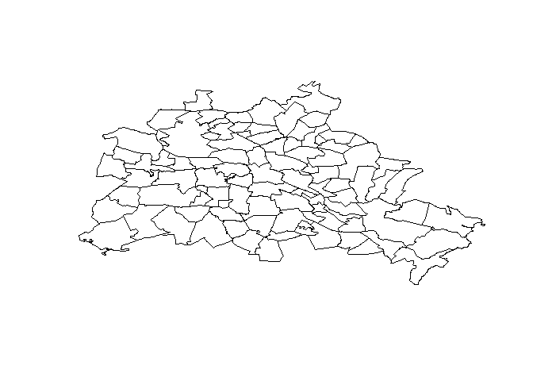
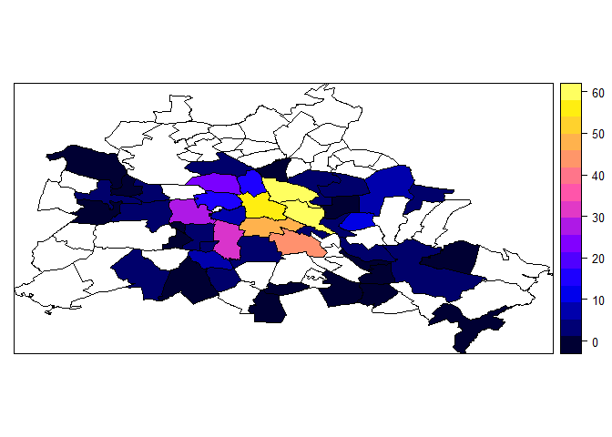

# Daten für Polygone aggregieren
Jan-Philipp Kolb  
31 März 2016  


## Administrative Grenzen Berlin

Die Polygonzüge können hier heruntergeladen werden:

<https://github.com/Japhilko/GeoData/blob/master/data/Berlin_adm10.RData>


```r
(load("data/Berlin_adm10.RData"))
```

```
## [1] "be10"
```

## Administrative Grenzen Berlin

- Die Daten stammen von OpenStreetMap und wurden mit PostGIS und QGIS extrahiert.


```r
library(maptools)
plot(be10)
```



## Daten zu Bars einlesen


```r
link <- "https://raw.githubusercontent.com/Japhilko/GeoData/master/data/Deutschland_bar.csv"
bars <- read.csv(link)
```

Der Datensatz wurde auf Basis von OpenStreetMap Informationen unter der Nutzung der Overpass API erstellt.

## Der Datensatz


  X        lat         lon  place                name              
---  ---------  ----------  -------------------  ------------------
  1   54.33268   10.111893  Schleswig-Holstein   Bonema            
  2   54.65974    9.931704  Schleswig-Holstein   dodo club         
  3   53.86208   10.687524  Schleswig-Holstein   Jazz Cafe Lübeck 
  4   53.87045   10.688367  Schleswig-Holstein   Bolero            
  5   54.16740   10.549837  Schleswig-Holstein   Edgar's           
  6   53.57845    9.704408  Schleswig-Holstein   I touch           
  7   54.33113   10.179918  Schleswig-Holstein   Lola Coffee Bar   
  8   54.09173   10.805188  Schleswig-Holstein   Baritim           


## Basisdatensatz einschränken


```r
be_bar <- bars[bars$place=="Berlin",]
```

in einen spatialpoints Datensatz umwandeln

```r
library(sp)
pts <- cbind(be_bar$lon,be_bar$lat)
sp_df <- SpatialPointsDataFrame(pts,be_bar)
```


## Ist der Punkt im Polygon


```r
tmp <- over(sp_df,be10)
nrow(tmp)
```

```
## [1] 486
```

```r
length(be10)
```

```
## [1] 97
```

```r
nrow(be_bar)
```

```
## [1] 486
```


```r
ind <- match(tmp$way_area,be10@data$way_area)
ind
```

```
##   [1] 34 57 34 59 57 59 62 62 62 62 15 57 27 57 62 57 54 22 59 59 59 59 59
##  [24] 24 57 62 57 57 27 55 46 56 55 69 82 60 62 59 54 55 65 59 28 59 57 54
##  [47] 65 56 59 59 59 57 59 59 59 22 55 62 44 62 64 24 23 24 57 57  8 64 59
##  [70] 59 64 58 58 18 81 81 58 57 59 59 56 62 62 62 62 58 11 56 23 62 62 62
##  [93] 62 62 65 59 68 57 55 28 62 62 62 56 59 57 62 24 10 56 59 55  7 57 82
## [116] 82 24 55 57 57 57 57 57 57 57 24 62 56 56 59 56 59 56 59 57 59 62 62
## [139] 57 59 59 62 59 59 62 59 56 56 28 28 57 13 59 28 59 56 57 62 59 62 57
## [162] 62 62 11 11 56 59 57 57  7 53 19 28 56 59 46 57 27 27 58 11 28 62 17
## [185] 58 58 57 65 55 64 65 24 59 65 67 24 55 20 23 55 59 59 57 58 62 59 81
## [208] 66 66 62 73 55 57 55 57 81 62 55 81 57 27 22 23 57 56 67  7 55 11 55
## [231] 57 57 62 22 22 27 57 62 22 57 62 22 22 55 23 55 62 24 56 58 62 21 55
## [254] 55 24 24 59 59 58 58 21 16 55 46 56 56 22 28 58 28 56 55 59 11 24 22
## [277] 28 66 59 56 57 59 28 28 28 55 14 28 59 56 21 56 62 62 24 55 62 27 56
## [300] 74 58 58 56 62 13 17 15 69 27 62 28 28 28 59 56 56 56 56 24 22 57 59
## [323] 56 22 55 27 27 55 22 56 23 28 74 55 62 76 55 55 28 55 58 28 55 62 59
## [346] 27 27 24 13 24 56 56 56 56 56 62 56 48 55 28 29 41 56 59 57 56 57 56
## [369] 24 24 55 56 62 56 62 34 62 62 55 24 86 65 24 57 60 62 13 43 21 56 62
## [392] 57 28 NA 27 20 24 59 57 56 46 55 57 15 82 82 24 57 55 55 24 24 55 34
## [415] 59 24 55 22 57 60 60 22 56 24 57 22 22 59 10 56 59 57 55 56 11 20 55
## [438] 22 74 11 62 20 74 74 65 22 22 59 22 24 56 24 65 22 57 24 65 59 55 62
## [461] 62 59 27 27 55 71 55 57 23 22 56 22 22 22 22 22 22 22 22 22 23 23 22
## [484] 81 62 66
```


```r
tab_bars <- table(tmp$way_area)
ind_bars <- match(be10@data$way_area,names(tab_bars))
be10@data$bars <- tab_bars[ind_bars]
```

## Karte mit Bars in Berlin


```r
spplot(be10,"bars")
```



