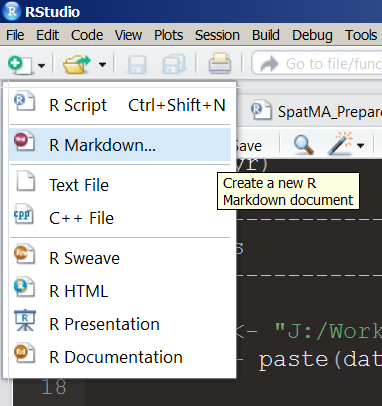
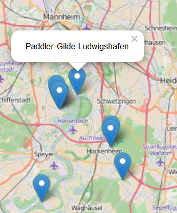
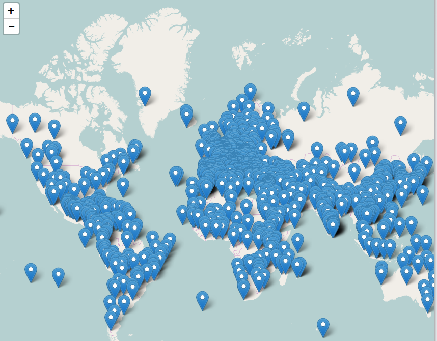

```{r,echo=F,warning=F}
library(knitr)
Ex <- T
```

```{r,echo=F}
internet=F
```


## Präsentationen mit Rstudio I



## Präsentationen mit  Rstudio II


## Präsentationen mit Rstudio III


## Fragen

- Wie kann man zwei Graphiken nebeneinander darstellen?
- Wie kann man Graphiken speichern?
- Wie bekommt man Popups in interaktive Graphiken?


## Beispiel zu Campingplätzen

- Die Daten stammen von:

<http://www.openstreetmap.de/>

- Dabei wird die Overpass API genutzt:

<http://wiki.openstreetmap.org/wiki/Overpass_API>

```{r,echo=F}
url <- "https://raw.githubusercontent.com/Japhilko/GeoData/master/2015/data/CampSites_Germany.csv"
```

```{r,eval=F}
url <- "https://raw.githubusercontent.com/Japhilko/
GeoData/master/2015/data/CampSites_Germany.csv"
```

```{r}
CampSites <- read.csv(url)
```


## Überblick über Daten zu Campingplätzen

```{r,echo=F}
kable(CampSites[1:8,1:4])
```


## Eine Karte für Deutschland bekommen

```{r Get map of Germany,message=F,warning=F,eval=F}
library(raster)
DEU1 <- getData('GADM', country='DEU', level=1)
```

```{r,eval=F,echo=F}
setwd("C:/Users/kolbjp/Documents/GitHub/GeoData/2016/slides/data")
save(DEU1,file="DEU1.RData")
```

```{r,echo=F}
load("data/DEU1.RData")
```

```{r,message=F}
library(maptools)
plot(DEU1)
```

## Die Campingplätze hinzufügen

```{r plot Campsites,eval=Ex}
plot(DEU1)
points(y=CampSites$lat,x=CampSites$lon,
       col="red",pch=20)
```

## Die Transparenz verändern

```{r,eval=Ex}
plot(DEU1)
points(y=CampSites$lat,x=CampSites$lon,col=rgb(0,1,0,.2),
       pch=20)
```

## Eine Google Karte für Deutschland bekommen

```{r,message=F,warning=F,eval=Ex}
library(ggmap)
DE_Map <- qmap("Germany", zoom=6, maptype="hybrid")
DE_Map
```

## Die Punkte auf die Google Karte zeichnen

```{r,warning=F,eval=Ex}
DE_Map + geom_point(aes(x = lon, y = lat),
                    data = CampSites)
```

## Einen Dichteplot zeichnen

```{r,eval=Ex}
DE_Map + geom_density2d(data = CampSites,                  aes(x = lon, y = lat),lwd=1.5)
```

## Einen anderen Dichteplot

```{r,eval=Ex}
DE_Map + stat_density2d(data = CampSites, 
aes(x = lon, y = lat,fill = ..level..), bins = 100, 
geom = 'polygon')
```


## Einen anderen Dichteplot

```{r,eval=Ex}
DE_Map + stat_density2d(data=CampSites, 
                        aes(x=lon,y=lat,fill=..level..,
alpha = ..level..),bins=80,geom='polygon')
```

## Notwendige Pakete

[magrittr](https://cran.r-project.org/web/packages/magrittr/index.html) - für den Pipe Operator in R:

```{r,warning=F}
library("magrittr")
```


[leaflet](https://rstudio.github.io/leaflet/) - um  interaktive Karten mit der JavaScript Bibliothek 'Leaflet' zu erzeugen

```{r,warning=F}
library("leaflet")
```


## Eine interaktive Karte

```{r,eval=F}
m <- leaflet() %>%
  addTiles() %>%  
  addMarkers(lng=CampSites$lon, 
             lat=CampSites$lat, 
             popup=CampSites$name)
m
```

## Mehr Informationen hinzufügen

```{r,eval=F}
popupInfo <- paste(CampSites$name,"\n",CampSites$website)
```

```{r,eval=F}
m <- leaflet() %>%
  addTiles() %>%  # Add default OpenStreetMap map tiles
  addMarkers(lng=CampSites$lon, 
             lat=CampSites$lat, 
             popup=popupInfo)
m
```

Das Ergebnis ist hier:

<http://rpubs.com/Japhilko82/CampSitesHL>

## Die resultierende Karte


## Popups in einer interactiven Karte



Ich hab die Ergebnisse hochgeladen:

<http://rpubs.com/Japhilko82/Campsites>

## Wie man auf Rpubs publizieren kann


## Ein weiteres Beispiel - Weltkulturerbe

```{r,cache=T}
url <- "https://raw.githubusercontent.com/Japhilko/
GeoData/master/2015/data/whcSites.csv"

whcSites <- read.csv(url) 
```


## Eine interaktive Karte erstellen

```{r,eval=internet}
m <- leaflet() %>%
  addTiles() %>%  # Add default OpenStreetMap map tiles
  addMarkers(lng=whcSites$lon, 
             lat=whcSites$lat, 
             popup=whcSites$name_en)
m
```

## Die Karte zeigen

 

## Farbe hinzu

```{r}
whcSites$color <- "red"
whcSites$color[whcSites$category=="Cultural"] <- "blue"
whcSites$color[whcSites$category=="Mixed"] <- "orange"
```

## Eine Karte mit Farbe erzeugen

```{r,eval=internet}
m1 <- leaflet() %>%
  addTiles() %>%  
  addCircles(lng=whcSites$lon, 
             lat=whcSites$lat, 
             popup=whcSites$name_en,
             color=whcSites$color)
m1
```

## Die Karte zeigen

 

## [Die Karte abspeichern](http://www.r-bloggers.com/interactive-mapping-with-leaflet-in-r-2/)


## ggmap: Zwei Karten nebeneinander

```{r}
url <- "https://raw.githubusercontent.com/Japhilko/
GeoData/master/2015/data/whcSites.csv"
UNESCO <- read.csv(url)
```

```{r,echo=F}
kable(UNESCO[1:4,c("name_en","latitude","longitude")])
```

## Die Stätten für Deutschland

```{r,cache=T,message=F}
library(ggmap)
ind <- UNESCO$states_name_en=="Germany"
UNESCO_DE <- UNESCO[ind,]
```

## Eine erste Karte zeichnen

```{r,message=F,eval=Ex}
library(ggplot2)
DE_Map + geom_point(aes(x = longitude, y = latitude),
                    data = UNESCO_DE)
```


## Zwei Karten produzieren

```{r,eval=Ex}
library(ggplot2)
DNunesco <- UNESCO_DE[UNESCO_DE$category=="Natural",]
DCunesco <- UNESCO_DE[UNESCO_DE$category=="Cultural",]

Csites <- DE_Map + geom_point(aes(x = longitude, 
                                  y = latitude),
                              data =DCunesco,
                              col="orange", size= 3)

Nsites <- DE_Map + geom_point(aes(x = longitude, 
                                  y = latitude),
                              data = DNunesco,
                              col="green", size= 3)
```


## Zwei Graphiken [nebeneinander](http://stackoverflow.com/questions/1249548/side-by-side-plots-with-ggplot2)

```{r,eval=Ex}
library(gridExtra)
grid.arrange(Csites, Nsites, ncol=2)
```


## Links und Quellen

- <http://www.r-bloggers.com/the-leaflet-package-for-online-mapping-in-r/>

- <https://rstudio.github.io/leaflet/>


