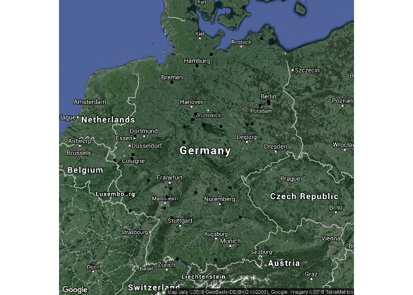

Präsentationen mit Rstudio I
----------------------------

Präsentationen mit Rstudio II
-----------------------------

Präsentationen mit Rstudio III
------------------------------

Fragen
------

-   Wie kann man zwei Graphiken nebeneinander darstellen?
-   Wie kann man Graphiken speichern?
-   Wie bekommt man Popups in interaktive Graphiken?

Beispiel zu Campingplätzen
--------------------------

-   Die Daten stammen von:

<http://www.openstreetmap.de/>

-   Dabei wird die Overpass API genutzt:

<http://wiki.openstreetmap.org/wiki/Overpass_API>

    url <- "https://raw.githubusercontent.com/Japhilko/
    GeoData/master/2015/data/CampSites_Germany.csv"

    CampSites <- read.csv(url)

Überblick über Daten zu Campingplätzen
--------------------------------------

<table>
<thead>
<tr class="header">
<th align="right">X</th>
<th align="left">name</th>
<th align="left">tourism</th>
<th align="left">website</th>
</tr>
</thead>
<tbody>
<tr class="odd">
<td align="right">1</td>
<td align="left">Campingplatz Winkelbachtal</td>
<td align="left">camp_site</td>
<td align="left"><a href="http://www.gruibingen.de/campingplatz.html" class="uri">http://www.gruibingen.de/campingplatz.html</a></td>
</tr>
<tr class="even">
<td align="right">2</td>
<td align="left">Radler-Zeltplatz</td>
<td align="left">camp_site</td>
<td align="left">NA</td>
</tr>
<tr class="odd">
<td align="right">3</td>
<td align="left">Campingplatz des Naturfreundehauses</td>
<td align="left">camp_site</td>
<td align="left">NA</td>
</tr>
<tr class="even">
<td align="right">4</td>
<td align="left">Campingplatz Am Aichstruter Stausee</td>
<td align="left">camp_site</td>
<td align="left">NA</td>
</tr>
<tr class="odd">
<td align="right">5</td>
<td align="left">NA</td>
<td align="left">camp_site</td>
<td align="left">NA</td>
</tr>
<tr class="even">
<td align="right">6</td>
<td align="left">Kandern</td>
<td align="left">camp_site</td>
<td align="left">NA</td>
</tr>
<tr class="odd">
<td align="right">7</td>
<td align="left">Campingplatz Baiersbronn-Obertal</td>
<td align="left">camp_site</td>
<td align="left">NA</td>
</tr>
<tr class="even">
<td align="right">8</td>
<td align="left">Campingplatz Schwabenmühle</td>
<td align="left">camp_site</td>
<td align="left">NA</td>
</tr>
</tbody>
</table>

Eine Karte für Deutschland bekommen
-----------------------------------

    library(raster)
    DEU1 <- getData('GADM', country='DEU', level=1)

    library(maptools)
    plot(DEU1)

<!-- -->

Die Campingplätze hinzufügen
----------------------------

    plot(DEU1)
    points(y=CampSites$lat,x=CampSites$lon,
           col="red",pch=20)

<!-- -->

Die Transparenz verändern
-------------------------

    plot(DEU1)
    points(y=CampSites$lat,x=CampSites$lon,col=rgb(0,1,0,.2),
           pch=20)

<!-- -->

Eine Google Karte für Deutschland bekommen
------------------------------------------

    library(ggmap)
    DE_Map <- qmap("Germany", zoom=6, maptype="hybrid")
    DE_Map

<!-- -->

Die Punkte auf die Google Karte zeichnen
----------------------------------------

    DE_Map + geom_point(aes(x = lon, y = lat),
                        data = CampSites)

<!-- -->

Einen Dichteplot zeichnen
-------------------------

    DE_Map + geom_density2d(data = CampSites,                  aes(x = lon, y = lat),lwd=1.5)

<!-- -->

Einen anderen Dichteplot
------------------------

    DE_Map + stat_density2d(data = CampSites, 
    aes(x = lon, y = lat,fill = ..level..), bins = 100, 
    geom = 'polygon')

<!-- -->

Einen anderen Dichteplot
------------------------

    DE_Map + stat_density2d(data=CampSites, 
                            aes(x=lon,y=lat,fill=..level..,
    alpha = ..level..),bins=80,geom='polygon')

<!-- -->

Notwendige Pakete
-----------------

[magrittr](https://cran.r-project.org/web/packages/magrittr/index.html)
- für den Pipe Operator in R:

    library("magrittr")

    ## 
    ## Attaching package: 'magrittr'

    ## The following object is masked from 'package:ggmap':
    ## 
    ##     inset

[leaflet](https://rstudio.github.io/leaflet/) - um interaktive Karten
mit der JavaScript Bibliothek 'Leaflet' zu erzeugen

    library("leaflet")

Eine interaktive Karte
----------------------

    m <- leaflet() %>%
      addTiles() %>%  
      addMarkers(lng=CampSites$lon, 
                 lat=CampSites$lat, 
                 popup=CampSites$name)
    m

Mehr Informationen hinzufügen
-----------------------------

    popupInfo <- paste(CampSites$name,"\n",CampSites$website)

    m <- leaflet() %>%
      addTiles() %>%  # Add default OpenStreetMap map tiles
      addMarkers(lng=CampSites$lon, 
                 lat=CampSites$lat, 
                 popup=popupInfo)
    m

Das Ergebnis ist hier:

<http://rpubs.com/Japhilko82/CampSitesHL>

Die resultierende Karte
-----------------------

Popups in einer interactiven Karte
----------------------------------

Ich hab die Ergebnisse hochgeladen:

<http://rpubs.com/Japhilko82/Campsites>

Wie man auf Rpubs publizieren kann
----------------------------------

Ein weiteres Beispiel - Weltkulturerbe
--------------------------------------

    url <- "https://raw.githubusercontent.com/Japhilko/
    GeoData/master/2015/data/whcSites.csv"

    whcSites <- read.csv(url) 

Eine interaktive Karte erstellen
--------------------------------

    m <- leaflet() %>%
      addTiles() %>%  # Add default OpenStreetMap map tiles
      addMarkers(lng=whcSites$lon, 
                 lat=whcSites$lat, 
                 popup=whcSites$name_en)
    m

Die Karte zeigen
----------------

Farbe hinzu
-----------

    whcSites$color <- "red"
    whcSites$color[whcSites$category=="Cultural"] <- "blue"
    whcSites$color[whcSites$category=="Mixed"] <- "orange"

Eine Karte mit Farbe erzeugen
-----------------------------

    m1 <- leaflet() %>%
      addTiles() %>%  
      addCircles(lng=whcSites$lon, 
                 lat=whcSites$lat, 
                 popup=whcSites$name_en,
                 color=whcSites$color)
    m1

Die Karte zeigen
----------------

[Die Karte abspeichern](http://www.r-bloggers.com/interactive-mapping-with-leaflet-in-r-2/)
-------------------------------------------------------------------------------------------

ggmap: Zwei Karten nebeneinander
--------------------------------

    url <- "https://raw.githubusercontent.com/Japhilko/
    GeoData/master/2015/data/whcSites.csv"
    UNESCO <- read.csv(url)

<table>
<thead>
<tr class="header">
<th align="left">name_en</th>
<th align="right">latitude</th>
<th align="right">longitude</th>
</tr>
</thead>
<tbody>
<tr class="odd">
<td align="left">Cultural Landscape and Archaeological Remains of the Bamiyan Valley</td>
<td align="right">34.84694</td>
<td align="right">67.82525</td>
</tr>
<tr class="even">
<td align="left">Minaret and Archaeological Remains of Jam</td>
<td align="right">34.39656</td>
<td align="right">64.51606</td>
</tr>
<tr class="odd">
<td align="left">Historic Centres of Berat and Gjirokastra</td>
<td align="right">40.06944</td>
<td align="right">20.13333</td>
</tr>
<tr class="even">
<td align="left">Butrint</td>
<td align="right">39.75111</td>
<td align="right">20.02611</td>
</tr>
</tbody>
</table>

Die Stätten für Deutschland
---------------------------

    library(ggmap)
    ind <- UNESCO$states_name_en=="Germany"
    UNESCO_DE <- UNESCO[ind,]

Eine erste Karte zeichnen
-------------------------

    library(ggplot2)
    DE_Map + geom_point(aes(x = longitude, y = latitude),
                        data = UNESCO_DE)

<!-- -->

Zwei Karten produzieren
-----------------------

    library(ggplot2)
    DNunesco <- UNESCO_DE[UNESCO_DE$category=="Natural",]
    DCunesco <- UNESCO_DE[UNESCO_DE$category=="Cultural",]

    Csites <- DE_Map + geom_point(aes(x = longitude, 
                                      y = latitude),
                                  data =DCunesco,
                                  col="orange", size= 3)

    Nsites <- DE_Map + geom_point(aes(x = longitude, 
                                      y = latitude),
                                  data = DNunesco,
                                  col="green", size= 3)

Zwei Graphiken [nebeneinander](http://stackoverflow.com/questions/1249548/side-by-side-plots-with-ggplot2)
----------------------------------------------------------------------------------------------------------

    library(gridExtra)
    grid.arrange(Csites, Nsites, ncol=2)

<!-- -->

Links und Quellen
-----------------

-   <http://www.r-bloggers.com/the-leaflet-package-for-online-mapping-in-r/>

-   <https://rstudio.github.io/leaflet/>
