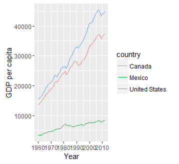

```{r setup, include=FALSE}
knitr::opts_chunk$set(echo = TRUE)
Ex<- F
ca <- F
```

## In R integrierte Datensätze

Das R-Paket datasets

```{r,eval=Ex}
library(datasets)
```

Beispiel Erdbeben Datensatz:

```{r,eval=Ex}
head(quakes)
```

```{r,echo=F,eval=F}
kable(head(quakes))
```

|    lat|   long| depth| mag| stations|
|------:|------:|-----:|---:|--------:|
| -20.42| 181.62|   562| 4.8|       41|
| -20.62| 181.03|   650| 4.2|       15|
| -26.00| 184.10|    42| 5.4|       43|
| -17.97| 181.66|   626| 4.1|       19|
| -20.42| 181.96|   649| 4.0|       11|
| -19.68| 184.31|   195| 4.0|       12|


```{r,echo=F,eval=Ex}
kable(head(quakes))
```


## [FAO Datenbank](http://cran.r-project.org/web/packages/FAOSTAT/index.html)


```{r,eval=Ex}
library("FAOSTAT")
```

```{r,eval=F}
FAOsearch()
test <- getFAO(query = .LastSearch)
```

```{r,eval=F}
colnames(test)[3] <- "Annual Population"
kable(head(test))
```

| FAOST_CODE| Year| Annual Population|
|----------:|----:|-----------------:|
|        100| 1950|        376325.205|
|        104| 1950|          2913.093|
|        110| 1950|         82199.470|
|        114| 1950|          6076.757|
|        118| 1950|           152.250|
|        120| 1950|          1682.916|


## National health and nutrition examination survey

```{r,eval=Ex}
library(survey)
data(nhanes)
```

```{r,eval=F,echo=F}
kable(head(nhanes[,1:6]))
```

| SDMVPSU| SDMVSTRA| WTMEC2YR| HI_CHOL| race|agecat   |
|-------:|--------:|--------:|-------:|----:|:--------|
|       1|       83| 81528.77|       0|    2|(19,39]  |
|       1|       84| 14509.28|       0|    3|(0,19]   |
|       2|       86| 12041.64|       0|    3|(0,19]   |
|       2|       75| 21000.34|       0|    3|(59,Inf] |
|       1|       88| 22633.58|       0|    1|(19,39]  |
|       2|       85| 74112.49|       1|    2|(39,59]  |


## Datensatz zum US Zensus

```{r,message=F,eval=Ex}
library(UScensus2010)
```

<http://www.jstatsoft.org/htaccess.php?volume=37&type=i&issue=06&paper=true>

Disclaimer: Funktioniert leider mit der neuesten R-Version nicht so gut

## Weltbank Daten

[`WDI`](https://cran.r-project.org/web/packages/WDI/index.html) - World Development Indicators (World Bank) - [Einführung in das Paket](https://github.com/vincentarelbundock/WDI)

```{r,message=F,eval=Ex}
library(WDI)
```

```{r,eval=F,eval=Ex}
WDIsearch('gdp')[1:10,]
```

```{r,echo=F,eval=Ex}
kable(WDIsearch('gdp')[1:10,])
```

[1,] "Trade in services (% of GDP)"                                            
 [2,] "Foreign direct investment, net outflows (% of GDP)"                      
 [3,] "Current account balance (% of GDP)"                                      
 [4,] "Current account balance excluding net official capital grants (% of GDP)"
 [5,] "Net income (% of GDP)"   
 
 
## Nutzung von WDI Daten

```{r,cache=ca,eval=Ex}
dat <-  WDI(indicator='NY.GDP.PCAP.KD',
            country=c('MX','CA','US'), 
            start=1960, end=2012)
head(dat)
```

```{r,echo=F,eval=Ex}
kable(head(dat))
```

|iso2c |country | NY.GDP.PCAP.KD| year|
|:-----|:-------|--------------:|----:|
|CA    |Canada  |       37442.33| 2012|
|CA    |Canada  |       37176.16| 2011|
|CA    |Canada  |       36465.71| 2010|
|CA    |Canada  |       35670.58| 2009|
|CA    |Canada  |       37086.90| 2008|
|CA    |Canada  |       37054.88| 2007|

## Erste Grafik mit WDI Daten

```{r,echo=F,cache=ca,eval=Ex}
library(ggplot2)
ggplot(dat, aes(year, NY.GDP.PCAP.KD, color=country)) + geom_line() + 
    xlab('Year') + ylab('GDP per capita')
```



## worldHires Daten

```{r,cache=ca,warning=F,message=F,eval=T}
library(mapdata)
data(worldHiresMapEnv)
map('worldHires', col=1:10)
```


## Historische Daten

- [R-Paket HistData](http://www.inside-r.org/packages/cran/HistData)

```{r,cache=ca,warning=F,eval=Ex}
library(HistData)
data(Arbuthnot)
```

```{r,eval=F,echo=F}
kable(head(Arbuthnot))
```

| Year| Males| Females| Plague| Mortality|    Ratio| Total|
|----:|-----:|-------:|------:|---------:|--------:|-----:|
| 1629|  5218|    4683|      0|      8771| 1.114243| 9.901|
| 1630|  4858|    4457|   1317|     10554| 1.089971| 9.315|
| 1631|  4422|    4102|    274|      8562| 1.078011| 8.524|
| 1632|  4994|    4590|      8|      9535| 1.088017| 9.584|
| 1633|  5158|    4839|      0|      8393| 1.065923| 9.997|
| 1634|  5035|    4820|      1|     10400| 1.044606| 9.855|


## Global Database of Events, Language, and Tone (GDELT)

- [GDELT](http://www.gdeltproject.org/) - http://www.gdeltproject.org/

- Daten zu TV-Sendungen, Online und Print-Artikeln etc. ([Beispiel 1](http://quantifyingmemory.blogspot.de/2013/04/mapping-gdelt-data-in-r-and-some.html), 
[http://www.kalevleetaru.com/](http://www.kalevleetaru.com/))


```{r,eval=F,cache=ca,warning=F,eval=Ex}
library(GDELTtools)
test.filter <- list(ActionGeo_ADM1Code=c("NI", "US"),
                    ActionGeo_CountryCode="US")
test.results <- GetGDELT(start.date="1979-01-01",
                         end.date="1979-12-31",
                         filter=test.filter)
```

## GDELT Daten

Beispiel für enthaltene Daten

```{r,eval=F,echo=F}
kable(test.results[1:4,c("Year","Actor2Geo_FullName","GoldsteinScale","Actor1Geo_Lat")])
```

|    | Year|Actor2Geo_FullName | GoldsteinScale| Actor1Geo_Lat|
|:---|----:|:------------------|--------------:|-------------:|
|49  | 1979|United States      |            3.0|           0.0|
|147 | 1979|Cuba               |            0.0|          38.0|
|148 | 1979|United States      |            3.5|          21.5|
|149 | 1979|United States      |           -2.0|          21.5|


## Die Goldstein Skala

Die Skala misst die Intensität von Konflikten


<http://web.pdx.edu/~kinsella/jgscale.html>
