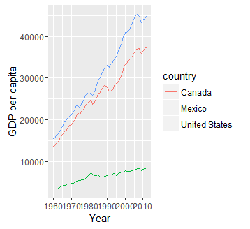
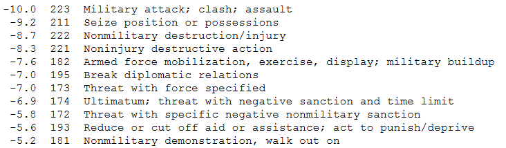

In R integrierte Datensätze
---------------------------

Das R-Paket datasets

    library(datasets)

Beispiel Erdbeben Datensatz:

    head(quakes)

<table>
<thead>
<tr class="header">
<th align="right">lat</th>
<th align="right">long</th>
<th align="right">depth</th>
<th align="right">mag</th>
<th align="right">stations</th>
</tr>
</thead>
<tbody>
<tr class="odd">
<td align="right">-20.42</td>
<td align="right">181.62</td>
<td align="right">562</td>
<td align="right">4.8</td>
<td align="right">41</td>
</tr>
<tr class="even">
<td align="right">-20.62</td>
<td align="right">181.03</td>
<td align="right">650</td>
<td align="right">4.2</td>
<td align="right">15</td>
</tr>
<tr class="odd">
<td align="right">-26.00</td>
<td align="right">184.10</td>
<td align="right">42</td>
<td align="right">5.4</td>
<td align="right">43</td>
</tr>
<tr class="even">
<td align="right">-17.97</td>
<td align="right">181.66</td>
<td align="right">626</td>
<td align="right">4.1</td>
<td align="right">19</td>
</tr>
<tr class="odd">
<td align="right">-20.42</td>
<td align="right">181.96</td>
<td align="right">649</td>
<td align="right">4.0</td>
<td align="right">11</td>
</tr>
<tr class="even">
<td align="right">-19.68</td>
<td align="right">184.31</td>
<td align="right">195</td>
<td align="right">4.0</td>
<td align="right">12</td>
</tr>
</tbody>
</table>

[FAO Datenbank](http://cran.r-project.org/web/packages/FAOSTAT/index.html)
--------------------------------------------------------------------------

    library("FAOSTAT")

    FAOsearch()
    test <- getFAO(query = .LastSearch)

    colnames(test)[3] <- "Annual Population"
    kable(head(test))

<table>
<thead>
<tr class="header">
<th align="right">FAOST_CODE</th>
<th align="right">Year</th>
<th align="right">Annual Population</th>
</tr>
</thead>
<tbody>
<tr class="odd">
<td align="right">100</td>
<td align="right">1950</td>
<td align="right">376325.205</td>
</tr>
<tr class="even">
<td align="right">104</td>
<td align="right">1950</td>
<td align="right">2913.093</td>
</tr>
<tr class="odd">
<td align="right">110</td>
<td align="right">1950</td>
<td align="right">82199.470</td>
</tr>
<tr class="even">
<td align="right">114</td>
<td align="right">1950</td>
<td align="right">6076.757</td>
</tr>
<tr class="odd">
<td align="right">118</td>
<td align="right">1950</td>
<td align="right">152.250</td>
</tr>
<tr class="even">
<td align="right">120</td>
<td align="right">1950</td>
<td align="right">1682.916</td>
</tr>
</tbody>
</table>

National health and nutrition examination survey
------------------------------------------------

    library(survey)
    data(nhanes)

<table>
<thead>
<tr class="header">
<th align="right">SDMVPSU</th>
<th align="right">SDMVSTRA</th>
<th align="right">WTMEC2YR</th>
<th align="right">HI_CHOL</th>
<th align="right">race</th>
<th align="left">agecat</th>
</tr>
</thead>
<tbody>
<tr class="odd">
<td align="right">1</td>
<td align="right">83</td>
<td align="right">81528.77</td>
<td align="right">0</td>
<td align="right">2</td>
<td align="left">(19,39]</td>
</tr>
<tr class="even">
<td align="right">1</td>
<td align="right">84</td>
<td align="right">14509.28</td>
<td align="right">0</td>
<td align="right">3</td>
<td align="left">(0,19]</td>
</tr>
<tr class="odd">
<td align="right">2</td>
<td align="right">86</td>
<td align="right">12041.64</td>
<td align="right">0</td>
<td align="right">3</td>
<td align="left">(0,19]</td>
</tr>
<tr class="even">
<td align="right">2</td>
<td align="right">75</td>
<td align="right">21000.34</td>
<td align="right">0</td>
<td align="right">3</td>
<td align="left">(59,Inf]</td>
</tr>
<tr class="odd">
<td align="right">1</td>
<td align="right">88</td>
<td align="right">22633.58</td>
<td align="right">0</td>
<td align="right">1</td>
<td align="left">(19,39]</td>
</tr>
<tr class="even">
<td align="right">2</td>
<td align="right">85</td>
<td align="right">74112.49</td>
<td align="right">1</td>
<td align="right">2</td>
<td align="left">(39,59]</td>
</tr>
</tbody>
</table>

Datensatz zum US Zensus
-----------------------

    library(UScensus2010)

<http://www.jstatsoft.org/htaccess.php?volume=37&type=i&issue=06&paper=true>

Disclaimer: Funktioniert leider mit der neuesten R-Version nicht so gut

Weltbank Daten
--------------

[`WDI`](https://cran.r-project.org/web/packages/WDI/index.html) - World
Development Indicators (World Bank) - [Einführung in das
Paket](https://github.com/vincentarelbundock/WDI)

    library(WDI)

    WDIsearch('gdp')[1:10,]

\[1,\] "Trade in services (% of GDP)"  
\[2,\] "Foreign direct investment, net outflows (% of GDP)"  
\[3,\] "Current account balance (% of GDP)"  
\[4,\] "Current account balance excluding net official capital grants (%
of GDP)" \[5,\] "Net income (% of GDP)"

Nutzung von WDI Daten
---------------------

    dat <-  WDI(indicator='NY.GDP.PCAP.KD',
                country=c('MX','CA','US'), 
                start=1960, end=2012)
    head(dat)

<table>
<thead>
<tr class="header">
<th align="left">iso2c</th>
<th align="left">country</th>
<th align="right">NY.GDP.PCAP.KD</th>
<th align="right">year</th>
</tr>
</thead>
<tbody>
<tr class="odd">
<td align="left">CA</td>
<td align="left">Canada</td>
<td align="right">37442.33</td>
<td align="right">2012</td>
</tr>
<tr class="even">
<td align="left">CA</td>
<td align="left">Canada</td>
<td align="right">37176.16</td>
<td align="right">2011</td>
</tr>
<tr class="odd">
<td align="left">CA</td>
<td align="left">Canada</td>
<td align="right">36465.71</td>
<td align="right">2010</td>
</tr>
<tr class="even">
<td align="left">CA</td>
<td align="left">Canada</td>
<td align="right">35670.58</td>
<td align="right">2009</td>
</tr>
<tr class="odd">
<td align="left">CA</td>
<td align="left">Canada</td>
<td align="right">37086.90</td>
<td align="right">2008</td>
</tr>
<tr class="even">
<td align="left">CA</td>
<td align="left">Canada</td>
<td align="right">37054.88</td>
<td align="right">2007</td>
</tr>
</tbody>
</table>

Erste Grafik mit WDI Daten
--------------------------

worldHires Daten
----------------

    library(mapdata)
    data(worldHiresMapEnv)
    map('worldHires', col=1:10)

<!-- -->

Historische Daten
-----------------

-   [R-Paket HistData](http://www.inside-r.org/packages/cran/HistData)

<!-- -->

    library(HistData)
    data(Arbuthnot)

<table>
<thead>
<tr class="header">
<th align="right">Year</th>
<th align="right">Males</th>
<th align="right">Females</th>
<th align="right">Plague</th>
<th align="right">Mortality</th>
<th align="right">Ratio</th>
<th align="right">Total</th>
</tr>
</thead>
<tbody>
<tr class="odd">
<td align="right">1629</td>
<td align="right">5218</td>
<td align="right">4683</td>
<td align="right">0</td>
<td align="right">8771</td>
<td align="right">1.114243</td>
<td align="right">9.901</td>
</tr>
<tr class="even">
<td align="right">1630</td>
<td align="right">4858</td>
<td align="right">4457</td>
<td align="right">1317</td>
<td align="right">10554</td>
<td align="right">1.089971</td>
<td align="right">9.315</td>
</tr>
<tr class="odd">
<td align="right">1631</td>
<td align="right">4422</td>
<td align="right">4102</td>
<td align="right">274</td>
<td align="right">8562</td>
<td align="right">1.078011</td>
<td align="right">8.524</td>
</tr>
<tr class="even">
<td align="right">1632</td>
<td align="right">4994</td>
<td align="right">4590</td>
<td align="right">8</td>
<td align="right">9535</td>
<td align="right">1.088017</td>
<td align="right">9.584</td>
</tr>
<tr class="odd">
<td align="right">1633</td>
<td align="right">5158</td>
<td align="right">4839</td>
<td align="right">0</td>
<td align="right">8393</td>
<td align="right">1.065923</td>
<td align="right">9.997</td>
</tr>
<tr class="even">
<td align="right">1634</td>
<td align="right">5035</td>
<td align="right">4820</td>
<td align="right">1</td>
<td align="right">10400</td>
<td align="right">1.044606</td>
<td align="right">9.855</td>
</tr>
</tbody>
</table>

Global Database of Events, Language, and Tone (GDELT)
-----------------------------------------------------

-   [GDELT](http://www.gdeltproject.org/) -
    <http://www.gdeltproject.org/>

-   Daten zu TV-Sendungen, Online und Print-Artikeln etc. ([Beispiel
    1](http://quantifyingmemory.blogspot.de/2013/04/mapping-gdelt-data-in-r-and-some.html),
    <http://www.kalevleetaru.com/>)

<!-- -->

    library(GDELTtools)
    test.filter <- list(ActionGeo_ADM1Code=c("NI", "US"),
                        ActionGeo_CountryCode="US")
    test.results <- GetGDELT(start.date="1979-01-01",
                             end.date="1979-12-31",
                             filter=test.filter)

GDELT Daten
-----------

Beispiel für enthaltene Daten

<table>
<thead>
<tr class="header">
<th align="left"></th>
<th align="right">Year</th>
<th align="left">Actor2Geo_FullName</th>
<th align="right">GoldsteinScale</th>
<th align="right">Actor1Geo_Lat</th>
</tr>
</thead>
<tbody>
<tr class="odd">
<td align="left">49</td>
<td align="right">1979</td>
<td align="left">United States</td>
<td align="right">3.0</td>
<td align="right">0.0</td>
</tr>
<tr class="even">
<td align="left">147</td>
<td align="right">1979</td>
<td align="left">Cuba</td>
<td align="right">0.0</td>
<td align="right">38.0</td>
</tr>
<tr class="odd">
<td align="left">148</td>
<td align="right">1979</td>
<td align="left">United States</td>
<td align="right">3.5</td>
<td align="right">21.5</td>
</tr>
<tr class="even">
<td align="left">149</td>
<td align="right">1979</td>
<td align="left">United States</td>
<td align="right">-2.0</td>
<td align="right">21.5</td>
</tr>
</tbody>
</table>

Die Goldstein Skala
-------------------

Die Skala misst die Intensität von Konflikten

<http://web.pdx.edu/~kinsella/jgscale.html>
