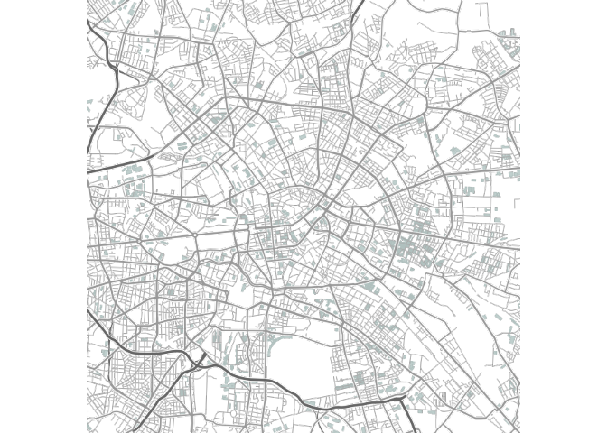
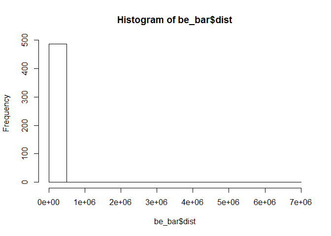
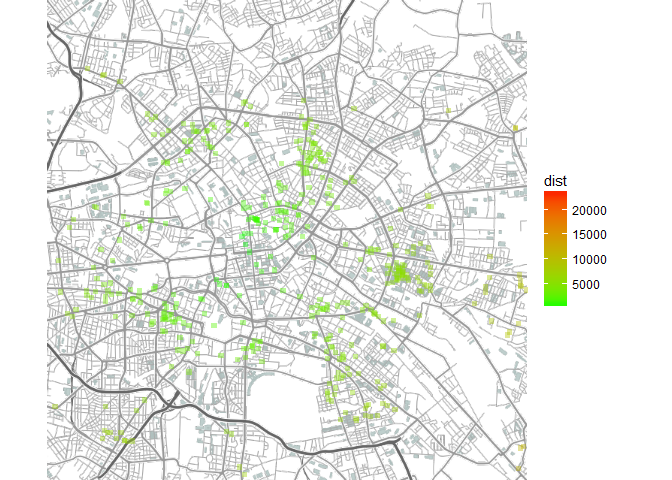

# Geographische Berechnungen
Jan-Philipp Kolb  
08 April 2016  


## Beispieldaten importieren


```r
link <- "https://raw.githubusercontent.com/Japhilko/GeoData/master/data/Deutschland_bar.csv"
bars <- read.csv(link)
```

## Erste Distanz berechnen mit dem Paket `SoDa`


```r
library(SoDA)
geoDist(lat1 = bars$lat[1],
        lon1 = bars$lon[1],
        lat2 = bars$lat[2],
        lon2 = bars$lon[2])
```

```
## [1] 38232.07
```

## Mehr Distanzen berechnen


```r
Dist <- vector()
for(i in 1:100){
  Dist[i] <- geoDist(lat1 = bars$lat[i],
        lon1 = bars$lon[i],
        lat2 = bars$lat[i+1],
        lon2 = bars$lon[i+1])
}
Dist
```

```
##   [1] 3.823207e+04 1.015315e+05 9.334179e+02 3.427596e+04 8.595952e+04
##   [6] 8.940222e+04 4.872595e+04 5.222502e+04 1.802615e+03 2.879160e+04
##  [11] 6.209852e+04 7.906148e+04 9.344139e+04 4.120987e+04 7.142291e+04
##  [16] 4.128370e+02 7.225028e+04 3.721553e+02 6.003687e+04 7.707340e+04
##  [21] 3.032062e+04 7.607193e+04 6.818329e+04 7.203179e+01 6.135879e+04
##  [26] 6.147756e+04 3.642841e+03 3.264600e+04 3.763451e+04 1.323154e+05
##  [31] 9.372909e+04 6.306435e+04 9.293827e+04 1.933719e+05 6.070501e+04
##  [36] 1.797790e+01 6.164575e+04 1.497216e+05 4.568855e+04 1.943216e+02
##  [41] 1.704310e+04 1.961695e+04 3.855207e+04 1.271432e+05 1.951097e+05
##  [46] 1.889180e+05 5.495999e+04 8.133018e+04 7.164943e+02 6.891519e+00
##  [51] 5.289525e+04 3.855971e+04 2.684826e+04 2.976360e+01 8.771942e+02
##  [56] 1.124214e+04 1.283904e+04 1.202756e+03 6.980687e+04 7.086897e+04
##  [61] 1.433094e+03 6.045992e+04 7.105843e+04 6.843855e+04 2.775210e+03
##  [66] 5.790742e+02 5.651299e+02 3.355595e+04 3.329784e+04 6.247448e+04
##  [71] 6.086916e+04 4.527346e+02 5.357397e+04 5.936207e+04 8.672381e+04
##  [76] 1.306815e+05 1.346139e+05 5.085136e+04 3.860461e+04 3.996503e+04
##  [81] 4.555102e+03 5.011942e+03 5.765979e+04 1.522674e+04 6.215123e+04
##  [86] 7.393343e+04 8.272253e+04 1.196932e+04 8.799558e+04 8.882663e+04
##  [91] 4.824144e+04 1.096207e+05 6.999689e+04 2.097777e+03 6.266448e+04
##  [96] 1.854132e+04 6.704101e+02 6.240843e+04 9.894397e+02 8.087980e+04
```


## Beispiel für Berlin

Den Datensatz auf Berlin einschränken:


```r
be_bar <- bars[bars$place=="Berlin",]
```

Eine Karte für Berlin


```r
library(ggmap)
be_map12 <- qmap("Berlin",zoom=12,
 maptype="terrain-lines",source="stamen")
```

## Karte für Berlin


```r
be_map12
```



## Distanzen zu einem Punkt


```r
geo_be <- geocode("Berlin Brandenburger Tor")
geo_be
```

```
##       lon      lat
## 1 13.3777 52.51627
```

Die Distanzen der Bars zu diesem Punkt:


```r
Dist_bars <- vector()
for(i in 1:nrow(be_bar)){
  Dist_bars[i] <- geoDist(lat1 = geo_be$lat,
        lon1 = geo_be$lon,
        lat2 = be_bar$lat[i],
        lon2 = be_bar$lon[i])
}

be_bar$dist <- Dist_bars
```

## Die Distanzen 


```r
hist(be_bar$dist)
```



```r
be_bar$dist[which.max(be_bar$dist)] <- NA
```


## Distanzen visualisieren


```r
be_map12  + 
  geom_point(data = be_bar, 
             mapping = aes(lon, lat, colour=dist), 
             size=1.5, alpha=0.4, shape=15) + 
  scale_colour_gradient(low = 'green', high = 'red')
```



## Links und Resourcen

- R-bloggers - [Kontouren zeichnen](http://stackoverflow.com/questions/27594257/plotting-contours-on-map-using-ggmap)
