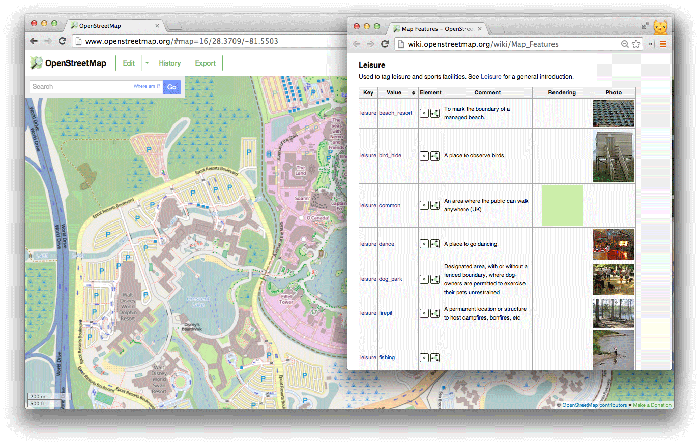
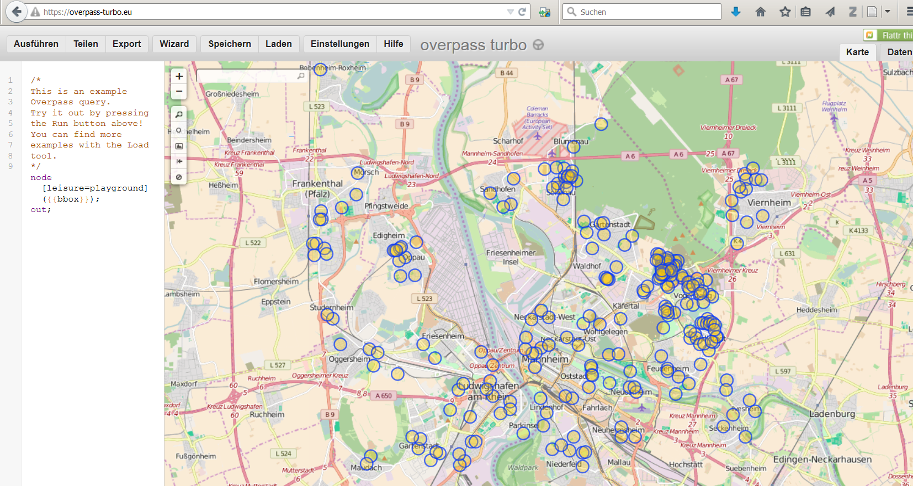

```{r,echo=F}
Ex=F
```


## The Overpass API


>The Overpass API is a read-only API that serves up custom selected parts of the OSM map data.

(<http://wiki.openstreetmap.org/wiki/Overpass_API>)

## Wichtige Information 

<http://wiki.openstreetmap.org/wiki/Map_Features>




## Beispiel: Nutzung der Overpass API



## Export der Rohdaten


## Import von der Overpass API zu R

```{r,echo=F}
Link1 <- "http://www.overpass-api.de/api/interpreter?data=[maxsize:1073741824][timeout:900];area[name=\""
```

```{r,eval=F}
Link1 <- "http://www.overpass-api.de/api/interpreter?
data=[maxsize:1073741824][timeout:900];area[name=\""
```

```{r,eval=Ex}
place <- "Mannheim"
type_obj <- "node"
object <- "leisure=playground"

InfoList <- xmlParse(paste(Link1,place,"\"];",
type_obj,"(area)[",object,
"];out;",sep=""))
```


## Das Arbeiten mit XML Daten (xpath)

Die Liste der ID's mit dem Wert *playground*:

```{r,eval=Ex}
node_id<- xpathApply(InfoList,
"//tag[@v= 'playground']/parent::node/@ id")
```

## latitude und longitude bekommen

```{r,eval=Ex}
lat_x <- xpathApply(InfoList,
"//tag[@v= 'playground']/parent::node/@ lat")
```

```{r,eval=Ex}
lat_x <- xpathApply(InfoList,
"//tag[@v= 'playground']/parent::node/@ lon")
```

## Paket auf Github

```{r,eval=F}
library(devtools)
install_github("Japhilko/GeoData/geosmdata")
```

```{r,eval=F}
library(geosmdata)
pg_MA <- get_osm_nodes(object="leisure=playground",
                       "Mannheim")
info <- extract_osm_nodes(OSM.Data=pg_MA,
                          value="playground")
```

## Link

- [Tutorial zur Nutzung der Overpass API](http://osmlab.github.io/learnoverpass/en/exercises/intro/1/)

<http://osmlab.github.io/learnoverpass/en/exercises/intro/1/>
