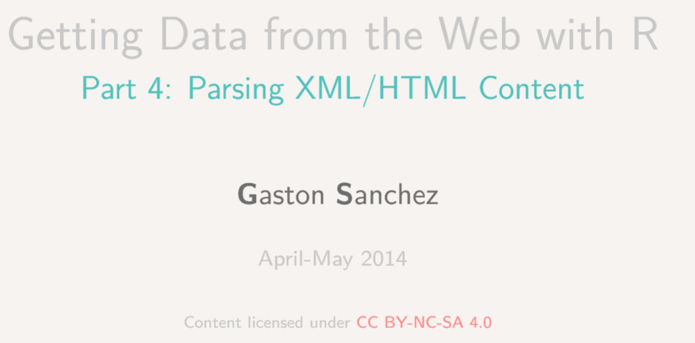

```{r,echo=F}
library(knitr)
```


## Ziel: Eine Karte mit Pflegeheimen in Deutschland

 

## The XML library

 

```{r}
# install.packages("XML")
library(XML)
```


## Import the data to R

```{r,eval=F}
l<-"https://www.pflegesuche.de/bundesland_pflegeheime_RP.html"
mps <- "https://de.wikipedia.org/wiki/Land_%28Deutschland%29" 

ab <- readLines(mps)
```

The result is quite unstructured:

 

## Structuring data

```{r,eval=F}
tab <- ab[[6]]
tab1 <- gsub("\t","",tab)
tab2 <- strsplit(tab1,"\n")
dat <- unlist(lapply(tab2,function(x)x[1]))
bla <- unlist(lapply(tab2,function(x)x[2]))
df_pflege <- data.frame(bla,
          Anz=as.numeric(as.character(dat)))
```


## Overview of data

```{r,echo=F}
kable(head(df_pflege))
```

## Get a map

```{r,warning=F,message=F,cache=T}
library(raster)
DEU1 <- getData('GADM', country='DEU', level=1)
plot(DEU1)
```

## Combine map and data

```{r}
ind <- match(DEU1@data$NAME_1,df_pflege$bla)
ind
```

## Match the missing entries

```{r}
DEU1@data$NAME_1[is.na(ind)]
which(is.na(ind))
```

```{r}
ind[1] <- agrep("rttemberg",df_pflege$bla)
ind[8] <- agrep("pommern",df_pflege$bla)
ind[13] <- agrep("Anhalt",df_pflege$bla)
ind[15] <- agrep("Holstein",df_pflege$bla)
ind[16] <- agrep("ringen",df_pflege$bla)
```

## Combine data and map

```{r}
DEU1@data$nursingHomes <- df_pflege$Anz[ind]
library(sp)
spplot(DEU1,"nursingHomes")
```


## Das Paket `rvest`

```{r,eval=F}
install.packages("rvest")
```

```{r,eval=F}
library("rvest")
land_DE <- "https://de.wikipedia.org/w/index.php?title=Land_%28Deutschland%29&action=edit"

 # URL of interest:
mps <- "https://de.wikipedia.org/wiki/Land_%28Deutschland%29" 

# parse the document for R representation:
mps.doc <- htmlParse(mps)

# get all the tables in mps.doc as data frames
mps.tabs <- readHTMLTable(mps.doc) 
```


```{r,eval=F}
ab <- html(land_DE)

lego_movie %>% 
  html_node("strong span") %>%
  html_text() %>%
  as.numeric()
```


## Links

Beispiel: [GiventheData](http://giventhedata.blogspot.de/2012/08/r-and-web-for-beginners-part-iii.html)
