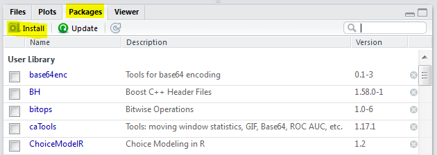
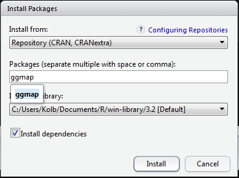
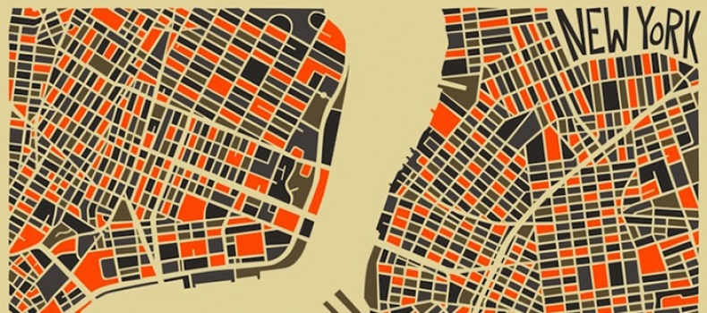
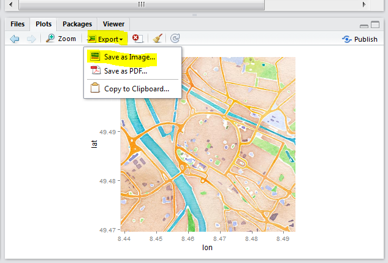
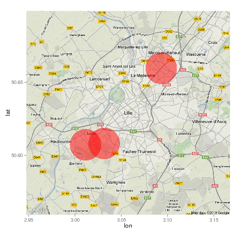

## Gliederung

Arten von räumlichen Daten: 

- [Straßenkarten](https://www.nceas.ucsb.edu/~frazier/RSpatialGuides/ggmap/ggmapCheatsheet.pdf) 
- Satelliten Bilder
- Physische Daten und Karten
- [Abstrakte Karten](http://www.designfaves.com/2014/03/abstracted-maps-reveal-cities-personalities)
- ...

Das R-paket [ggmap](http://journal.r-project.org/archive/2013-1/kahle-wickham.pdf) wird im folgenden genutzt um verschiedene Kartentypen darzustellen.

Mit [qmap](http://www.inside-r.org/packages/cran/ggmap/docs/qmap) kann man eine schnelle Karte erzeugen.


```{r,echo=F,warning=F}
internet=F
Ex <- T
Ca <- T
library(knitr)

graph.path <- "../data/figure/"
```


## Straßenkarten

- Straßenkarte werden sehr häufig verwendet. 
- Diese Karten zeigen Haupt- und Nebenstraßen (abhängig vom Detail) 
- oft sind auch weitere Informationen enthalten. Wie beispielsweise Flughäfen, Städte, Campingplätze oder andere Orte von Interesse 
- Beispiel einer Straßenkarte für [Mannheim](http://rpubs.com/Japhilko82/OpenStreetMap_Mannheim). 

## Installieren des Paketes

- Zur Erstellung der Karten brauchen wir das Paket `ggmap`:

1. Möglichkeit:

```{r,eval=F}
install.packages("ggmap")
```


2. Möglichkeit:



## Pakete installieren




## Paket ggmap - Hallo Welt

- Um das Paket zu laden verwenden wir den Befehl `library`

```{r,message=F,warning=F}
library(ggmap)
```

Und schon kann die erste Karte erstellt werden:

```{r,message=F,eval=Ex,cache=Ca}
qmap("Mannheim")
```

```{r,echo=F,message=F,warning=F,cache=T}
MA_map <- qmap("Mannheim")
```

## Karte für eine Sehenswürdigkeit

```{r,message=F}
BBT <- qmap("Berlin Brandenburger Tor")
BBT
```


## Karte für einen ganzen Staat

```{r,message=F}
qmap("Germany")
```

- Wir brauchen ein anderes *zoom level*

## Ein anderes *zoom level*

- level 3 - Kontinent
- level 10 - Stadt
- level 21 - Gebäude

```{r,message=F}
qmap("Germany", zoom = 6)
```

```{r,echo=F}
# https://www.nceas.ucsb.edu/~frazier/RSpatialGuides/ggmap/ggmapCheatsheet.pdf
```


## Hilfe bekommen wir mit dem Fragezeichen

```{r,eval=F}
?qmap
```

Verschiedene Abschnitte in der Hilfe:

- Description
- Usage
- Arguments
- Value
- Author(s)
- See Also
- Examples


## Die Beispiele in der Hilfe

Ausschnitt aus der Hilfe Seite zum Befehl `qmap`:


Das Beispiel kann man direkt in die Konsole kopieren:

```{r,eval=F}
# qmap("baylor university")
qmap("baylor university", zoom = 14)
# und so weiter
```

## Ein anderes *zoom level*

```{r,message=F,eval=Ex,cache=Ca}
qmap("Mannheim", zoom = 12)
```

## Näher rankommen

```{r,message=F,eval=Ex,cache=Ca}
qmap('Mannheim', zoom = 13)
```


## Ganz nah dran

```{r,message=F,eval=Ex,cache=Ca}
qmap('Mannheim', zoom = 20)
```

## ggmap - Quelle OpenStreetMap

```{r,message=F,eval=Ex,cache=Ca}
qmap('Mannheim', zoom = 14, source="osm")
```

## ggmap - OpenStreetMap - schwarz/weiß

```{r,message=F,eval=Ex,cache=Ca}
qmap('Mannheim', zoom = 14, source="osm",color="bw")
```


## ggmap - maptype satellite

```{r,message=F,eval=Ex,cache=Ca}
qmap('Mannheim', zoom = 14, maptype="satellite")
```

## ggmap - maptype satellite zoom 20

```{r,message=F,eval=Ex,cache=Ca}
qmap('Mannheim', zoom = 20, maptype="hybrid")
```


## ggmap - maptype hybrid

```{r,message=F,eval=Ex,cache=Ca}
qmap("Mannheim", zoom = 14, maptype="hybrid")
```


## Terrain/physical maps

- Aus Physischen Karten kann man Informationen über Berge, Flüsse und Seen ablesen. 

- Farben werden oft genutzt um Höhenunterschiede zu visualisieren

## ggmap - terrain map

```{r,message=F,cache=T}
qmap('Schriesheim', zoom = 14,
 maptype="terrain")
```

## Abstrahierte Karten ([http://www.designfaves.com](http://www.designfaves.com/2014/03/abstracted-maps-reveal-cities-personalities))





- Abstraktion wird genutzt um nur die essentiellen Informationen einer Karte zu zeigen. 

- Bsp. U-Bahn Karten - wichtig sind Richtungen und wenig Infos zur Orientierung

- Im folgenden werden Karten vorgestellt, die sich gut als Hintergrundkarten eignen.

## ggmap - maptype watercolor

```{r,message=F,eval=Ex,cache=Ca}
qmap('Mannheim', zoom = 14,
 maptype="watercolor",source="stamen")
```


## ggmap - source stamen

```{r,message=F,eval=Ex,cache=Ca}
qmap('Mannheim', zoom = 14,
 maptype="toner",source="stamen")
```


## ggmap - maptype toner-lite

```{r,message=F,eval=Ex,cache=Ca}
qmap('Mannheim', zoom = 14,
 maptype="toner-lite",source="stamen")
```

## ggmap - maptype toner-hybrid

```{r,message=F,eval=Ex,cache=Ca}
qmap('Mannheim', zoom = 14,
 maptype="toner-hybrid",source="stamen")
```


## ggmap - maptype terrain-lines

```{r,message=F,eval=Ex,cache=Ca}
qmap('Mannheim', zoom = 14,
 maptype="terrain-lines",source="stamen")
```


## Graphiken speichern




## ggmap - ein Objekt erzeugen

- `<-` ist der Zuweisungspfeil um ein Objekt zu erzeugen
- Dieses Vorgehen macht bspw. Sinn, wenn mehrere Karten nebeneinander gebraucht werden.

```{r,warning=F,message=F,cache=T}
MA_map <- qmap('Mannheim', 
               zoom = 14,
               maptype="toner",
               source="stamen")
```


## Geokodierung

> Geocoding (...) uses a description of a location, most typically a postal address or place name, to find geographic coordinates from spatial reference data ... 

[Wikipedia - Geocoding](https://github.com/adam-p/markdown-here/wiki/Markdown-Cheatsheet#blockquotes)

```{r,message=F,eval=F,warning=F}
library(ggmap)
geocode("Mannheim Wasserturm",source="google")
```

```{r,echo=F,message=F,warning=F,cache=Ca}
MAgc <- geocode("Mannheim University",source="google")
kable(MAgc)
```


## Latitude und Longitude


[http://modernsurvivalblog.com](http://modernsurvivalblog.com/survival-skills/basic-map-reading-latitude-longitude/)

## Koordinaten verschiedener Orte in Deutschland

```{r,echo=F,message=F}
cities <- c("Hamburg","Koeln","Dresden","Muenchen")
lon <- vector()
lat <- vector()
for (i in 1:length(cities)){
  gc <- geocode(cities[i],source="google")
  lon[i] <- gc$lon
  lat[i] <- gc$lat
}

Dat <- data.frame(cities,lon,lat)
kable(Dat)
```


## Reverse Geokodierung

> Reverse geocoding is the process of back (reverse) coding of a point location (latitude, longitude) to a readable address or place name. This permits the identification of nearby street addresses, places, and/or areal subdivisions such as neighbourhoods, county, state, or country.

Quelle: [Wikipedia](https://en.wikipedia.org/wiki/Reverse_geocoding)

```{r,cache=T,message=F}
revgeocode(c(48,8))
```


## Die Distanz zwischen zwei Punkten

```{r,message=F,eval=Ex,cache=Ca}
mapdist("Q1, 4 Mannheim","B2, 1 Mannheim")
```

```{r,message=F,eval=Ex,cache=Ca}
mapdist("Q1, 4 Mannheim","B2, 1 Mannheim",mode="walking")
```


## Eine andere Distanz bekommen

```{r,message=F,eval=Ex,cache=Ca}
mapdist("Q1, 4 Mannheim","B2, 1 Mannheim",mode="bicycling")
```


## Geokodierung - verschiedene Punkte von Interesse

```{r,cache=Ca,message=F,warning=F}
POI1 <- geocode("B2, 1 Mannheim",source="google")
POI2 <- geocode("Hbf Mannheim",source="google")
POI3 <- geocode("Wasserturm Mannheim",source="google")
ListPOI <-rbind(POI1,POI2,POI3)
POI1;POI2;POI3
```


## Punkte in der Karte

```{r,message=F,warning=F,eval=Ex,cache=Ca}
MA_map +
geom_point(aes(x = lon, y = lat),
data = ListPOI)
```

## Punkte in der Karte

```{r,message=F,warning=F,eval=Ex,cache=Ca}
MA_map +
geom_point(aes(x = lon, y = lat),col="red",
data = ListPOI)
```


## ggmap - verschiedene Farben

```{r,eval=Ex,cache=Ca}
ListPOI$color <- c("A","B","C")
MA_map +
geom_point(aes(x = lon, y = lat,col=color),
data = ListPOI)
```

## ggmap - größere Punkte

```{r,eval=Ex,cache=Ca}
ListPOI$size <- c(10,20,30)
MA_map +
geom_point(aes(x = lon, y = lat,col=color,size=size),
data = ListPOI)
```


## Eine Route von Google maps bekommen

```{r,message=F,warning=F,cache=T}
from <- "Mannheim Hbf"
to <- "Mannheim B2 , 1"
route_df <- route(from, to, structure = "route")
```

[Mehr Information](http://rpackages.ianhowson.com/cran/ggmap/man/route.html)

<http://rpackages.ianhowson.com/cran/ggmap/man/route.html>

## Eine Karte mit dieser Information zeichnen

```{r,message=F,warning=F,cache=T}
qmap("Mannheim Hbf", zoom = 14) +
  geom_path(
    aes(x = lon, y = lat),  colour = "red", size = 1.5,
    data = route_df, lineend = "round"
  )
```

Wie fügt man Punkte hinzu

- Nutzung von [geom_point](http://zevross.com/blog/2014/07/16/mapping-in-r-using-the-ggplot2-package/)


- Question on [stackoverflow](http://stackoverflow.com/questions/15069963/getting-a-map-with-points-using-ggmap-and-ggplot2)

<http://i.stack.imgur.com>


 
## Cheatsheet

- Cheatsheet zu [data visualisation](https://www.rstudio.com/wp-content/uploads/2015/04/ggplot2-cheatsheet.pdf)

<https://www.rstudio.com/>


## Resourcen und Literatur


- [Artikel von David Kahle und Hadley Wickham](http://journal.r-project.org/archive/2013-1/kahle-wickham.pdf) zur Nutzung von `ggmap`.

<http://journal.r-project.org/archive/2013-1/kahle-wickham.pdf>

- [Schnell eine Karte bekommen ](http://rpackages.ianhowson.com/cran/ggmap/man/get_map.html)

<http://rpackages.ianhowson.com/cran/ggmap/man/get_map.html>

- [Karten machen mit R](http://www.kevjohnson.org/making-maps-in-r-part-2/)

<http://www.kevjohnson.org/making-maps-in-r-part-2/>

## Take Home Message

Was klar sein sollte:

- Wie man eine schnelle Karte erzeugt
- wie man geokodiert
- Wie man eine Distanz berechnet

 