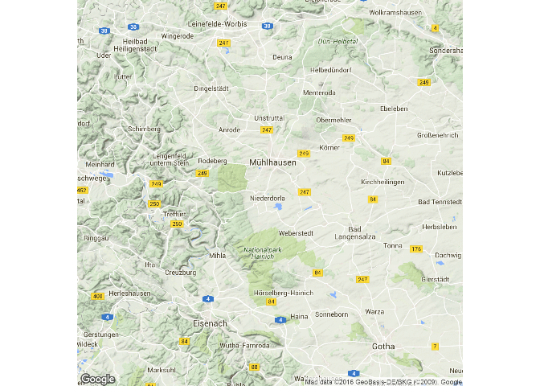
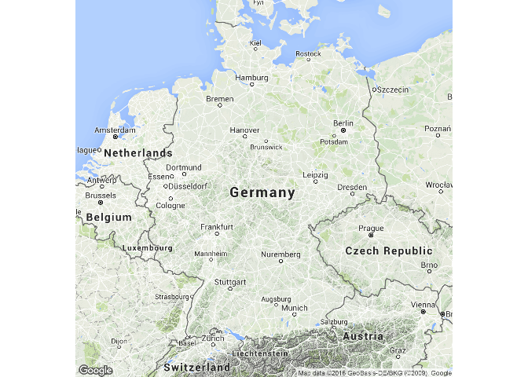
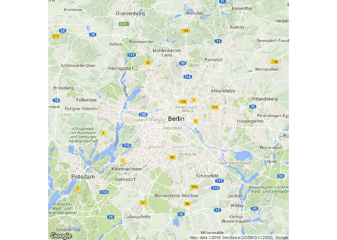
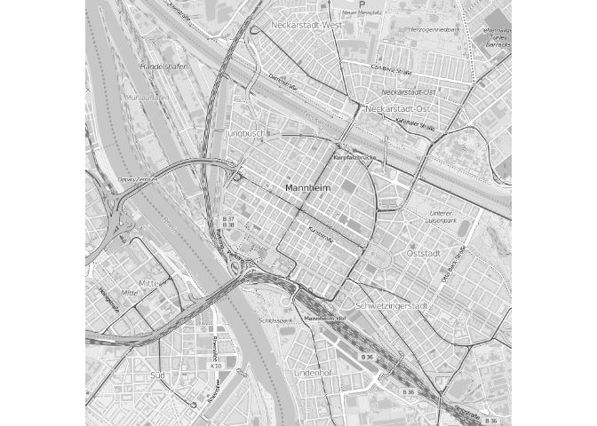
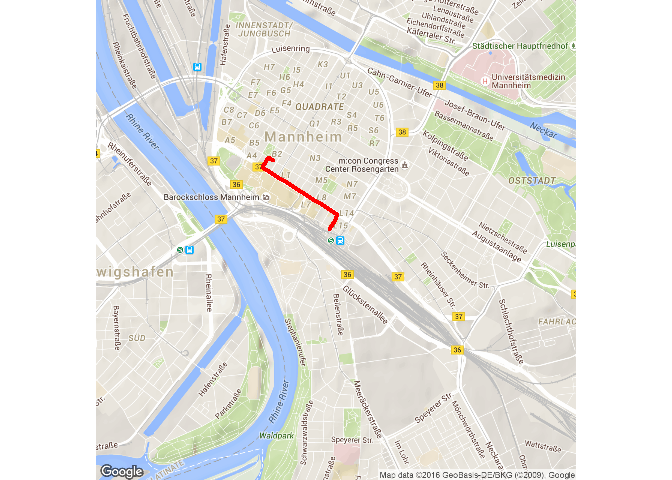

Gliederung
----------

Arten von räumlichen Daten:

-   [Straßenkarten](https://www.nceas.ucsb.edu/~frazier/RSpatialGuides/ggmap/ggmapCheatsheet.pdf)
-   Satelliten Bilder
-   Physische Daten und Karten
-   [Abstrakte
    Karten](http://www.designfaves.com/2014/03/abstracted-maps-reveal-cities-personalities)
-   ...

Das R-paket
[ggmap](http://journal.r-project.org/archive/2013-1/kahle-wickham.pdf)
wird im folgenden genutzt um verschiedene Kartentypen darzustellen.

Mit [qmap](http://www.inside-r.org/packages/cran/ggmap/docs/qmap) kann
man eine schnelle Karte erzeugen.

Straßenkarten
-------------

[Mannheim](http://rpubs.com/Japhilko82/OpenStreetMap_Mannheim)

A road map is one of the most widely used map types.

-   These maps show major and minor highways and roads (depending on
    detail)
-   as well as things like airports, city locations and points of
    interest like parks, campgrounds and monuments.
-   Major highways on a road map are generally red and larger than other
    roads,
-   while minor roads are a lighter color and a narrower line.

Road maps
---------

Install the library
-------------------

-   We'll need package ggmap - so we have to install it:

1.  possibility

<!-- -->

    install.packages("ggmap")

1.  possibility:

Library ggmap - Hallo Welt
--------------------------

-   To load the library we use the command `library`

<!-- -->

    library(ggmap)

    qmap("Mannheim")

Karte für eine Sehenswürdigkeit
-------------------------------

    BBT <- qmap("Berlin Brandenburger Tor")
    BBT

<!-- -->

Karte für einen ganzen Staat
----------------------------

    qmap("Germany")

<!-- -->

-   We need another zoom level

Use another zoom level
----------------------

-   level 3 - continent
-   level 10 - city
-   level 21 - building

<!-- -->

    qmap("Germany", zoom = 6)

<!-- -->

Get help with the questionmark
------------------------------

    ?qmap

Different components in the help

-   Description
-   Usage
-   Arguments
-   Value
-   Author(s)
-   See Also
-   Examples

The examples section of help
----------------------------

Extract from the help file on qmap:

This examples can be directly copy-pasted to the console

    qmap("baylor university")
    qmap("baylor university", zoom = 14)
    # and so on

Other zoom level
----------------

    qmap("Mannheim", zoom = 12)

Get closer
----------

    qmap('Mannheim', zoom = 13)

Get very close
--------------

    qmap('Mannheim', zoom = 20)

ggmap - source OpenStreetMap
----------------------------

    qmap('Mannheim', zoom = 14, source="osm")

ggmap - OpenStreetMap - black/white
-----------------------------------

    qmap('Mannheim', zoom = 14, source="osm",color="bw")

ggmap - maptype satellite
-------------------------

    qmap('Mannheim', zoom = 14, maptype="satellite")

ggmap - maptype satellite zoom 21
---------------------------------

    qmap('Mannheim', zoom = 21, maptype="hybrid")

ggmap - maptype hybrid
----------------------

    qmap("Mannheim", zoom = 14, maptype="hybrid")

Terrain/physical maps
---------------------

Physical maps illustrate the physical features of an area, such as the
mountains, rivers and lakes. Colors are used to show relief differences
in land elevations.

-   The water is usually shown in blue.
-   a lighter color is typically used at lower elevation and
-   darker color indicate higher elevations.
-   Contour lines can also be used to show elevation changes (they are
    normally spaced at regular intervals)

ggmap - terrain map
-------------------

    qmap('Schriesheim', zoom = 14,
     maptype="terrain")

<!-- -->

Abstracted maps
---------------

Source: [Design
faves](http://www.designfaves.com/2014/03/abstracted-maps-reveal-cities-personalities)

-   Abstraction is used to create a map with only essential information
-   Example metro maps - directions and little information for
    orientation is included
-   In the following especially background maps

ggmap - maptype watercolor
--------------------------

    qmap('Mannheim', zoom = 14,
     maptype="watercolor",source="stamen")

ggmap - source stamen
---------------------

    qmap('Mannheim', zoom = 14,
     maptype="toner",source="stamen")

ggmap - maptype toner-lite
--------------------------

    qmap('Mannheim', zoom = 14,
     maptype="toner-lite",source="stamen")

ggmap - maptype toner-hybrid
----------------------------

    qmap('Mannheim', zoom = 14,
     maptype="toner-hybrid",source="stamen")

ggmap - maptype terrain-lines
-----------------------------

    qmap('Mannheim', zoom = 14,
     maptype="terrain-lines",source="stamen")

Stamen maps
-----------

These high-contrast B+W (black and white) maps are featured in our
Dotspotting project. They are perfect for data mashups and exploring
river meanders and coastal zones.

Source: <http://maps.stamen.com/>

Save graphics
-------------

ggmap - create an object
------------------------

-   `<-` is an assignment operator which can be used to create an object
-   This is useful if you work with several maps at the same time

<!-- -->

    MA_map <- qmap('Mannheim', 
                   zoom = 14,
                   maptype="toner",
                   source="stamen")

Geocoding
---------

> Geocoding (...) uses a description of a location, most typically a
> postal address or place name, to find geographic coordinates from
> spatial reference data ...

[Wikipedia -
Geocoding](https://github.com/adam-p/markdown-here/wiki/Markdown-Cheatsheet#blockquotes)

    library(ggmap)
    geocode("Mannheim Wasserturm",source="google")

<table>
<thead>
<tr class="header">
<th align="right">lon</th>
<th align="right">lat</th>
</tr>
</thead>
<tbody>
<tr class="odd">
<td align="right">34.79565</td>
<td align="right">32.1221</td>
</tr>
</tbody>
</table>

Latitude and Longitude
----------------------

[Source](http://modernsurvivalblog.com/survival-skills/basic-map-reading-latitude-longitude/)

Coords of different places in Germany
-------------------------------------

<table>
<thead>
<tr class="header">
<th align="left">cities</th>
<th align="right">lon</th>
<th align="right">lat</th>
</tr>
</thead>
<tbody>
<tr class="odd">
<td align="left">Hamburg</td>
<td align="right">9.993682</td>
<td align="right">53.55108</td>
</tr>
<tr class="even">
<td align="left">Koeln</td>
<td align="right">6.960279</td>
<td align="right">50.93753</td>
</tr>
<tr class="odd">
<td align="left">Dresden</td>
<td align="right">13.737262</td>
<td align="right">51.05041</td>
</tr>
<tr class="even">
<td align="left">Muenchen</td>
<td align="right">11.581981</td>
<td align="right">48.13513</td>
</tr>
</tbody>
</table>

Reverse geocoding
-----------------

> Reverse geocoding is the process of back (reverse) coding of a point
> location (latitude, longitude) to a readable address or place name.
> This permits the identification of nearby street addresses, places,
> and/or areal subdivisions such as neighbourhoods, county, state, or
> country.

Source: [Wikipedia](https://en.wikipedia.org/wiki/Reverse_geocoding)

    revgeocode(c(48,8))

    ## [1] "Unnamed Road, Somalia"

Get the distance between 2 points
---------------------------------

    mapdist("Q1, 4 Mannheim","B2, 1 Mannheim")

    mapdist("Q1, 4 Mannheim","B2, 1 Mannheim",mode="walking")

Get another distance
--------------------

    mapdist("Q1, 4 Mannheim","B2, 1 Mannheim",mode="bicycling")

Take Home Messages/Homework
---------------------------

What you should know:

-   How to create a quick map
-   How to get a geocode
-   How to compute a distance

Homework:

-   Please send me a map of a place/city you like very much

And now some more advanced stuff....

Geocoding - various points of interest
--------------------------------------

    POI1 <- geocode("B2, 1 Mannheim",source="google")
    POI2 <- geocode("Hbf Mannheim",source="google")
    POI3 <- geocode("Wasserturm Mannheim",source="google")
    ListPOI <-rbind(POI1,POI2,POI3)
    POI1;POI2;POI3

    ##        lon      lat
    ## 1 8.462844 49.48569

    ##        lon      lat
    ## 1 8.469879 49.47972

    ##        lon      lat
    ## 1 8.466039 49.48746

Points in map
-------------

    MA_map +
    geom_point(aes(x = lon, y = lat),
    data = ListPOI)

Points in map
-------------

    MA_map +
    geom_point(aes(x = lon, y = lat),col="red",
    data = ListPOI)

ggmap - adding different colors
-------------------------------

    ListPOI$color <- c("A","B","C")
    MA_map +
    geom_point(aes(x = lon, y = lat,col=color),
    data = ListPOI)

ggmap - bigger dots
-------------------

    ListPOI$size <- c(10,20,30)
    MA_map +
    geom_point(aes(x = lon, y = lat,col=color,size=size),
    data = ListPOI)

Get a route from Google maps
----------------------------

    from <- "Mannheim Hbf"
    to <- "Mannheim B2 , 1"
    route_df <- route(from, to, structure = "route")

[More
information](http://rpackages.ianhowson.com/cran/ggmap/man/route.html)

Draw a map with this information
--------------------------------

    qmap("Mannheim Hbf", zoom = 14) +
      geom_path(
        aes(x = lon, y = lat),  colour = "red", size = 1.5,
        data = route_df, lineend = "round"
      )

<!-- -->

Resources
---------

-   [Article by David Kahle and Hadley
    Wickham](http://journal.r-project.org/archive/2013-1/kahle-wickham.pdf)
    on the usage of ggmap.
-   [Grab a
    map](http://rpackages.ianhowson.com/cran/ggmap/man/get_map.html)
-   [Making Maps in
    R](http://www.kevjohnson.org/making-maps-in-r-part-2/)

More about adding points

-   Usage of
    [geom\_point](http://zevross.com/blog/2014/07/16/mapping-in-r-using-the-ggplot2-package/)
-   Question on
    [stackoverflow](http://stackoverflow.com/questions/15069963/getting-a-map-with-points-using-ggmap-and-ggplot2)

Cheatsheet
----------

-   Cheatsheet on [data
    visualisation](https://www.rstudio.com/wp-content/uploads/2015/04/ggplot2-cheatsheet.pdf)

Resources and literature
------------------------

[ggmap: Spatial Visualization with
ggplot2](http://citeseerx.ist.psu.edu/viewdoc/download?doi=10.1.1.375.8693&rep=rep1&type=pdf)

by David Kahle and Hadley Wickham
