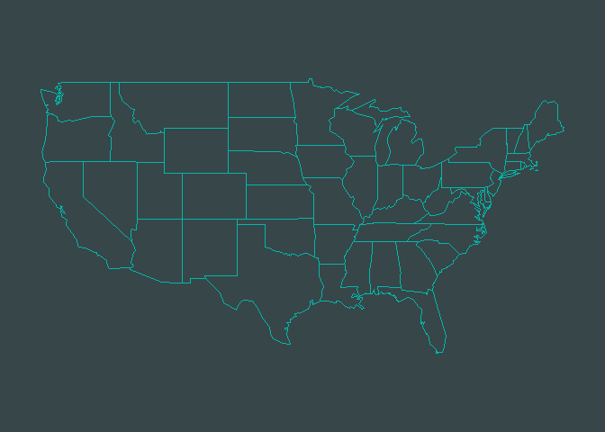
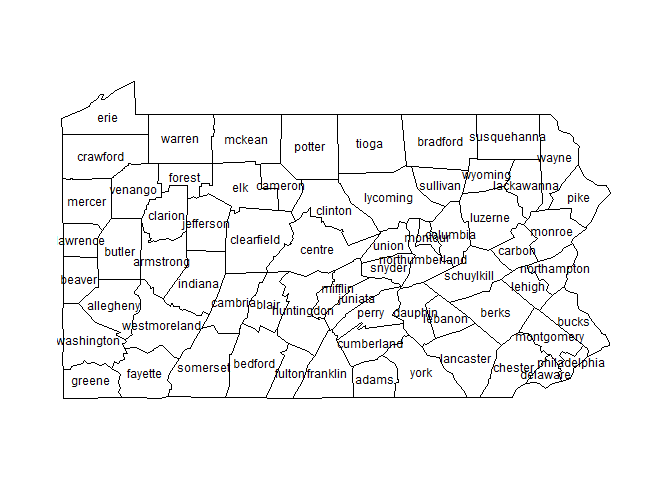
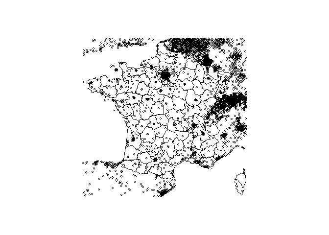
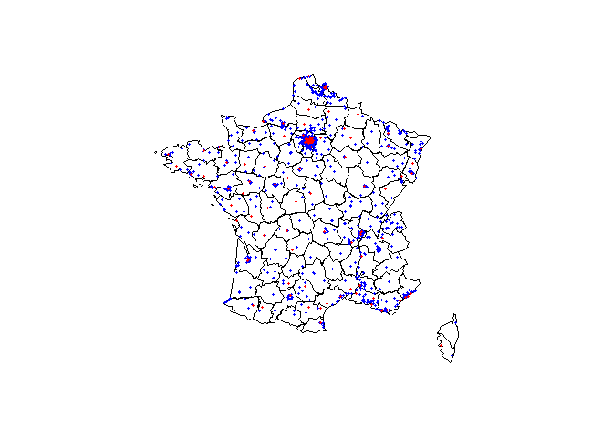
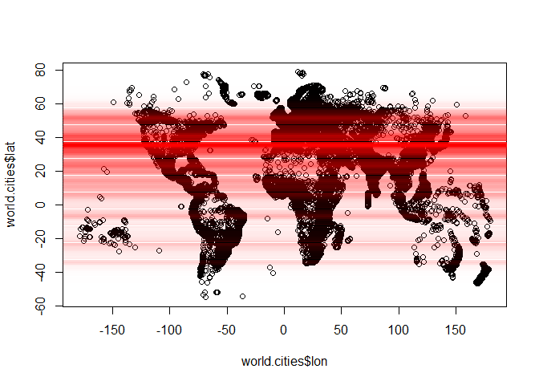
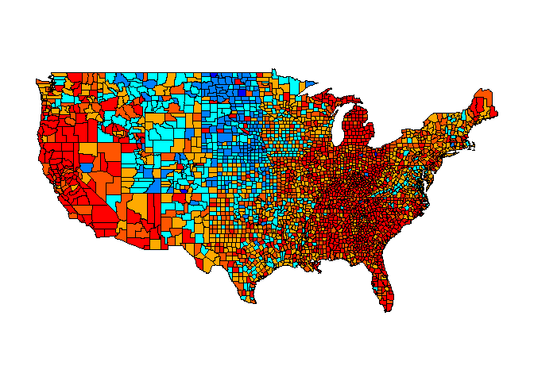
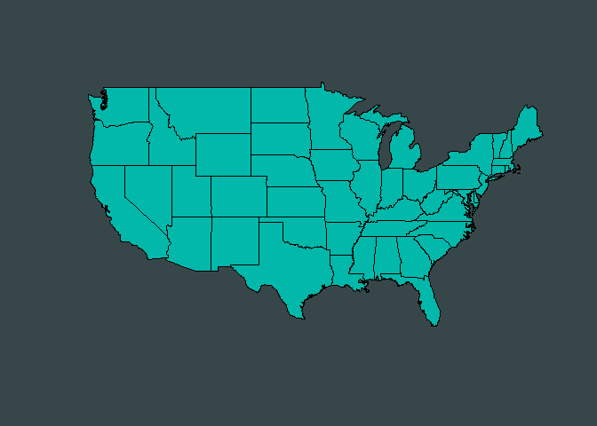
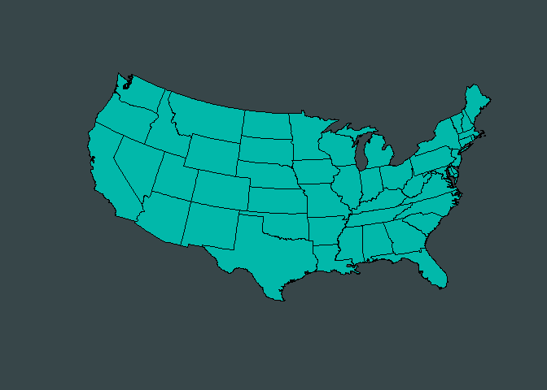
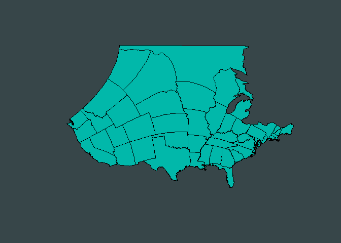

Politische Karte:
-----------------

-   Eine politische Karte zeigt keine topographischen Informationen.

-   Hauptsächlich sollen adminstrative Grenzen dargestellt werden.

-   Teilweise werden auch Städte mit eingezeichnet

-   Ein typisches Beispiel ist eine Karte der US-Staaten

Politische Karte
----------------

<!-- -->

Das R-Paket maps
----------------

    library(maps)

Wie man Hilfe bekommt:

    ?map

Hallo Welt
----------

    map()

<!-- -->

Ein erstes Argument
-------------------

Der gleiche Befehl mit einem Argument:

    map("usa")

<!-- -->

Eine Frankreichkarte
--------------------

    map("france")

<!-- -->

Politische Karte - Italien
--------------------------

Grenzen in blau:

    library ( maps )
    map ("italy", col = "blue")

<!-- -->

Add In: Colour Picker
---------------------

-   RStudio Version 0.99.893 oder höher ist notwendig
-   Das Paket `shinyjs` muss installiert sein.

Choroplethen - R-Paket maps
---------------------------

Wir wollen die Flächen blau einfärben:

    map ("italy",fill =T, col = "blue")

<!-- -->

Mehr Farben
-----------

Einen Vektor erzeugen:

    colors <- c("blue","red","yellow")

nun nutzrn wir den Vektor um die Farbe zu spezifizieren

    map ("italy",fill =T, col = colors)

<!-- -->

Excurs: mehr Farben!
--------------------

Wir können auch den
[rgb](https://stat.ethz.ch/R-manual/R-devel/library/grDevices/html/rgb.html)
Befehl nutzen um eigene Farben zu erzeugen:

    map("italy",fill=T, col = rgb(0,1,0))

<!-- -->

[Hintergrund](https://dataveld.wordpress.com/2016/02/15/getting-started-with-r-maps-in-microsoft-power-bi/)
-----------------------------------------------------------------------------------------------------------

    map("state", col="#01B8AA", bg="#374649")

<!-- -->

Auch ausprobieren:
------------------

    map("italy",fill=T, col = rgb(1,0,0))
    map("italy",fill=T, col = rgb(1,1,1))
    map("italy",fill=T, col = rgb(1,0.5,0.4))

Choroplethen - R-Paket maps
---------------------------

Wenn man wissen will, welche Region sich wohinter verbirgt:

    italy <- map("italy", plot = F)
    head(italy$names)

    ## [1] "Bolzano-Bozen" "Belluno"       "Udine"         "Sondrio"      
    ## [5] "Trento"        "Novara"

Karten mit nur einem Argument
-----------------------------

    map("county")

<table>
<thead>
<tr class="header">
<th align="left">Argument</th>
<th align="left">What</th>
</tr>
</thead>
<tbody>
<tr class="odd">
<td align="left">county</td>
<td align="left">US Counties</td>
</tr>
<tr class="even">
<td align="left">france</td>
<td align="left">France</td>
</tr>
<tr class="odd">
<td align="left">italy</td>
<td align="left">Italy</td>
</tr>
<tr class="even">
<td align="left">nz</td>
<td align="left">New Zealand</td>
</tr>
<tr class="odd">
<td align="left">state</td>
<td align="left">US States</td>
</tr>
<tr class="even">
<td align="left">usa</td>
<td align="left">USA</td>
</tr>
<tr class="odd">
<td align="left">world</td>
<td align="left">Countries of the world</td>
</tr>
</tbody>
</table>

Eine Karte für Deutschland
--------------------------

    library(maps)
    map("world", "Germany")

<!-- -->

R-Paket maps - zwei Länder
--------------------------

    map("world", c("Germany","Poland"))

<!-- -->

Zwei Länder mit mehr Farbe
--------------------------

    map("world", c("Germany","Austria"),fill=T,
    col=c("red","green"))

<!-- -->

R-Paket maps - mehr Feature
---------------------------

    map("world", "China")
    map.scale()

<!-- -->

R-Paket maps - mehr Feature
---------------------------

Wie `map`, aber mit Bezeichnungen für die Regionen:

    map.text("county", "penn")

<!-- -->

Counties in Pennsylvania

R-Paket maps - Städte der Welt
------------------------------

mit dem Befehl `data` kann man spezifische Datensätze einlesen.

    data(world.cities)

`head` - den ersten Teil eines Objekts zurück geben

    head(world.cities)

Übebrlick über Datensatz Städte der Welt
----------------------------------------

<table>
<thead>
<tr class="header">
<th align="left">name</th>
<th align="left">country.etc</th>
<th align="right">pop</th>
<th align="right">lat</th>
<th align="right">long</th>
<th align="right">capital</th>
</tr>
</thead>
<tbody>
<tr class="odd">
<td align="left">'Abasan al-Jadidah</td>
<td align="left">Palestine</td>
<td align="right">5629</td>
<td align="right">31.31</td>
<td align="right">34.34</td>
<td align="right">0</td>
</tr>
<tr class="even">
<td align="left">'Abasan al-Kabirah</td>
<td align="left">Palestine</td>
<td align="right">18999</td>
<td align="right">31.32</td>
<td align="right">34.35</td>
<td align="right">0</td>
</tr>
<tr class="odd">
<td align="left">'Abdul Hakim</td>
<td align="left">Pakistan</td>
<td align="right">47788</td>
<td align="right">30.55</td>
<td align="right">72.11</td>
<td align="right">0</td>
</tr>
<tr class="even">
<td align="left">'Abdullah-as-Salam</td>
<td align="left">Kuwait</td>
<td align="right">21817</td>
<td align="right">29.36</td>
<td align="right">47.98</td>
<td align="right">0</td>
</tr>
<tr class="odd">
<td align="left">'Abud</td>
<td align="left">Palestine</td>
<td align="right">2456</td>
<td align="right">32.03</td>
<td align="right">35.07</td>
<td align="right">0</td>
</tr>
<tr class="even">
<td align="left">'Abwein</td>
<td align="left">Palestine</td>
<td align="right">3434</td>
<td align="right">32.03</td>
<td align="right">35.20</td>
<td align="right">0</td>
</tr>
</tbody>
</table>

Die Städte der Welt kartieren
-----------------------------

    map()
    map.cities(world.cities)

<!-- -->

Frankreichs Städte
------------------

    data(world.cities)
    map("france")
    map.cities(world.cities)

<!-- -->

Nur französische Städte
-----------------------

    FrenchCity <- world.cities$country.etc=="France"
    FCit <- world.cities[FrenchCity,]

<table>
<thead>
<tr class="header">
<th></th>
<th align="left">name</th>
<th align="left">country.etc</th>
<th align="right">pop</th>
<th align="right">lat</th>
<th align="right">long</th>
<th align="right">capital</th>
</tr>
</thead>
<tbody>
<tr class="odd">
<td>195</td>
<td align="left">Abbeville</td>
<td align="left">France</td>
<td align="right">26656</td>
<td align="right">50.12</td>
<td align="right">1.83</td>
<td align="right">0</td>
</tr>
<tr class="even">
<td>318</td>
<td align="left">Acheres</td>
<td align="left">France</td>
<td align="right">23219</td>
<td align="right">48.97</td>
<td align="right">2.06</td>
<td align="right">0</td>
</tr>
<tr class="odd">
<td>477</td>
<td align="left">Agde</td>
<td align="left">France</td>
<td align="right">23477</td>
<td align="right">43.33</td>
<td align="right">3.46</td>
<td align="right">0</td>
</tr>
<tr class="even">
<td>479</td>
<td align="left">Agen</td>
<td align="left">France</td>
<td align="right">34742</td>
<td align="right">44.20</td>
<td align="right">0.62</td>
<td align="right">0</td>
</tr>
</tbody>
</table>

Nur französische Städte
-----------------------

Jetzt ist es möglich nur die französischen Städte zu kartieren:

    map("france")
    map.cities(FCit,col="blue",pch=20)

<!-- -->

`pch` - plotting character, z.B., das Symbol das genutzt werden soll.

Verschiedene Größen - verschiedene Farben
-----------------------------------------

    FCit_Bc<-FCit[FCit$pop>50000,]
    map("france")
    map.cities(FCit,col="blue",pch=20)
    map.cities(FCit_Bc,col="red",pch=20)

<!-- -->

Beispiel für Fortgeschrittene
-----------------------------

[Where people live](http://www.r-bloggers.com/where-people-live/)

    library(maps)
    data("world.cities")
     X <- world.cities[,c("lat","pop")]
     liss <- function(x,h){
       w=dnorm(x-X[,"lat"],0,h)
       sum(X[,"pop"]*w)
     }
     vx=seq(-80,80)
     vy=Vectorize(function(x) liss(x,1))(vx)
     vy=vy/max(vy)

Wo leben viele Menschen
-----------------------

    plot(world.cities$lon,world.cities$lat,)
     for(i in 1:length(vx)) 
     abline(h=vx[i],col=rgb(1,0,0,vy[i]),lwd=2.7)

<!-- -->

Thematische Karten mit dem R-Paket maps
---------------------------------------

Datenbasis - CIA World DataBank II

> The [CIA World DataBank](http://www.evl.uic.edu/pape/data/WDB/) is a
> collection of world map data, consisting of vector descriptions of
> land outlines, rivers, / political boundaries. It was created by U.S.
> government in the 1980s.

Beispiel: US Arbeitslosigkeit
-----------------------------

-   [Mehr](http://bcb.dfci.harvard.edu/~aedin/courses/R/CDC/maps.html)
    über die Nutzung des Paketes `maps`

Die Daten bekommen:

    library(maps)
    data(unemp)
    data(county.fips)

Farbverläufe
------------

    library(colorRamps)
    colors <- blue2red(6)
    barplot(1:6,col=colors)

<!-- -->

Beispiel: US Arbeitslosigkeit - Farbschattierung
------------------------------------------------

    unemp$colorSteps <- cut(unemp$unemp, 
              c(0, 2, 4, 6, 8,10, 100))
    colorsmatch <- unemp$colorSteps[match(county.fips$fips, 
              unemp$fips)]

Beispiel: US Arbeitslosigkeit
-----------------------------

    map("county", col = colors[colorsmatch], 
        fill = TRUE)

<!-- -->

Verschiedene Projektionen
-------------------------

    library(mapproj)
    map("state", col="#01B8AA", bg="#374649", fill=TRUE, proj="mercator")

<!-- -->

Eine andere Projektion
----------------------

    map("state", col="#01B8AA", bg="#374649", fill=TRUE, proj="azequalarea")

<!-- -->

Eine weitere Projektion
-----------------------

    map("state", col="#01B8AA", bg="#374649", fill=TRUE, proj="guyou")

<!-- -->

Mehr Links und Quellen
----------------------

-   [Using R — Working with Geospatial
    Data](http://mazamascience.com/WorkingWithData/?p=1277)

-   Robin Lovelace, James Cheshire - [Introduction to visualising
    spatial data in
    R](https://cran.r-project.org/doc/contrib/intro-spatial-rl.pdf)

-   [Maps in R: Introduction - Drawing the map of
    Europe](http://www.milanor.net/blog/?p=534)
