Politische Karte:
-----------------

-   Eine politische Karte zeigt keine topographischen Informationen.

-   Hauptsächlich sollen adminstrative Grenzen dargestellt werden.

-   Teilweise werden auch Städte mit eingezeichnet

-   Ein typisches Beispiel ist eine Karte der US-Staaten

Politische Karte
----------------

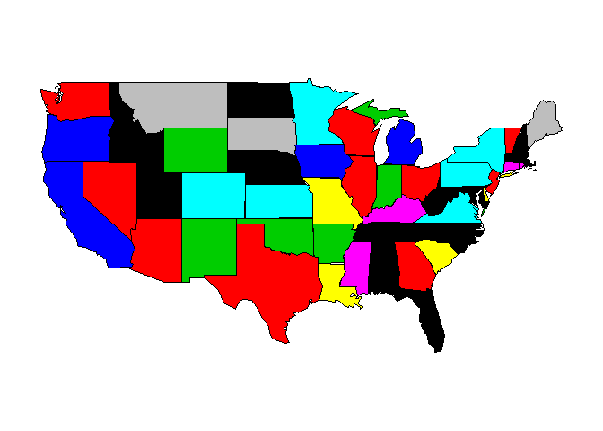<!-- -->

Das R-Paket maps
----------------

    library(maps)

Wie man Hilfe bekommt:

    ?map

Hallo Welt
----------

    map()

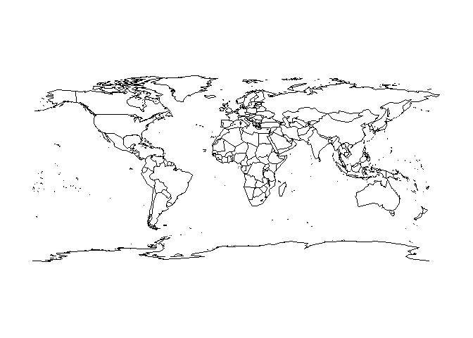<!-- -->

Ein erstes Argument
-------------------

Der gleiche Befehl mit einem Argument:

    map("usa")

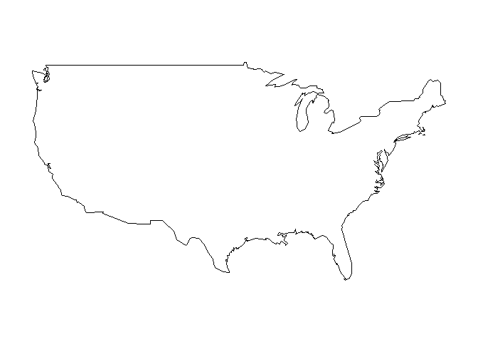<!-- -->

Eine Frankreichkarte
--------------------

    map("france")

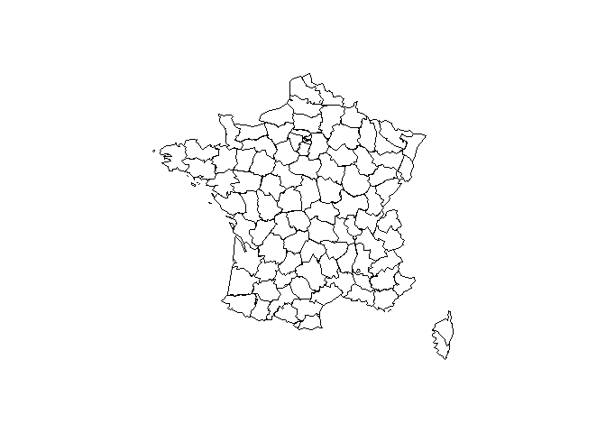<!-- -->

Politische Karte - Italien
--------------------------

Grenzen in blau:

    library ( maps )
    map ("italy", col = "blue")

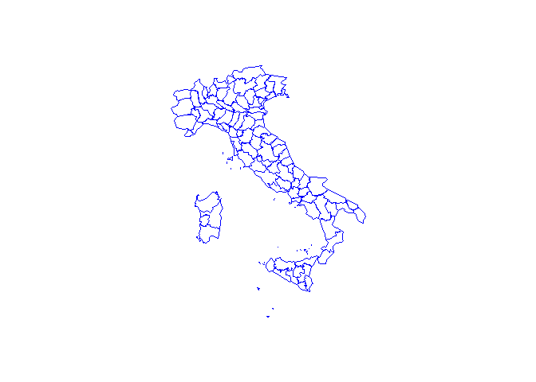<!-- -->

Choroplethen - R-Paket maps
---------------------------

If we want the areas in blue:

    map ("italy",fill =T, col = "blue")

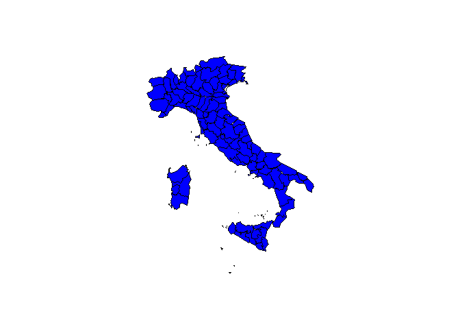<!-- -->

More colors
-----------

Create a vector:

    colors <- c("blue","red","yellow")

and use the vector to specify the color

    map ("italy",fill =T, col = colors)

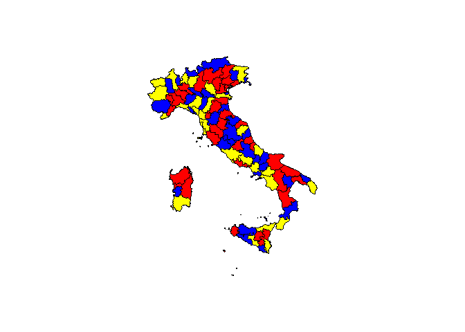<!-- -->

Excursus: more colors!
----------------------

You can also use the
[rgb](https://stat.ethz.ch/R-manual/R-devel/library/grDevices/html/rgb.html)
command to create your own colors:

    map("italy",fill=T, col = rgb(0,1,0))

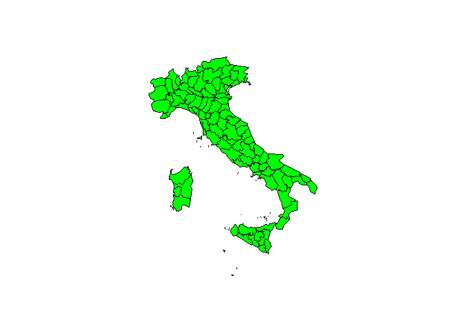<!-- -->

Try also
--------

    map("italy",fill=T, col = rgb(1,0,0))
    map("italy",fill=T, col = rgb(1,1,1))
    map("italy",fill=T, col = rgb(1,0.5,0.4))

Choropleths - R-Paket maps
--------------------------

If you want to know, which region is at which place:

    italy <- map("italy", plot = F)
    head(italy$names)

    ## [1] "Bolzano-Bozen" "Belluno"       "Udine"         "Sondrio"      
    ## [5] "Trento"        "Novara"

Maps with only one argument
---------------------------

    map("county")

<table>
<thead>
<tr class="header">
<th align="left">Argument</th>
<th align="left">What</th>
</tr>
</thead>
<tbody>
<tr class="odd">
<td align="left">county</td>
<td align="left">US Counties</td>
</tr>
<tr class="even">
<td align="left">france</td>
<td align="left">France</td>
</tr>
<tr class="odd">
<td align="left">italy</td>
<td align="left">Italy</td>
</tr>
<tr class="even">
<td align="left">nz</td>
<td align="left">New Zealand</td>
</tr>
<tr class="odd">
<td align="left">state</td>
<td align="left">US States</td>
</tr>
<tr class="even">
<td align="left">usa</td>
<td align="left">USA</td>
</tr>
<tr class="odd">
<td align="left">world</td>
<td align="left">Countries of the world</td>
</tr>
</tbody>
</table>

A map for Germany
-----------------

    library(maps)
    map("world", "Germany")

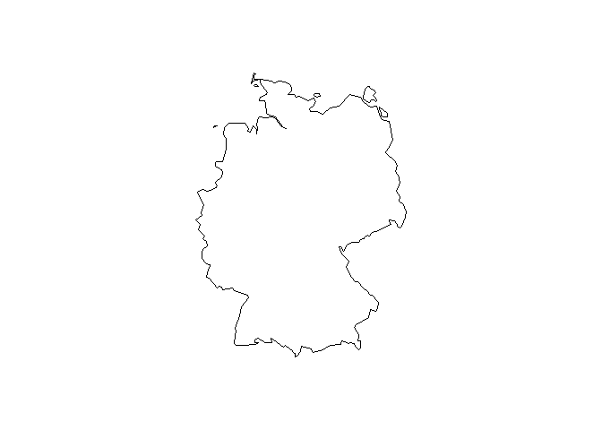<!-- -->

R-Paket maps - two countries
----------------------------

    map("world", c("Germany","Poland"))

<!-- -->

Two countries with color
------------------------

    map("world", c("Germany","Austria"),fill=T,
    col=c("red","green"))

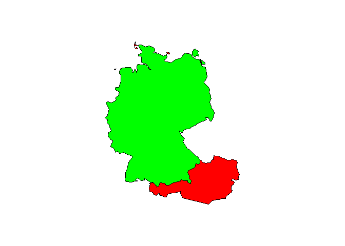<!-- -->

R-Paket maps - additional features
----------------------------------

    map("world", "China")
    map.scale()

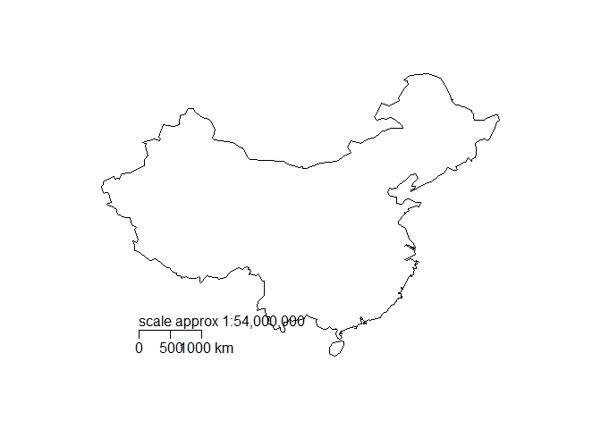<!-- -->

R-Paket maps - additional features
----------------------------------

Like `map`, but labels the regions:

    map.text("county", "penn")

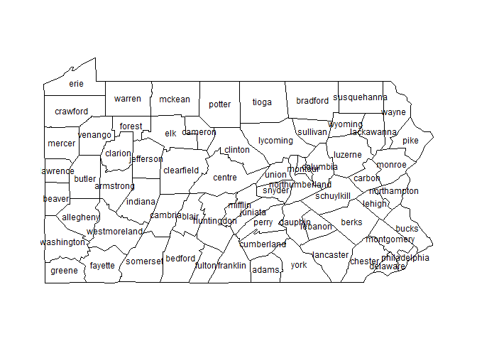<!-- -->

Pennsylvania counties

R-Paket maps - World cities
---------------------------

`data` loads specified data sets, or lists the available data sets.

    data(world.cities)

`head` - Return the First Part of an Object

    head(world.cities)

Overview of world cities data
-----------------------------

<table>
<thead>
<tr class="header">
<th align="left">name</th>
<th align="left">country.etc</th>
<th align="right">pop</th>
<th align="right">lat</th>
<th align="right">long</th>
<th align="right">capital</th>
</tr>
</thead>
<tbody>
<tr class="odd">
<td align="left">'Abasan al-Jadidah</td>
<td align="left">Palestine</td>
<td align="right">5629</td>
<td align="right">31.31</td>
<td align="right">34.34</td>
<td align="right">0</td>
</tr>
<tr class="even">
<td align="left">'Abasan al-Kabirah</td>
<td align="left">Palestine</td>
<td align="right">18999</td>
<td align="right">31.32</td>
<td align="right">34.35</td>
<td align="right">0</td>
</tr>
<tr class="odd">
<td align="left">'Abdul Hakim</td>
<td align="left">Pakistan</td>
<td align="right">47788</td>
<td align="right">30.55</td>
<td align="right">72.11</td>
<td align="right">0</td>
</tr>
<tr class="even">
<td align="left">'Abdullah-as-Salam</td>
<td align="left">Kuwait</td>
<td align="right">21817</td>
<td align="right">29.36</td>
<td align="right">47.98</td>
<td align="right">0</td>
</tr>
<tr class="odd">
<td align="left">'Abud</td>
<td align="left">Palestine</td>
<td align="right">2456</td>
<td align="right">32.03</td>
<td align="right">35.07</td>
<td align="right">0</td>
</tr>
<tr class="even">
<td align="left">'Abwein</td>
<td align="left">Palestine</td>
<td align="right">3434</td>
<td align="right">32.03</td>
<td align="right">35.20</td>
<td align="right">0</td>
</tr>
</tbody>
</table>

Map the cities of the world
---------------------------

    map()
    map.cities(world.cities)

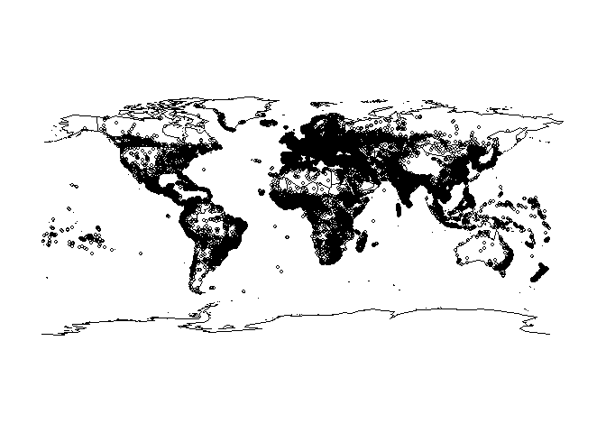<!-- -->

Cities of France
----------------

    data(world.cities)
    map("france")
    map.cities(world.cities)

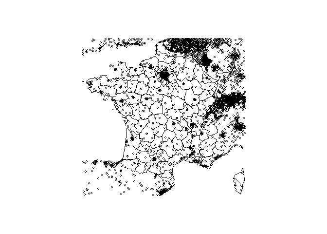<!-- -->

Only cities of France
---------------------

    FrenchCity <- world.cities$country.etc=="France"
    FCit <- world.cities[FrenchCity,]

<table>
<thead>
<tr class="header">
<th align="left"></th>
<th align="left">name</th>
<th align="left">country.etc</th>
<th align="right">pop</th>
<th align="right">lat</th>
<th align="right">long</th>
<th align="right">capital</th>
</tr>
</thead>
<tbody>
<tr class="odd">
<td align="left">195</td>
<td align="left">Abbeville</td>
<td align="left">France</td>
<td align="right">26656</td>
<td align="right">50.12</td>
<td align="right">1.83</td>
<td align="right">0</td>
</tr>
<tr class="even">
<td align="left">318</td>
<td align="left">Acheres</td>
<td align="left">France</td>
<td align="right">23219</td>
<td align="right">48.97</td>
<td align="right">2.06</td>
<td align="right">0</td>
</tr>
<tr class="odd">
<td align="left">477</td>
<td align="left">Agde</td>
<td align="left">France</td>
<td align="right">23477</td>
<td align="right">43.33</td>
<td align="right">3.46</td>
<td align="right">0</td>
</tr>
<tr class="even">
<td align="left">479</td>
<td align="left">Agen</td>
<td align="left">France</td>
<td align="right">34742</td>
<td align="right">44.20</td>
<td align="right">0.62</td>
<td align="right">0</td>
</tr>
</tbody>
</table>

Only cities of France
---------------------

Now it is possible to map only the french cities:

    map("france")
    map.cities(FCit,col="blue",pch=20)

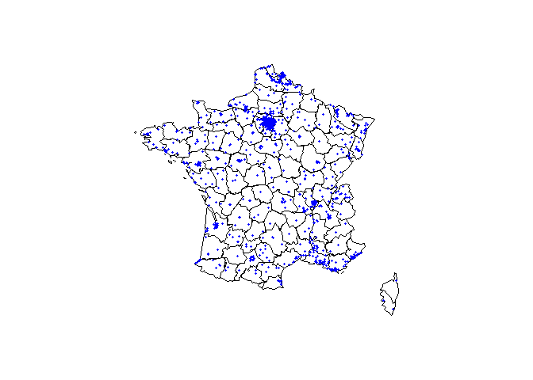<!-- -->

`pch` - plotting character, i.e., symbol to use.

Different sizes - different colors
----------------------------------

    FCit_Bc<-FCit[FCit$pop>50000,]
    map("france")
    map.cities(FCit,col="blue",pch=20)
    map.cities(FCit_Bc,col="red",pch=20)

<!-- -->

Thematic maps with R-Paket maps
-------------------------------

Data basis - CIA World DataBank II

The [CIA World DataBank](http://www.evl.uic.edu/pape/data/WDB/) is a
collection of world map data, consisting of vector descriptions of land
outlines, rivers, / political boundaries. It was created by U.S.
government in the 1980s.

Example: US Unemployment
------------------------

-   [More](http://bcb.dfci.harvard.edu/~aedin/courses/R/CDC/maps.html)
    about the usage of Paket maps

Get the data:

    library(maps)
    data(unemp)
    data(county.fips)

Farbverläufe
------------

    library(colorRamps)
    colors <- blue2red(6)
    barplot(1:6,col=colors)

<!-- -->

Example: US Unemployment - color coding
---------------------------------------

    unemp$colorSteps <- cut(unemp$unemp, 
              c(0, 2, 4, 6, 8,10, 100))
    colorsmatch <- unemp$colorSteps[match(county.fips$fips, 
              unemp$fips)]

Example: US Unemployment
------------------------

    map("county", col = colors[colorsmatch], 
        fill = TRUE)

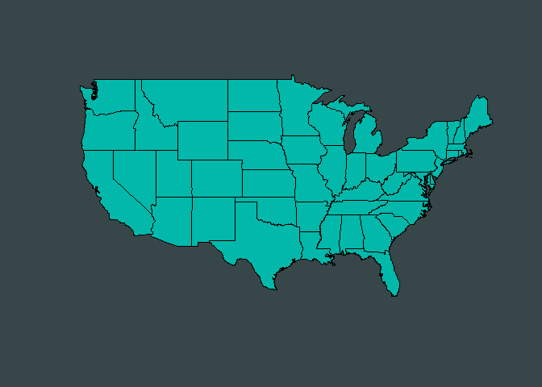<!-- -->

Further links and resources
---------------------------

-   [Using R — Working with Geospatial
    Data](http://mazamascience.com/WorkingWithData/?p=1277)

-   Robin Lovelace, James Cheshire - [Introduction to visualising
    spatial data in
    R](https://cran.r-project.org/doc/contrib/intro-spatial-rl.pdf)

-   [Maps in R: Introduction - Drawing the map of
    Europe](http://www.milanor.net/blog/?p=534)
