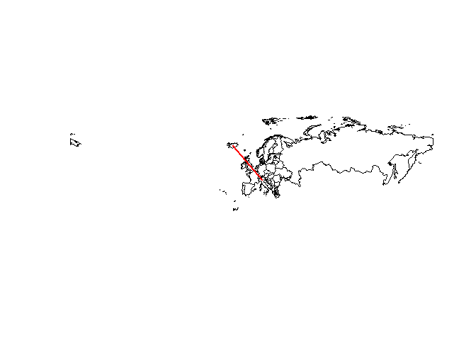

Das Paket maptools
------------------

-   Datensatz `wrld_simpl` aus dem Paket
    [maptools](https://cran.r-project.org/web/packages/maptools/index.html)
-   Polygone für fast alle Staaten der Erde

<!-- -->

    library(maptools)
    data(wrld_simpl)

<table>
<thead>
<tr class="header">
<th></th>
<th align="left">FIPS</th>
<th align="left">ISO2</th>
<th align="left">ISO3</th>
<th align="right">UN</th>
<th align="left">NAME</th>
</tr>
</thead>
<tbody>
<tr class="odd">
<td>ATG</td>
<td align="left">AC</td>
<td align="left">AG</td>
<td align="left">ATG</td>
<td align="right">28</td>
<td align="left">Antigua and Barbuda</td>
</tr>
<tr class="even">
<td>DZA</td>
<td align="left">AG</td>
<td align="left">DZ</td>
<td align="left">DZA</td>
<td align="right">12</td>
<td align="left">Algeria</td>
</tr>
<tr class="odd">
<td>AZE</td>
<td align="left">AJ</td>
<td align="left">AZ</td>
<td align="left">AZE</td>
<td align="right">31</td>
<td align="left">Azerbaijan</td>
</tr>
<tr class="even">
<td>ALB</td>
<td align="left">AL</td>
<td align="left">AL</td>
<td align="left">ALB</td>
<td align="right">8</td>
<td align="left">Albania</td>
</tr>
</tbody>
</table>

Hello world
-----------

    data(wrld_simpl)
    plot(wrld_simpl)

<!-- -->

Der shapefile
-------------

-   Es handelt sich um einen `shapefile`

<!-- -->

    typeof(wrld_simpl)

    ## [1] "S4"

-   Die Daten sind als `S4` abgespeichert
-   Es gibt verschiedene Slots
-   In einem davon ist Information als `data.frame` gespeichert.

Der Datensatz
-------------

    head(wrld_simpl@data)

<table>
<thead>
<tr class="header">
<th></th>
<th align="left">FIPS</th>
<th align="left">ISO2</th>
<th align="left">ISO3</th>
<th align="right">UN</th>
<th align="left">NAME</th>
</tr>
</thead>
<tbody>
<tr class="odd">
<td>ATG</td>
<td align="left">AC</td>
<td align="left">AG</td>
<td align="left">ATG</td>
<td align="right">28</td>
<td align="left">Antigua and Barbuda</td>
</tr>
<tr class="even">
<td>DZA</td>
<td align="left">AG</td>
<td align="left">DZ</td>
<td align="left">DZA</td>
<td align="right">12</td>
<td align="left">Algeria</td>
</tr>
<tr class="odd">
<td>AZE</td>
<td align="left">AJ</td>
<td align="left">AZ</td>
<td align="left">AZE</td>
<td align="right">31</td>
<td align="left">Azerbaijan</td>
</tr>
<tr class="even">
<td>ALB</td>
<td align="left">AL</td>
<td align="left">AL</td>
<td align="left">ALB</td>
<td align="right">8</td>
<td align="left">Albania</td>
</tr>
</tbody>
</table>

Die Struktur der Daten
----------------------

    head(wrld_simpl@data$NAME)

    ## [1] Antigua and Barbuda Algeria             Azerbaijan         
    ## [4] Albania             Armenia             Angola             
    ## 246 Levels: Aaland Islands Afghanistan Albania Algeria ... Zimbabwe

Eine logische Abfrage
---------------------

    ind_SA <- wrld_simpl@data$NAME =="South Africa"
    head(ind_SA)

    ## [1] FALSE FALSE FALSE FALSE FALSE FALSE

    table(ind_SA)

    ## ind_SA
    ## FALSE  TRUE 
    ##   245     1

Eine Karte für Süd Afrika
-------------------------

-   Ein Land zeichnen

<!-- -->

    SouthAfrica <- wrld_simpl[ind_SA,]
    plot(SouthAfrica)

<!-- -->

Mehr als ein Land zeichnen
--------------------------

    EuropeList <- c('Germany', 'France')
    my_map <- wrld_simpl[wrld_simpl$NAME %in% EuropeList, ]
    par(mai=c(0,0,0,0))
    plot(my_map)

<!-- -->

Mehr Farbe
----------

    my_map@data$color <- c("blue","green")
    plot(my_map,col=my_map@data$color)

<!-- -->

Mehr Farbe für die Welt
-----------------------

    plot(wrld_simpl, bg='azure2', col='green',
         border='lightgray')

<!-- -->

Eine Karte für Europa
---------------------

    Europe <- wrld_simpl[wrld_simpl$REGION=="150",]
    plot(Europe,col="royalblue")

<!-- -->

Europa ohne Russland
--------------------

    ind <- which(Europe@data$NAME=="Russia")
    EU <- Europe[-ind,]
    plot(EU,col="blue",border="red")

<!-- -->

Spielen Sie mit Farben
----------------------

    EU$colors <- "green"
    plot(EU,col=EU$colors,border="red")

<!-- -->

    pop05 <- Europe$POP2005
    Europe$colors[pop05>mean(pop05)] <- "royalblue"
    plot(Europe,col=Europe$colors)

<!-- -->

Mehr über Farben
----------------

[Colors in R](http://www.stat.columbia.edu/~tzheng/files/Rcolor.pdf)

    Europe$colors[pop05>median(pop05)] <- "chocolate4"
    plot(Europe,col=Europe$colors)

<!-- -->

Europa - Farbschattierung blau
------------------------------

    val <- Europe$POP2005/max(Europe$POP2005)
    plot(Europe,col=rgb(0,0,val))

<!-- -->

Europa - Farbschattierung rot
-----------------------------

    val <- Europe$POP2005/max(Europe$POP2005)
    plot(Europe,col=rgb(val,0,0))

<!-- -->

Europa - Farbschattierung grün
------------------------------

    val <- Europe$POP2005/max(Europe$POP2005)
    plot(Europe,col=rgb(0,val,0))

<!-- -->

Europa - Farbschattierung grau
------------------------------

    val <- Europe$POP2005/max(Europe$POP2005)
    plot(Europe,col=rgb(val,val,val))

<!-- -->

Europa - zwei Graphiken nebeneinander
-------------------------------------

    par(mfrow=c(1,2))
    plot(Europe,col=rgb(val,0,val))
    plot(Europe,col=rgb(val,val,0))

<!-- -->

Europa - Punkte hinzufügen
--------------------------

    which(Europe$ISO2=="FR") # 14

    ## [1] 10

    plot(Europe)
    points(Europe$LON[14],Europe$LAT[14],col="red",pch=20)

<!-- -->

Europa - Blasen hinzufügen
--------------------------

    pop <- Europe$POP2005
    pop <- pop/max(pop)*10
    plot(Europe)
    points(Europe$LON,Europe$LAT,cex=pop,col=rgb(0,0,1,.2),
    pch=20)

<!-- -->

Europa - Text hinzufügen
------------------------

    plot(Europe)
    text(Europe$LON,Europe$LAT,Europe$ISO2,col="red")

<!-- -->

Europa - Linien hinzufügen
--------------------------

    which(Europe$ISO2=="FR") # 15
    which(Europe$ISO2=="DE") # 16

    Dat <- cbind(Europe$LON[15:16],Europe$LAT[15:16])
    plot(Europe)
    lines(Dat,col="red",lwd=2)

<!-- -->
