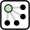
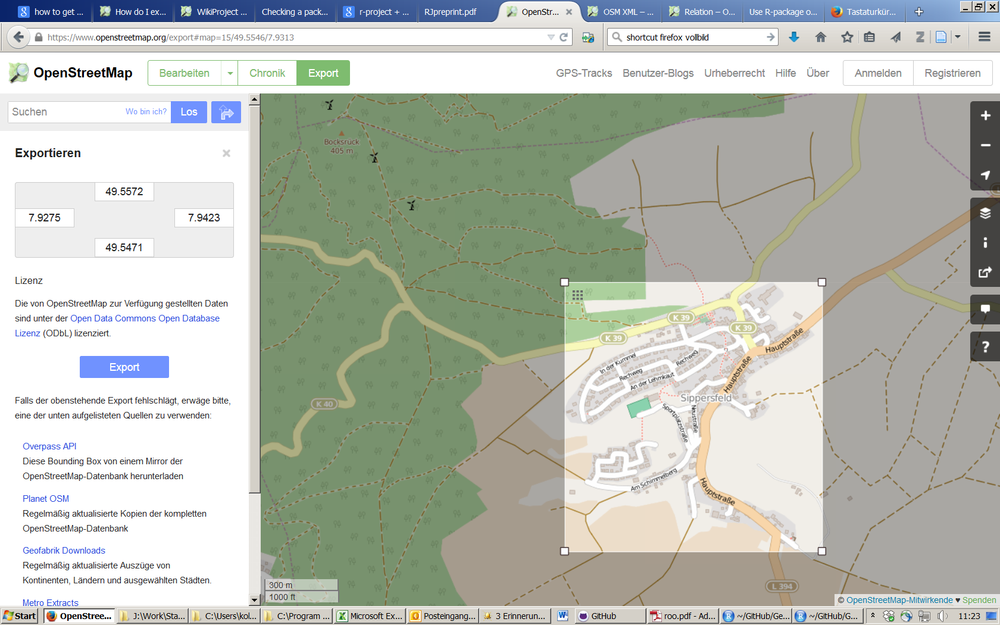

```{r,echo=F}
library(knitr)
library(DT)
Ex=T
Ca=F
```


## Die relevanten Pakete

Das R-Paket [osmar](https://cran.r-project.org/web/packages/osmar/index.html) wurde von Thomas Schlesinger und Manuel J. A. Eugster erstellt um OpenStreetMap Daten in R zu importieren und zu verarbeiten. 

```{r,message=F}
library(ggmap)
library(osmar)
```

Die folgende Zeile ist sehr wichtig um die API zu nutzen
```{r}
api <- osmsource_api()
```

## Download von Information

- Der Download dauert eine Weile
- Der Download Ausschnitt ist stark begrenzt

```{r,cache=Ca,message=F,eval=F}
cityC <- geocode("Trier")
bb <- center_bbox(cityC$lon,cityC$lat,200, 200)
ua <- get_osm(bb, source = api)
```

```{r,eval=F,echo=F}
setwd("C:/Users/kolbjp/Documents/GitHub/GeoData/2016/slides/data")
save(ua,file="uaTrier.RData")
```

```{r,echo=F}
load("data/uaTrier.RData")
```


## Welche Informationen hat man nun:

Man bekommt drei Arten von Informationen:

```{r,eval=Ex}
names(ua)
```

 [Node](http://wiki.openstreetmap.org/wiki/Elements#Node)

 [Way](http://wiki.openstreetmap.org/wiki/Elements#Way)

 [Relation](http://wiki.openstreetmap.org/wiki/Relation)


## Um sich die Information zu den nodes anzuschauen:

```{r,eval=F}
summary(ua$nodes)
```

Überblick über die Information

```{r,eval=F,echo=F}
datatable(summary(ua$nodes)[[6]])
```

```{r,eval=Ex,echo=F}
kable(head(summary(ua$nodes)[[6]]))
```

## Shapefile für die Gebäude

```{r,eval=Ex,cache=Ca}
bg_ids <- find(ua, way(tags(k=="building")))
bg_ids <- find_down(ua, way(bg_ids))
bg <- subset(ua, ids = bg_ids)
```

## Die Gebäude zeichnen

```{r,eval=Ex,cache=Ca}
plot(bg)
```

## Einen Shapefile erzeugen

```{r,eval=Ex,cache=Ca}
bg_poly <- as_sp(bg, "polygons")  
plot(bg_poly)
```


## Die Informationen manuell herunterladen

- The information can be exported from [OSM](https://www.openstreetmap.org/export)




## In R Importieren unter Nutzung von `osmar`

```{r,eval=F}
map <- get_osm(complete_file(), 
                source = osmsource_file("map.osm"))
```

Was ist dahinter:

[Osmosis](http://wiki.openstreetmap.org/wiki/Osmosis/Detailed_Usage_0.44#--tag-filter_.28--tf.29) ist eine Kommandozeilen Java Applikation um OSM Daten zu verarbeiten.

## Mehr Tutorien zur Nutzung von `osmar` und OpenStreetMap Daten:

- [giswerk.org](http://giswerk.org/)
ist eine Sammlung von Informationen zu den Themen Geographie und Geoinformatik. Es gibt auch Informationen wie man OpenStreetMap Daten in R importiert und verarbeitet ([OpenStreetMap2R ](http://giswerk.org/doku.php?id=r:r-tutorials:packages:osmar#things_of_further_interest))

<http://giswerk.org/doku.php?id=r:r-tutorials:packages:osmar#things_of_further_interest>

- [Nutzung von OpenStreetMap Daten um Karten zu erzeugen](https://github.com/Robinlovelace/osm-tutorial/blob/master/osm.Rmd)

<https://github.com/Robinlovelace/osm-tutorial/blob/master/osm.Rmd>

- [Kochbuch zur Nutzung von osmar](http://generalcookbook.blogspot.de/2013/08/application-of-openstreetmap-data-in.html?view=classic)

<http://generalcookbook.blogspot.de/2013/08/application-of-openstreetmap-data-in.html?view=classic>

## Resourcen

```{r}
citation("osmar")
```

