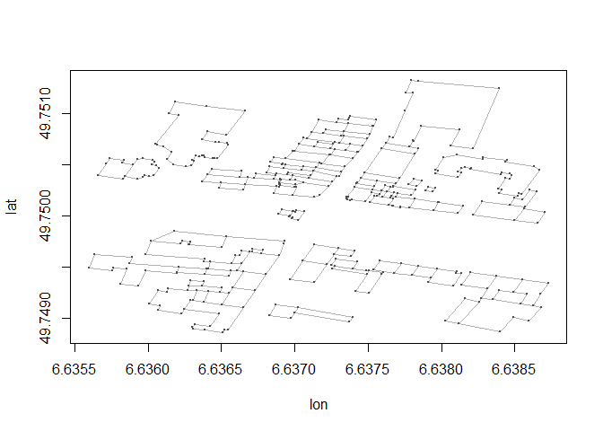
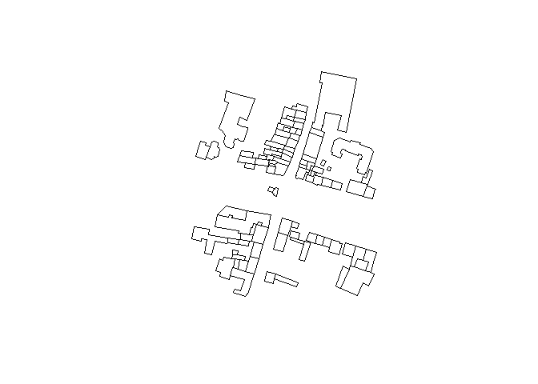

# Das R-Paket osmar
Jan-Philipp Kolb  
08 April 2016  


## Die relevanten Pakete

Das R-Paket [osmar](https://cran.r-project.org/web/packages/osmar/index.html) wurde von Thomas Schlesinger und Manuel J. A. Eugster erstellt um OpenStreetMap Daten in R zu importieren und zu verarbeiten. 


```r
library(ggmap)
library(osmar)
```

Die folgende Zeile ist sehr wichtig um die API zu nutzen

```r
api <- osmsource_api()
```

## Download von Information

- Der Download dauert eine Weile
- Der Download Ausschnitt ist stark begrenzt


```r
cityC <- geocode("Trier")
bb <- center_bbox(cityC$lon,cityC$lat,200, 200)
ua <- get_osm(bb, source = api)
```

## Welche Informationen hat man nun:

Man bekommt drei Arten von Informationen:


```r
names(ua)
```

```
## [1] "nodes"     "ways"      "relations"
```

 [Node](http://wiki.openstreetmap.org/wiki/Elements#Node)

 [Way](http://wiki.openstreetmap.org/wiki/Elements#Way)

 [Relation](http://wiki.openstreetmap.org/wiki/Relation)


## Um sich die Information zu den nodes anzuschauen:


```r
summary(ua$nodes)
```

```
## osmar$nodes object
## 823 nodes, 163 tags 
## 
## ..$attrs data.frame: 
##     id, visible, timestamp, version, changeset, user, uid, lat,
##     lon 
## ..$tags data.frame: 
##     id, k, v 
##  
## Bounding box:
##          lat      lon
## min 49.74492 6.626433
## max 49.76133 6.649429
## 
## Key-Value contingency table:
##              Key           Value Freq
## 1        highway        crossing   10
## 2       crossing traffic_signals    9
## 3        highway traffic_signals    7
## 4  addr:postcode           54290    6
## 5      addr:city           Trier    6
## 6   addr:country              DE    5
## 7     wheelchair             yes    5
## 8    addr:street      Neustraße    4
## 9        amenity      restaurant    4
## 10         seats               4    3
```

## Überblick über die Information


Key                      Value                                                          Freq
-----------------------  ------------------------------------------------------------  -----
highway                  crossing                                                         10
crossing                 traffic_signals                                                   9
highway                  traffic_signals                                                   7
addr:postcode            54290                                                             6
addr:city                Trier                                                             6
addr:country             DE                                                                5
wheelchair               yes                                                               5
addr:street              Neustraße                                                        4
amenity                  restaurant                                                        4
seats                    4                                                                 3
amenity                  bench                                                             3
colour                   brown                                                             3
highway                  bus_stop                                                          3
wheelchair               limited                                                           3
public_transport         stop_position                                                     3
material                 wood                                                              3
backrest                 yes                                                               3
addr:street              Südallee                                                         2
name                     Trier, Südallee/Kaiserstraße                                    2
bicycle                  yes                                                               2
phone                    +49 651 1453158                                                   1
contact:phone            +49 651 9778-0                                                    1
phone                    +49 651 99895810                                                  1
fax                      +49 651 99895819                                                  1
addr:housenumber         24                                                                1
addr:housenumber         25                                                                1
addr:housenumber         39                                                                1
addr:housenumber         51                                                                1
addr:housenumber         52                                                                1
addr:housenumber         58                                                                1
ref                      70                                                                1
name                     Antiquariat Zaunmüller                                           1
cuisine                  asian                                                             1
name                     Athena                                                            1
name                     Bügelfix                                                         1
shop                     books                                                             1
amenity                  cafe                                                              1
name                     Curry 59                                                          1
name                     Das Flammkuchenhaus                                               1
name                     Deutscher Hof                                                     1
wheelchair:description   Ein Eingang ebenerdig, zweiter Eingang eine Stufe                 1
name                     Familiencafé Löwentatze                                         1
amenity                  fast_food                                                         1
shop                     furniture                                                         1
barrier                  gate                                                              1
cuisine                  german                                                            1
name                     Gilbertstraße                                                    1
cuisine                  greek                                                             1
shop                     greengrocer                                                       1
information              guidepost                                                         1
entrance                 highway                                                           1
tourism                  hotel                                                             1
contact:website          http://www.hotel-deutscher-hof.de                                 1
website                  http://www.luft-rlp.de/aktuell/messnetz/standorte/index.php       1
website                  http://www.mobileemergency.de                                     1
website                  http://www.schuhe-berg.de/                                        1
website                  http://www.yong-suppenbar.de/                                     1
created_by               iLOE 1.9                                                          1
cuisine                  indian                                                            1
contact:email            info@hotel-deutscher-hof.de                                       1
email                    info@schuhe-berg.de                                               1
tourism                  information                                                       1
name                     Jasmin Market                                                     1
shop                     jewelry                                                           1
operator                 Landesamt für Umwelt, Wasserwirtschaft und Gewerbeaufsicht       1
shop                     laundry                                                           1
barrier                  lift_gate                                                         1
email                    mail@yong-suppenbar.de                                            1
observatory:type         meteorological                                                    1
name                     Mobile Emergency Trier - Handyklinik                              1
man_made                 monitoring_station                                                1
access                   motor_vehicle                                                     1
microbrewery             no                                                                1
smoking                  no                                                                1
wheelchair               no                                                                1
name                     Optimum                                                           1
amenity                  parking_entrance                                                  1
vending                  parking_tickets                                                   1
name                     Perlenträume                                                     1
public_transport         platform                                                          1
access                   private                                                           1
amenity                  pub                                                               1
name                     Schuhe Berg... Schuhe zum Leben                                   1
shop                     shoes                                                             1
operator                 Stadt Trier                                                       1
name                     Taj Mahal                                                         1
crossing_ref             toucan                                                            1
name                     Trier, Gilbertstraße                                             1
name                     Trier, Kaiserstraße                                              1
amenity                  vending_machine                                                   1
bus                      yes                                                               1
foot                     yes                                                               1
monitoring:weather       yes                                                               1
payment:coins            yes                                                               1
payment:debit_cards      yes                                                               1
shelter                  yes                                                               1
name                     Yong                                                              1

## Shapefile für die Gebäude


```r
bg_ids <- find(ua, way(tags(k=="building")))
bg_ids <- find_down(ua, way(bg_ids))
bg <- subset(ua, ids = bg_ids)
```

## Die Gebäude zeichnen


```r
plot(bg)
```



## Einen Shapefile erzeugen


```r
bg_poly <- as_sp(bg, "polygons")  
plot(bg_poly)
```




## Die Informationen manuell herunterladen

- The information can be exported from [OSM](https://www.openstreetmap.org/export)


## In R Importieren unter Nutzung von `osmar`


```r
map <- get_osm(complete_file(), 
                source = osmsource_file("map.osm"))
```


## Was ist dahinter:

[Osmosis](http://wiki.openstreetmap.org/wiki/Osmosis/Detailed_Usage_0.44#--tag-filter_.28--tf.29) ist eine Kommandozeilen Java Applikation um OSM Daten zu verarbeiten.

## Mehr Tutorien zur Nutzung von `osmar` und OpenStreetMap Daten:

- [giswerk.org](http://giswerk.org/)
ist eine Sammlung von Informationen zu den Themen Geographie und Geoinformatik. Es gibt auch Informationen wie man OpenStreetMap Daten in R importiert und verarbeitet ([OpenStreetMap2R ](http://giswerk.org/doku.php?id=r:r-tutorials:packages:osmar#things_of_further_interest))

- [Nutzung von OpenStreetMap Daten um Karten zu erzeugen](https://github.com/Robinlovelace/osm-tutorial/blob/master/osm.Rmd)


- [Kochbuch zur Nutzung von osmar](http://generalcookbook.blogspot.de/2013/08/application-of-openstreetmap-data-in.html?view=classic)

## Resourcen


```r
citation("osmar")
```

```
## 
## To cite the osmar package use:
## 
##   Manuel J. A. Eugster and Thomas Schlesinger. osmar:
##   OpenStreetMap and R. R Journal, 2012. Accepted for publication
##   on 2012-08-14. http://osmar.r-forge.r-project.org/RJpreprint.pdf
## 
## A BibTeX entry for LaTeX users is
## 
##   @Article{,
##     title = {osmar: OpenStreetMap and R},
##     author = {Manuel J. A. Eugster and Thomas Schlesinger},
##     journal = {R Journal},
##     year = {2010},
##     note = {Accepted for publication on 2012-08-14},
##     url = {http://osmar.r-forge.r-project.org/RJpreprint.pdf},
##   }
```

