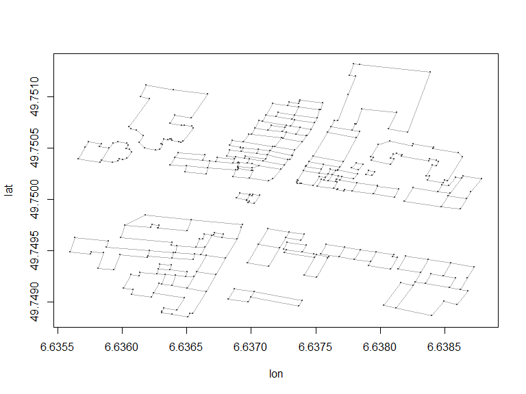
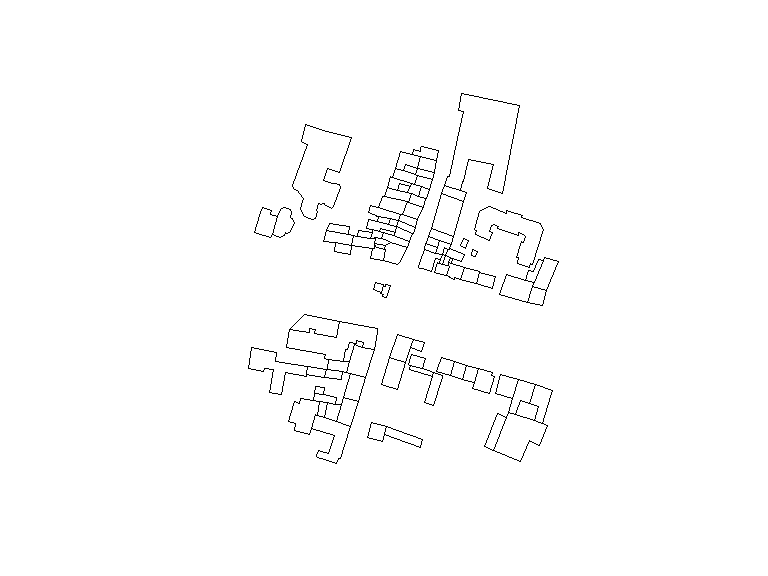

# Nutzung von GeoDaten in den Sozialwissenschaften - Das R-Paket osmar
Jan-Philipp Kolb  
08 April 2016  


## Die relevanten Pakete

Das R-Paket [osmar](https://cran.r-project.org/web/packages/osmar/index.html) wurde von Thomas Schlesinger und Manuel J. A. Eugster erstellt um OpenStreetMap Daten in R zu importieren und zu verarbeiten. 


```r
library(ggmap)
library(osmar)
```

Die folgende Zeile ist sehr wichtig um die API zu nutzen

```r
api <- osmsource_api()
```

## Download von Information

- Der Download dauert eine Weile
- Der Download Ausschnitt ist stark begrenzt


```r
cityC <- geocode("Trier")
bb <- center_bbox(cityC$lon,cityC$lat,200, 200)
ua <- get_osm(bb, source = api)
```


## Welche Informationen hat man nun:

Man bekommt drei Arten von Informationen:


```r
names(ua)
```

```
## [1] "nodes"     "ways"      "relations"
```

 [Node](http://wiki.openstreetmap.org/wiki/Elements#Node)

 [Way](http://wiki.openstreetmap.org/wiki/Elements#Way)

 [Relation](http://wiki.openstreetmap.org/wiki/Relation)


## Um sich die Information zu den nodes anzuschauen:


```r
summary(ua$nodes)
```

Überblick über die Information


Key             Value              Freq
--------------  ----------------  -----
addr:postcode   54290                11
addr:city       Trier                11
highway         crossing             10
crossing        traffic_signals       9
addr:street     Neustraße            8
highway         traffic_signals       7

## Shapefile für die Gebäude


```r
bg_ids <- find(ua, way(tags(k=="building")))
bg_ids <- find_down(ua, way(bg_ids))
bg <- subset(ua, ids = bg_ids)
```

## Die Gebäude zeichnen


```r
plot(bg)
```

<!-- -->

## Einen Shapefile erzeugen


```r
bg_poly <- as_sp(bg, "polygons")  
plot(bg_poly)
```

<!-- -->


## Die Informationen manuell herunterladen

- The information can be exported from [OSM](https://www.openstreetmap.org/export)


## In R Importieren unter Nutzung von `osmar`


```r
map <- get_osm(complete_file(), 
                source = osmsource_file("map.osm"))
```

Was ist dahinter:

[Osmosis](http://wiki.openstreetmap.org/wiki/Osmosis/Detailed_Usage_0.44#--tag-filter_.28--tf.29) ist eine Kommandozeilen Java Applikation um OSM Daten zu verarbeiten.

## Mehr Tutorien zur Nutzung von `osmar` und OpenStreetMap Daten:

- [giswerk.org](http://giswerk.org/)
ist eine Sammlung von Informationen zu den Themen Geographie und Geoinformatik. Es gibt auch Informationen wie man OpenStreetMap Daten in R importiert und verarbeitet ([OpenStreetMap2R ](http://giswerk.org/doku.php?id=r:r-tutorials:packages:osmar#things_of_further_interest))

<http://giswerk.org/doku.php?id=r:r-tutorials:packages:osmar#things_of_further_interest>

- [Nutzung von OpenStreetMap Daten um Karten zu erzeugen](https://github.com/Robinlovelace/osm-tutorial/blob/master/osm.Rmd)

<https://github.com/Robinlovelace/osm-tutorial/blob/master/osm.Rmd>

- [Kochbuch zur Nutzung von osmar](http://generalcookbook.blogspot.de/2013/08/application-of-openstreetmap-data-in.html?view=classic)

<http://generalcookbook.blogspot.de/2013/08/application-of-openstreetmap-data-in.html?view=classic>

## Resourcen


```r
citation("osmar")
```

```
## 
## To cite the osmar package use:
## 
##   Manuel J. A. Eugster and Thomas Schlesinger. osmar:
##   OpenStreetMap and R. R Journal, 2012. Accepted for publication
##   on 2012-08-14. http://osmar.r-forge.r-project.org/RJpreprint.pdf
## 
## A BibTeX entry for LaTeX users is
## 
##   @Article{,
##     title = {osmar: OpenStreetMap and R},
##     author = {Manuel J. A. Eugster and Thomas Schlesinger},
##     journal = {R Journal},
##     year = {2010},
##     note = {Accepted for publication on 2012-08-14},
##     url = {http://osmar.r-forge.r-project.org/RJpreprint.pdf},
##   }
```

