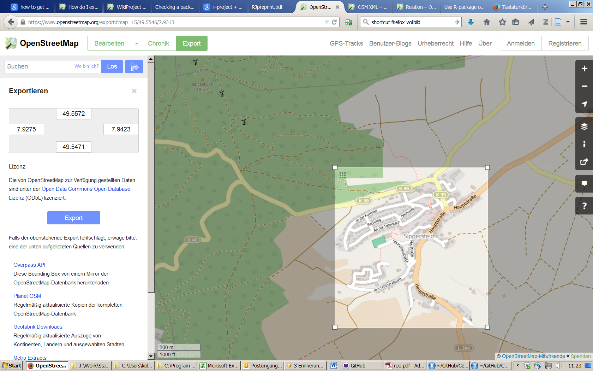

Die relevanten Pakete
---------------------

Das R-Paket
[osmar](https://cran.r-project.org/web/packages/osmar/index.html) wurde
von Thomas Schlesinger und Manuel J. A. Eugster erstellt um
OpenStreetMap Daten in R zu importieren und zu verarbeiten.

    library(ggmap)
    library(osmar)

Die folgende Zeile ist sehr wichtig um die API zu nutzen

    api <- osmsource_api()

Download von Information
------------------------

-   Der Download dauert eine Weile
-   Der Download Ausschnitt ist stark begrenzt

<!-- -->

    cityC <- geocode("Trier")
    bb <- center_bbox(cityC$lon,cityC$lat,200, 200)
    ua <- get_osm(bb, source = api)

Welche Informationen hat man nun:
---------------------------------

Man bekommt drei Arten von Informationen:

    names(ua)

    ## [1] "nodes"     "ways"      "relations"

[Node](http://wiki.openstreetmap.org/wiki/Elements#Node)

[Way](http://wiki.openstreetmap.org/wiki/Elements#Way)

[Relation](http://wiki.openstreetmap.org/wiki/Relation)

Um sich die Information zu den nodes anzuschauen:
-------------------------------------------------

    summary(ua$nodes)

Überblick über die Information

<table>
<thead>
<tr class="header">
<th align="left">Key</th>
<th align="left">Value</th>
<th align="right">Freq</th>
</tr>
</thead>
<tbody>
<tr class="odd">
<td align="left">addr:postcode</td>
<td align="left">54290</td>
<td align="right">11</td>
</tr>
<tr class="even">
<td align="left">addr:city</td>
<td align="left">Trier</td>
<td align="right">11</td>
</tr>
<tr class="odd">
<td align="left">highway</td>
<td align="left">crossing</td>
<td align="right">10</td>
</tr>
<tr class="even">
<td align="left">crossing</td>
<td align="left">traffic_signals</td>
<td align="right">9</td>
</tr>
<tr class="odd">
<td align="left">addr:street</td>
<td align="left">Neustraße</td>
<td align="right">8</td>
</tr>
<tr class="even">
<td align="left">highway</td>
<td align="left">traffic_signals</td>
<td align="right">7</td>
</tr>
</tbody>
</table>

Shapefile für die Gebäude
-------------------------

    bg_ids <- find(ua, way(tags(k=="building")))
    bg_ids <- find_down(ua, way(bg_ids))
    bg <- subset(ua, ids = bg_ids)

Die Gebäude zeichnen
--------------------

    plot(bg)

<!-- -->

Einen Shapefile erzeugen
------------------------

    bg_poly <- as_sp(bg, "polygons")  
    plot(bg_poly)

<!-- -->

Die Informationen manuell herunterladen
---------------------------------------

-   The information can be exported from
    [OSM](https://www.openstreetmap.org/export)

In R Importieren unter Nutzung von `osmar`
------------------------------------------

    map <- get_osm(complete_file(), 
                    source = osmsource_file("map.osm"))

Was ist dahinter:

[Osmosis](http://wiki.openstreetmap.org/wiki/Osmosis/Detailed_Usage_0.44#--tag-filter_.28--tf.29)
ist eine Kommandozeilen Java Applikation um OSM Daten zu verarbeiten.

Mehr Tutorien zur Nutzung von `osmar` und OpenStreetMap Daten:
--------------------------------------------------------------

-   [giswerk.org](http://giswerk.org/) ist eine Sammlung von
    Informationen zu den Themen Geographie und Geoinformatik. Es gibt
    auch Informationen wie man OpenStreetMap Daten in R importiert und
    verarbeitet
    ([OpenStreetMap2R](http://giswerk.org/doku.php?id=r:r-tutorials:packages:osmar#things_of_further_interest))

<http://giswerk.org/doku.php?id=r:r-tutorials:packages:osmar#things_of_further_interest>

-   [Nutzung von OpenStreetMap Daten um Karten zu
    erzeugen](https://github.com/Robinlovelace/osm-tutorial/blob/master/osm.Rmd)

<https://github.com/Robinlovelace/osm-tutorial/blob/master/osm.Rmd>

-   [Kochbuch zur Nutzung von
    osmar](http://generalcookbook.blogspot.de/2013/08/application-of-openstreetmap-data-in.html?view=classic)

<http://generalcookbook.blogspot.de/2013/08/application-of-openstreetmap-data-in.html?view=classic>

Resourcen
---------

    citation("osmar")

    ## 
    ## To cite the osmar package use:
    ## 
    ##   Manuel J. A. Eugster and Thomas Schlesinger. osmar:
    ##   OpenStreetMap and R. R Journal, 2012. Accepted for publication
    ##   on 2012-08-14. http://osmar.r-forge.r-project.org/RJpreprint.pdf
    ## 
    ## A BibTeX entry for LaTeX users is
    ## 
    ##   @Article{,
    ##     title = {osmar: OpenStreetMap and R},
    ##     author = {Manuel J. A. Eugster and Thomas Schlesinger},
    ##     journal = {R Journal},
    ##     year = {2010},
    ##     note = {Accepted for publication on 2012-08-14},
    ##     url = {http://osmar.r-forge.r-project.org/RJpreprint.pdf},
    ##   }
