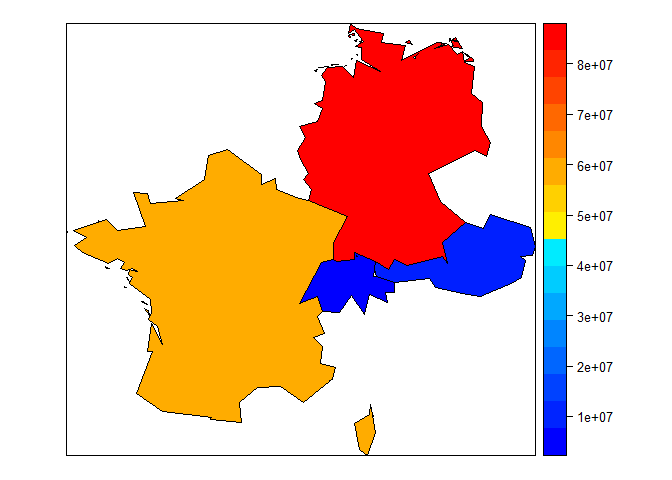

Beispiel: US Arbeitslosigkeit
-----------------------------

-   [Mehr](http://bcb.dfci.harvard.edu/~aedin/courses/R/CDC/maps.html)
    über die Nutzung des Paketes `maps`

Die Daten bekommen:

    library(maps)
    data(unemp)
    data(county.fips)

Farbverläufe
------------

    library(colorRamps)
    colors <- blue2red(6)
    barplot(1:6,col=colors)

<!-- -->

Beispiel: US Arbeitslosigkeit - Farbschattierung
------------------------------------------------

    unemp$colorSteps <- cut(unemp$unemp, 
              c(0, 2, 4, 6, 8,10, 100))
    colorsmatch <- unemp$colorSteps[match(county.fips$fips, 
              unemp$fips)]

Beispiel: US Arbeitslosigkeit
-----------------------------

    map("county", col = colors[colorsmatch], 
        fill = TRUE)

<!-- -->

Das R-Paket [sp](https://cran.r-project.org/web/packages/sp/index.html)
-----------------------------------------------------------------------

-   Klassen und Methoden für räumliche Daten
-   Authoren: Edzer Pebesma, Roger Bivand, Barry Rowlingson, Virgilio
    Gomez-Rubio et. al.
-   Viele
    [Einführungen](http://ifgi.uni-muenster.de/~epebe_01/Aufbaukurs/R/slides_R.pdf)
    sind verfügbar

<!-- -->

    library(sp)

Hallo Welt
----------

-   Ein erstes Beispiel unter Verwendung von Daten aus `maptools`
    ([ISO2-codes](http://en.wikipedia.org/wiki/ISO_3166-1_alpha-2))

<!-- -->

    library(maptools)
    data("wrld_simpl")
    ISO2codes <- wrld_simpl@data$ISO2
    countries <- c("FR","DE","AT","CH")
    ind <- match(countries,ISO2codes)
    my_map <- wrld_simpl[ind,]

Die Karte zeichnen
------------------

    library(maptools)
    plot(my_map)

<!-- -->

Der Datensatz
-------------

    head(my_map@data)

<table>
<thead>
<tr class="header">
<th></th>
<th align="left">ISO2</th>
<th align="left">NAME</th>
<th align="right">AREA</th>
<th align="right">POP2005</th>
<th align="right">REGION</th>
</tr>
</thead>
<tbody>
<tr class="odd">
<td>FRA</td>
<td align="left">FR</td>
<td align="left">France</td>
<td align="right">55010</td>
<td align="right">60990544</td>
<td align="right">150</td>
</tr>
<tr class="even">
<td>DEU</td>
<td align="left">DE</td>
<td align="left">Germany</td>
<td align="right">34895</td>
<td align="right">82652369</td>
<td align="right">150</td>
</tr>
<tr class="odd">
<td>AUT</td>
<td align="left">AT</td>
<td align="left">Austria</td>
<td align="right">8245</td>
<td align="right">8291979</td>
<td align="right">150</td>
</tr>
<tr class="even">
<td>CHE</td>
<td align="left">CH</td>
<td align="left">Switzerland</td>
<td align="right">4000</td>
<td align="right">7424389</td>
<td align="right">150</td>
</tr>
</tbody>
</table>

Ein weiteres Beispiel
---------------------

    spplot(my_map,"POP2005")

<!-- -->

Nutzung von `colorRamps`
------------------------

    library(colorRamps)
    spplot(my_map,"POP2005",col.regions=blue2red(100))

<!-- -->

Nutzung von `colorRamps`
------------------------

    spplot(my_map,"POP2005",col.regions=blue2green(100))

<!-- -->

Nutzung von `colorRamps`
------------------------

    spplot(my_map,"POP2005",col.regions=green2red(100))

<!-- -->

Nutzung von `colorRamps`
------------------------

    spplot(my_map,"POP2005",col.regions=blue2yellow(100))

<!-- -->

Nutzung von `colorRamps`
------------------------

    spplot(my_map,"POP2005",col.regions=matlab.like(100))

<!-- -->

Nutzung von synthetischen Daten
-------------------------------

Synthetische Daten erzeugen (Bevölkerung 2010)

    my_map$Pop2010 <- my_map$POP2005 + 
                        runif(length(my_map),-10000,10000)

Farben wie bei [matlab](http://de.mathworks.com/products/matlab/)
-----------------------------------------------------------------

    spplot(my_map,c("POP2005","Pop2010"),
           col.regions=matlab.like(100))

<!-- -->

Mehr Beispiele
--------------

-   [Stamen Karten mit
    spplot](https://procomun.wordpress.com/2013/04/24/stamen-maps-with-spplot/)

<https://procomun.wordpress.com/2013/04/24/stamen-maps-with-spplot/>

-   [Indien durch Visualisierung
    kennenlernen](http://justanotherdatablog.blogspot.de/2014/02/know-india-through-visualisations-1.html)

<http://justanotherdatablog.blogspot.de/2014/02/know-india-through-visualisations-1.html>

-   [Great
    circles](https://procomun.wordpress.com/2011/05/20/great-circles/)

<https://procomun.wordpress.com/2011/05/20/great-circles/>

-   [Kanadischer
    Wählerkompass](http://blog.revolutionanalytics.com/2011/12/vote-compass-visualizing-canadian-poll-results-with-r.html)

<http://blog.revolutionanalytics.com/2011/12/vote-compass-visualizing-canadian-poll-results-with-r.html>

-   [Mehr Farben in
    R](http://www.r-bloggers.com/using-the-new-viridis-colormap-in-r-thanks-to-simon-garnier/)

<http://www.r-bloggers.com/using-the-new-viridis-colormap-in-r-thanks-to-simon-garnier/>

Vignetten für das Paket `sp`
----------------------------

-   Edzer Pebesma - [Customising spatial data classes and
    methods](https://cran.r-project.org/web/packages/sp/vignettes/csdacm.pdf)

<https://cran.r-project.org/web/packages/sp/vignettes/csdacm.pdf>

-   Edzer Pebesma und Roger S. Bivand - [S Classes and Methods for
    Spatial Data: the `sp`
    Package](https://cran.r-project.org/web/packages/sp/vignettes/intro_sp.pdf)

<https://cran.r-project.org/web/packages/sp/vignettes/intro_sp.pdf>

-   Edzer Pebesma - [Map overlay and spatial aggregation in
    sp](https://cran.r-project.org/web/packages/sp/vignettes/over.pdf)

<https://cran.r-project.org/web/packages/sp/vignettes/over.pdf>
