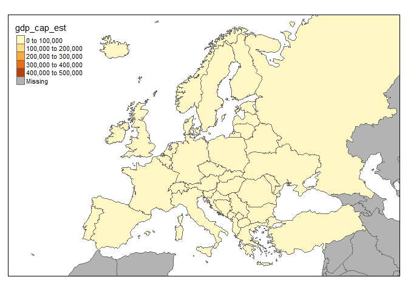
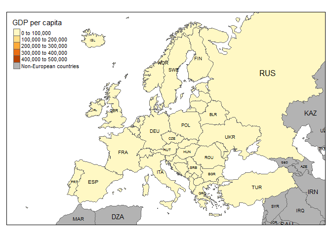
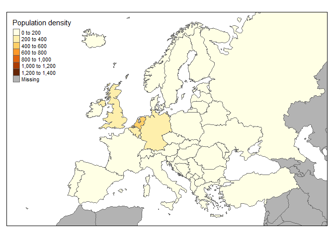

Das Paket [tmap](https://cran.r-project.org/web/packages/tmap/index.html)
-------------------------------------------------------------------------

-   Laden Sie das Paket
    [tmap](http://twitter.com/sharon000/status/593028906820599808/photo/1?ref_src=twsrc%5Etfw)
-   Die folgenden Beispiele sind auf der
    [Vignette](https://cran.r-project.org/web/packages/tmap/vignettes/tmap-nutshell.html)
    des Paketes basiert.

<!-- -->

    # install.packages("tmap")
    library(tmap)

Schnelle thematische Karte
--------------------------

-   [qtm](https://cran.r-project.org/web/packages/tmap/vignettes/tmap-nutshell.html) -
    Quick thematic map plot

<https://cran.r-project.org/web/packages/tmap/vignettes/tmap-nutshell.html>

    data(Europe)
    qtm(Europe)

<!-- -->

Der Europa-Datensatz
--------------------

<table>
<thead>
<tr class="header">
<th></th>
<th align="left">iso_a3</th>
<th align="left">name</th>
<th align="left">sovereignt</th>
<th align="left">continent</th>
</tr>
</thead>
<tbody>
<tr class="odd">
<td>5</td>
<td align="left">ALB</td>
<td align="left">Albania</td>
<td align="left">Albania</td>
<td align="left">Europe</td>
</tr>
<tr class="even">
<td>6</td>
<td align="left">ALA</td>
<td align="left">Aland</td>
<td align="left">Finland</td>
<td align="left">Europe</td>
</tr>
<tr class="odd">
<td>7</td>
<td align="left">AND</td>
<td align="left">Andorra</td>
<td align="left">Andorra</td>
<td align="left">Europe</td>
</tr>
<tr class="even">
<td>10</td>
<td align="left">ARM</td>
<td align="left">Armenia</td>
<td align="left">Armenia</td>
<td align="left">Asia</td>
</tr>
<tr class="odd">
<td>17</td>
<td align="left">AUT</td>
<td align="left">Austria</td>
<td align="left">Austria</td>
<td align="left">Europe</td>
</tr>
<tr class="even">
<td>18</td>
<td align="left">AZE</td>
<td align="left">Azerbaijan</td>
<td align="left">Azerbaijan</td>
<td align="left">Asia</td>
</tr>
<tr class="odd">
<td>20</td>
<td align="left">BEL</td>
<td align="left">Belgium</td>
<td align="left">Belgium</td>
<td align="left">Europe</td>
</tr>
<tr class="even">
<td>24</td>
<td align="left">BGR</td>
<td align="left">Bulgaria</td>
<td align="left">Bulgaria</td>
<td align="left">Europe</td>
</tr>
<tr class="odd">
<td>27</td>
<td align="left">BIH</td>
<td align="left">Bosnia and Herz.</td>
<td align="left">Bosnia and Herzegovina</td>
<td align="left">Europe</td>
</tr>
<tr class="even">
<td>29</td>
<td align="left">BLR</td>
<td align="left">Belarus</td>
<td align="left">Belarus</td>
<td align="left">Europe</td>
</tr>
<tr class="odd">
<td>40</td>
<td align="left">CHE</td>
<td align="left">Switzerland</td>
<td align="left">Switzerland</td>
<td align="left">Europe</td>
</tr>
<tr class="even">
<td>57</td>
<td align="left">CZE</td>
<td align="left">Czech Rep.</td>
<td align="left">Czech Republic</td>
<td align="left">Europe</td>
</tr>
<tr class="odd">
<td>58</td>
<td align="left">DEU</td>
<td align="left">Germany</td>
<td align="left">Germany</td>
<td align="left">Europe</td>
</tr>
<tr class="even">
<td>61</td>
<td align="left">DNK</td>
<td align="left">Denmark</td>
<td align="left">Denmark</td>
<td align="left">Europe</td>
</tr>
<tr class="odd">
<td>63</td>
<td align="left">DZA</td>
<td align="left">Algeria</td>
<td align="left">Algeria</td>
<td align="left">Africa</td>
</tr>
<tr class="even">
<td>65</td>
<td align="left">EGY</td>
<td align="left">Egypt</td>
<td align="left">Egypt</td>
<td align="left">Africa</td>
</tr>
<tr class="odd">
<td>67</td>
<td align="left">ESP</td>
<td align="left">Spain</td>
<td align="left">Spain</td>
<td align="left">Europe</td>
</tr>
<tr class="even">
<td>68</td>
<td align="left">EST</td>
<td align="left">Estonia</td>
<td align="left">Estonia</td>
<td align="left">Europe</td>
</tr>
<tr class="odd">
<td>70</td>
<td align="left">FIN</td>
<td align="left">Finland</td>
<td align="left">Finland</td>
<td align="left">Europe</td>
</tr>
<tr class="even">
<td>73</td>
<td align="left">FRA</td>
<td align="left">France</td>
<td align="left">France</td>
<td align="left">Europe</td>
</tr>
<tr class="odd">
<td>74</td>
<td align="left">FRO</td>
<td align="left">Faeroe Is.</td>
<td align="left">Denmark</td>
<td align="left">Europe</td>
</tr>
<tr class="even">
<td>77</td>
<td align="left">GBR</td>
<td align="left">United Kingdom</td>
<td align="left">United Kingdom</td>
<td align="left">Europe</td>
</tr>
<tr class="odd">
<td>78</td>
<td align="left">GEO</td>
<td align="left">Georgia</td>
<td align="left">Georgia</td>
<td align="left">Asia</td>
</tr>
<tr class="even">
<td>79</td>
<td align="left">GGY</td>
<td align="left">Guernsey</td>
<td align="left">United Kingdom</td>
<td align="left">Europe</td>
</tr>
<tr class="odd">
<td>85</td>
<td align="left">GRC</td>
<td align="left">Greece</td>
<td align="left">Greece</td>
<td align="left">Europe</td>
</tr>
<tr class="even">
<td>94</td>
<td align="left">HRV</td>
<td align="left">Croatia</td>
<td align="left">Croatia</td>
<td align="left">Europe</td>
</tr>
<tr class="odd">
<td>96</td>
<td align="left">HUN</td>
<td align="left">Hungary</td>
<td align="left">Hungary</td>
<td align="left">Europe</td>
</tr>
<tr class="even">
<td>98</td>
<td align="left">IMN</td>
<td align="left">Isle of Man</td>
<td align="left">United Kingdom</td>
<td align="left">Europe</td>
</tr>
<tr class="odd">
<td>102</td>
<td align="left">IRL</td>
<td align="left">Ireland</td>
<td align="left">Ireland</td>
<td align="left">Europe</td>
</tr>
<tr class="even">
<td>103</td>
<td align="left">IRN</td>
<td align="left">Iran</td>
<td align="left">Iran</td>
<td align="left">Asia</td>
</tr>
<tr class="odd">
<td>104</td>
<td align="left">IRQ</td>
<td align="left">Iraq</td>
<td align="left">Iraq</td>
<td align="left">Asia</td>
</tr>
<tr class="even">
<td>105</td>
<td align="left">ISL</td>
<td align="left">Iceland</td>
<td align="left">Iceland</td>
<td align="left">Europe</td>
</tr>
<tr class="odd">
<td>106</td>
<td align="left">ISR</td>
<td align="left">Israel</td>
<td align="left">Israel</td>
<td align="left">Asia</td>
</tr>
<tr class="even">
<td>107</td>
<td align="left">ITA</td>
<td align="left">Italy</td>
<td align="left">Italy</td>
<td align="left">Europe</td>
</tr>
<tr class="odd">
<td>109</td>
<td align="left">JEY</td>
<td align="left">Jersey</td>
<td align="left">United Kingdom</td>
<td align="left">Europe</td>
</tr>
<tr class="even">
<td>110</td>
<td align="left">JOR</td>
<td align="left">Jordan</td>
<td align="left">Jordan</td>
<td align="left">Asia</td>
</tr>
<tr class="odd">
<td>113</td>
<td align="left">KAZ</td>
<td align="left">Kazakhstan</td>
<td align="left">Kazakhstan</td>
<td align="left">Asia</td>
</tr>
<tr class="even">
<td>120</td>
<td align="left">NA</td>
<td align="left">Kosovo</td>
<td align="left">Kosovo</td>
<td align="left">Europe</td>
</tr>
<tr class="odd">
<td>121</td>
<td align="left">KWT</td>
<td align="left">Kuwait</td>
<td align="left">Kuwait</td>
<td align="left">Asia</td>
</tr>
<tr class="even">
<td>123</td>
<td align="left">LBN</td>
<td align="left">Lebanon</td>
<td align="left">Lebanon</td>
<td align="left">Asia</td>
</tr>
<tr class="odd">
<td>125</td>
<td align="left">LBY</td>
<td align="left">Libya</td>
<td align="left">Libya</td>
<td align="left">Africa</td>
</tr>
<tr class="even">
<td>127</td>
<td align="left">LIE</td>
<td align="left">Liechtenstein</td>
<td align="left">Liechtenstein</td>
<td align="left">Europe</td>
</tr>
<tr class="odd">
<td>130</td>
<td align="left">LTU</td>
<td align="left">Lithuania</td>
<td align="left">Lithuania</td>
<td align="left">Europe</td>
</tr>
<tr class="even">
<td>131</td>
<td align="left">LUX</td>
<td align="left">Luxembourg</td>
<td align="left">Luxembourg</td>
<td align="left">Europe</td>
</tr>
<tr class="odd">
<td>132</td>
<td align="left">LVA</td>
<td align="left">Latvia</td>
<td align="left">Latvia</td>
<td align="left">Europe</td>
</tr>
<tr class="even">
<td>135</td>
<td align="left">MAR</td>
<td align="left">Morocco</td>
<td align="left">Morocco</td>
<td align="left">Africa</td>
</tr>
<tr class="odd">
<td>136</td>
<td align="left">MCO</td>
<td align="left">Monaco</td>
<td align="left">Monaco</td>
<td align="left">Europe</td>
</tr>
<tr class="even">
<td>137</td>
<td align="left">MDA</td>
<td align="left">Moldova</td>
<td align="left">Moldova</td>
<td align="left">Europe</td>
</tr>
<tr class="odd">
<td>142</td>
<td align="left">MKD</td>
<td align="left">Macedonia</td>
<td align="left">Macedonia</td>
<td align="left">Europe</td>
</tr>
<tr class="even">
<td>144</td>
<td align="left">MLT</td>
<td align="left">Malta</td>
<td align="left">Malta</td>
<td align="left">Europe</td>
</tr>
<tr class="odd">
<td>146</td>
<td align="left">MNE</td>
<td align="left">Montenegro</td>
<td align="left">Montenegro</td>
<td align="left">Europe</td>
</tr>
<tr class="even">
<td>162</td>
<td align="left">NLD</td>
<td align="left">Netherlands</td>
<td align="left">Netherlands</td>
<td align="left">Europe</td>
</tr>
<tr class="odd">
<td>163</td>
<td align="left">NOR</td>
<td align="left">Norway</td>
<td align="left">Norway</td>
<td align="left">Europe</td>
</tr>
<tr class="even">
<td>175</td>
<td align="left">POL</td>
<td align="left">Poland</td>
<td align="left">Poland</td>
<td align="left">Europe</td>
</tr>
<tr class="odd">
<td>178</td>
<td align="left">PRT</td>
<td align="left">Portugal</td>
<td align="left">Portugal</td>
<td align="left">Europe</td>
</tr>
<tr class="even">
<td>180</td>
<td align="left">PSE</td>
<td align="left">Palestine</td>
<td align="left">Israel</td>
<td align="left">Asia</td>
</tr>
<tr class="odd">
<td>183</td>
<td align="left">ROU</td>
<td align="left">Romania</td>
<td align="left">Romania</td>
<td align="left">Europe</td>
</tr>
<tr class="even">
<td>184</td>
<td align="left">RUS</td>
<td align="left">Russia</td>
<td align="left">Russia</td>
<td align="left">Europe</td>
</tr>
<tr class="odd">
<td>187</td>
<td align="left">SAU</td>
<td align="left">Saudi Arabia</td>
<td align="left">Saudi Arabia</td>
<td align="left">Asia</td>
</tr>
<tr class="even">
<td>197</td>
<td align="left">SMR</td>
<td align="left">San Marino</td>
<td align="left">San Marino</td>
<td align="left">Europe</td>
</tr>
<tr class="odd">
<td>201</td>
<td align="left">SRB</td>
<td align="left">Serbia</td>
<td align="left">Republic of Serbia</td>
<td align="left">Europe</td>
</tr>
<tr class="even">
<td>204</td>
<td align="left">SVK</td>
<td align="left">Slovakia</td>
<td align="left">Slovakia</td>
<td align="left">Europe</td>
</tr>
<tr class="odd">
<td>205</td>
<td align="left">SVN</td>
<td align="left">Slovenia</td>
<td align="left">Slovenia</td>
<td align="left">Europe</td>
</tr>
<tr class="even">
<td>206</td>
<td align="left">SWE</td>
<td align="left">Sweden</td>
<td align="left">Sweden</td>
<td align="left">Europe</td>
</tr>
<tr class="odd">
<td>210</td>
<td align="left">SYR</td>
<td align="left">Syria</td>
<td align="left">Syria</td>
<td align="left">Asia</td>
</tr>
<tr class="even">
<td>216</td>
<td align="left">TKM</td>
<td align="left">Turkmenistan</td>
<td align="left">Turkmenistan</td>
<td align="left">Asia</td>
</tr>
<tr class="odd">
<td>221</td>
<td align="left">TUR</td>
<td align="left">Turkey</td>
<td align="left">Turkey</td>
<td align="left">Asia</td>
</tr>
<tr class="even">
<td>225</td>
<td align="left">UKR</td>
<td align="left">Ukraine</td>
<td align="left">Ukraine</td>
<td align="left">Europe</td>
</tr>
<tr class="odd">
<td>228</td>
<td align="left">UZB</td>
<td align="left">Uzbekistan</td>
<td align="left">Uzbekistan</td>
<td align="left">Asia</td>
</tr>
<tr class="even">
<td>229</td>
<td align="left">VAT</td>
<td align="left">Vatican</td>
<td align="left">Vatican</td>
<td align="left">Europe</td>
</tr>
</tbody>
</table>

Um mehr Farbe in die Karte zu bekommen
--------------------------------------

-   Visualisierung von [Natural Earth](http://www.naturalearthdata.com/)
    Daten

<http://www.naturalearthdata.com/>

    qtm(Europe, fill="gdp_cap_est")

<!-- -->

Eine Karte mit Text
-------------------

    qtm(Europe, fill="gdp_cap_est", text="iso_a3")

<!-- -->

Dieses Schema passt besser:
---------------------------

    qtm(Europe, fill="gdp_cap_est", text="iso_a3", 
        text.size="AREA", root=5, fill.title="GDP per capita", 
        fill.textNA="Non-European countries", theme="Europe")

<!-- -->

[Bevölkerungsdichte](https://en.wikipedia.org/wiki/Population_density)
----------------------------------------------------------------------

    qtm(Europe, fill="pop_est_dens", fill.title="Population density")

<!-- -->

Themen des Europa-Datensatzes
-----------------------------

-   [ISO
    Klassifikation](http://userpage.chemie.fu-berlin.de/diverse/doc/ISO_3166.html)
-   Ländername
-   Teil Europas
-   Fläche, Bevölkerung, Bevölkerungsdichte,
-   [Bruttoinlandsprodukt](https://en.wikipedia.org/wiki/Gross_domestic_product)
-   Bruttoinlandsprodukt [zu
    Kaufkraftparitäten](https://en.wikipedia.org/wiki/List_of_countries_by_GDP_%28PPP%29_per_capita)
-   Ökonomie, Einkommensgruppe

Namen und Themen
----------------

<table>
<thead>
<tr class="header">
<th></th>
<th align="left">iso_a3</th>
<th align="left">name</th>
<th align="left">sovereignt</th>
<th align="left">continent</th>
<th align="left">part</th>
<th align="right">area</th>
</tr>
</thead>
<tbody>
<tr class="odd">
<td>5</td>
<td align="left">ALB</td>
<td align="left">Albania</td>
<td align="left">Albania</td>
<td align="left">Europe</td>
<td align="left">Southern Europe</td>
<td align="right">27400.0000</td>
</tr>
<tr class="even">
<td>6</td>
<td align="left">ALA</td>
<td align="left">Aland</td>
<td align="left">Finland</td>
<td align="left">Europe</td>
<td align="left">Northern Europe</td>
<td align="right">674.3934</td>
</tr>
<tr class="odd">
<td>7</td>
<td align="left">AND</td>
<td align="left">Andorra</td>
<td align="left">Andorra</td>
<td align="left">Europe</td>
<td align="left">Southern Europe</td>
<td align="right">470.0000</td>
</tr>
<tr class="even">
<td>10</td>
<td align="left">ARM</td>
<td align="left">Armenia</td>
<td align="left">Armenia</td>
<td align="left">Asia</td>
<td align="left">NA</td>
<td align="right">28470.0000</td>
</tr>
<tr class="odd">
<td>17</td>
<td align="left">AUT</td>
<td align="left">Austria</td>
<td align="left">Austria</td>
<td align="left">Europe</td>
<td align="left">Western Europe</td>
<td align="right">82531.0000</td>
</tr>
<tr class="even">
<td>18</td>
<td align="left">AZE</td>
<td align="left">Azerbaijan</td>
<td align="left">Azerbaijan</td>
<td align="left">Asia</td>
<td align="left">NA</td>
<td align="right">82659.0000</td>
</tr>
<tr class="odd">
<td>20</td>
<td align="left">BEL</td>
<td align="left">Belgium</td>
<td align="left">Belgium</td>
<td align="left">Europe</td>
<td align="left">Western Europe</td>
<td align="right">30280.0000</td>
</tr>
<tr class="even">
<td>24</td>
<td align="left">BGR</td>
<td align="left">Bulgaria</td>
<td align="left">Bulgaria</td>
<td align="left">Europe</td>
<td align="left">Eastern Europe</td>
<td align="right">108560.0000</td>
</tr>
</tbody>
</table>

Die ISO Kodierung:
------------------

    ##   [1] "AALAND ISLANDS                                  AX      ALA     248"      
    ##   [2] "AFGHANISTAN                                     AF      AFG     004"      
    ##   [3] "ALBANIA                                         AL      ALB     008"      
    ##   [4] "ALGERIA                                         DZ      DZA     012"      
    ##   [5] "AMERICAN SAMOA                                  AS      ASM     016"      
    ##   [6] "ANDORRA                                         AD      AND     020"      
    ##   [7] "ANGOLA                                          AO      AGO     024"      
    ##   [8] "ANGUILLA                                        AI      AIA     660"      
    ##   [9] "ANTARCTICA                                      AQ      ATA     010"      
    ##  [10] "ANTIGUA AND BARBUDA                             AG      ATG     028"      
    ##  [11] "ARGENTINA                                       AR      ARG     032"      
    ##  [12] "ARMENIA                                         AM      ARM     051  "    
    ##  [13] "ARUBA                                           AW      ABW     533"      
    ##  [14] "AUSTRALIA                                       AU      AUS     036"      
    ##  [15] "AUSTRIA                                         AT      AUT     040"      
    ##  [16] "AZERBAIJAN                                      AZ      AZE     031  "    
    ##  [17] "BAHAMAS                                         BS      BHS     044"      
    ##  [18] "BAHRAIN                                         BH      BHR     048"      
    ##  [19] "BANGLADESH                                      BD      BGD     050"      
    ##  [20] "BARBADOS                                        BB      BRB     052"      
    ##  [21] "BELARUS                                         BY      BLR     112  "    
    ##  [22] "BELGIUM                                         BE      BEL     056"      
    ##  [23] "BELIZE                                          BZ      BLZ     084"      
    ##  [24] "BENIN                                           BJ      BEN     204"      
    ##  [25] "BERMUDA                                         BM      BMU     060"      
    ##  [26] "BHUTAN                                          BT      BTN     064"      
    ##  [27] "BOLIVIA                                         BO      BOL     068"      
    ##  [28] "BOSNIA AND HERZEGOWINA                          BA      BIH     070"      
    ##  [29] "BOTSWANA                                        BW      BWA     072"      
    ##  [30] "BOUVET ISLAND                                   BV      BVT     074"      
    ##  [31] "BRAZIL                                          BR      BRA     076"      
    ##  [32] "BRITISH INDIAN OCEAN TERRITORY                  IO      IOT     086"      
    ##  [33] "BRUNEI DARUSSALAM                               BN      BRN     096"      
    ##  [34] "BULGARIA                                        BG      BGR     100"      
    ##  [35] "BURKINA FASO                                    BF      BFA     854"      
    ##  [36] "BURUNDI                                         BI      BDI     108"      
    ##  [37] "CAMBODIA                                        KH      KHM     116"      
    ##  [38] "CAMEROON                                        CM      CMR     120"      
    ##  [39] "CANADA                                          CA      CAN     124"      
    ##  [40] "CAPE VERDE                                      CV      CPV     132"      
    ##  [41] "CAYMAN ISLANDS                                  KY      CYM     136"      
    ##  [42] "CENTRAL AFRICAN REPUBLIC                        CF      CAF     140"      
    ##  [43] "CHAD                                            TD      TCD     148"      
    ##  [44] "CHILE                                           CL      CHL     152"      
    ##  [45] "CHINA                                           CN      CHN     156"      
    ##  [46] "CHRISTMAS ISLAND                                CX      CXR     162"      
    ##  [47] "COCOS (KEELING) ISLANDS                         CC      CCK     166"      
    ##  [48] "COLOMBIA                                        CO      COL     170"      
    ##  [49] "COMOROS                                         KM      COM     174"      
    ##  [50] "CONGO, Democratic Republic of (was Zaire)       CD      COD     180"      
    ##  [51] "CONGO, Republic of                              CG      COG     178"      
    ##  [52] "COOK ISLANDS                                    CK      COK     184"      
    ##  [53] "COSTA RICA                                      CR      CRI     188"      
    ##  [54] "COTE D'IVOIRE                                   CI      CIV     384"      
    ##  [55] "CROATIA (local name: Hrvatska)                  HR      HRV     191      "
    ##  [56] "CUBA                                            CU      CUB     192"      
    ##  [57] "CYPRUS                                          CY      CYP     196"      
    ##  [58] "CZECH REPUBLIC                                  CZ      CZE     203  "    
    ##  [59] "DENMARK                                         DK      DNK     208"      
    ##  [60] "DJIBOUTI                                        DJ      DJI     262"      
    ##  [61] "DOMINICA                                        DM      DMA     212"      
    ##  [62] "DOMINICAN REPUBLIC                              DO      DOM     214"      
    ##  [63] "ECUADOR                                         EC      ECU     218"      
    ##  [64] "EGYPT                                           EG      EGY     818"      
    ##  [65] "EL SALVADOR                                     SV      SLV     222"      
    ##  [66] "EQUATORIAL GUINEA                               GQ      GNQ     226"      
    ##  [67] "ERITREA                                         ER      ERI     232"      
    ##  [68] "ESTONIA                                         EE      EST     233  "    
    ##  [69] "ETHIOPIA                                        ET      ETH     231"      
    ##  [70] "FALKLAND ISLANDS (MALVINAS)                     FK      FLK     238"      
    ##  [71] "FAROE ISLANDS                                   FO      FRO     234"      
    ##  [72] "FIJI                                            FJ      FJI     242"      
    ##  [73] "FINLAND                                         FI      FIN     246"      
    ##  [74] "FRANCE                                          FR      FRA     250"      
    ##  [75] "FRENCH GUIANA                                   GF      GUF     254"      
    ##  [76] "FRENCH POLYNESIA                                PF      PYF     258"      
    ##  [77] "FRENCH SOUTHERN TERRITORIES                     TF      ATF     260"      
    ##  [78] "GABON                                           GA      GAB     266"      
    ##  [79] "GAMBIA                                          GM      GMB     270"      
    ##  [80] "GEORGIA                                         GE      GEO     268  "    
    ##  [81] "GERMANY                                         DE      DEU     276"      
    ##  [82] "GHANA                                           GH      GHA     288"      
    ##  [83] "GIBRALTAR                                       GI      GIB     292"      
    ##  [84] "GREECE                                          GR      GRC     300"      
    ##  [85] "GREENLAND                                       GL      GRL     304"      
    ##  [86] "GRENADA                                         GD      GRD     308"      
    ##  [87] "GUADELOUPE                                      GP      GLP     312"      
    ##  [88] "GUAM                                            GU      GUM     316"      
    ##  [89] "GUATEMALA                                       GT      GTM     320"      
    ##  [90] "GUINEA                                          GN      GIN     324"      
    ##  [91] "GUINEA-BISSAU                                   GW      GNB     624"      
    ##  [92] "GUYANA                                          GY      GUY     328"      
    ##  [93] "HAITI                                           HT      HTI     332"      
    ##  [94] "HEARD AND MC DONALD ISLANDS                     HM      HMD     334"      
    ##  [95] "HONDURAS                                        HN      HND     340"      
    ##  [96] "HONG KONG                                       HK      HKG     344"      
    ##  [97] "HUNGARY                                         HU      HUN     348"      
    ##  [98] "ICELAND                                         IS      ISL     352"      
    ##  [99] "INDIA                                           IN      IND     356"      
    ## [100] "INDONESIA                                       ID      IDN     360"      
    ## [101] "IRAN (ISLAMIC REPUBLIC OF)                      IR      IRN     364"      
    ## [102] "IRAQ                                            IQ      IRQ     368"      
    ## [103] "IRELAND                                         IE      IRL     372"      
    ## [104] "ISRAEL                                          IL      ISR     376"      
    ## [105] "ITALY                                           IT      ITA     380"      
    ## [106] "JAMAICA                                         JM      JAM     388"      
    ## [107] "JAPAN                                           JP      JPN     392"      
    ## [108] "JORDAN                                          JO      JOR     400"      
    ## [109] "KAZAKHSTAN                                      KZ      KAZ     398  "    
    ## [110] "KENYA                                           KE      KEN     404"      
    ## [111] "KIRIBATI                                        KI      KIR     296"      
    ## [112] "KOREA, DEMOCRATIC PEOPLE'S REPUBLIC OF          KP      PRK     408"      
    ## [113] "KOREA, REPUBLIC OF                              KR      KOR     410"      
    ## [114] "KUWAIT                                          KW      KWT     414"      
    ## [115] "KYRGYZSTAN                                      KG      KGZ     417  "    
    ## [116] "LAO PEOPLE'S DEMOCRATIC REPUBLIC                LA      LAO     418"      
    ## [117] "LATVIA                                          LV      LVA     428  "    
    ## [118] "LEBANON                                         LB      LBN     422"      
    ## [119] "LESOTHO                                         LS      LSO     426"      
    ## [120] "LIBERIA                                         LR      LBR     430"      
    ## [121] "LIBYAN ARAB JAMAHIRIYA                          LY      LBY     434"      
    ## [122] "LIECHTENSTEIN                                   LI      LIE     438"      
    ## [123] "LITHUANIA                                       LT      LTU     440  "    
    ## [124] "LUXEMBOURG                                      LU      LUX     442"      
    ## [125] "MACAU                                           MO      MAC     446"      
    ## [126] "MACEDONIA, THE FORMER YUGOSLAV REPUBLIC OF      MK      MKD     807 "     
    ## [127] "MADAGASCAR                                      MG      MDG     450"      
    ## [128] "MALAWI                                          MW      MWI     454"      
    ## [129] "MALAYSIA                                        MY      MYS     458"      
    ## [130] "MALDIVES                                        MV      MDV     462"      
    ## [131] "MALI                                            ML      MLI     466"      
    ## [132] "MALTA                                           MT      MLT     470"      
    ## [133] "MARSHALL ISLANDS                                MH      MHL     584"      
    ## [134] "MARTINIQUE                                      MQ      MTQ     474"      
    ## [135] "MAURITANIA                                      MR      MRT     478"      
    ## [136] "MAURITIUS                                       MU      MUS     480"      
    ## [137] "MAYOTTE                                         YT      MYT     175  "    
    ## [138] "MEXICO                                          MX      MEX     484"      
    ## [139] "MICRONESIA, FEDERATED STATES OF                 FM      FSM     583"      
    ## [140] "MOLDOVA, REPUBLIC OF                            MD      MDA     498  "    
    ## [141] "MONACO                                          MC      MCO     492"      
    ## [142] "MONGOLIA                                        MN      MNG     496"      
    ## [143] "MONTSERRAT                                      MS      MSR     500"      
    ## [144] "MOROCCO                                         MA      MAR     504"      
    ## [145] "MOZAMBIQUE                                      MZ      MOZ     508"      
    ## [146] "MYANMAR                                         MM      MMR     104"      
    ## [147] "NAMIBIA                                         NA      NAM     516"      
    ## [148] "NAURU                                           NR      NRU     520"      
    ## [149] "NEPAL                                           NP      NPL     524"      
    ## [150] "NETHERLANDS                                     NL      NLD     528"      
    ## [151] "NETHERLANDS ANTILLES                            AN      ANT     530"      
    ## [152] "NEW CALEDONIA                                   NC      NCL     540"      
    ## [153] "NEW ZEALAND                                     NZ      NZL     554"      
    ## [154] "NICARAGUA                                       NI      NIC     558"      
    ## [155] "NIGER                                           NE      NER     562"      
    ## [156] "NIGERIA                                         NG      NGA     566"      
    ## [157] "NIUE                                            NU      NIU     570"      
    ## [158] "NORFOLK ISLAND                                  NF      NFK     574"      
    ## [159] "NORTHERN MARIANA ISLANDS                        MP      MNP     580"      
    ## [160] "NORWAY                                          NO      NOR     578"      
    ## [161] "OMAN                                            OM      OMN     512"      
    ## [162] "PAKISTAN                                        PK      PAK     586"      
    ## [163] "PALAU                                           PW      PLW     585"      
    ## [164] "PALESTINIAN TERRITORY, Occupied                 PS      PSE     275"      
    ## [165] "PANAMA                                          PA      PAN     591"      
    ## [166] "PAPUA NEW GUINEA                                PG      PNG     598"      
    ## [167] "PARAGUAY                                        PY      PRY     600"      
    ## [168] "PERU                                            PE      PER     604"      
    ## [169] "PHILIPPINES                                     PH      PHL     608"      
    ## [170] "PITCAIRN                                        PN      PCN     612"      
    ## [171] "POLAND                                          PL      POL     616"      
    ## [172] "PORTUGAL                                        PT      PRT     620"      
    ## [173] "PUERTO RICO                                     PR      PRI     630"      
    ## [174] "QATAR                                           QA      QAT     634"      
    ## [175] "REUNION                                         RE      REU     638"      
    ## [176] "ROMANIA                                         RO      ROU     642"      
    ## [177] "RUSSIAN FEDERATION                              RU      RUS     643"      
    ## [178] "RWANDA                                          RW      RWA     646"      
    ## [179] "SAINT HELENA                                    SH      SHN     654"      
    ## [180] "SAINT KITTS AND NEVIS                           KN      KNA     659"      
    ## [181] "SAINT LUCIA                                     LC      LCA     662"      
    ## [182] "SAINT PIERRE AND MIQUELON                       PM      SPM     666"      
    ## [183] "SAINT VINCENT AND THE GRENADINES                VC      VCT     670"      
    ## [184] "SAMOA                                           WS      WSM     882"      
    ## [185] "SAN MARINO                                      SM      SMR     674"      
    ## [186] "SAO TOME AND PRINCIPE                           ST      STP     678"      
    ## [187] "SAUDI ARABIA                                    SA      SAU     682"      
    ## [188] "SENEGAL                                         SN      SEN     686"      
    ## [189] "SERBIA AND MONTENEGRO                           CS      SCG     891"      
    ## [190] "SEYCHELLES                                      SC      SYC     690"      
    ## [191] "SIERRA LEONE                                    SL      SLE     694"      
    ## [192] "SINGAPORE                                       SG      SGP     702"      
    ## [193] "SLOVAKIA                                        SK      SVK     703  "    
    ## [194] "SLOVENIA                                        SI      SVN     705  "    
    ## [195] "SOLOMON ISLANDS                                 SB      SLB     090"      
    ## [196] "SOMALIA                                         SO      SOM     706"      
    ## [197] "SOUTH AFRICA                                    ZA      ZAF     710"      
    ## [198] "SOUTH GEORGIA AND THE SOUTH SANDWICH ISLANDS    GS      SGS     239"      
    ## [199] "SPAIN                                           ES      ESP     724"      
    ## [200] "SRI LANKA                                       LK      LKA     144"      
    ## [201] "SUDAN                                           SD      SDN     736"      
    ## [202] "SURINAME                                        SR      SUR     740"      
    ## [203] "SVALBARD AND JAN MAYEN ISLANDS                  SJ      SJM     744"      
    ## [204] "SWAZILAND                                       SZ      SWZ     748"      
    ## [205] "SWEDEN                                          SE      SWE     752"      
    ## [206] "SWITZERLAND                                     CH      CHE     756"      
    ## [207] "SYRIAN ARAB REPUBLIC                            SY      SYR     760"      
    ## [208] "TAIWAN                                          TW      TWN     158"      
    ## [209] "TAJIKISTAN                                      TJ      TJK     762  "    
    ## [210] "TANZANIA, UNITED REPUBLIC OF                    TZ      TZA     834"      
    ## [211] "THAILAND                                        TH      THA     764"      
    ## [212] "TIMOR-LESTE                                     TL      TLS     626"      
    ## [213] "TOGO                                            TG      TGO     768"      
    ## [214] "TOKELAU                                         TK      TKL     772"      
    ## [215] "TONGA                                           TO      TON     776"      
    ## [216] "TRINIDAD AND TOBAGO                             TT      TTO     780"      
    ## [217] "TUNISIA                                         TN      TUN     788"      
    ## [218] "TURKEY                                          TR      TUR     792"      
    ## [219] "TURKMENISTAN                                    TM      TKM     795  "    
    ## [220] "TURKS AND CAICOS ISLANDS                        TC      TCA     796"      
    ## [221] "TUVALU                                          TV      TUV     798"      
    ## [222] "UGANDA                                          UG      UGA     800"      
    ## [223] "UKRAINE                                         UA      UKR     804"      
    ## [224] "UNITED ARAB EMIRATES                            AE      ARE     784"      
    ## [225] "UNITED KINGDOM                                  GB      GBR     826"      
    ## [226] "UNITED STATES                                   US      USA     840"      
    ## [227] "UNITED STATES MINOR OUTLYING ISLANDS            UM      UMI     581"      
    ## [228] "URUGUAY                                         UY      URY     858"      
    ## [229] "UZBEKISTAN                                      UZ      UZB     860  "    
    ## [230] "VANUATU                                         VU      VUT     548"      
    ## [231] "VATICAN CITY STATE (HOLY SEE)                   VA      VAT     336"      
    ## [232] "VENEZUELA                                       VE      VEN     862"      
    ## [233] "VIET NAM                                        VN      VNM     704"      
    ## [234] "VIRGIN ISLANDS (BRITISH)                        VG      VGB     092"      
    ## [235] "VIRGIN ISLANDS (U.S.)                           VI      VIR     850"      
    ## [236] "WALLIS AND FUTUNA ISLANDS                       WF      WLF     876"      
    ## [237] "WESTERN SAHARA                                  EH      ESH     732"      
    ## [238] "YEMEN                                           YE      YEM     887"      
    ## [239] "ZAMBIA                                          ZM      ZMB     894"      
    ## [240] "ZIMBABWE                                        ZW      ZWE     716"

Teil Europas?
-------------

    qtm(Europe, fill="continent")

<!-- -->

Teil Europas?
-------------

    qtm(Europe, fill="part",fill.title="part of Europe")

<!-- -->

Fläche
------

    qtm(Europe, fill="area") # Russia is huge

<!-- -->

Bevölkerung
-----------

    qtm(Europe, fill="pop_est",fill.title="Population") 

<!-- -->

Bevölkerungsdichte
------------------

    qtm(Europe, fill="pop_est_dens",
        fill.title="Population density") 

<!-- -->

Ökonomie
--------

    qtm(Europe, fill="economy") 

<!-- -->

Einkommensgruppe
----------------

    qtm(Europe, fill="income_grp",fill.title="Income group") 

<!-- -->

Der Welt-Datensatz im Paket `tmap`
----------------------------------

<table>
<thead>
<tr class="header">
<th></th>
<th align="left">iso_a3</th>
<th align="left">name</th>
<th align="left">sovereignt</th>
<th align="left">continent</th>
<th align="left">subregion</th>
<th align="right">area</th>
<th align="right">pop_est</th>
<th align="right">pop_est_dens</th>
<th align="right">gdp_md_est</th>
<th align="right">gdp_cap_est</th>
<th align="left">economy</th>
<th align="left">income_grp</th>
<th align="right">life_exp</th>
<th align="right">well_being</th>
<th align="right">HPI</th>
</tr>
</thead>
<tbody>
<tr class="odd">
<td>2</td>
<td align="left">AFG</td>
<td align="left">Afghanistan</td>
<td align="left">Afghanistan</td>
<td align="left">Asia</td>
<td align="left">Southern Asia</td>
<td align="right">652860.000</td>
<td align="right">28400000</td>
<td align="right">43.5009037</td>
<td align="right">22270</td>
<td align="right">784.1549</td>
<td align="left">7. Least developed region</td>
<td align="left">5. Low income</td>
<td align="right">48.7</td>
<td align="right">4.758381</td>
<td align="right">36.75366</td>
</tr>
<tr class="even">
<td>3</td>
<td align="left">AGO</td>
<td align="left">Angola</td>
<td align="left">Angola</td>
<td align="left">Africa</td>
<td align="left">Middle Africa</td>
<td align="right">1246700.000</td>
<td align="right">12799293</td>
<td align="right">10.2665381</td>
<td align="right">110300</td>
<td align="right">8617.6635</td>
<td align="left">7. Least developed region</td>
<td align="left">3. Upper middle income</td>
<td align="right">51.1</td>
<td align="right">4.206092</td>
<td align="right">33.20143</td>
</tr>
<tr class="odd">
<td>5</td>
<td align="left">ALB</td>
<td align="left">Albania</td>
<td align="left">Albania</td>
<td align="left">Europe</td>
<td align="left">Southern Europe</td>
<td align="right">27400.000</td>
<td align="right">3639453</td>
<td align="right">132.8267518</td>
<td align="right">21810</td>
<td align="right">5992.6588</td>
<td align="left">6. Developing region</td>
<td align="left">4. Lower middle income</td>
<td align="right">76.9</td>
<td align="right">5.268937</td>
<td align="right">54.05118</td>
</tr>
<tr class="even">
<td>8</td>
<td align="left">ARE</td>
<td align="left">United Arab Emirates</td>
<td align="left">United Arab Emirates</td>
<td align="left">Asia</td>
<td align="left">Western Asia</td>
<td align="right">83600.000</td>
<td align="right">4798491</td>
<td align="right">57.3982177</td>
<td align="right">184300</td>
<td align="right">38407.9078</td>
<td align="left">6. Developing region</td>
<td align="left">2. High income: nonOECD</td>
<td align="right">76.5</td>
<td align="right">7.196803</td>
<td align="right">31.77827</td>
</tr>
<tr class="odd">
<td>9</td>
<td align="left">ARG</td>
<td align="left">Argentina</td>
<td align="left">Argentina</td>
<td align="left">South America</td>
<td align="left">South America</td>
<td align="right">2736690.000</td>
<td align="right">40913584</td>
<td align="right">14.9500250</td>
<td align="right">573900</td>
<td align="right">14027.1261</td>
<td align="left">5. Emerging region: G20</td>
<td align="left">3. Upper middle income</td>
<td align="right">75.9</td>
<td align="right">6.441067</td>
<td align="right">54.05504</td>
</tr>
<tr class="even">
<td>10</td>
<td align="left">ARM</td>
<td align="left">Armenia</td>
<td align="left">Armenia</td>
<td align="left">Asia</td>
<td align="left">Western Asia</td>
<td align="right">28470.000</td>
<td align="right">2967004</td>
<td align="right">104.2151036</td>
<td align="right">18770</td>
<td align="right">6326.2469</td>
<td align="left">6. Developing region</td>
<td align="left">4. Lower middle income</td>
<td align="right">74.2</td>
<td align="right">4.367811</td>
<td align="right">46.00319</td>
</tr>
<tr class="odd">
<td>12</td>
<td align="left">ATA</td>
<td align="left">Antarctica</td>
<td align="left">Antarctica</td>
<td align="left">Antarctica</td>
<td align="left">Antarctica</td>
<td align="right">10866664.407</td>
<td align="right">3802</td>
<td align="right">0.0003499</td>
<td align="right">NA</td>
<td align="right">NA</td>
<td align="left">6. Developing region</td>
<td align="left">2. High income: nonOECD</td>
<td align="right">NA</td>
<td align="right">NA</td>
<td align="right">NA</td>
</tr>
<tr class="even">
<td>14</td>
<td align="left">ATF</td>
<td align="left">Fr. S. Antarctic Lands</td>
<td align="left">France</td>
<td align="left">Seven seas (open ocean)</td>
<td align="left">Seven seas (open ocean)</td>
<td align="right">6187.205</td>
<td align="right">140</td>
<td align="right">0.0226273</td>
<td align="right">16</td>
<td align="right">114285.7143</td>
<td align="left">6. Developing region</td>
<td align="left">2. High income: nonOECD</td>
<td align="right">NA</td>
<td align="right">NA</td>
<td align="right">NA</td>
</tr>
<tr class="odd">
<td>16</td>
<td align="left">AUS</td>
<td align="left">Australia</td>
<td align="left">Australia</td>
<td align="left">Oceania</td>
<td align="left">Australia and New Zealand</td>
<td align="right">7682300.000</td>
<td align="right">21262641</td>
<td align="right">2.7677442</td>
<td align="right">800200</td>
<td align="right">37634.0832</td>
<td align="left">2. Developed region: nonG7</td>
<td align="left">1. High income: OECD</td>
<td align="right">81.9</td>
<td align="right">7.405616</td>
<td align="right">41.97981</td>
</tr>
<tr class="even">
<td>17</td>
<td align="left">AUT</td>
<td align="left">Austria</td>
<td align="left">Austria</td>
<td align="left">Europe</td>
<td align="left">Western Europe</td>
<td align="right">82409.000</td>
<td align="right">8210281</td>
<td align="right">99.6284508</td>
<td align="right">329500</td>
<td align="right">40132.6093</td>
<td align="left">2. Developed region: nonG7</td>
<td align="left">1. High income: OECD</td>
<td align="right">80.9</td>
<td align="right">7.346036</td>
<td align="right">47.08514</td>
</tr>
<tr class="odd">
<td>18</td>
<td align="left">AZE</td>
<td align="left">Azerbaijan</td>
<td align="left">Azerbaijan</td>
<td align="left">Asia</td>
<td align="left">Western Asia</td>
<td align="right">82658.000</td>
<td align="right">8238672</td>
<td align="right">99.6718043</td>
<td align="right">77610</td>
<td align="right">9420.2075</td>
<td align="left">6. Developing region</td>
<td align="left">3. Upper middle income</td>
<td align="right">70.7</td>
<td align="right">4.218611</td>
<td align="right">40.88457</td>
</tr>
<tr class="even">
<td>19</td>
<td align="left">BDI</td>
<td align="left">Burundi</td>
<td align="left">Burundi</td>
<td align="left">Africa</td>
<td align="left">Eastern Africa</td>
<td align="right">25680.000</td>
<td align="right">8988091</td>
<td align="right">350.0035436</td>
<td align="right">3102</td>
<td align="right">345.1233</td>
<td align="left">7. Least developed region</td>
<td align="left">5. Low income</td>
<td align="right">50.4</td>
<td align="right">3.791681</td>
<td align="right">30.51501</td>
</tr>
<tr class="odd">
<td>20</td>
<td align="left">BEL</td>
<td align="left">Belgium</td>
<td align="left">Belgium</td>
<td align="left">Europe</td>
<td align="left">Western Europe</td>
<td align="right">30280.000</td>
<td align="right">10414336</td>
<td align="right">343.9344782</td>
<td align="right">389300</td>
<td align="right">37381.1638</td>
<td align="left">2. Developed region: nonG7</td>
<td align="left">1. High income: OECD</td>
<td align="right">80.0</td>
<td align="right">6.853514</td>
<td align="right">37.09053</td>
</tr>
<tr class="even">
<td>21</td>
<td align="left">BEN</td>
<td align="left">Benin</td>
<td align="left">Benin</td>
<td align="left">Africa</td>
<td align="left">Western Africa</td>
<td align="right">112760.000</td>
<td align="right">8791832</td>
<td align="right">77.9694218</td>
<td align="right">12830</td>
<td align="right">1459.3090</td>
<td align="left">7. Least developed region</td>
<td align="left">5. Low income</td>
<td align="right">56.1</td>
<td align="right">3.667140</td>
<td align="right">31.08321</td>
</tr>
<tr class="odd">
<td>22</td>
<td align="left">BFA</td>
<td align="left">Burkina Faso</td>
<td align="left">Burkina Faso</td>
<td align="left">Africa</td>
<td align="left">Western Africa</td>
<td align="right">273600.000</td>
<td align="right">15746232</td>
<td align="right">57.5520175</td>
<td align="right">17820</td>
<td align="right">1131.6993</td>
<td align="left">7. Least developed region</td>
<td align="left">5. Low income</td>
<td align="right">55.4</td>
<td align="right">4.035560</td>
<td align="right">31.79385</td>
</tr>
</tbody>
</table>

Welt - Länder nach Einkommensgruppe
-----------------------------------

    qtm(World, fill="income_grp",fill.title="Income group") 

<!-- -->

Ein Datensatz zu den Provinzen in den Niederlanden (R-Paket `tmap`)
-------------------------------------------------------------------

<table>
<thead>
<tr class="header">
<th></th>
<th align="left">code</th>
<th align="left">name</th>
<th align="right">population</th>
<th align="right">pop_men</th>
<th align="right">pop_women</th>
</tr>
</thead>
<tbody>
<tr class="odd">
<td>0</td>
<td align="left">20</td>
<td align="left">Groningen</td>
<td align="right">582705</td>
<td align="right">289795</td>
<td align="right">292875</td>
</tr>
<tr class="even">
<td>1</td>
<td align="left">21</td>
<td align="left">Friesland</td>
<td align="right">646290</td>
<td align="right">323215</td>
<td align="right">323055</td>
</tr>
<tr class="odd">
<td>2</td>
<td align="left">22</td>
<td align="left">Drenthe</td>
<td align="right">488970</td>
<td align="right">242225</td>
<td align="right">246755</td>
</tr>
<tr class="even">
<td>3</td>
<td align="left">23</td>
<td align="left">Overijssel</td>
<td align="right">1139680</td>
<td align="right">570185</td>
<td align="right">569465</td>
</tr>
<tr class="odd">
<td>4</td>
<td align="left">24</td>
<td align="left">Flevoland</td>
<td align="right">399885</td>
<td align="right">199940</td>
<td align="right">199940</td>
</tr>
<tr class="even">
<td>5</td>
<td align="left">25</td>
<td align="left">Gelderland</td>
<td align="right">2019635</td>
<td align="right">997805</td>
<td align="right">1021790</td>
</tr>
</tbody>
</table>

Niederlande - Bevölkerung in den Provinzen
------------------------------------------

    qtm(NLD_prov, fill="population",fill.title="population") 

<!-- -->

Anteile berechnen
-----------------

    pop <- NLD_prov@data$population
    pop

    ##  [1]  582705  646290  488970 1139680  399885 2019635 1253645 2741320
    ##  [9] 3576960  380610 2479220 1119980

    popmen <- NLD_prov@data$pop_men
    popmen

    ##  [1]  289795  323215  242225  570185  199940  997805  613645 1349610
    ##  [9] 1764855  188655 1238600  555450

    prop <- popmen/pop
    prop

    ##  [1] 0.4973271 0.5001083 0.4953780 0.5003027 0.4999937 0.4940521 0.4894887
    ##  [8] 0.4923212 0.4933952 0.4956649 0.4995926 0.4959464

Exkurs: Barplot vom Männeranteil
--------------------------------

    barplot(prop)

<!-- -->

Barplot mit Farbe

    barplot(prop,col="blue")

<!-- -->

Niederlnade - Anteil Männer
---------------------------

Information in Datensatz einspeisen

    NLD_prov@data$proportion <- prop

    qtm(NLD_prov, fill="proportion",fill.title="proportion") 

<!-- -->

Niederlande - Anteil der Personen 65 plus
-----------------------------------------

(kleiner Trick notwendig - Die Daten hatten sich verändert)

    ant <- runif(length(NLD_prov),.18,.28)
    NLD_prov@data$pop_65plus <- round(NLD_prov@data$population*ant)
    pop65plus <- NLD_prov@data$pop_65plus
    prop65plus <- pop65plus/pop
    NLD_prov@data$proportion65plus <- prop65plus

Den Anteil der über 65-jährigen visualisieren
---------------------------------------------

    qtm(NLD_prov, fill="proportion",fill.title="proportion") 

<!-- -->

Ein Datensatz zu den Gemeinden in den Niederlanden (R-Paket `tmap`)
-------------------------------------------------------------------

    data(NLD_muni)

<table>
<thead>
<tr class="header">
<th></th>
<th align="left">name</th>
<th align="left">province</th>
<th align="right">population</th>
</tr>
</thead>
<tbody>
<tr class="odd">
<td>0</td>
<td align="left">Appingedam</td>
<td align="left">Groningen</td>
<td align="right">12065</td>
</tr>
<tr class="even">
<td>1</td>
<td align="left">Bedum</td>
<td align="left">Groningen</td>
<td align="right">10495</td>
</tr>
<tr class="odd">
<td>2</td>
<td align="left">Bellingwedde</td>
<td align="left">Groningen</td>
<td align="right">8920</td>
</tr>
<tr class="even">
<td>3</td>
<td align="left">Ten Boer</td>
<td align="left">Groningen</td>
<td align="right">7480</td>
</tr>
<tr class="odd">
<td>4</td>
<td align="left">Delfzijl</td>
<td align="left">Groningen</td>
<td align="right">25695</td>
</tr>
<tr class="even">
<td>5</td>
<td align="left">Groningen</td>
<td align="left">Groningen</td>
<td align="right">198315</td>
</tr>
<tr class="odd">
<td>6</td>
<td align="left">Grootegast</td>
<td align="left">Groningen</td>
<td align="right">12165</td>
</tr>
<tr class="even">
<td>7</td>
<td align="left">Haren</td>
<td align="left">Groningen</td>
<td align="right">18780</td>
</tr>
<tr class="odd">
<td>8</td>
<td align="left">Hoogezand-Sappemeer</td>
<td align="left">Groningen</td>
<td align="right">34305</td>
</tr>
<tr class="even">
<td>9</td>
<td align="left">Leek</td>
<td align="left">Groningen</td>
<td align="right">19595</td>
</tr>
<tr class="odd">
<td>10</td>
<td align="left">Loppersum</td>
<td align="left">Groningen</td>
<td align="right">10195</td>
</tr>
<tr class="even">
<td>11</td>
<td align="left">Marum</td>
<td align="left">Groningen</td>
<td align="right">10375</td>
</tr>
<tr class="odd">
<td>12</td>
<td align="left">Almere</td>
<td align="left">Flevoland</td>
<td align="right">196010</td>
</tr>
<tr class="even">
<td>13</td>
<td align="left">Stadskanaal</td>
<td align="left">Groningen</td>
<td align="right">32800</td>
</tr>
<tr class="odd">
<td>14</td>
<td align="left">Slochteren</td>
<td align="left">Groningen</td>
<td align="right">15545</td>
</tr>
<tr class="even">
<td>15</td>
<td align="left">Veendam</td>
<td align="left">Groningen</td>
<td align="right">27790</td>
</tr>
<tr class="odd">
<td>16</td>
<td align="left">Vlagtwedde</td>
<td align="left">Groningen</td>
<td align="right">15905</td>
</tr>
<tr class="even">
<td>17</td>
<td align="left">Zeewolde</td>
<td align="left">Flevoland</td>
<td align="right">21500</td>
</tr>
<tr class="odd">
<td>18</td>
<td align="left">Winsum</td>
<td align="left">Groningen</td>
<td align="right">13850</td>
</tr>
<tr class="even">
<td>19</td>
<td align="left">Zuidhorn</td>
<td align="left">Groningen</td>
<td align="right">18775</td>
</tr>
<tr class="odd">
<td>20</td>
<td align="left">Dongeradeel</td>
<td align="left">Friesland</td>
<td align="right">24160</td>
</tr>
<tr class="even">
<td>21</td>
<td align="left">Achtkarspelen</td>
<td align="left">Friesland</td>
<td align="right">28015</td>
</tr>
<tr class="odd">
<td>22</td>
<td align="left">Ameland</td>
<td align="left">Friesland</td>
<td align="right">3575</td>
</tr>
<tr class="even">
<td>23</td>
<td align="left">het Bildt</td>
<td align="left">Friesland</td>
<td align="right">10625</td>
</tr>
<tr class="odd">
<td>24</td>
<td align="left">Franekeradeel</td>
<td align="left">Friesland</td>
<td align="right">20445</td>
</tr>
<tr class="even">
<td>25</td>
<td align="left">Harlingen</td>
<td align="left">Friesland</td>
<td align="right">15820</td>
</tr>
<tr class="odd">
<td>26</td>
<td align="left">Heerenveen</td>
<td align="left">Friesland</td>
<td align="right">49900</td>
</tr>
<tr class="even">
<td>27</td>
<td align="left">Kollumerland en Nieuwkruisland</td>
<td align="left">Friesland</td>
<td align="right">12875</td>
</tr>
<tr class="odd">
<td>28</td>
<td align="left">Leeuwarden</td>
<td align="left">Friesland</td>
<td align="right">107340</td>
</tr>
<tr class="even">
<td>29</td>
<td align="left">Leeuwarderadeel</td>
<td align="left">Friesland</td>
<td align="right">10275</td>
</tr>
<tr class="odd">
<td>30</td>
<td align="left">Ooststellingwerf</td>
<td align="left">Friesland</td>
<td align="right">25670</td>
</tr>
<tr class="even">
<td>31</td>
<td align="left">Opsterland</td>
<td align="left">Friesland</td>
<td align="right">29860</td>
</tr>
<tr class="odd">
<td>32</td>
<td align="left">Schiermonnikoog</td>
<td align="left">Friesland</td>
<td align="right">940</td>
</tr>
<tr class="even">
<td>33</td>
<td align="left">Smallingerland</td>
<td align="left">Friesland</td>
<td align="right">55465</td>
</tr>
<tr class="odd">
<td>34</td>
<td align="left">Terschelling</td>
<td align="left">Friesland</td>
<td align="right">4780</td>
</tr>
<tr class="even">
<td>35</td>
<td align="left">Vlieland</td>
<td align="left">Friesland</td>
<td align="right">1110</td>
</tr>
<tr class="odd">
<td>36</td>
<td align="left">Weststellingwerf</td>
<td align="left">Friesland</td>
<td align="right">25455</td>
</tr>
<tr class="even">
<td>37</td>
<td align="left">Assen</td>
<td align="left">Drenthe</td>
<td align="right">67190</td>
</tr>
<tr class="odd">
<td>38</td>
<td align="left">Coevorden</td>
<td align="left">Drenthe</td>
<td align="right">35770</td>
</tr>
<tr class="even">
<td>39</td>
<td align="left">Emmen</td>
<td align="left">Drenthe</td>
<td align="right">108050</td>
</tr>
<tr class="odd">
<td>40</td>
<td align="left">Hoogeveen</td>
<td align="left">Drenthe</td>
<td align="right">54665</td>
</tr>
<tr class="even">
<td>41</td>
<td align="left">Meppel</td>
<td align="left">Drenthe</td>
<td align="right">32865</td>
</tr>
<tr class="odd">
<td>42</td>
<td align="left">Littenseradiel</td>
<td align="left">Friesland</td>
<td align="right">10925</td>
</tr>
<tr class="even">
<td>43</td>
<td align="left">Almelo</td>
<td align="left">Overijssel</td>
<td align="right">72460</td>
</tr>
<tr class="odd">
<td>44</td>
<td align="left">Borne</td>
<td align="left">Overijssel</td>
<td align="right">21885</td>
</tr>
<tr class="even">
<td>45</td>
<td align="left">Dalfsen</td>
<td align="left">Overijssel</td>
<td align="right">27675</td>
</tr>
<tr class="odd">
<td>46</td>
<td align="left">Deventer</td>
<td align="left">Overijssel</td>
<td align="right">98320</td>
</tr>
<tr class="even">
<td>47</td>
<td align="left">Enschede</td>
<td align="left">Overijssel</td>
<td align="right">158585</td>
</tr>
<tr class="odd">
<td>48</td>
<td align="left">Haaksbergen</td>
<td align="left">Overijssel</td>
<td align="right">24345</td>
</tr>
<tr class="even">
<td>49</td>
<td align="left">Hardenberg</td>
<td align="left">Overijssel</td>
<td align="right">59575</td>
</tr>
<tr class="odd">
<td>50</td>
<td align="left">Hellendoorn</td>
<td align="left">Overijssel</td>
<td align="right">35710</td>
</tr>
<tr class="even">
<td>51</td>
<td align="left">Hengelo</td>
<td align="left">Overijssel</td>
<td align="right">80955</td>
</tr>
<tr class="odd">
<td>52</td>
<td align="left">Kampen</td>
<td align="left">Overijssel</td>
<td align="right">51090</td>
</tr>
<tr class="even">
<td>53</td>
<td align="left">Losser</td>
<td align="left">Overijssel</td>
<td align="right">22610</td>
</tr>
<tr class="odd">
<td>54</td>
<td align="left">Noordoostpolder</td>
<td align="left">Flevoland</td>
<td align="right">46355</td>
</tr>
<tr class="even">
<td>55</td>
<td align="left">Oldenzaal</td>
<td align="left">Overijssel</td>
<td align="right">32135</td>
</tr>
<tr class="odd">
<td>56</td>
<td align="left">Ommen</td>
<td align="left">Overijssel</td>
<td align="right">17360</td>
</tr>
<tr class="even">
<td>57</td>
<td align="left">Raalte</td>
<td align="left">Overijssel</td>
<td align="right">36520</td>
</tr>
<tr class="odd">
<td>58</td>
<td align="left">Staphorst</td>
<td align="left">Overijssel</td>
<td align="right">16365</td>
</tr>
<tr class="even">
<td>59</td>
<td align="left">Tubbergen</td>
<td align="left">Overijssel</td>
<td align="right">21205</td>
</tr>
<tr class="odd">
<td>60</td>
<td align="left">Urk</td>
<td align="left">Flevoland</td>
<td align="right">19470</td>
</tr>
<tr class="even">
<td>61</td>
<td align="left">Wierden</td>
<td align="left">Overijssel</td>
<td align="right">23910</td>
</tr>
<tr class="odd">
<td>62</td>
<td align="left">Zwolle</td>
<td align="left">Overijssel</td>
<td align="right">123160</td>
</tr>
<tr class="even">
<td>63</td>
<td align="left">Rijnwaarden</td>
<td align="left">Gelderland</td>
<td align="right">10915</td>
</tr>
<tr class="odd">
<td>64</td>
<td align="left">Aalten</td>
<td align="left">Gelderland</td>
<td align="right">27010</td>
</tr>
<tr class="even">
<td>65</td>
<td align="left">Apeldoorn</td>
<td align="left">Gelderland</td>
<td align="right">157545</td>
</tr>
<tr class="odd">
<td>66</td>
<td align="left">Arnhem</td>
<td align="left">Gelderland</td>
<td align="right">150820</td>
</tr>
<tr class="even">
<td>67</td>
<td align="left">Barneveld</td>
<td align="left">Gelderland</td>
<td align="right">54150</td>
</tr>
<tr class="odd">
<td>68</td>
<td align="left">Beuningen</td>
<td align="left">Gelderland</td>
<td align="right">25285</td>
</tr>
<tr class="even">
<td>69</td>
<td align="left">Brummen</td>
<td align="left">Gelderland</td>
<td align="right">21175</td>
</tr>
<tr class="odd">
<td>70</td>
<td align="left">Buren</td>
<td align="left">Gelderland</td>
<td align="right">26020</td>
</tr>
<tr class="even">
<td>71</td>
<td align="left">Culemborg</td>
<td align="left">Gelderland</td>
<td align="right">27590</td>
</tr>
<tr class="odd">
<td>72</td>
<td align="left">Doesburg</td>
<td align="left">Gelderland</td>
<td align="right">11435</td>
</tr>
<tr class="even">
<td>73</td>
<td align="left">Doetinchem</td>
<td align="left">Gelderland</td>
<td align="right">56345</td>
</tr>
<tr class="odd">
<td>74</td>
<td align="left">Druten</td>
<td align="left">Gelderland</td>
<td align="right">18210</td>
</tr>
<tr class="even">
<td>75</td>
<td align="left">Duiven</td>
<td align="left">Gelderland</td>
<td align="right">25610</td>
</tr>
<tr class="odd">
<td>76</td>
<td align="left">Ede</td>
<td align="left">Gelderland</td>
<td align="right">110655</td>
</tr>
<tr class="even">
<td>77</td>
<td align="left">Elburg</td>
<td align="left">Gelderland</td>
<td align="right">22645</td>
</tr>
<tr class="odd">
<td>78</td>
<td align="left">Epe</td>
<td align="left">Gelderland</td>
<td align="right">32350</td>
</tr>
<tr class="even">
<td>79</td>
<td align="left">Ermelo</td>
<td align="left">Gelderland</td>
<td align="right">26045</td>
</tr>
<tr class="odd">
<td>80</td>
<td align="left">Geldermalsen</td>
<td align="left">Gelderland</td>
<td align="right">26300</td>
</tr>
<tr class="even">
<td>81</td>
<td align="left">Groesbeek</td>
<td align="left">Gelderland</td>
<td align="right">18975</td>
</tr>
<tr class="odd">
<td>82</td>
<td align="left">Harderwijk</td>
<td align="left">Gelderland</td>
<td align="right">45730</td>
</tr>
<tr class="even">
<td>83</td>
<td align="left">Hattem</td>
<td align="left">Gelderland</td>
<td align="right">11730</td>
</tr>
<tr class="odd">
<td>84</td>
<td align="left">Heerde</td>
<td align="left">Gelderland</td>
<td align="right">18490</td>
</tr>
<tr class="even">
<td>85</td>
<td align="left">Heumen</td>
<td align="left">Gelderland</td>
<td align="right">16335</td>
</tr>
<tr class="odd">
<td>86</td>
<td align="left">Lochem</td>
<td align="left">Gelderland</td>
<td align="right">33245</td>
</tr>
<tr class="even">
<td>87</td>
<td align="left">Maasdriel</td>
<td align="left">Gelderland</td>
<td align="right">24155</td>
</tr>
<tr class="odd">
<td>88</td>
<td align="left">Millingen aan de Rijn</td>
<td align="left">Gelderland</td>
<td align="right">5875</td>
</tr>
<tr class="even">
<td>89</td>
<td align="left">Nijkerk</td>
<td align="left">Gelderland</td>
<td align="right">40635</td>
</tr>
<tr class="odd">
<td>90</td>
<td align="left">Nijmegen</td>
<td align="left">Gelderland</td>
<td align="right">168290</td>
</tr>
<tr class="even">
<td>91</td>
<td align="left">Oldebroek</td>
<td align="left">Gelderland</td>
<td align="right">22835</td>
</tr>
<tr class="odd">
<td>92</td>
<td align="left">Putten</td>
<td align="left">Gelderland</td>
<td align="right">23870</td>
</tr>
<tr class="even">
<td>93</td>
<td align="left">Renkum</td>
<td align="left">Gelderland</td>
<td align="right">31580</td>
</tr>
<tr class="odd">
<td>94</td>
<td align="left">Rheden</td>
<td align="left">Gelderland</td>
<td align="right">43640</td>
</tr>
<tr class="even">
<td>95</td>
<td align="left">Rozendaal</td>
<td align="left">Gelderland</td>
<td align="right">1500</td>
</tr>
<tr class="odd">
<td>96</td>
<td align="left">Scherpenzeel</td>
<td align="left">Gelderland</td>
<td align="right">9495</td>
</tr>
<tr class="even">
<td>97</td>
<td align="left">Tiel</td>
<td align="left">Gelderland</td>
<td align="right">41775</td>
</tr>
<tr class="odd">
<td>98</td>
<td align="left">Ubbergen</td>
<td align="left">Gelderland</td>
<td align="right">9450</td>
</tr>
<tr class="even">
<td>99</td>
<td align="left">Voorst</td>
<td align="left">Gelderland</td>
<td align="right">23765</td>
</tr>
<tr class="odd">
<td>100</td>
<td align="left">Wageningen</td>
<td align="left">Gelderland</td>
<td align="right">37430</td>
</tr>
<tr class="even">
<td>101</td>
<td align="left">Westervoort</td>
<td align="left">Gelderland</td>
<td align="right">15135</td>
</tr>
<tr class="odd">
<td>102</td>
<td align="left">Winterswijk</td>
<td align="left">Gelderland</td>
<td align="right">28880</td>
</tr>
<tr class="even">
<td>103</td>
<td align="left">Wijchen</td>
<td align="left">Gelderland</td>
<td align="right">41040</td>
</tr>
<tr class="odd">
<td>104</td>
<td align="left">Zaltbommel</td>
<td align="left">Gelderland</td>
<td align="right">27180</td>
</tr>
<tr class="even">
<td>105</td>
<td align="left">Zevenaar</td>
<td align="left">Gelderland</td>
<td align="right">32280</td>
</tr>
<tr class="odd">
<td>106</td>
<td align="left">Zutphen</td>
<td align="left">Gelderland</td>
<td align="right">47165</td>
</tr>
<tr class="even">
<td>107</td>
<td align="left">Nunspeet</td>
<td align="left">Gelderland</td>
<td align="right">26680</td>
</tr>
<tr class="odd">
<td>108</td>
<td align="left">Dronten</td>
<td align="left">Flevoland</td>
<td align="right">40410</td>
</tr>
<tr class="even">
<td>109</td>
<td align="left">Neerijnen</td>
<td align="left">Gelderland</td>
<td align="right">12020</td>
</tr>
<tr class="odd">
<td>110</td>
<td align="left">Amersfoort</td>
<td align="left">Utrecht</td>
<td align="right">150895</td>
</tr>
<tr class="even">
<td>111</td>
<td align="left">Baarn</td>
<td align="left">Utrecht</td>
<td align="right">24315</td>
</tr>
<tr class="odd">
<td>112</td>
<td align="left">De Bilt</td>
<td align="left">Utrecht</td>
<td align="right">42035</td>
</tr>
<tr class="even">
<td>113</td>
<td align="left">Bunnik</td>
<td align="left">Utrecht</td>
<td align="right">14625</td>
</tr>
<tr class="odd">
<td>114</td>
<td align="left">Bunschoten</td>
<td align="left">Utrecht</td>
<td align="right">20490</td>
</tr>
<tr class="even">
<td>115</td>
<td align="left">Eemnes</td>
<td align="left">Utrecht</td>
<td align="right">8780</td>
</tr>
<tr class="odd">
<td>116</td>
<td align="left">Houten</td>
<td align="left">Utrecht</td>
<td align="right">48420</td>
</tr>
<tr class="even">
<td>117</td>
<td align="left">Leusden</td>
<td align="left">Utrecht</td>
<td align="right">28995</td>
</tr>
<tr class="odd">
<td>118</td>
<td align="left">Lopik</td>
<td align="left">Utrecht</td>
<td align="right">14000</td>
</tr>
<tr class="even">
<td>119</td>
<td align="left">Montfoort</td>
<td align="left">Utrecht</td>
<td align="right">13640</td>
</tr>
<tr class="odd">
<td>120</td>
<td align="left">Renswoude</td>
<td align="left">Utrecht</td>
<td align="right">4925</td>
</tr>
<tr class="even">
<td>121</td>
<td align="left">Rhenen</td>
<td align="left">Utrecht</td>
<td align="right">19115</td>
</tr>
<tr class="odd">
<td>122</td>
<td align="left">Soest</td>
<td align="left">Utrecht</td>
<td align="right">45490</td>
</tr>
<tr class="even">
<td>123</td>
<td align="left">Utrecht</td>
<td align="left">Utrecht</td>
<td align="right">328165</td>
</tr>
<tr class="odd">
<td>124</td>
<td align="left">Veenendaal</td>
<td align="left">Utrecht</td>
<td align="right">63250</td>
</tr>
<tr class="even">
<td>125</td>
<td align="left">Woudenberg</td>
<td align="left">Utrecht</td>
<td align="right">12420</td>
</tr>
<tr class="odd">
<td>126</td>
<td align="left">Wijk bij Duurstede</td>
<td align="left">Utrecht</td>
<td align="right">23040</td>
</tr>
<tr class="even">
<td>127</td>
<td align="left">IJsselstein</td>
<td align="left">Utrecht</td>
<td align="right">34275</td>
</tr>
<tr class="odd">
<td>128</td>
<td align="left">Zeist</td>
<td align="left">Utrecht</td>
<td align="right">61250</td>
</tr>
<tr class="even">
<td>129</td>
<td align="left">Nieuwegein</td>
<td align="left">Utrecht</td>
<td align="right">61035</td>
</tr>
<tr class="odd">
<td>130</td>
<td align="left">Aalsmeer</td>
<td align="left">Noord-Holland</td>
<td align="right">30760</td>
</tr>
<tr class="even">
<td>131</td>
<td align="left">Alkmaar</td>
<td align="left">Noord-Holland</td>
<td align="right">94865</td>
</tr>
<tr class="odd">
<td>132</td>
<td align="left">Amstelveen</td>
<td align="left">Noord-Holland</td>
<td align="right">85015</td>
</tr>
<tr class="even">
<td>133</td>
<td align="left">Amsterdam</td>
<td align="left">Noord-Holland</td>
<td align="right">810935</td>
</tr>
<tr class="odd">
<td>134</td>
<td align="left">Graft-De Rijp</td>
<td align="left">Noord-Holland</td>
<td align="right">6450</td>
</tr>
<tr class="even">
<td>135</td>
<td align="left">Beemster</td>
<td align="left">Noord-Holland</td>
<td align="right">8910</td>
</tr>
<tr class="odd">
<td>136</td>
<td align="left">Bergen (NH.)</td>
<td align="left">Noord-Holland</td>
<td align="right">30075</td>
</tr>
<tr class="even">
<td>137</td>
<td align="left">Beverwijk</td>
<td align="left">Noord-Holland</td>
<td align="right">40090</td>
</tr>
<tr class="odd">
<td>138</td>
<td align="left">Blaricum</td>
<td align="left">Noord-Holland</td>
<td align="right">9095</td>
</tr>
<tr class="even">
<td>139</td>
<td align="left">Bloemendaal</td>
<td align="left">Noord-Holland</td>
<td align="right">22060</td>
</tr>
<tr class="odd">
<td>140</td>
<td align="left">Bussum</td>
<td align="left">Noord-Holland</td>
<td align="right">32630</td>
</tr>
<tr class="even">
<td>141</td>
<td align="left">Castricum</td>
<td align="left">Noord-Holland</td>
<td align="right">34285</td>
</tr>
<tr class="odd">
<td>142</td>
<td align="left">Diemen</td>
<td align="left">Noord-Holland</td>
<td align="right">25930</td>
</tr>
<tr class="even">
<td>143</td>
<td align="left">Edam-Volendam</td>
<td align="left">Noord-Holland</td>
<td align="right">28920</td>
</tr>
<tr class="odd">
<td>144</td>
<td align="left">Enkhuizen</td>
<td align="left">Noord-Holland</td>
<td align="right">18375</td>
</tr>
<tr class="even">
<td>145</td>
<td align="left">Haarlem</td>
<td align="left">Noord-Holland</td>
<td align="right">155145</td>
</tr>
<tr class="odd">
<td>146</td>
<td align="left">Haarlemmerliede en Spaarnwoude</td>
<td align="left">Noord-Holland</td>
<td align="right">5535</td>
</tr>
<tr class="even">
<td>147</td>
<td align="left">Haarlemmermeer</td>
<td align="left">Noord-Holland</td>
<td align="right">144060</td>
</tr>
<tr class="odd">
<td>148</td>
<td align="left">Heemskerk</td>
<td align="left">Noord-Holland</td>
<td align="right">39085</td>
</tr>
<tr class="even">
<td>149</td>
<td align="left">Heemstede</td>
<td align="left">Noord-Holland</td>
<td align="right">26365</td>
</tr>
<tr class="odd">
<td>150</td>
<td align="left">Heerhugowaard</td>
<td align="left">Noord-Holland</td>
<td align="right">53305</td>
</tr>
<tr class="even">
<td>151</td>
<td align="left">Heiloo</td>
<td align="left">Noord-Holland</td>
<td align="right">22635</td>
</tr>
<tr class="odd">
<td>152</td>
<td align="left">Den Helder</td>
<td align="left">Noord-Holland</td>
<td align="right">56595</td>
</tr>
<tr class="even">
<td>153</td>
<td align="left">Hilversum</td>
<td align="left">Noord-Holland</td>
<td align="right">86425</td>
</tr>
<tr class="odd">
<td>154</td>
<td align="left">Hoorn</td>
<td align="left">Noord-Holland</td>
<td align="right">71700</td>
</tr>
<tr class="even">
<td>155</td>
<td align="left">Huizen</td>
<td align="left">Noord-Holland</td>
<td align="right">41245</td>
</tr>
<tr class="odd">
<td>156</td>
<td align="left">Landsmeer</td>
<td align="left">Noord-Holland</td>
<td align="right">10445</td>
</tr>
<tr class="even">
<td>157</td>
<td align="left">Langedijk</td>
<td align="left">Noord-Holland</td>
<td align="right">26935</td>
</tr>
<tr class="odd">
<td>158</td>
<td align="left">Laren</td>
<td align="left">Noord-Holland</td>
<td align="right">10860</td>
</tr>
<tr class="even">
<td>159</td>
<td align="left">Medemblik</td>
<td align="left">Noord-Holland</td>
<td align="right">43320</td>
</tr>
<tr class="odd">
<td>160</td>
<td align="left">Muiden</td>
<td align="left">Noord-Holland</td>
<td align="right">6285</td>
</tr>
<tr class="even">
<td>161</td>
<td align="left">Naarden</td>
<td align="left">Noord-Holland</td>
<td align="right">17205</td>
</tr>
<tr class="odd">
<td>162</td>
<td align="left">Oostzaan</td>
<td align="left">Noord-Holland</td>
<td align="right">9140</td>
</tr>
<tr class="even">
<td>163</td>
<td align="left">Opmeer</td>
<td align="left">Noord-Holland</td>
<td align="right">11365</td>
</tr>
<tr class="odd">
<td>164</td>
<td align="left">Ouder-Amstel</td>
<td align="left">Noord-Holland</td>
<td align="right">13270</td>
</tr>
<tr class="even">
<td>165</td>
<td align="left">Purmerend</td>
<td align="left">Noord-Holland</td>
<td align="right">79575</td>
</tr>
<tr class="odd">
<td>166</td>
<td align="left">Schagen</td>
<td align="left">Noord-Holland</td>
<td align="right">45975</td>
</tr>
<tr class="even">
<td>167</td>
<td align="left">Texel</td>
<td align="left">Noord-Holland</td>
<td align="right">13550</td>
</tr>
<tr class="odd">
<td>168</td>
<td align="left">Uitgeest</td>
<td align="left">Noord-Holland</td>
<td align="right">13235</td>
</tr>
<tr class="even">
<td>169</td>
<td align="left">Uithoorn</td>
<td align="left">Noord-Holland</td>
<td align="right">28415</td>
</tr>
<tr class="odd">
<td>170</td>
<td align="left">Velsen</td>
<td align="left">Noord-Holland</td>
<td align="right">67220</td>
</tr>
<tr class="even">
<td>171</td>
<td align="left">Weesp</td>
<td align="left">Noord-Holland</td>
<td align="right">18170</td>
</tr>
<tr class="odd">
<td>172</td>
<td align="left">Schermer</td>
<td align="left">Noord-Holland</td>
<td align="right">5540</td>
</tr>
<tr class="even">
<td>173</td>
<td align="left">Zandvoort</td>
<td align="left">Noord-Holland</td>
<td align="right">16575</td>
</tr>
<tr class="odd">
<td>174</td>
<td align="left">Zeevang</td>
<td align="left">Noord-Holland</td>
<td align="right">6340</td>
</tr>
<tr class="even">
<td>175</td>
<td align="left">Zaanstad</td>
<td align="left">Noord-Holland</td>
<td align="right">150595</td>
</tr>
<tr class="odd">
<td>176</td>
<td align="left">Alblasserdam</td>
<td align="left">Zuid-Holland</td>
<td align="right">19800</td>
</tr>
<tr class="even">
<td>177</td>
<td align="left">Alphen aan den Rijn</td>
<td align="left">Zuid-Holland</td>
<td align="right">106785</td>
</tr>
<tr class="odd">
<td>178</td>
<td align="left">Barendrecht</td>
<td align="left">Zuid-Holland</td>
<td align="right">47375</td>
</tr>
<tr class="even">
<td>179</td>
<td align="left">Bergambacht</td>
<td align="left">Zuid-Holland</td>
<td align="right">9970</td>
</tr>
<tr class="odd">
<td>180</td>
<td align="left">Drechterland</td>
<td align="left">Noord-Holland</td>
<td align="right">19250</td>
</tr>
<tr class="even">
<td>181</td>
<td align="left">Brielle</td>
<td align="left">Zuid-Holland</td>
<td align="right">16310</td>
</tr>
<tr class="odd">
<td>182</td>
<td align="left">Capelle aan den IJssel</td>
<td align="left">Zuid-Holland</td>
<td align="right">66175</td>
</tr>
<tr class="even">
<td>183</td>
<td align="left">Delft</td>
<td align="left">Zuid-Holland</td>
<td align="right">100045</td>
</tr>
<tr class="odd">
<td>184</td>
<td align="left">Dordrecht</td>
<td align="left">Zuid-Holland</td>
<td align="right">118690</td>
</tr>
<tr class="even">
<td>185</td>
<td align="left">Gorinchem</td>
<td align="left">Zuid-Holland</td>
<td align="right">35240</td>
</tr>
<tr class="odd">
<td>186</td>
<td align="left">Gouda</td>
<td align="left">Zuid-Holland</td>
<td align="right">70940</td>
</tr>
<tr class="even">
<td>187</td>
<td align="left">'s-Gravenhage</td>
<td align="left">Zuid-Holland</td>
<td align="right">508940</td>
</tr>
<tr class="odd">
<td>188</td>
<td align="left">Hardinxveld-Giessendam</td>
<td align="left">Zuid-Holland</td>
<td align="right">17755</td>
</tr>
<tr class="even">
<td>189</td>
<td align="left">Hellevoetsluis</td>
<td align="left">Zuid-Holland</td>
<td align="right">38950</td>
</tr>
<tr class="odd">
<td>190</td>
<td align="left">Hendrik-Ido-Ambacht</td>
<td align="left">Zuid-Holland</td>
<td align="right">28910</td>
</tr>
<tr class="even">
<td>191</td>
<td align="left">Stede Broec</td>
<td align="left">Noord-Holland</td>
<td align="right">21485</td>
</tr>
<tr class="odd">
<td>192</td>
<td align="left">Hillegom</td>
<td align="left">Zuid-Holland</td>
<td align="right">20945</td>
</tr>
<tr class="even">
<td>193</td>
<td align="left">Katwijk</td>
<td align="left">Zuid-Holland</td>
<td align="right">62780</td>
</tr>
<tr class="odd">
<td>194</td>
<td align="left">Krimpen aan den IJssel</td>
<td align="left">Zuid-Holland</td>
<td align="right">28825</td>
</tr>
<tr class="even">
<td>195</td>
<td align="left">Leerdam</td>
<td align="left">Zuid-Holland</td>
<td align="right">20590</td>
</tr>
<tr class="odd">
<td>196</td>
<td align="left">Leiden</td>
<td align="left">Zuid-Holland</td>
<td align="right">121160</td>
</tr>
<tr class="even">
<td>197</td>
<td align="left">Leiderdorp</td>
<td align="left">Zuid-Holland</td>
<td align="right">26810</td>
</tr>
<tr class="odd">
<td>198</td>
<td align="left">Lisse</td>
<td align="left">Zuid-Holland</td>
<td align="right">22335</td>
</tr>
<tr class="even">
<td>199</td>
<td align="left">Maassluis</td>
<td align="left">Zuid-Holland</td>
<td align="right">32080</td>
</tr>
<tr class="odd">
<td>200</td>
<td align="left">Bernisse</td>
<td align="left">Zuid-Holland</td>
<td align="right">12365</td>
</tr>
<tr class="even">
<td>201</td>
<td align="left">Nieuwkoop</td>
<td align="left">Zuid-Holland</td>
<td align="right">27105</td>
</tr>
<tr class="odd">
<td>202</td>
<td align="left">Noordwijk</td>
<td align="left">Zuid-Holland</td>
<td align="right">25690</td>
</tr>
<tr class="even">
<td>203</td>
<td align="left">Noordwijkerhout</td>
<td align="left">Zuid-Holland</td>
<td align="right">15955</td>
</tr>
<tr class="odd">
<td>204</td>
<td align="left">Oegstgeest</td>
<td align="left">Zuid-Holland</td>
<td align="right">22910</td>
</tr>
<tr class="even">
<td>205</td>
<td align="left">Oud-Beijerland</td>
<td align="left">Zuid-Holland</td>
<td align="right">23715</td>
</tr>
<tr class="odd">
<td>206</td>
<td align="left">Binnenmaas</td>
<td align="left">Zuid-Holland</td>
<td align="right">28710</td>
</tr>
<tr class="even">
<td>207</td>
<td align="left">Korendijk</td>
<td align="left">Zuid-Holland</td>
<td align="right">10700</td>
</tr>
<tr class="odd">
<td>208</td>
<td align="left">Oudewater</td>
<td align="left">Utrecht</td>
<td align="right">9870</td>
</tr>
<tr class="even">
<td>209</td>
<td align="left">Papendrecht</td>
<td align="left">Zuid-Holland</td>
<td align="right">32115</td>
</tr>
<tr class="odd">
<td>210</td>
<td align="left">Ridderkerk</td>
<td align="left">Zuid-Holland</td>
<td align="right">45250</td>
</tr>
<tr class="even">
<td>211</td>
<td align="left">Rotterdam</td>
<td align="left">Zuid-Holland</td>
<td align="right">618355</td>
</tr>
<tr class="odd">
<td>212</td>
<td align="left">Rijswijk</td>
<td align="left">Zuid-Holland</td>
<td align="right">47635</td>
</tr>
<tr class="even">
<td>213</td>
<td align="left">Schiedam</td>
<td align="left">Zuid-Holland</td>
<td align="right">76450</td>
</tr>
<tr class="odd">
<td>214</td>
<td align="left">Schoonhoven</td>
<td align="left">Zuid-Holland</td>
<td align="right">11900</td>
</tr>
<tr class="even">
<td>215</td>
<td align="left">Sliedrecht</td>
<td align="left">Zuid-Holland</td>
<td align="right">24525</td>
</tr>
<tr class="odd">
<td>216</td>
<td align="left">Cromstrijen</td>
<td align="left">Zuid-Holland</td>
<td align="right">12735</td>
</tr>
<tr class="even">
<td>217</td>
<td align="left">Spijkenisse</td>
<td align="left">Zuid-Holland</td>
<td align="right">72560</td>
</tr>
<tr class="odd">
<td>218</td>
<td align="left">Albrandswaard</td>
<td align="left">Zuid-Holland</td>
<td align="right">25070</td>
</tr>
<tr class="even">
<td>219</td>
<td align="left">Westvoorne</td>
<td align="left">Zuid-Holland</td>
<td align="right">13965</td>
</tr>
<tr class="odd">
<td>220</td>
<td align="left">Strijen</td>
<td align="left">Zuid-Holland</td>
<td align="right">8680</td>
</tr>
<tr class="even">
<td>221</td>
<td align="left">Vianen</td>
<td align="left">Utrecht</td>
<td align="right">19595</td>
</tr>
<tr class="odd">
<td>222</td>
<td align="left">Vlaardingen</td>
<td align="left">Zuid-Holland</td>
<td align="right">70980</td>
</tr>
<tr class="even">
<td>223</td>
<td align="left">Vlist</td>
<td align="left">Zuid-Holland</td>
<td align="right">9695</td>
</tr>
<tr class="odd">
<td>224</td>
<td align="left">Voorschoten</td>
<td align="left">Zuid-Holland</td>
<td align="right">24950</td>
</tr>
<tr class="even">
<td>225</td>
<td align="left">Waddinxveen</td>
<td align="left">Zuid-Holland</td>
<td align="right">25505</td>
</tr>
<tr class="odd">
<td>226</td>
<td align="left">Wassenaar</td>
<td align="left">Zuid-Holland</td>
<td align="right">25675</td>
</tr>
<tr class="even">
<td>227</td>
<td align="left">Woerden</td>
<td align="left">Utrecht</td>
<td align="right">50575</td>
</tr>
<tr class="odd">
<td>228</td>
<td align="left">Zoetermeer</td>
<td align="left">Zuid-Holland</td>
<td align="right">123560</td>
</tr>
<tr class="even">
<td>229</td>
<td align="left">Zoeterwoude</td>
<td align="left">Zuid-Holland</td>
<td align="right">8075</td>
</tr>
<tr class="odd">
<td>230</td>
<td align="left">Zwijndrecht</td>
<td align="left">Zuid-Holland</td>
<td align="right">44545</td>
</tr>
<tr class="even">
<td>231</td>
<td align="left">Nederlek</td>
<td align="left">Zuid-Holland</td>
<td align="right">14075</td>
</tr>
<tr class="odd">
<td>232</td>
<td align="left">Ouderkerk</td>
<td align="left">Zuid-Holland</td>
<td align="right">8210</td>
</tr>
<tr class="even">
<td>233</td>
<td align="left">Borsele</td>
<td align="left">Zeeland</td>
<td align="right">22580</td>
</tr>
<tr class="odd">
<td>234</td>
<td align="left">Goes</td>
<td align="left">Zeeland</td>
<td align="right">36955</td>
</tr>
<tr class="even">
<td>235</td>
<td align="left">West Maas en Waal</td>
<td align="left">Gelderland</td>
<td align="right">18420</td>
</tr>
<tr class="odd">
<td>236</td>
<td align="left">Hulst</td>
<td align="left">Zeeland</td>
<td align="right">27385</td>
</tr>
<tr class="even">
<td>237</td>
<td align="left">Kapelle</td>
<td align="left">Zeeland</td>
<td align="right">12500</td>
</tr>
<tr class="odd">
<td>238</td>
<td align="left">Middelburg</td>
<td align="left">Zeeland</td>
<td align="right">47640</td>
</tr>
<tr class="even">
<td>239</td>
<td align="left">Giessenlanden</td>
<td align="left">Zuid-Holland</td>
<td align="right">14440</td>
</tr>
<tr class="odd">
<td>240</td>
<td align="left">Reimerswaal</td>
<td align="left">Zeeland</td>
<td align="right">21925</td>
</tr>
<tr class="even">
<td>241</td>
<td align="left">Zederik</td>
<td align="left">Zuid-Holland</td>
<td align="right">13655</td>
</tr>
<tr class="odd">
<td>242</td>
<td align="left">Terneuzen</td>
<td align="left">Zeeland</td>
<td align="right">54710</td>
</tr>
<tr class="even">
<td>243</td>
<td align="left">Tholen</td>
<td align="left">Zeeland</td>
<td align="right">25405</td>
</tr>
<tr class="odd">
<td>244</td>
<td align="left">Veere</td>
<td align="left">Zeeland</td>
<td align="right">21865</td>
</tr>
<tr class="even">
<td>245</td>
<td align="left">Vlissingen</td>
<td align="left">Zeeland</td>
<td align="right">44445</td>
</tr>
<tr class="odd">
<td>246</td>
<td align="left">Lingewaal</td>
<td align="left">Gelderland</td>
<td align="right">11060</td>
</tr>
<tr class="even">
<td>247</td>
<td align="left">De Ronde Venen</td>
<td align="left">Utrecht</td>
<td align="right">42640</td>
</tr>
<tr class="odd">
<td>248</td>
<td align="left">Tytsjerksteradiel</td>
<td align="left">Friesland</td>
<td align="right">31970</td>
</tr>
<tr class="even">
<td>249</td>
<td align="left">Aalburg</td>
<td align="left">Noord-Brabant</td>
<td align="right">12845</td>
</tr>
<tr class="odd">
<td>250</td>
<td align="left">Asten</td>
<td align="left">Noord-Brabant</td>
<td align="right">16440</td>
</tr>
<tr class="even">
<td>251</td>
<td align="left">Baarle-Nassau</td>
<td align="left">Noord-Brabant</td>
<td align="right">6610</td>
</tr>
<tr class="odd">
<td>252</td>
<td align="left">Bergen op Zoom</td>
<td align="left">Noord-Brabant</td>
<td align="right">66420</td>
</tr>
<tr class="even">
<td>253</td>
<td align="left">Best</td>
<td align="left">Noord-Brabant</td>
<td align="right">28615</td>
</tr>
<tr class="odd">
<td>254</td>
<td align="left">Boekel</td>
<td align="left">Noord-Brabant</td>
<td align="right">10090</td>
</tr>
<tr class="even">
<td>255</td>
<td align="left">Boxmeer</td>
<td align="left">Noord-Brabant</td>
<td align="right">28145</td>
</tr>
<tr class="odd">
<td>256</td>
<td align="left">Boxtel</td>
<td align="left">Noord-Brabant</td>
<td align="right">30320</td>
</tr>
<tr class="even">
<td>257</td>
<td align="left">Breda</td>
<td align="left">Noord-Brabant</td>
<td align="right">179620</td>
</tr>
<tr class="odd">
<td>258</td>
<td align="left">Deurne</td>
<td align="left">Noord-Brabant</td>
<td align="right">31660</td>
</tr>
<tr class="even">
<td>259</td>
<td align="left">Pekela</td>
<td align="left">Groningen</td>
<td align="right">12705</td>
</tr>
<tr class="odd">
<td>260</td>
<td align="left">Dongen</td>
<td align="left">Noord-Brabant</td>
<td align="right">25355</td>
</tr>
<tr class="even">
<td>261</td>
<td align="left">Eersel</td>
<td align="left">Noord-Brabant</td>
<td align="right">18180</td>
</tr>
<tr class="odd">
<td>262</td>
<td align="left">Eindhoven</td>
<td align="left">Noord-Brabant</td>
<td align="right">220920</td>
</tr>
<tr class="even">
<td>263</td>
<td align="left">Etten-Leur</td>
<td align="left">Noord-Brabant</td>
<td align="right">42355</td>
</tr>
<tr class="odd">
<td>264</td>
<td align="left">Geertruidenberg</td>
<td align="left">Noord-Brabant</td>
<td align="right">21570</td>
</tr>
<tr class="even">
<td>265</td>
<td align="left">Gilze en Rijen</td>
<td align="left">Noord-Brabant</td>
<td align="right">26070</td>
</tr>
<tr class="odd">
<td>266</td>
<td align="left">Goirle</td>
<td align="left">Noord-Brabant</td>
<td align="right">23095</td>
</tr>
<tr class="even">
<td>267</td>
<td align="left">Grave</td>
<td align="left">Noord-Brabant</td>
<td align="right">12695</td>
</tr>
<tr class="odd">
<td>268</td>
<td align="left">Haaren</td>
<td align="left">Noord-Brabant</td>
<td align="right">13585</td>
</tr>
<tr class="even">
<td>269</td>
<td align="left">Helmond</td>
<td align="left">Noord-Brabant</td>
<td align="right">89255</td>
</tr>
<tr class="odd">
<td>270</td>
<td align="left">'s-Hertogenbosch</td>
<td align="left">Noord-Brabant</td>
<td align="right">143730</td>
</tr>
<tr class="even">
<td>271</td>
<td align="left">Heusden</td>
<td align="left">Noord-Brabant</td>
<td align="right">43165</td>
</tr>
<tr class="odd">
<td>272</td>
<td align="left">Hilvarenbeek</td>
<td align="left">Noord-Brabant</td>
<td align="right">15090</td>
</tr>
<tr class="even">
<td>273</td>
<td align="left">Loon op Zand</td>
<td align="left">Noord-Brabant</td>
<td align="right">23080</td>
</tr>
<tr class="odd">
<td>274</td>
<td align="left">Mill en Sint Hubert</td>
<td align="left">Noord-Brabant</td>
<td align="right">10850</td>
</tr>
<tr class="even">
<td>275</td>
<td align="left">Nuenen. Gerwen en Nederwetten</td>
<td align="left">Noord-Brabant</td>
<td align="right">22620</td>
</tr>
<tr class="odd">
<td>276</td>
<td align="left">Oirschot</td>
<td align="left">Noord-Brabant</td>
<td align="right">17980</td>
</tr>
<tr class="even">
<td>277</td>
<td align="left">Oisterwijk</td>
<td align="left">Noord-Brabant</td>
<td align="right">25800</td>
</tr>
<tr class="odd">
<td>278</td>
<td align="left">Oosterhout</td>
<td align="left">Noord-Brabant</td>
<td align="right">53715</td>
</tr>
<tr class="even">
<td>279</td>
<td align="left">Oss</td>
<td align="left">Noord-Brabant</td>
<td align="right">84955</td>
</tr>
<tr class="odd">
<td>280</td>
<td align="left">Rucphen</td>
<td align="left">Noord-Brabant</td>
<td align="right">22180</td>
</tr>
<tr class="even">
<td>281</td>
<td align="left">Schijndel</td>
<td align="left">Noord-Brabant</td>
<td align="right">23360</td>
</tr>
<tr class="odd">
<td>282</td>
<td align="left">Sint-Michielsgestel</td>
<td align="left">Noord-Brabant</td>
<td align="right">28120</td>
</tr>
<tr class="even">
<td>283</td>
<td align="left">Sint-Oedenrode</td>
<td align="left">Noord-Brabant</td>
<td align="right">17935</td>
</tr>
<tr class="odd">
<td>284</td>
<td align="left">Someren</td>
<td align="left">Noord-Brabant</td>
<td align="right">18690</td>
</tr>
<tr class="even">
<td>285</td>
<td align="left">Son en Breugel</td>
<td align="left">Noord-Brabant</td>
<td align="right">16235</td>
</tr>
<tr class="odd">
<td>286</td>
<td align="left">Steenbergen</td>
<td align="left">Noord-Brabant</td>
<td align="right">23375</td>
</tr>
<tr class="even">
<td>287</td>
<td align="left">Waterland</td>
<td align="left">Noord-Holland</td>
<td align="right">17135</td>
</tr>
<tr class="odd">
<td>288</td>
<td align="left">Tilburg</td>
<td align="left">Noord-Brabant</td>
<td align="right">210270</td>
</tr>
<tr class="even">
<td>289</td>
<td align="left">Uden</td>
<td align="left">Noord-Brabant</td>
<td align="right">40910</td>
</tr>
<tr class="odd">
<td>290</td>
<td align="left">Valkenswaard</td>
<td align="left">Noord-Brabant</td>
<td align="right">30335</td>
</tr>
<tr class="even">
<td>291</td>
<td align="left">Veghel</td>
<td align="left">Noord-Brabant</td>
<td align="right">37465</td>
</tr>
<tr class="odd">
<td>292</td>
<td align="left">Veldhoven</td>
<td align="left">Noord-Brabant</td>
<td align="right">44155</td>
</tr>
<tr class="even">
<td>293</td>
<td align="left">Vught</td>
<td align="left">Noord-Brabant</td>
<td align="right">25635</td>
</tr>
<tr class="odd">
<td>294</td>
<td align="left">Waalre</td>
<td align="left">Noord-Brabant</td>
<td align="right">16765</td>
</tr>
<tr class="even">
<td>295</td>
<td align="left">Waalwijk</td>
<td align="left">Noord-Brabant</td>
<td align="right">46495</td>
</tr>
<tr class="odd">
<td>296</td>
<td align="left">Werkendam</td>
<td align="left">Noord-Brabant</td>
<td align="right">26385</td>
</tr>
<tr class="even">
<td>297</td>
<td align="left">Woensdrecht</td>
<td align="left">Noord-Brabant</td>
<td align="right">21620</td>
</tr>
<tr class="odd">
<td>298</td>
<td align="left">Woudrichem</td>
<td align="left">Noord-Brabant</td>
<td align="right">14425</td>
</tr>
<tr class="even">
<td>299</td>
<td align="left">Zundert</td>
<td align="left">Noord-Brabant</td>
<td align="right">21400</td>
</tr>
<tr class="odd">
<td>300</td>
<td align="left">Wormerland</td>
<td align="left">Noord-Holland</td>
<td align="right">15775</td>
</tr>
<tr class="even">
<td>301</td>
<td align="left">Onderbanken</td>
<td align="left">Limburg</td>
<td align="right">7880</td>
</tr>
<tr class="odd">
<td>302</td>
<td align="left">Landgraaf</td>
<td align="left">Limburg</td>
<td align="right">37570</td>
</tr>
<tr class="even">
<td>303</td>
<td align="left">Beek</td>
<td align="left">Limburg</td>
<td align="right">16270</td>
</tr>
<tr class="odd">
<td>304</td>
<td align="left">Beesel</td>
<td align="left">Limburg</td>
<td align="right">13615</td>
</tr>
<tr class="even">
<td>305</td>
<td align="left">Bergen (L.)</td>
<td align="left">Limburg</td>
<td align="right">13235</td>
</tr>
<tr class="odd">
<td>306</td>
<td align="left">Brunssum</td>
<td align="left">Limburg</td>
<td align="right">28955</td>
</tr>
<tr class="even">
<td>307</td>
<td align="left">Gennep</td>
<td align="left">Limburg</td>
<td align="right">17285</td>
</tr>
<tr class="odd">
<td>308</td>
<td align="left">Heerlen</td>
<td align="left">Limburg</td>
<td align="right">88260</td>
</tr>
<tr class="even">
<td>309</td>
<td align="left">Kerkrade</td>
<td align="left">Limburg</td>
<td align="right">46785</td>
</tr>
<tr class="odd">
<td>310</td>
<td align="left">Maastricht</td>
<td align="left">Limburg</td>
<td align="right">122485</td>
</tr>
<tr class="even">
<td>311</td>
<td align="left">Meerssen</td>
<td align="left">Limburg</td>
<td align="right">19255</td>
</tr>
<tr class="odd">
<td>312</td>
<td align="left">Mook en Middelaar</td>
<td align="left">Limburg</td>
<td align="right">7795</td>
</tr>
<tr class="even">
<td>313</td>
<td align="left">Nederweert</td>
<td align="left">Limburg</td>
<td align="right">16750</td>
</tr>
<tr class="odd">
<td>314</td>
<td align="left">Nuth</td>
<td align="left">Limburg</td>
<td align="right">15580</td>
</tr>
<tr class="even">
<td>315</td>
<td align="left">Roermond</td>
<td align="left">Limburg</td>
<td align="right">56930</td>
</tr>
<tr class="odd">
<td>316</td>
<td align="left">Schinnen</td>
<td align="left">Limburg</td>
<td align="right">12900</td>
</tr>
<tr class="even">
<td>317</td>
<td align="left">Simpelveld</td>
<td align="left">Limburg</td>
<td align="right">10845</td>
</tr>
<tr class="odd">
<td>318</td>
<td align="left">Stein</td>
<td align="left">Limburg</td>
<td align="right">25390</td>
</tr>
<tr class="even">
<td>319</td>
<td align="left">Vaals</td>
<td align="left">Limburg</td>
<td align="right">9685</td>
</tr>
<tr class="odd">
<td>320</td>
<td align="left">Venlo</td>
<td align="left">Limburg</td>
<td align="right">100425</td>
</tr>
<tr class="even">
<td>321</td>
<td align="left">Venray</td>
<td align="left">Limburg</td>
<td align="right">43110</td>
</tr>
<tr class="odd">
<td>322</td>
<td align="left">Voerendaal</td>
<td align="left">Limburg</td>
<td align="right">12455</td>
</tr>
<tr class="even">
<td>323</td>
<td align="left">Weert</td>
<td align="left">Limburg</td>
<td align="right">48720</td>
</tr>
<tr class="odd">
<td>324</td>
<td align="left">Valkenburg aan de Geul</td>
<td align="left">Limburg</td>
<td align="right">16675</td>
</tr>
<tr class="even">
<td>325</td>
<td align="left">Lelystad</td>
<td align="left">Flevoland</td>
<td align="right">76140</td>
</tr>
<tr class="odd">
<td>326</td>
<td align="left">Horst aan de Maas</td>
<td align="left">Limburg</td>
<td align="right">41725</td>
</tr>
<tr class="even">
<td>327</td>
<td align="left">Oude IJsselstreek</td>
<td align="left">Gelderland</td>
<td align="right">39595</td>
</tr>
<tr class="odd">
<td>328</td>
<td align="left">Teylingen</td>
<td align="left">Zuid-Holland</td>
<td align="right">35735</td>
</tr>
<tr class="even">
<td>329</td>
<td align="left">Utrechtse Heuvelrug</td>
<td align="left">Utrecht</td>
<td align="right">47950</td>
</tr>
<tr class="odd">
<td>330</td>
<td align="left">Oost Gelre</td>
<td align="left">Gelderland</td>
<td align="right">29700</td>
</tr>
<tr class="even">
<td>331</td>
<td align="left">Koggenland</td>
<td align="left">Noord-Holland</td>
<td align="right">22485</td>
</tr>
<tr class="odd">
<td>332</td>
<td align="left">Lansingerland</td>
<td align="left">Zuid-Holland</td>
<td align="right">57120</td>
</tr>
<tr class="even">
<td>333</td>
<td align="left">Leudal</td>
<td align="left">Limburg</td>
<td align="right">36220</td>
</tr>
<tr class="odd">
<td>334</td>
<td align="left">Maasgouw</td>
<td align="left">Limburg</td>
<td align="right">23905</td>
</tr>
<tr class="even">
<td>335</td>
<td align="left">Eemsmond</td>
<td align="left">Groningen</td>
<td align="right">15925</td>
</tr>
<tr class="odd">
<td>336</td>
<td align="left">Gemert-Bakel</td>
<td align="left">Noord-Brabant</td>
<td align="right">29315</td>
</tr>
<tr class="even">
<td>337</td>
<td align="left">Halderberge</td>
<td align="left">Noord-Brabant</td>
<td align="right">29340</td>
</tr>
<tr class="odd">
<td>338</td>
<td align="left">Heeze-Leende</td>
<td align="left">Noord-Brabant</td>
<td align="right">15350</td>
</tr>
<tr class="even">
<td>339</td>
<td align="left">Laarbeek</td>
<td align="left">Noord-Brabant</td>
<td align="right">21800</td>
</tr>
<tr class="odd">
<td>340</td>
<td align="left">De Marne</td>
<td align="left">Groningen</td>
<td align="right">10210</td>
</tr>
<tr class="even">
<td>341</td>
<td align="left">Reusel-De Mierden</td>
<td align="left">Noord-Brabant</td>
<td align="right">12710</td>
</tr>
<tr class="odd">
<td>342</td>
<td align="left">Roerdalen</td>
<td align="left">Limburg</td>
<td align="right">20830</td>
</tr>
<tr class="even">
<td>343</td>
<td align="left">Maasdonk</td>
<td align="left">Noord-Brabant</td>
<td align="right">11240</td>
</tr>
<tr class="odd">
<td>344</td>
<td align="left">Roosendaal</td>
<td align="left">Noord-Brabant</td>
<td align="right">77025</td>
</tr>
<tr class="even">
<td>345</td>
<td align="left">Schouwen-Duiveland</td>
<td align="left">Zeeland</td>
<td align="right">33850</td>
</tr>
<tr class="odd">
<td>346</td>
<td align="left">Aa en Hunze</td>
<td align="left">Drenthe</td>
<td align="right">25355</td>
</tr>
<tr class="even">
<td>347</td>
<td align="left">Borger-Odoorn</td>
<td align="left">Drenthe</td>
<td align="right">25625</td>
</tr>
<tr class="odd">
<td>348</td>
<td align="left">Cuijk</td>
<td align="left">Noord-Brabant</td>
<td align="right">24780</td>
</tr>
<tr class="even">
<td>349</td>
<td align="left">Landerd</td>
<td align="left">Noord-Brabant</td>
<td align="right">15265</td>
</tr>
<tr class="odd">
<td>350</td>
<td align="left">De Wolden</td>
<td align="left">Drenthe</td>
<td align="right">23580</td>
</tr>
<tr class="even">
<td>351</td>
<td align="left">Noord-Beveland</td>
<td align="left">Zeeland</td>
<td align="right">7530</td>
</tr>
<tr class="odd">
<td>352</td>
<td align="left">Wijdemeren</td>
<td align="left">Noord-Holland</td>
<td align="right">23185</td>
</tr>
<tr class="even">
<td>353</td>
<td align="left">Noordenveld</td>
<td align="left">Drenthe</td>
<td align="right">31085</td>
</tr>
<tr class="odd">
<td>354</td>
<td align="left">Twenterand</td>
<td align="left">Overijssel</td>
<td align="right">33930</td>
</tr>
<tr class="even">
<td>355</td>
<td align="left">Westerveld</td>
<td align="left">Drenthe</td>
<td align="right">18930</td>
</tr>
<tr class="odd">
<td>356</td>
<td align="left">Sint Anthonis</td>
<td align="left">Noord-Brabant</td>
<td align="right">11690</td>
</tr>
<tr class="even">
<td>357</td>
<td align="left">Lingewaard</td>
<td align="left">Gelderland</td>
<td align="right">45775</td>
</tr>
<tr class="odd">
<td>358</td>
<td align="left">Cranendonck</td>
<td align="left">Noord-Brabant</td>
<td align="right">20345</td>
</tr>
<tr class="even">
<td>359</td>
<td align="left">Steenwijkerland</td>
<td align="left">Overijssel</td>
<td align="right">43350</td>
</tr>
<tr class="odd">
<td>360</td>
<td align="left">Moerdijk</td>
<td align="left">Noord-Brabant</td>
<td align="right">36730</td>
</tr>
<tr class="even">
<td>361</td>
<td align="left">Echt-Susteren</td>
<td align="left">Limburg</td>
<td align="right">31975</td>
</tr>
<tr class="odd">
<td>362</td>
<td align="left">Sluis</td>
<td align="left">Zeeland</td>
<td align="right">23820</td>
</tr>
<tr class="even">
<td>363</td>
<td align="left">Drimmelen</td>
<td align="left">Noord-Brabant</td>
<td align="right">26695</td>
</tr>
<tr class="odd">
<td>364</td>
<td align="left">Bernheze</td>
<td align="left">Noord-Brabant</td>
<td align="right">29690</td>
</tr>
<tr class="even">
<td>365</td>
<td align="left">Ferwerderadiel</td>
<td align="left">Friesland</td>
<td align="right">8790</td>
</tr>
<tr class="odd">
<td>366</td>
<td align="left">Alphen-Chaam</td>
<td align="left">Noord-Brabant</td>
<td align="right">9715</td>
</tr>
<tr class="even">
<td>367</td>
<td align="left">Bergeijk</td>
<td align="left">Noord-Brabant</td>
<td align="right">18255</td>
</tr>
<tr class="odd">
<td>368</td>
<td align="left">Bladel</td>
<td align="left">Noord-Brabant</td>
<td align="right">19835</td>
</tr>
<tr class="even">
<td>369</td>
<td align="left">Gulpen-Wittem</td>
<td align="left">Limburg</td>
<td align="right">14485</td>
</tr>
<tr class="odd">
<td>370</td>
<td align="left">Tynaarlo</td>
<td align="left">Drenthe</td>
<td align="right">32490</td>
</tr>
<tr class="even">
<td>371</td>
<td align="left">Midden-Drenthe</td>
<td align="left">Drenthe</td>
<td align="right">33365</td>
</tr>
<tr class="odd">
<td>372</td>
<td align="left">Overbetuwe</td>
<td align="left">Gelderland</td>
<td align="right">46665</td>
</tr>
<tr class="even">
<td>373</td>
<td align="left">Hof van Twente</td>
<td align="left">Overijssel</td>
<td align="right">34995</td>
</tr>
<tr class="odd">
<td>374</td>
<td align="left">Neder-Betuwe</td>
<td align="left">Gelderland</td>
<td align="right">22555</td>
</tr>
<tr class="even">
<td>375</td>
<td align="left">Rijssen-Holten</td>
<td align="left">Overijssel</td>
<td align="right">37660</td>
</tr>
<tr class="odd">
<td>376</td>
<td align="left">Geldrop-Mierlo</td>
<td align="left">Noord-Brabant</td>
<td align="right">38855</td>
</tr>
<tr class="even">
<td>377</td>
<td align="left">Olst-Wijhe</td>
<td align="left">Overijssel</td>
<td align="right">17770</td>
</tr>
<tr class="odd">
<td>378</td>
<td align="left">Dinkelland</td>
<td align="left">Overijssel</td>
<td align="right">25945</td>
</tr>
<tr class="even">
<td>379</td>
<td align="left">Westland</td>
<td align="left">Zuid-Holland</td>
<td align="right">103240</td>
</tr>
<tr class="odd">
<td>380</td>
<td align="left">Midden-Delfland</td>
<td align="left">Zuid-Holland</td>
<td align="right">18455</td>
</tr>
<tr class="even">
<td>381</td>
<td align="left">Berkelland</td>
<td align="left">Gelderland</td>
<td align="right">44665</td>
</tr>
<tr class="odd">
<td>382</td>
<td align="left">Bronckhorst</td>
<td align="left">Gelderland</td>
<td align="right">36930</td>
</tr>
<tr class="even">
<td>383</td>
<td align="left">Sittard-Geleen</td>
<td align="left">Limburg</td>
<td align="right">93690</td>
</tr>
<tr class="odd">
<td>384</td>
<td align="left">Kaag en Braassem</td>
<td align="left">Zuid-Holland</td>
<td align="right">25745</td>
</tr>
<tr class="even">
<td>385</td>
<td align="left">Dantumadiel</td>
<td align="left">Friesland</td>
<td align="right">19030</td>
</tr>
<tr class="odd">
<td>386</td>
<td align="left">Zuidplas</td>
<td align="left">Zuid-Holland</td>
<td align="right">40890</td>
</tr>
<tr class="even">
<td>387</td>
<td align="left">Peel en Maas</td>
<td align="left">Limburg</td>
<td align="right">43315</td>
</tr>
<tr class="odd">
<td>388</td>
<td align="left">Oldambt</td>
<td align="left">Groningen</td>
<td align="right">38560</td>
</tr>
<tr class="even">
<td>389</td>
<td align="left">Zwartewaterland</td>
<td align="left">Overijssel</td>
<td align="right">22165</td>
</tr>
<tr class="odd">
<td>390</td>
<td align="left">Sudwest-Fryslan</td>
<td align="left">Friesland</td>
<td align="right">84180</td>
</tr>
<tr class="even">
<td>391</td>
<td align="left">Bodegraven-Reeuwijk</td>
<td align="left">Zuid-Holland</td>
<td align="right">32910</td>
</tr>
<tr class="odd">
<td>392</td>
<td align="left">Eijsden-Margraten</td>
<td align="left">Limburg</td>
<td align="right">24980</td>
</tr>
<tr class="even">
<td>393</td>
<td align="left">Stichtse Vecht</td>
<td align="left">Utrecht</td>
<td align="right">63855</td>
</tr>
<tr class="odd">
<td>394</td>
<td align="left">Menameradiel</td>
<td align="left">Friesland</td>
<td align="right">13670</td>
</tr>
<tr class="even">
<td>395</td>
<td align="left">Hollands Kroon</td>
<td align="left">Noord-Holland</td>
<td align="right">47500</td>
</tr>
<tr class="odd">
<td>396</td>
<td align="left">Leidschendam-Voorburg</td>
<td align="left">Zuid-Holland</td>
<td align="right">73355</td>
</tr>
<tr class="even">
<td>397</td>
<td align="left">De Friese Meren</td>
<td align="left">Friesland</td>
<td align="right">51415</td>
</tr>
<tr class="odd">
<td>398</td>
<td align="left">Goeree-Overflakkee</td>
<td align="left">Zuid-Holland</td>
<td align="right">48245</td>
</tr>
<tr class="even">
<td>399</td>
<td align="left">Pijnacker-Nootdorp</td>
<td align="left">Zuid-Holland</td>
<td align="right">51070</td>
</tr>
<tr class="odd">
<td>400</td>
<td align="left">Molenwaard</td>
<td align="left">Zuid-Holland</td>
<td align="right">29030</td>
</tr>
<tr class="even">
<td>401</td>
<td align="left">Montferland</td>
<td align="left">Gelderland</td>
<td align="right">34985</td>
</tr>
<tr class="odd">
<td>402</td>
<td align="left">Menterwolde</td>
<td align="left">Groningen</td>
<td align="right">12255</td>
</tr>
</tbody>
</table>

Bevölkerung der Gemeinden in den Niederlanden
---------------------------------------------

    qtm(NLD_muni, fill="population") 

<!-- -->

Zwei Karten
-----------

    tm_shape(Europe) +
        tm_fill(c("pop_est_dens", "gdp_cap_est"), 
            title=c("Population density", "GDP per capita"))
    # + tm_layout_Europe()

Zwei Karten
-----------

<!-- -->

Räumliche Daten zur Flächennutzung
----------------------------------

<table>
<thead>
<tr class="header">
<th align="left">cover</th>
<th align="left">cover_cls</th>
<th align="right">trees</th>
<th align="right">elevation</th>
</tr>
</thead>
<tbody>
<tr class="odd">
<td align="left">Water bodies</td>
<td align="left">Water</td>
<td align="right">NA</td>
<td align="right">NA</td>
</tr>
<tr class="even">
<td align="left">Water bodies</td>
<td align="left">Water</td>
<td align="right">NA</td>
<td align="right">NA</td>
</tr>
<tr class="odd">
<td align="left">Water bodies</td>
<td align="left">Water</td>
<td align="right">NA</td>
<td align="right">NA</td>
</tr>
<tr class="even">
<td align="left">Water bodies</td>
<td align="left">Water</td>
<td align="right">NA</td>
<td align="right">NA</td>
</tr>
<tr class="odd">
<td align="left">Water bodies</td>
<td align="left">Water</td>
<td align="right">NA</td>
<td align="right">NA</td>
</tr>
<tr class="even">
<td align="left">Water bodies</td>
<td align="left">Water</td>
<td align="right">NA</td>
<td align="right">NA</td>
</tr>
<tr class="odd">
<td align="left">Water bodies</td>
<td align="left">Water</td>
<td align="right">NA</td>
<td align="right">NA</td>
</tr>
<tr class="even">
<td align="left">Water bodies</td>
<td align="left">Water</td>
<td align="right">NA</td>
<td align="right">NA</td>
</tr>
<tr class="odd">
<td align="left">Water bodies</td>
<td align="left">Water</td>
<td align="right">NA</td>
<td align="right">NA</td>
</tr>
<tr class="even">
<td align="left">Water bodies</td>
<td align="left">Water</td>
<td align="right">NA</td>
<td align="right">NA</td>
</tr>
<tr class="odd">
<td align="left">Water bodies</td>
<td align="left">Water</td>
<td align="right">NA</td>
<td align="right">NA</td>
</tr>
<tr class="even">
<td align="left">Water bodies</td>
<td align="left">Water</td>
<td align="right">NA</td>
<td align="right">NA</td>
</tr>
<tr class="odd">
<td align="left">Water bodies</td>
<td align="left">Water</td>
<td align="right">NA</td>
<td align="right">NA</td>
</tr>
<tr class="even">
<td align="left">Water bodies</td>
<td align="left">Water</td>
<td align="right">NA</td>
<td align="right">NA</td>
</tr>
<tr class="odd">
<td align="left">Water bodies</td>
<td align="left">Water</td>
<td align="right">NA</td>
<td align="right">NA</td>
</tr>
</tbody>
</table>

Weltweite Flächennutzung
------------------------

    data(land)
    data(World)
    tm_shape(land,  relative=FALSE) +
        tm_raster("cover_cls", title="Global Land Cover")

<!-- -->

Räumliche Daten zu Metropolregionen
-----------------------------------

<table>
<thead>
<tr class="header">
<th></th>
<th align="left">name</th>
<th align="left">name_long</th>
<th align="left">iso_a3</th>
<th align="right">pop1950</th>
<th align="right">pop1960</th>
<th align="right">pop1970</th>
<th align="right">pop1980</th>
<th align="right">pop1990</th>
<th align="right">pop2000</th>
<th align="right">pop2010</th>
<th align="right">pop2020</th>
<th align="right">pop2030</th>
</tr>
</thead>
<tbody>
<tr class="odd">
<td>2</td>
<td align="left">Kabul</td>
<td align="left">Kabul</td>
<td align="left">AFG</td>
<td align="right">170784</td>
<td align="right">285352</td>
<td align="right">471891</td>
<td align="right">977824</td>
<td align="right">1549320</td>
<td align="right">2401109</td>
<td align="right">3722320</td>
<td align="right">5721697</td>
<td align="right">8279607</td>
</tr>
<tr class="even">
<td>8</td>
<td align="left">Algiers</td>
<td align="left">El Djazair (Algiers)</td>
<td align="left">DZA</td>
<td align="right">516450</td>
<td align="right">871636</td>
<td align="right">1281127</td>
<td align="right">1621442</td>
<td align="right">1797068</td>
<td align="right">2140577</td>
<td align="right">2432023</td>
<td align="right">2835218</td>
<td align="right">3404575</td>
</tr>
<tr class="odd">
<td>13</td>
<td align="left">Luanda</td>
<td align="left">Luanda</td>
<td align="left">AGO</td>
<td align="right">138413</td>
<td align="right">219427</td>
<td align="right">459225</td>
<td align="right">771349</td>
<td align="right">1390240</td>
<td align="right">2591388</td>
<td align="right">4508434</td>
<td align="right">6836849</td>
<td align="right">10428756</td>
</tr>
<tr class="even">
<td>16</td>
<td align="left">Buenos Aires</td>
<td align="left">Buenos Aires</td>
<td align="left">ARG</td>
<td align="right">5097612</td>
<td align="right">6597634</td>
<td align="right">8104621</td>
<td align="right">9422362</td>
<td align="right">10513284</td>
<td align="right">12406780</td>
<td align="right">14245871</td>
<td align="right">15894307</td>
<td align="right">16956491</td>
</tr>
<tr class="odd">
<td>17</td>
<td align="left">Cordoba</td>
<td align="left">Cordoba</td>
<td align="left">ARG</td>
<td align="right">429249</td>
<td align="right">605309</td>
<td align="right">809794</td>
<td align="right">1009521</td>
<td align="right">1200168</td>
<td align="right">1347561</td>
<td align="right">1459268</td>
<td align="right">1562509</td>
<td align="right">1718192</td>
</tr>
<tr class="even">
<td>25</td>
<td align="left">Rosario</td>
<td align="left">Rosario</td>
<td align="left">ARG</td>
<td align="right">554483</td>
<td align="right">671349</td>
<td align="right">816230</td>
<td align="right">953491</td>
<td align="right">1083819</td>
<td align="right">1152387</td>
<td align="right">1298073</td>
<td align="right">1453814</td>
<td align="right">1606993</td>
</tr>
<tr class="odd">
<td>32</td>
<td align="left">Yerevan</td>
<td align="left">Yerevan</td>
<td align="left">ARM</td>
<td align="right">341432</td>
<td align="right">537759</td>
<td align="right">778158</td>
<td align="right">1041587</td>
<td align="right">1174524</td>
<td align="right">1111301</td>
<td align="right">1065597</td>
<td align="right">1023703</td>
<td align="right">1057459</td>
</tr>
<tr class="even">
<td>33</td>
<td align="left">Adelaide</td>
<td align="left">Adelaide</td>
<td align="left">AUS</td>
<td align="right">429277</td>
<td align="right">571822</td>
<td align="right">850168</td>
<td align="right">971856</td>
<td align="right">1081618</td>
<td align="right">1141623</td>
<td align="right">1217990</td>
<td align="right">1320783</td>
<td align="right">1505422</td>
</tr>
<tr class="odd">
<td>34</td>
<td align="left">Brisbane</td>
<td align="left">Brisbane</td>
<td align="left">AUS</td>
<td align="right">441718</td>
<td align="right">602999</td>
<td align="right">904777</td>
<td align="right">1134833</td>
<td align="right">1381306</td>
<td align="right">1666203</td>
<td align="right">2033617</td>
<td align="right">2388517</td>
<td align="right">2721325</td>
</tr>
<tr class="even">
<td>37</td>
<td align="left">Melbourne</td>
<td align="left">Melbourne</td>
<td align="left">AUS</td>
<td align="right">1331966</td>
<td align="right">1851220</td>
<td align="right">2499109</td>
<td align="right">2839019</td>
<td align="right">3154314</td>
<td align="right">3460541</td>
<td align="right">3951216</td>
<td align="right">4500501</td>
<td align="right">5070873</td>
</tr>
<tr class="odd">
<td>39</td>
<td align="left">Perth</td>
<td align="left">Perth</td>
<td align="left">AUS</td>
<td align="right">310759</td>
<td align="right">409131</td>
<td align="right">687856</td>
<td align="right">921623</td>
<td align="right">1194665</td>
<td align="right">1432387</td>
<td align="right">1697517</td>
<td align="right">2036118</td>
<td align="right">2329184</td>
</tr>
<tr class="even">
<td>41</td>
<td align="left">Sydney</td>
<td align="left">Sydney</td>
<td align="left">AUS</td>
<td align="right">1689935</td>
<td align="right">2134673</td>
<td align="right">2892477</td>
<td align="right">3252111</td>
<td align="right">3631940</td>
<td align="right">4052499</td>
<td align="right">4364380</td>
<td align="right">4729406</td>
<td align="right">5300933</td>
</tr>
<tr class="odd">
<td>42</td>
<td align="left">Vienna</td>
<td align="left">Wien (Vienna)</td>
<td align="left">AUT</td>
<td align="right">1615058</td>
<td align="right">1626724</td>
<td align="right">1620537</td>
<td align="right">1538780</td>
<td align="right">1539106</td>
<td align="right">1549227</td>
<td align="right">1699888</td>
<td align="right">1807617</td>
<td align="right">1959109</td>
</tr>
<tr class="even">
<td>43</td>
<td align="left">Baku</td>
<td align="left">Baku</td>
<td align="left">AZE</td>
<td align="right">896761</td>
<td align="right">1005297</td>
<td align="right">1274298</td>
<td align="right">1574287</td>
<td align="right">1733452</td>
<td align="right">1805977</td>
<td align="right">2061843</td>
<td align="right">2629468</td>
<td align="right">2971498</td>
</tr>
<tr class="odd">
<td>49</td>
<td align="left">Chittagong</td>
<td align="left">Chittagong</td>
<td align="left">BGD</td>
<td align="right">288853</td>
<td align="right">359898</td>
<td align="right">723324</td>
<td align="right">1339829</td>
<td align="right">2022825</td>
<td align="right">3308476</td>
<td align="right">4106060</td>
<td align="right">5154787</td>
<td align="right">6718801</td>
</tr>
<tr class="even">
<td>51</td>
<td align="left">Dhaka</td>
<td align="left">Dhaka</td>
<td align="left">BGD</td>
<td align="right">335760</td>
<td align="right">507921</td>
<td align="right">1373718</td>
<td align="right">3265663</td>
<td align="right">6620697</td>
<td align="right">10284947</td>
<td align="right">14730537</td>
<td align="right">20988559</td>
<td align="right">27373593</td>
</tr>
<tr class="odd">
<td>52</td>
<td align="left">Khulna</td>
<td align="left">Khulna</td>
<td align="left">BGD</td>
<td align="right">61259</td>
<td align="right">122844</td>
<td align="right">309875</td>
<td align="right">627393</td>
<td align="right">985412</td>
<td align="right">1247303</td>
<td align="right">1098087</td>
<td align="right">1038960</td>
<td align="right">1336055</td>
</tr>
<tr class="even">
<td>60</td>
<td align="left">Minsk</td>
<td align="left">Minsk</td>
<td align="left">BLR</td>
<td align="right">284222</td>
<td align="right">550710</td>
<td align="right">931566</td>
<td align="right">1319711</td>
<td align="right">1617544</td>
<td align="right">1700376</td>
<td align="right">1846994</td>
<td align="right">1953396</td>
<td align="right">1941714</td>
</tr>
<tr class="odd">
<td>64</td>
<td align="left">Bruxelles</td>
<td align="left">Bruxelles-Brussel</td>
<td align="left">BEL</td>
<td align="right">1414671</td>
<td align="right">1484676</td>
<td align="right">1567635</td>
<td align="right">1653780</td>
<td align="right">1695478</td>
<td align="right">1792495</td>
<td align="right">1958115</td>
<td align="right">2115468</td>
<td align="right">2202566</td>
</tr>
<tr class="even">
<td>70</td>
<td align="left">Cochabamba</td>
<td align="left">Cochabamba</td>
<td align="left">BOL</td>
<td align="right">93973</td>
<td align="right">133986</td>
<td align="right">191016</td>
<td align="right">289320</td>
<td align="right">484583</td>
<td align="right">720840</td>
<td align="right">1042197</td>
<td align="right">1400728</td>
<td align="right">1703163</td>
</tr>
<tr class="odd">
<td>71</td>
<td align="left">La Paz</td>
<td align="left">La Paz</td>
<td align="left">BOL</td>
<td align="right">319247</td>
<td align="right">437687</td>
<td align="right">600016</td>
<td align="right">809218</td>
<td align="right">1061850</td>
<td align="right">1389662</td>
<td align="right">1671931</td>
<td align="right">1931681</td>
<td align="right">2308274</td>
</tr>
<tr class="even">
<td>72</td>
<td align="left">Santa Cruz</td>
<td align="left">Santa Cruz</td>
<td align="left">BOL</td>
<td align="right">42220</td>
<td align="right">83737</td>
<td align="right">166047</td>
<td align="right">324144</td>
<td align="right">616172</td>
<td align="right">1053645</td>
<td align="right">1684180</td>
<td align="right">2454968</td>
<td align="right">2989471</td>
</tr>
<tr class="odd">
<td>77</td>
<td align="left">Baixada Santista</td>
<td align="left">Baixada Santista</td>
<td align="left">BRA</td>
<td align="right">242441</td>
<td align="right">385861</td>
<td align="right">602128</td>
<td align="right">896946</td>
<td align="right">1094611</td>
<td align="right">1308961</td>
<td align="right">1460971</td>
<td align="right">1608513</td>
<td align="right">1768738</td>
</tr>
<tr class="even">
<td>79</td>
<td align="left">Belem</td>
<td align="left">Belem</td>
<td align="left">BRA</td>
<td align="right">242091</td>
<td align="right">378260</td>
<td align="right">601027</td>
<td align="right">826894</td>
<td align="right">1179160</td>
<td align="right">1724260</td>
<td align="right">2022566</td>
<td align="right">2314534</td>
<td align="right">2540446</td>
</tr>
<tr class="odd">
<td>80</td>
<td align="left">Belo Horizonte</td>
<td align="left">Belo Horizonte</td>
<td align="left">BRA</td>
<td align="right">411868</td>
<td align="right">781970</td>
<td align="right">1485350</td>
<td align="right">2440572</td>
<td align="right">3548079</td>
<td align="right">4807277</td>
<td align="right">5409346</td>
<td align="right">5968949</td>
<td align="right">6438830</td>
</tr>
<tr class="even">
<td>83</td>
<td align="left">Brasilia</td>
<td align="left">Brasilia</td>
<td align="left">BRA</td>
<td align="right">35528</td>
<td align="right">136643</td>
<td align="right">525335</td>
<td align="right">1293179</td>
<td align="right">1863282</td>
<td align="right">2931823</td>
<td align="right">3710360</td>
<td align="right">4510111</td>
<td align="right">4929044</td>
</tr>
<tr class="odd">
<td>85</td>
<td align="left">Campinas</td>
<td align="left">Campinas</td>
<td align="left">BRA</td>
<td align="right">151977</td>
<td align="right">293174</td>
<td align="right">540430</td>
<td align="right">1108903</td>
<td align="right">1693359</td>
<td align="right">2332076</td>
<td align="right">2792846</td>
<td align="right">3253997</td>
<td align="right">3559550</td>
</tr>
<tr class="even">
<td>91</td>
<td align="left">Curitiba</td>
<td align="left">Curitiba</td>
<td align="left">BRA</td>
<td align="right">157548</td>
<td align="right">378588</td>
<td align="right">650523</td>
<td align="right">1309560</td>
<td align="right">1829370</td>
<td align="right">2493606</td>
<td align="right">3118137</td>
<td align="right">3758909</td>
<td align="right">4115999</td>
</tr>
<tr class="odd">
<td>93</td>
<td align="left">Florianopolis</td>
<td align="left">Florianopolis</td>
<td align="left">BRA</td>
<td align="right">67630</td>
<td align="right">97227</td>
<td align="right">150102</td>
<td align="right">325902</td>
<td align="right">502629</td>
<td align="right">733915</td>
<td align="right">1010091</td>
<td align="right">1321405</td>
<td align="right">1480573</td>
</tr>
<tr class="even">
<td>94</td>
<td align="left">Fortaleza</td>
<td align="left">Fortaleza</td>
<td align="left">BRA</td>
<td align="right">263818</td>
<td align="right">499873</td>
<td align="right">867408</td>
<td align="right">1487814</td>
<td align="right">2225860</td>
<td align="right">2875488</td>
<td align="right">3519526</td>
<td align="right">4169191</td>
<td align="right">4550936</td>
</tr>
<tr class="odd">
<td>96</td>
<td align="left">Goiania</td>
<td align="left">Goiania</td>
<td align="left">BRA</td>
<td align="right">53389</td>
<td align="right">148420</td>
<td align="right">374837</td>
<td align="right">736680</td>
<td align="right">1132125</td>
<td align="right">1634532</td>
<td align="right">2048878</td>
<td align="right">2476864</td>
<td align="right">2729645</td>
</tr>
<tr class="even">
<td>97</td>
<td align="left">Grande Sao Luis</td>
<td align="left">Grande Sao Luis</td>
<td align="left">BRA</td>
<td align="right">119785</td>
<td align="right">157559</td>
<td align="right">263164</td>
<td align="right">445442</td>
<td align="right">672390</td>
<td align="right">1064231</td>
<td align="right">1303803</td>
<td align="right">1547470</td>
<td align="right">1714400</td>
</tr>
<tr class="odd">
<td>98</td>
<td align="left">Grande Vitoria</td>
<td align="left">Grande Vitoria</td>
<td align="left">BRA</td>
<td align="right">84772</td>
<td align="right">171404</td>
<td align="right">339260</td>
<td align="right">716456</td>
<td align="right">1052209</td>
<td align="right">1314260</td>
<td align="right">1524280</td>
<td align="right">1731670</td>
<td align="right">1907583</td>
</tr>
<tr class="even">
<td>99</td>
<td align="left">Joao Pessoa</td>
<td align="left">Joao Pessoa</td>
<td align="left">BRA</td>
<td align="right">117404</td>
<td align="right">183568</td>
<td align="right">289451</td>
<td align="right">452869</td>
<td align="right">652055</td>
<td align="right">842016</td>
<td align="right">1004369</td>
<td align="right">1168777</td>
<td align="right">1297881</td>
</tr>
<tr class="odd">
<td>100</td>
<td align="left">Joinville</td>
<td align="left">Joinville</td>
<td align="left">BRA</td>
<td align="right">64273</td>
<td align="right">115944</td>
<td align="right">204533</td>
<td align="right">377834</td>
<td align="right">603432</td>
<td align="right">923015</td>
<td align="right">1114002</td>
<td align="right">1306963</td>
<td align="right">1450023</td>
</tr>
<tr class="even">
<td>106</td>
<td align="left">Maceio</td>
<td align="left">Maceio</td>
<td align="left">BRA</td>
<td align="right">123438</td>
<td align="right">182212</td>
<td align="right">277836</td>
<td align="right">420383</td>
<td align="right">660386</td>
<td align="right">952309</td>
<td align="right">1154403</td>
<td align="right">1359755</td>
<td align="right">1508261</td>
</tr>
<tr class="odd">
<td>107</td>
<td align="left">Manaus</td>
<td align="left">Manaus</td>
<td align="left">BRA</td>
<td align="right">89612</td>
<td align="right">151087</td>
<td align="right">280707</td>
<td align="right">603851</td>
<td align="right">954659</td>
<td align="right">1392428</td>
<td align="right">1788998</td>
<td align="right">2218020</td>
<td align="right">2454074</td>
</tr>
<tr class="even">
<td>110</td>
<td align="left">Natal</td>
<td align="left">Natal</td>
<td align="left">BRA</td>
<td align="right">102450</td>
<td align="right">173076</td>
<td align="right">284867</td>
<td align="right">469615</td>
<td align="right">658203</td>
<td align="right">860282</td>
<td align="right">1056387</td>
<td align="right">1258761</td>
<td align="right">1399318</td>
</tr>
<tr class="odd">
<td>115</td>
<td align="left">Porto Alegre</td>
<td align="left">Porto Alegre</td>
<td align="left">BRA</td>
<td align="right">488319</td>
<td align="right">881603</td>
<td align="right">1397546</td>
<td align="right">2132777</td>
<td align="right">2727619</td>
<td align="right">3215828</td>
<td align="right">3476065</td>
<td align="right">3718877</td>
<td align="right">4028310</td>
</tr>
<tr class="even">
<td>117</td>
<td align="left">Recife</td>
<td align="left">Recife</td>
<td align="left">BRA</td>
<td align="right">660569</td>
<td align="right">1073635</td>
<td align="right">1638263</td>
<td align="right">2122422</td>
<td align="right">2689620</td>
<td align="right">3204924</td>
<td align="right">3559092</td>
<td align="right">3892825</td>
<td align="right">4222465</td>
</tr>
<tr class="odd">
<td>120</td>
<td align="left">Rio de Janeiro</td>
<td align="left">Rio de Janeiro</td>
<td align="left">BRA</td>
<td align="right">3026195</td>
<td align="right">4493182</td>
<td align="right">6790519</td>
<td align="right">8783870</td>
<td align="right">9697487</td>
<td align="right">11306768</td>
<td align="right">12373884</td>
<td align="right">13326122</td>
<td align="right">14173748</td>
</tr>
<tr class="even">
<td>121</td>
<td align="left">Salvador</td>
<td align="left">Salvador</td>
<td align="left">BRA</td>
<td align="right">403275</td>
<td align="right">670874</td>
<td align="right">1068734</td>
<td align="right">1683321</td>
<td align="right">2330725</td>
<td align="right">2891087</td>
<td align="right">3343124</td>
<td align="right">3780413</td>
<td align="right">4114902</td>
</tr>
<tr class="odd">
<td>124</td>
<td align="left">Sao Paulo</td>
<td align="left">Sao Paulo</td>
<td align="left">BRA</td>
<td align="right">2334038</td>
<td align="right">3969759</td>
<td align="right">7620490</td>
<td align="right">12089454</td>
<td align="right">14775840</td>
<td align="right">17014078</td>
<td align="right">19659808</td>
<td align="right">22118900</td>
<td align="right">23444363</td>
</tr>
<tr class="even">
<td>132</td>
<td align="left">Sofia</td>
<td align="left">Sofia</td>
<td align="left">BGR</td>
<td align="right">521938</td>
<td align="right">708061</td>
<td align="right">888449</td>
<td align="right">1074414</td>
<td align="right">1190742</td>
<td align="right">1128266</td>
<td align="right">1199651</td>
<td align="right">1240977</td>
<td align="right">1229925</td>
</tr>
<tr class="odd">
<td>135</td>
<td align="left">Ouagadougou</td>
<td align="left">Ouagadougou</td>
<td align="left">BFA</td>
<td align="right">33035</td>
<td align="right">59126</td>
<td align="right">115374</td>
<td align="right">265200</td>
<td align="right">537441</td>
<td align="right">920808</td>
<td align="right">1914162</td>
<td align="right">3695437</td>
<td align="right">5853943</td>
</tr>
<tr class="even">
<td>137</td>
<td align="left">Phnom Penh</td>
<td align="left">Phnum Penh (Phnom Penh)</td>
<td align="left">KHM</td>
<td align="right">364000</td>
<td align="right">389280</td>
<td align="right">900000</td>
<td align="right">238267</td>
<td align="right">615000</td>
<td align="right">1148703</td>
<td align="right">1509715</td>
<td align="right">1978642</td>
<td align="right">2584336</td>
</tr>
<tr class="odd">
<td>140</td>
<td align="left">Douala</td>
<td align="left">Douala</td>
<td align="left">CMR</td>
<td align="right">94769</td>
<td align="right">152612</td>
<td align="right">297687</td>
<td align="right">570741</td>
<td align="right">940489</td>
<td align="right">1490263</td>
<td align="right">2361114</td>
<td align="right">3502730</td>
<td align="right">4774365</td>
</tr>
<tr class="even">
<td>143</td>
<td align="left">Yaounde</td>
<td align="left">Yaounde</td>
<td align="left">CMR</td>
<td align="right">31644</td>
<td align="right">75455</td>
<td align="right">183364</td>
<td align="right">415116</td>
<td align="right">777062</td>
<td align="right">1351047</td>
<td align="right">2348656</td>
<td align="right">3759268</td>
<td align="right">5157957</td>
</tr>
<tr class="odd">
<td>144</td>
<td align="left">Calgary</td>
<td align="left">Calgary</td>
<td align="left">CAN</td>
<td align="right">132073</td>
<td align="right">262078</td>
<td align="right">388860</td>
<td align="right">567917</td>
<td align="right">737990</td>
<td align="right">927453</td>
<td align="right">1190362</td>
<td align="right">1463528</td>
<td align="right">1630262</td>
</tr>
<tr class="even">
<td>145</td>
<td align="left">Edmonton</td>
<td align="left">Edmonton</td>
<td align="left">CAN</td>
<td align="right">163473</td>
<td align="right">317634</td>
<td align="right">476845</td>
<td align="right">622570</td>
<td align="right">830538</td>
<td align="right">924300</td>
<td align="right">1137346</td>
<td align="right">1388625</td>
<td align="right">1546963</td>
</tr>
<tr class="odd">
<td>150</td>
<td align="left">Montreal</td>
<td align="left">Montreal</td>
<td align="left">CAN</td>
<td align="right">1343463</td>
<td align="right">2031108</td>
<td align="right">2684215</td>
<td align="right">2823607</td>
<td align="right">3153675</td>
<td align="right">3428971</td>
<td align="right">3791073</td>
<td align="right">4158292</td>
<td align="right">4517425</td>
</tr>
<tr class="even">
<td>152</td>
<td align="left">Ottawa</td>
<td align="left">Ottawa-Gatineau</td>
<td align="left">CAN</td>
<td align="right">282326</td>
<td align="right">414858</td>
<td align="right">581060</td>
<td align="right">728873</td>
<td align="right">917822</td>
<td align="right">1055418</td>
<td align="right">1218013</td>
<td align="right">1421851</td>
<td align="right">1576927</td>
</tr>
<tr class="odd">
<td>155</td>
<td align="left">Toronto</td>
<td align="left">Toronto</td>
<td align="left">CAN</td>
<td align="right">1068305</td>
<td align="right">1744328</td>
<td align="right">2534788</td>
<td align="right">3008032</td>
<td align="right">3806957</td>
<td align="right">4607142</td>
<td align="right">5499233</td>
<td align="right">6406527</td>
<td align="right">6956552</td>
</tr>
<tr class="even">
<td>156</td>
<td align="left">Vancouver</td>
<td align="left">Vancouver</td>
<td align="left">CAN</td>
<td align="right">556369</td>
<td align="right">620415</td>
<td align="right">1044661</td>
<td align="right">1247252</td>
<td align="right">1558991</td>
<td align="right">1959037</td>
<td align="right">2278216</td>
<td align="right">2664516</td>
<td align="right">2929898</td>
</tr>
<tr class="odd">
<td>161</td>
<td align="left">N'Djamena</td>
<td align="left">N'Djamena</td>
<td align="left">TCD</td>
<td align="right">24604</td>
<td align="right">71280</td>
<td align="right">155419</td>
<td align="right">323593</td>
<td align="right">476883</td>
<td align="right">703344</td>
<td align="right">1037509</td>
<td align="right">1535423</td>
<td align="right">2346978</td>
</tr>
<tr class="even">
<td>166</td>
<td align="left">Santiago</td>
<td align="left">Santiago</td>
<td align="left">CHL</td>
<td align="right">1321647</td>
<td align="right">1979927</td>
<td align="right">2646661</td>
<td align="right">3720640</td>
<td align="right">4615919</td>
<td align="right">5658363</td>
<td align="right">6269330</td>
<td align="right">6706769</td>
<td align="right">7122444</td>
</tr>
<tr class="odd">
<td>173</td>
<td align="left">Anshan</td>
<td align="left">Anshan</td>
<td align="left">CHN</td>
<td align="right">455250</td>
<td align="right">850045</td>
<td align="right">812636</td>
<td align="right">967176</td>
<td align="right">1233986</td>
<td align="right">1384345</td>
<td align="right">1500959</td>
<td align="right">1640592</td>
<td align="right">1886382</td>
</tr>
<tr class="even">
<td>179</td>
<td align="left">Baoding</td>
<td align="left">Baoding</td>
<td align="left">CHN</td>
<td align="right">173700</td>
<td align="right">264249</td>
<td align="right">337913</td>
<td align="right">384904</td>
<td align="right">471351</td>
<td align="right">883638</td>
<td align="right">1033306</td>
<td align="right">1187346</td>
<td align="right">1377007</td>
</tr>
<tr class="odd">
<td>181</td>
<td align="left">Baotou</td>
<td align="left">Baotou</td>
<td align="left">CHN</td>
<td align="right">104231</td>
<td align="right">346543</td>
<td align="right">754485</td>
<td align="right">835227</td>
<td align="right">1044173</td>
<td align="right">1406034</td>
<td align="right">1757126</td>
<td align="right">2153996</td>
<td align="right">2494597</td>
</tr>
<tr class="even">
<td>185</td>
<td align="left">Beijing</td>
<td align="left">Beijing</td>
<td align="left">CHN</td>
<td align="right">1671365</td>
<td align="right">3900441</td>
<td align="right">4426045</td>
<td align="right">5366115</td>
<td align="right">6787737</td>
<td align="right">10162386</td>
<td align="right">16189572</td>
<td align="right">24201465</td>
<td align="right">27706032</td>
</tr>
<tr class="odd">
<td>194</td>
<td align="left">Changchun</td>
<td align="left">Changchun</td>
<td align="left">CHN</td>
<td align="right">764622</td>
<td align="right">1110918</td>
<td align="right">1254799</td>
<td align="right">1655415</td>
<td align="right">2192320</td>
<td align="right">2730167</td>
<td align="right">3386544</td>
<td align="right">4129638</td>
<td align="right">4742114</td>
</tr>
<tr class="even">
<td>199</td>
<td align="left">Changsha</td>
<td align="left">Changsha</td>
<td align="left">CHN</td>
<td align="right">577078</td>
<td align="right">860796</td>
<td align="right">730949</td>
<td align="right">830056</td>
<td align="right">1089378</td>
<td align="right">2182246</td>
<td align="right">3155126</td>
<td align="right">4321679</td>
<td align="right">5013202</td>
</tr>
<tr class="odd">
<td>203</td>
<td align="left">Changzhou</td>
<td align="left">Changzhou, Jiangsu</td>
<td align="left">CHN</td>
<td align="right">149237</td>
<td align="right">220761</td>
<td align="right">326528</td>
<td align="right">469103</td>
<td align="right">729893</td>
<td align="right">1477986</td>
<td align="right">2234966</td>
<td align="right">2913413</td>
<td align="right">3380623</td>
</tr>
<tr class="even">
<td>206</td>
<td align="left">Chaozhou</td>
<td align="left">Chaozhou</td>
<td align="left">CHN</td>
<td align="right">98714</td>
<td align="right">107789</td>
<td align="right">126938</td>
<td align="right">157229</td>
<td align="right">333620</td>
<td align="right">691239</td>
<td align="right">1232245</td>
<td align="right">1426533</td>
<td align="right">1649534</td>
</tr>
<tr class="odd">
<td>208</td>
<td align="left">Chengdu</td>
<td align="left">Chengdu</td>
<td align="left">CHN</td>
<td align="right">646157</td>
<td align="right">1580303</td>
<td align="right">1750000</td>
<td align="right">2150000</td>
<td align="right">2954909</td>
<td align="right">4222276</td>
<td align="right">6234260</td>
<td align="right">8765741</td>
<td align="right">10104406</td>
</tr>
<tr class="even">
<td>212</td>
<td align="left">Chongqing</td>
<td align="left">Chongqing</td>
<td align="left">CHN</td>
<td align="right">1566966</td>
<td align="right">2275158</td>
<td align="right">2237344</td>
<td align="right">2961400</td>
<td align="right">4010602</td>
<td align="right">7862976</td>
<td align="right">11243667</td>
<td align="right">15232821</td>
<td align="right">17380364</td>
</tr>
<tr class="odd">
<td>215</td>
<td align="left">Cixi</td>
<td align="left">Cixi</td>
<td align="left">CHN</td>
<td align="right">3160</td>
<td align="right">8993</td>
<td align="right">25589</td>
<td align="right">72832</td>
<td align="right">207243</td>
<td align="right">650453</td>
<td align="right">1043987</td>
<td align="right">1545555</td>
<td align="right">1828772</td>
</tr>
<tr class="even">
<td>218</td>
<td align="left">Dalian</td>
<td align="left">Dalian</td>
<td align="left">CHN</td>
<td align="right">715898</td>
<td align="right">938450</td>
<td align="right">1176959</td>
<td align="right">1423770</td>
<td align="right">1884310</td>
<td align="right">2833270</td>
<td align="right">3862366</td>
<td align="right">5073094</td>
<td align="right">5850602</td>
</tr>
<tr class="odd">
<td>221</td>
<td align="left">Daqing</td>
<td align="left">Daqing</td>
<td align="left">CHN</td>
<td align="right">180888</td>
<td align="right">258693</td>
<td align="right">369926</td>
<td align="right">529040</td>
<td align="right">756518</td>
<td align="right">1081914</td>
<td align="right">1420734</td>
<td align="right">1813744</td>
<td align="right">2112875</td>
</tr>
<tr class="even">
<td>223</td>
<td align="left">Datong</td>
<td align="left">Datong</td>
<td align="left">CHN</td>
<td align="right">200618</td>
<td align="right">358246</td>
<td align="right">431922</td>
<td align="right">565225</td>
<td align="right">917322</td>
<td align="right">1048919</td>
<td align="right">1350571</td>
<td align="right">1706595</td>
<td align="right">1987673</td>
</tr>
<tr class="odd">
<td>231</td>
<td align="left">Dongguan</td>
<td align="left">Dongguan</td>
<td align="left">CHN</td>
<td align="right">91558</td>
<td align="right">98868</td>
<td align="right">113950</td>
<td align="right">137169</td>
<td align="right">552613</td>
<td align="right">3630941</td>
<td align="right">7118368</td>
<td align="right">7731364</td>
<td align="right">8700622</td>
</tr>
<tr class="even">
<td>242</td>
<td align="left">Foshan</td>
<td align="left">Foshan</td>
<td align="left">CHN</td>
<td align="right">103298</td>
<td align="right">182574</td>
<td align="right">322640</td>
<td align="right">570252</td>
<td align="right">1007947</td>
<td align="right">3832248</td>
<td align="right">6653209</td>
<td align="right">7399346</td>
<td align="right">8353315</td>
</tr>
<tr class="odd">
<td>245</td>
<td align="left">Fushun</td>
<td align="left">Fushun, Liaoning</td>
<td align="left">CHN</td>
<td align="right">636879</td>
<td align="right">726844</td>
<td align="right">829487</td>
<td align="right">991234</td>
<td align="right">1288977</td>
<td align="right">1357527</td>
<td align="right">1320171</td>
<td align="right">1318799</td>
<td align="right">1507924</td>
</tr>
<tr class="even">
<td>249</td>
<td align="left">Fuzhou</td>
<td align="left">Fuzhou, Fujian</td>
<td align="left">CHN</td>
<td align="right">301109</td>
<td align="right">406631</td>
<td align="right">549086</td>
<td align="right">741509</td>
<td align="right">1402584</td>
<td align="right">2008540</td>
<td align="right">2793287</td>
<td align="right">3738637</td>
<td align="right">4335389</td>
</tr>
<tr class="odd">
<td>261</td>
<td align="left">Guangzhou</td>
<td align="left">Guangzhou, Guangdong</td>
<td align="left">CHN</td>
<td align="right">1049031</td>
<td align="right">1271981</td>
<td align="right">1542233</td>
<td align="right">1870003</td>
<td align="right">3072144</td>
<td align="right">7330099</td>
<td align="right">9620379</td>
<td align="right">15174267</td>
<td align="right">17574395</td>
</tr>
<tr class="even">
<td>265</td>
<td align="left">Guiyang</td>
<td align="left">Guiyang</td>
<td align="left">CHN</td>
<td align="right">249496</td>
<td align="right">424606</td>
<td align="right">702266</td>
<td align="right">808904</td>
<td align="right">1080013</td>
<td align="right">1860321</td>
<td align="right">2495945</td>
<td align="right">3224600</td>
<td align="right">3733956</td>
</tr>
<tr class="odd">
<td>266</td>
<td align="left">Haerbin</td>
<td align="left">Haerbin</td>
<td align="left">CHN</td>
<td align="right">726527</td>
<td align="right">1422692</td>
<td align="right">1695540</td>
<td align="right">1991988</td>
<td align="right">2392404</td>
<td align="right">3887637</td>
<td align="right">4896299</td>
<td align="right">5998973</td>
<td align="right">6860038</td>
</tr>
<tr class="even">
<td>268</td>
<td align="left">Haikou</td>
<td align="left">Haikou</td>
<td align="left">CHN</td>
<td align="right">106982</td>
<td align="right">168237</td>
<td align="right">247304</td>
<td align="right">347595</td>
<td align="right">488512</td>
<td align="right">907462</td>
<td align="right">1492393</td>
<td align="right">2287440</td>
<td align="right">2702173</td>
</tr>
<tr class="odd">
<td>273</td>
<td align="left">Handan</td>
<td align="left">Handan</td>
<td align="left">CHN</td>
<td align="right">68823</td>
<td align="right">114411</td>
<td align="right">190169</td>
<td align="right">316134</td>
<td align="right">525453</td>
<td align="right">810591</td>
<td align="right">1295960</td>
<td align="right">1950206</td>
<td align="right">2304432</td>
</tr>
<tr class="even">
<td>274</td>
<td align="left">Hangzhou</td>
<td align="left">Hangzhou</td>
<td align="left">CHN</td>
<td align="right">610498</td>
<td align="right">948198</td>
<td align="right">1026735</td>
<td align="right">1141430</td>
<td align="right">1476223</td>
<td align="right">3159778</td>
<td align="right">5081771</td>
<td align="right">7596584</td>
<td align="right">8821757</td>
</tr>
<tr class="odd">
<td>277</td>
<td align="left">Hefei</td>
<td align="left">Hefei</td>
<td align="left">CHN</td>
<td align="right">145407</td>
<td align="right">316240</td>
<td align="right">517863</td>
<td align="right">750527</td>
<td align="right">1099523</td>
<td align="right">1532292</td>
<td align="right">3027190</td>
<td align="right">3622260</td>
<td align="right">4152230</td>
</tr>
<tr class="even">
<td>281</td>
<td align="left">Hengyang</td>
<td align="left">Hengyang</td>
<td align="left">CHN</td>
<td align="right">97371</td>
<td align="right">146862</td>
<td align="right">221481</td>
<td align="right">334052</td>
<td align="right">503788</td>
<td align="right">792749</td>
<td align="right">1103074</td>
<td align="right">1487814</td>
<td align="right">1746245</td>
</tr>
<tr class="odd">
<td>286</td>
<td align="left">Hohhot</td>
<td align="left">Hohhot</td>
<td align="left">CHN</td>
<td align="right">122096</td>
<td align="right">234223</td>
<td align="right">365233</td>
<td align="right">480799</td>
<td align="right">634594</td>
<td align="right">1004651</td>
<td align="right">1477887</td>
<td align="right">2070751</td>
<td align="right">2429052</td>
</tr>
<tr class="even">
<td>288</td>
<td align="left">Huai'an</td>
<td align="left">Huai'an</td>
<td align="left">CHN</td>
<td align="right">64308</td>
<td align="right">96825</td>
<td align="right">145768</td>
<td align="right">219476</td>
<td align="right">330461</td>
<td align="right">817569</td>
<td align="right">1493549</td>
<td align="right">2481933</td>
<td align="right">2950852</td>
</tr>
<tr class="odd">
<td>291</td>
<td align="left">Huainan</td>
<td align="left">Huainan</td>
<td align="left">CHN</td>
<td align="right">252858</td>
<td align="right">385439</td>
<td align="right">507550</td>
<td align="right">606285</td>
<td align="right">724231</td>
<td align="right">1049379</td>
<td align="right">1232107</td>
<td align="right">1430716</td>
<td align="right">1657041</td>
</tr>
<tr class="even">
<td>294</td>
<td align="left">Huizhou</td>
<td align="left">Huizhou</td>
<td align="left">CHN</td>
<td align="right">48633</td>
<td align="right">69643</td>
<td align="right">99721</td>
<td align="right">142802</td>
<td align="right">204543</td>
<td align="right">1003069</td>
<td align="right">1775499</td>
<td align="right">2817033</td>
<td align="right">3329825</td>
</tr>
<tr class="odd">
<td>299</td>
<td align="left">Jiangmen</td>
<td align="left">Jiangmen</td>
<td align="left">CHN</td>
<td align="right">87915</td>
<td align="right">106655</td>
<td align="right">129382</td>
<td align="right">156961</td>
<td align="right">190475</td>
<td align="right">834095</td>
<td align="right">1454125</td>
<td align="right">1683836</td>
<td align="right">1943442</td>
</tr>
<tr class="even">
<td>306</td>
<td align="left">Jilin</td>
<td align="left">Jilin</td>
<td align="left">CHN</td>
<td align="right">393798</td>
<td align="right">550469</td>
<td align="right">606008</td>
<td align="right">777151</td>
<td align="right">1090384</td>
<td align="right">1310546</td>
<td align="right">1450233</td>
<td align="right">1609672</td>
<td align="right">1853881</td>
</tr>
<tr class="odd">
<td>308</td>
<td align="left">Ji'nan</td>
<td align="left">Ji'nan, Shandong</td>
<td align="left">CHN</td>
<td align="right">575915</td>
<td align="right">1002979</td>
<td align="right">1060000</td>
<td align="right">1260000</td>
<td align="right">1923150</td>
<td align="right">2591790</td>
<td align="right">3492952</td>
<td align="right">4536893</td>
<td align="right">5234047</td>
</tr>
<tr class="even">
<td>315</td>
<td align="left">Jining</td>
<td align="left">Jining, Shandong</td>
<td align="left">CHN</td>
<td align="right">71550</td>
<td align="right">133246</td>
<td align="right">248100</td>
<td align="right">462032</td>
<td align="right">871170</td>
<td align="right">1112289</td>
<td align="right">1290574</td>
<td align="right">1488763</td>
<td align="right">1722382</td>
</tr>
<tr class="odd">
<td>326</td>
<td align="left">Kaohsiung</td>
<td align="left">Kaohsiung</td>
<td align="left">CHN</td>
<td align="right">255525</td>
<td align="right">454017</td>
<td align="right">806570</td>
<td align="right">1159943</td>
<td align="right">1372484</td>
<td align="right">1488415</td>
<td align="right">1514281</td>
<td align="right">1568916</td>
<td align="right">1796094</td>
</tr>
<tr class="even">
<td>330</td>
<td align="left">Kunming</td>
<td align="left">Kunming</td>
<td align="left">CHN</td>
<td align="right">334294</td>
<td align="right">397321</td>
<td align="right">472208</td>
<td align="right">561237</td>
<td align="right">1100130</td>
<td align="right">2599955</td>
<td align="right">3365405</td>
<td align="right">4177743</td>
<td align="right">4804552</td>
</tr>
<tr class="odd">
<td>338</td>
<td align="left">Lanzhou</td>
<td align="left">Lanzhou</td>
<td align="left">CHN</td>
<td align="right">335740</td>
<td align="right">589272</td>
<td align="right">862851</td>
<td align="right">1033170</td>
<td align="right">1289891</td>
<td align="right">1889948</td>
<td align="right">2418782</td>
<td align="right">3016503</td>
<td align="right">3484521</td>
</tr>
<tr class="even">
<td>351</td>
<td align="left">Linyi</td>
<td align="left">Linyi, Shandong</td>
<td align="left">CHN</td>
<td align="right">15075</td>
<td align="right">30735</td>
<td align="right">62651</td>
<td align="right">127735</td>
<td align="right">260433</td>
<td align="right">1129602</td>
<td align="right">1509740</td>
<td align="right">1895884</td>
<td align="right">2204013</td>
</tr>
<tr class="odd">
<td>357</td>
<td align="left">Liuzhou</td>
<td align="left">Liuzhou</td>
<td align="left">CHN</td>
<td align="right">117585</td>
<td align="right">231629</td>
<td align="right">314444</td>
<td align="right">435177</td>
<td align="right">636911</td>
<td align="right">1026975</td>
<td align="right">1396452</td>
<td align="right">1829962</td>
<td align="right">2136669</td>
</tr>
<tr class="even">
<td>365</td>
<td align="left">Luoyang</td>
<td align="left">Luoyang</td>
<td align="left">CHN</td>
<td align="right">145415</td>
<td align="right">250515</td>
<td align="right">392016</td>
<td align="right">538304</td>
<td align="right">725462</td>
<td align="right">1212823</td>
<td align="right">1707961</td>
<td align="right">2302310</td>
<td align="right">2687563</td>
</tr>
<tr class="odd">
<td>376</td>
<td align="left">Nanchang</td>
<td align="left">Nanchang</td>
<td align="left">CHN</td>
<td align="right">343221</td>
<td align="right">563654</td>
<td align="right">614703</td>
<td align="right">787955</td>
<td align="right">912020</td>
<td align="right">1647940</td>
<td align="right">2202789</td>
<td align="right">2833724</td>
<td align="right">3285277</td>
</tr>
<tr class="even">
<td>378</td>
<td align="left">Nanjing</td>
<td align="left">Nanjing, Jiangsu</td>
<td align="left">CHN</td>
<td align="right">1037123</td>
<td align="right">1230229</td>
<td align="right">1459221</td>
<td align="right">1730919</td>
<td align="right">2892833</td>
<td align="right">4278637</td>
<td align="right">6162151</td>
<td align="right">8475650</td>
<td align="right">9754280</td>
</tr>
<tr class="odd">
<td>380</td>
<td align="left">Nanning</td>
<td align="left">Nanning</td>
<td align="left">CHN</td>
<td align="right">143045</td>
<td align="right">323292</td>
<td align="right">431886</td>
<td align="right">621437</td>
<td align="right">759258</td>
<td align="right">1623980</td>
<td align="right">2619101</td>
<td align="right">3800364</td>
<td align="right">4438356</td>
</tr>
<tr class="even">
<td>381</td>
<td align="left">Nantong</td>
<td align="left">Nantong</td>
<td align="left">CHN</td>
<td align="right">243191</td>
<td align="right">305496</td>
<td align="right">291767</td>
<td align="right">371079</td>
<td align="right">469908</td>
<td align="right">1006340</td>
<td align="right">1588342</td>
<td align="right">2341546</td>
<td align="right">2755401</td>
</tr>
</tbody>
</table>

Nur ein Land visualisieren
--------------------------

    tm_shape(Europe[Europe$name=="Austria", ]) +
        tm_polygons()

<!-- -->

Die Daten laden
---------------

    url <- "https://raw.githubusercontent.com/Japhilko/
    GeoData/master/2015/data/Unemployment07a13.csv"

    Unemp <- read.csv(url) 

Überblick über die Daten
------------------------

<table>
<thead>
<tr class="header">
<th align="left">GEO</th>
<th align="right">Val2007M12</th>
<th align="right">Val2013M01</th>
</tr>
</thead>
<tbody>
<tr class="odd">
<td align="left">EU28</td>
<td align="right">6.9</td>
<td align="right">10.9</td>
</tr>
<tr class="even">
<td align="left">EU27</td>
<td align="right">6.9</td>
<td align="right">10.9</td>
</tr>
<tr class="odd">
<td align="left">EU25</td>
<td align="right">6.9</td>
<td align="right">11.0</td>
</tr>
<tr class="even">
<td align="left">EU15</td>
<td align="right">6.9</td>
<td align="right">11.1</td>
</tr>
<tr class="odd">
<td align="left">EA</td>
<td align="right">7.3</td>
<td align="right">12.0</td>
</tr>
<tr class="even">
<td align="left">EA19</td>
<td align="right">7.3</td>
<td align="right">12.0</td>
</tr>
<tr class="odd">
<td align="left">EA18</td>
<td align="right">7.4</td>
<td align="right">12.0</td>
</tr>
<tr class="even">
<td align="left">EA17</td>
<td align="right">7.4</td>
<td align="right">12.0</td>
</tr>
</tbody>
</table>

Nutzung des Paketes `tmap` mit eigenen Daten
--------------------------------------------

    library("tmap")
    data(Europe)

Die Daten matchen
-----------------

    iso_a2<- substr(Europe@data$iso_a3,1,2)
    ind <- match(iso_a2,Unemp$GEO)
    Europe@data$Val2007M12 <- Unemp$Val2007M12[ind]
    Europe@data$Val2013M01 <- Unemp$Val2013M01[ind]

Eine Karte erzeugen
-------------------

    qtm(Europe,c("Val2007M12","Val2013M01"))

<!-- -->

Kleine und viele Karten
-----------------------

    tm_shape(Europe[Europe$continent=="Europe",]) +
        tm_fill("part", thres.poly = 0) +
        tm_facets("name", free.coords=TRUE, drop.shapes=TRUE) +
    tm_layout(legend.show = FALSE, title.position = c("center", "center"), 
              title.size = 2)

    ## Warning: The argument drop.shapes has been renamed to drop.units, and is
    ## therefore deprecated

<!-- -->

tmap zitieren
-------------

    citation("tmap")

    ## 
    ## To cite package 'tmap' in publications use:
    ## 
    ##   Martijn Tennekes (2016). tmap: Thematic Maps. R package version
    ##   1.4. https://CRAN.R-project.org/package=tmap
    ## 
    ## A BibTeX entry for LaTeX users is
    ## 
    ##   @Manual{,
    ##     title = {tmap: Thematic Maps},
    ##     author = {Martijn Tennekes},
    ##     year = {2016},
    ##     note = {R package version 1.4},
    ##     url = {https://CRAN.R-project.org/package=tmap},
    ##   }
