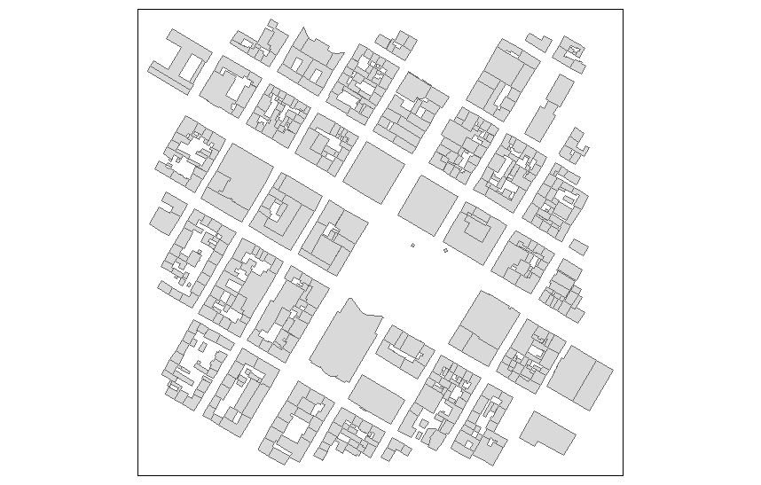

## Bibliotheken laden

```{r,warning=F,message=F}
library(osmar)
src <- osmsource_api()

library(tmap)

library(ggmap)
```

## Daten herunterladen

```{r,cache=T,eval=F}
Ma_Schloss <- geocode("Mannheim Schloss")
bb_MA_S3 <- center_bbox(Ma_Schloss$lon, Ma_Schloss$lat, 500, 500)
ua_MA_S2 <- get_osm(bb_MA_S3, source = src)
```

## In ein Shapefile transferieren

```{r,eval=F}
ua_ids <- find(ua_MA_S2, way(tags(k == "building")))
ua_ids2 <- find_down(ua_MA_S2, way(ua_ids))
bg <- subset(ua_MA_S2, ids = ua_ids2)
bg_erg <- as_sp(bg, "polygons")  
```

## Karte erzeugen

```{r,eval=F}
qtm(bg_erg)
```

