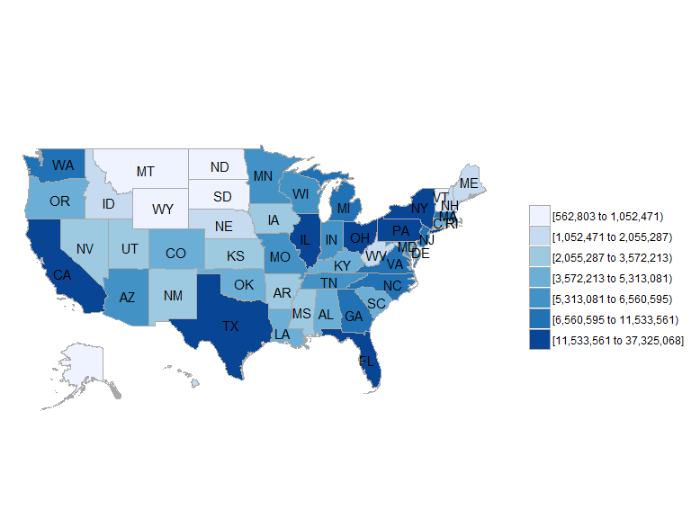
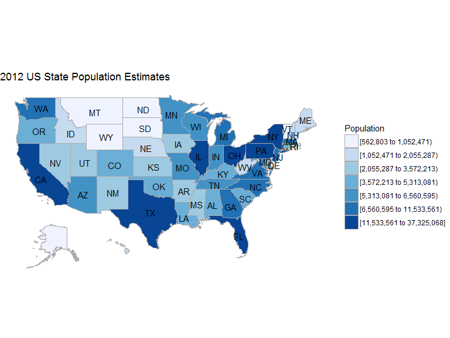
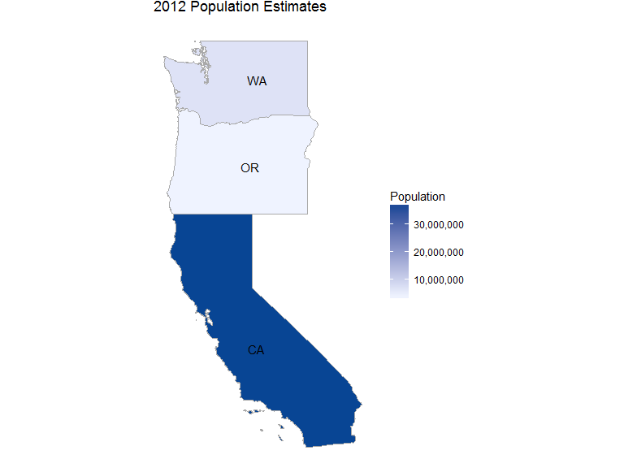
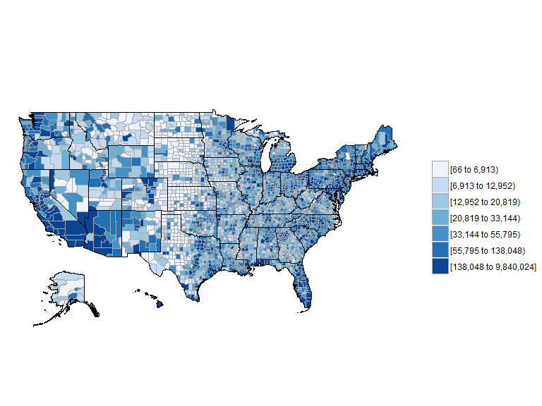
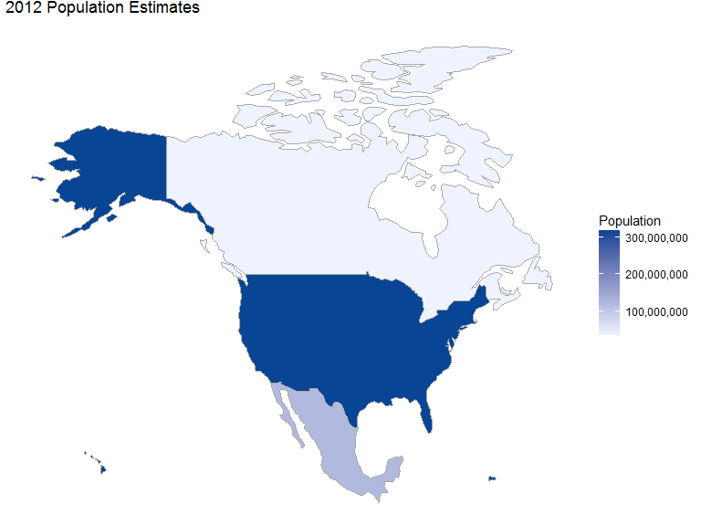
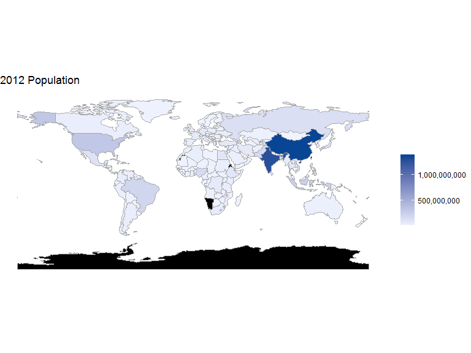
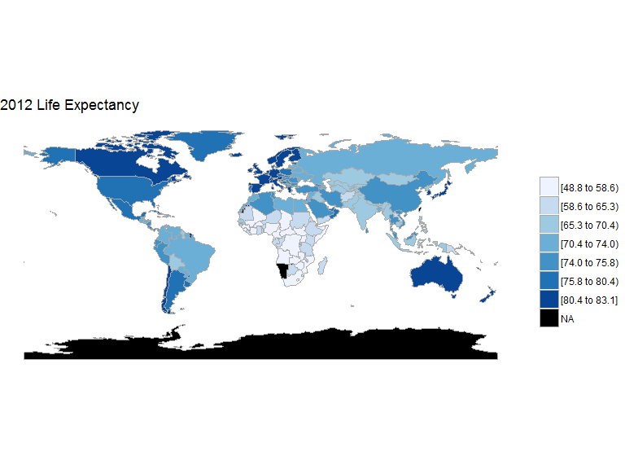

# R-Paket Choroplethr
Jan-Philipp Kolb  
22 Februar 2017  


## Einleitung

- [`choroplethr`](https://cran.r-project.org/web/packages/choroplethr/index.html) - Vereinfachung der Erstellung von Choroplethen in R

- Paket von [Ari Lamstein](http://www.arilamstein.com/)

- [`WDI`](https://cran.r-project.org/web/packages/WDI/index.html)
- World Development Indicators (World Bank)

- Folgendes basiert auf der [Vignette](https://cran.r-project.org/web/packages/choroplethr/index.html) des `choroplethr`-Paketes

## Was ist ein Choropleth

Ein Choropleth ist eine Karte, die

- geografische Grenzen zeigt.
- bei denen Bereiche basierend auf Metriken eingefärbt werden.

Choroplethen sind nützlich für die Visualisierung von Daten, wo geografische Grenzen eine natürliche Einheit der Aggregation sind. 

## Bevölkerungsschätzungen für den US-Staaten


`df_pop_state` ist ein Datensatz , der in dem Paket `choroplethr` enthalten ist, es enthält Schätzungen zu den US-Staaten für das Jahr 2012.


```r
library("choroplethrMaps")
```


region           value
-----------  ---------
alabama        4777326
alaska          711139
arizona        6410979
arkansas       2916372
california    37325068
colorado       5042853

## `choroplethr` - [Hallo Welt](http://mirrors.softliste.de/cran/web/packages/choroplethr/vignettes/a-introduction.html) 

Die Karte zeigt die US Bevölkerungsschätzung für die US-Staaten und das Jahr 2012:

Wir bekommen eine Choroplethenkarte mit nur einem Argument:


```r
state_choropleth(df_pop_state)
```

<!-- -->


Aber wir können auch einen Titel erstellen und die Legende benennen:


```r
state_choropleth(df_pop_state, title="2012 US State Population Estimates", legend="Population")
```

<!-- -->

## [Nur drei Staaten darstellen](http://mirrors.softliste.de/cran/web/packages/choroplethr/vignettes/b-state-choropleth.html)


```r
state_choropleth(df_pop_state,
                 title      = "2012 Population Estimates",
                 legend     = "Population",
                 num_colors = 1,
                 zoom       = c("california", "washington", "oregon"))
```

<!-- -->


## US County Chroplethen

[Choroplethen der US Counties](http://mirrors.softliste.de/cran/web/packages/choroplethr/vignettes/c-county-choropleth.html)

<http://mirrors.softliste.de/cran/web/packages/choroplethr/vignettes/c-county-choropleth.html>


```r
?df_pop_county
?county_choropleth
```

## Eine Karte der US Counties


```r
data(df_pop_county)
county_choropleth(df_pop_county)
```

<!-- -->


## [Choroplethen Länder](http://mirrors.softliste.de/cran/web/packages/choroplethr/vignettes/d-country-choropleth.html)


```r
data(df_pop_country)
country_choropleth(df_pop_country,
              title      = "2012 Population Estimates",
              legend     = "Population",
              num_colors = 1,
              zoom       = c("united states of america",
                             "mexico", "canada"))
```

## [Choroplethen Länder](http://mirrors.softliste.de/cran/web/packages/choroplethr/vignettes/d-country-choropleth.html)

<!-- -->


## Weltbank Daten


```r
library(choroplethr)
library(WDI) 
choroplethr_wdi(code="SP.POP.TOTL", year=2012, 
                title="2012 Population", 
                num_colors=1)
```

<!-- -->

## [Lebenserwartung](http://mirrors.softliste.de/cran/web/packages/choroplethr/vignettes/f-world-bank-data.html)


```r
library(WDI) 
choroplethr_wdi(code="SP.DYN.LE00.IN", year=2012,
                title="2012 Life Expectancy")
```

<!-- -->


## Ein weiterer Datensatz


```r
data(df_president_ts)
```

Mit dem Fragezeichen bekommen wir Hilfe


```r
?df_president_ts
```


```r
kable(df_president_ts[1:8,1:8])
```


region        1789   1792   1796   1800   1804   1808   1812 
------------  -----  -----  -----  -----  -----  -----  -----
alabama       NA     NA     NA     NA     NA     NA     NA   
alaska        NA     NA     NA     NA     NA     NA     NA   
arizona       NA     NA     NA     NA     NA     NA     NA   
arkansas      NA     NA     NA     NA     NA     NA     NA   
california    NA     NA     NA     NA     NA     NA     NA   
colorado      NA     NA     NA     NA     NA     NA     NA   
connecticut   GW     GW     F      F      F      F      F    
delaware      GW     GW     F      F      F      F      F    


## Resourcen


```r
citation("choroplethr")
```

```
## 
## To cite package 'choroplethr' in publications use:
## 
##   Ari Lamstein and Brian P Johnson (2017). choroplethr: Simplify
##   the Creation of Choropleth Maps in R. R package version 3.5.3.
##   https://CRAN.R-project.org/package=choroplethr
## 
## A BibTeX entry for LaTeX users is
## 
##   @Manual{,
##     title = {choroplethr: Simplify the Creation of Choropleth Maps in R},
##     author = {Ari Lamstein and Brian P Johnson},
##     year = {2017},
##     note = {R package version 3.5.3},
##     url = {https://CRAN.R-project.org/package=choroplethr},
##   }
## 
## ATTENTION: This citation information has been auto-generated from
## the package DESCRIPTION file and may need manual editing, see
## 'help("citation")'.
```

## Resources / Links

- [Einführung - Was sind Choroplethen](https://cran.r-project.org/web/packages/choroplethr/vignettes/a-introduction.html)

<https://cran.r-project.org/web/packages/choroplethr/vignettes/a-introduction.html>

- [Beschreibung](http://radar.oreilly.com/2014/01/new-choropleth-package-in-r.html) der Nutzung des  `choroplethr` Paketes

<http://radar.oreilly.com/2014/01/new-choropleth-package-in-r.html>
- Plot the [US states](https://cran.r-project.org/web/packages/choroplethr/vignettes/b-state-choropleth.html) with `choroplethr`

- [Weltbankdaten in Karten darstellen](https://cran.r-project.org/web/packages/choroplethr/vignettes/f-world-bank-data.html) mit `choroplethr`

<https://cran.r-project.org/web/packages/choroplethr/vignettes/f-world-bank-data.html>

- [Revolutions-blog](http://blog.revolutionanalytics.com/2014/01/easy-data-maps-with-r-the-choroplethr-package-.html) über das `choroplethr` Paket

<http://blog.revolutionanalytics.com/2014/01/easy-data-maps-with-r-the-choroplethr-package-.html>

- [trulia](http://www.trulia.com/tech/2014/01/15/the-choroplethr-package-for-r/)-blog über das `choroplethr` Paket

<http://www.trulia.com/tech/2014/01/15/the-choroplethr-package-for-r/>

- [Präsentation von Ari Lamstein](http://www.r-bloggers.com/slides-for-my-upcoming-talk-mapping-census-data-in-r/) über das `choroplethr` Paket

<http://www.r-bloggers.com/slides-for-my-upcoming-talk-mapping-census-data-in-r/>
