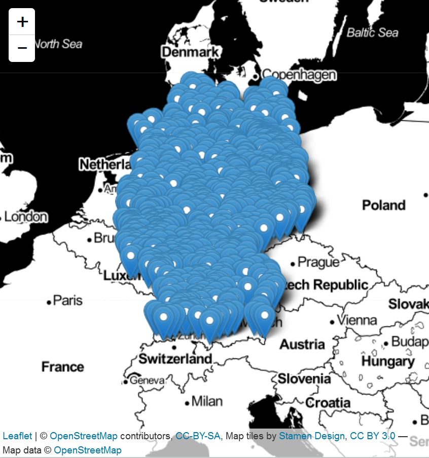
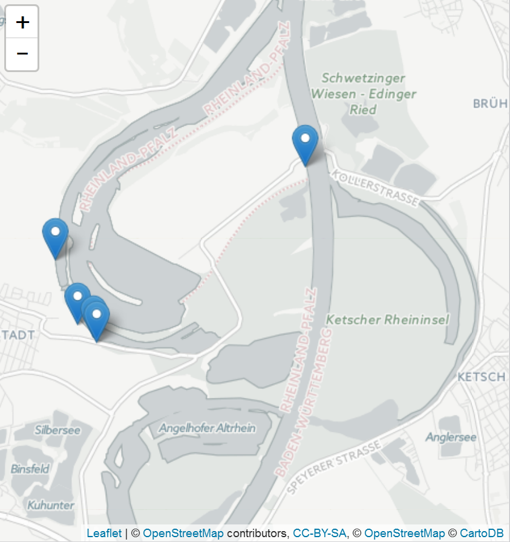
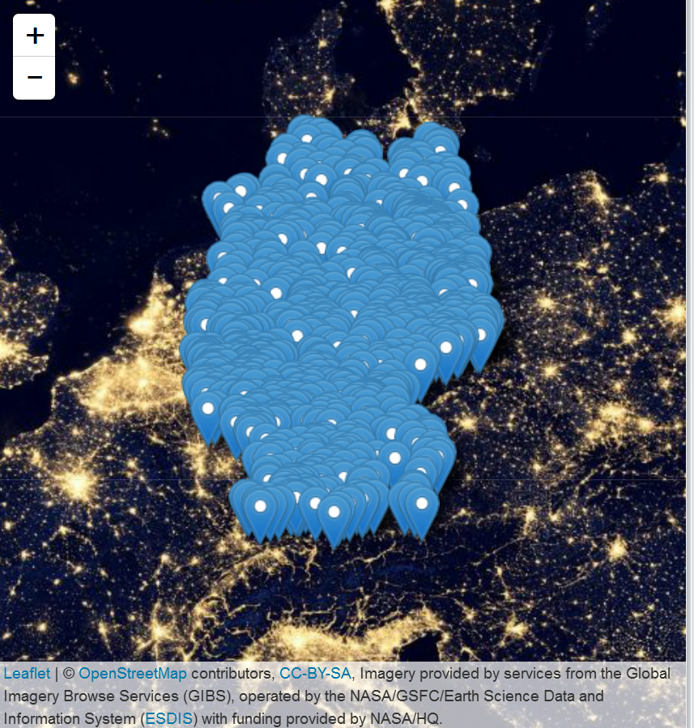
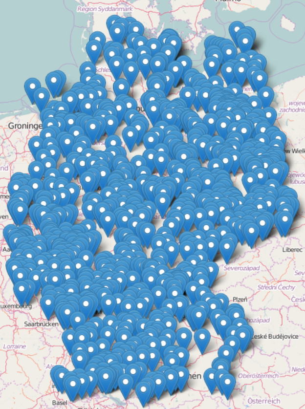
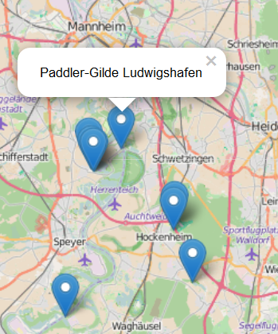
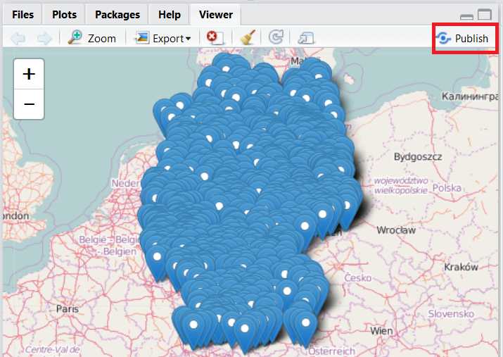
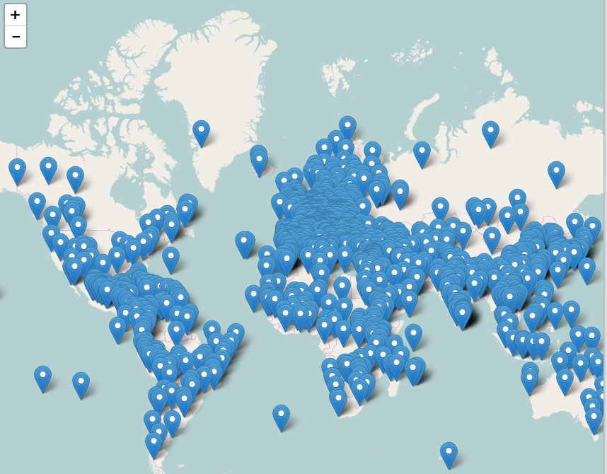
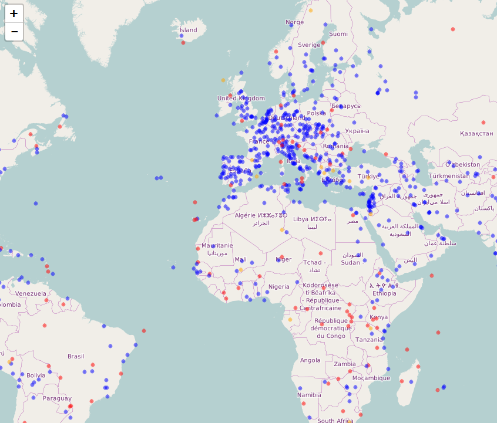
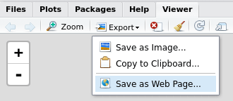

# Interaktive Karten
Jan-Philipp Kolb  
22 Februar 2017  


## Beispiel zu Campingplätzen

- Die Daten stammen von:

<http://www.openstreetmap.de/>

- Dabei wird die Overpass API genutzt:

<http://wiki.openstreetmap.org/wiki/Overpass_API>


```r
url <- "https://raw.githubusercontent.com/Japhilko/
GeoData/master/2015/data/CampSites_Germany.csv"
```


```r
CampSites <- read.csv(url)
```


## Überblick über Daten zu Campingplätzen


  X  name                                  tourism     website                                    
---  ------------------------------------  ----------  -------------------------------------------
  1  Campingplatz Winkelbachtal            camp_site   http://www.gruibingen.de/campingplatz.html 
  2  Radler-Zeltplatz                      camp_site   NA                                         
  3  Campingplatz des Naturfreundehauses   camp_site   NA                                         
  4  Campingplatz Am Aichstruter Stausee   camp_site   NA                                         
  5  NA                                    camp_site   NA                                         
  6  Kandern                               camp_site   NA                                         
  7  Campingplatz Baiersbronn-Obertal      camp_site   NA                                         
  8  Campingplatz Schwabenmühle           camp_site   NA                                         


## Notwendige Pakete

[magrittr](https://cran.r-project.org/web/packages/magrittr/index.html) - für den Pipe Operator in R:


```r
library("magrittr")
```


[leaflet](https://rstudio.github.io/leaflet/) - um  interaktive Karten mit der JavaScript Bibliothek 'Leaflet' zu erzeugen


```r
library("leaflet")
```


## Eine interaktive Karte


```r
m <- leaflet() %>%
  addTiles() %>%  
  addMarkers(lng=CampSites$lon, 
             lat=CampSites$lat, 
             popup=CampSites$name)
m
```

## [Stamen als Hintergrundkarte](https://rstudio.github.io/leaflet/basemaps.html)


```r
m %>% addProviderTiles("Stamen.Toner")
```



## CartoDB als Hintergrund


```r
m %>% addProviderTiles("CartoDB.Positron")
```



- [Info zu Map Tiles](https://www.mapbox.com/help/how-web-maps-work/)


## [Mehr Hintergründe](http://leaflet-extras.github.io/leaflet-providers/preview/index.html)


```r
m %>% addProviderTiles("NASAGIBS.ViirsEarthAtNight2012")
```




## Mehr Informationen hinzufügen


```r
popupInfo <- paste(CampSites$name,"\n",CampSites$website)
```


```r
m <- leaflet() %>%
  addTiles() %>%  # Add default OpenStreetMap map tiles
  addMarkers(lng=CampSites$lon, 
             lat=CampSites$lat, 
             popup=popupInfo)
m
```

Das Ergebnis ist hier:

<http://rpubs.com/Japhilko82/CampSitesHL>

## Die resultierende Karte



## Popups in einer interactiven Karte



Ich hab die Ergebnisse hochgeladen:

<http://rpubs.com/Japhilko82/Campsites>

## Wie man auf Rpubs publizieren kann




## Ein weiteres Beispiel - Weltkulturerbe


```r
url <- "https://raw.githubusercontent.com/Japhilko/
GeoData/master/2015/data/whcSites.csv"

whcSites <- read.csv(url) 
```


## Eine interaktive Karte erstellen


```r
m <- leaflet() %>%
  addTiles() %>%  # Add default OpenStreetMap map tiles
  addMarkers(lng=whcSites$lon, 
             lat=whcSites$lat, 
             popup=whcSites$name_en)
m
```

## Die Karte zeigen

 

## Farbe hinzu


```r
whcSites$color <- "red"
whcSites$color[whcSites$category=="Cultural"] <- "blue"
whcSites$color[whcSites$category=="Mixed"] <- "orange"
```

## Eine Karte mit Farbe erzeugen


```r
m1 <- leaflet() %>%
  addTiles() %>%  
  addCircles(lng=whcSites$lon, 
             lat=whcSites$lat, 
             popup=whcSites$name_en,
             color=whcSites$color)
m1
```

## Die Karte zeigen

 

## [Die Karte abspeichern](http://www.r-bloggers.com/interactive-mapping-with-leaflet-in-r-2/)




## Links und Quellen

- <http://www.r-bloggers.com/the-leaflet-package-for-online-mapping-in-r/>

- <https://rstudio.github.io/leaflet/>


