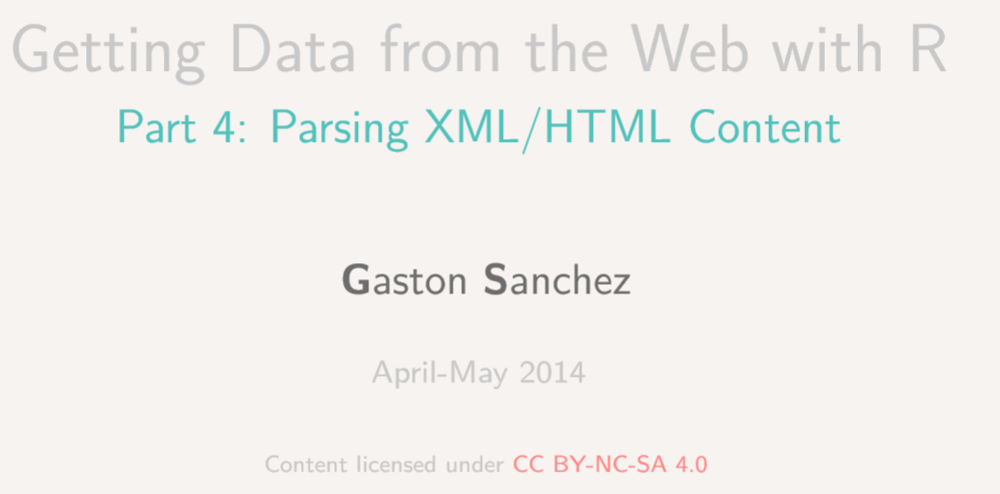

```{r setup, include=FALSE}
knitr::opts_chunk$set(echo = TRUE,cache=T)
```


```{r,echo=F}
library("knitr")
```


## [OSM Ausschnitte herunterladen](http://www.openstreetmap.org/export)

<www.openstreetmap.org/export>


## Das R-Paket `XML` - Gaston Sanchez

```{r}
library("XML")
```


Seine Arbeit sieht man [hier](http://gastonsanchez.com/).


## Wichtiger für mich:

[Das Arbeiten mit XML Daten](https://github.com/gastonstat/tutorial-R-web-data/blob/master/04-parsing-xml/04-parsing-xml.pdf)

<https://github.com/gastonstat/tutorial-R-web-data/blob/master/04-parsing-xml/04-parsing-xml.pdf>




## Funktionen im XML Paket

```{r,echo=F}
names <- c("Function","Description","xmlName()","name of the node","xmlSize()","number of subnodes","xmlAttrs()","named character vector of all attributes","xmlGetAttr()","value of a single attribute","xmlValue()","contents of a leaf node","xmlParent()","name of parent node","xmlAncestors()","name of ancestor nodes","getSibling()","siblings to the right or to the left","xmlNamespace()","the namespace (if there’s one)")
tab <- data.frame(t(array(names,dim=c(2,length(names)/2))))
colnames(tab) <- tab[1,]
tab <- tab[-1,]
kable(tab)
```

## Beispiel: administrative Grenzen Berlin

[Administrative Grenzen für Deutschland](http://wiki.openstreetmap.org/wiki/DE:Grenze#Bundesl.C3.A4ndergrenze_-_admin_level.3D4)

```{r,echo=F}
url <- "http://api.openstreetmap.org/api/0.6/relation/62422"
```

```{r,eval=F}
url <- "http://api.openstreetmap.org/api/0.6/
relation/62422"
```


```{r}
library(xml2)
BE <- xmlParse(url)
```


## Das XML analysieren

- [Tobi Bosede - Working with XML Data in R](http://www.informit.com/articles/article.aspx?p=2215520)

```{r}
xmltop = xmlRoot(BE)
class(xmltop)
xmlSize(xmltop)
xmlSize(xmltop[[1]])
```


## Nutzung von Xpath

[Xpath](https://de.wikipedia.org/wiki/XPath), the XML Path Language, is a query language for selecting nodes from an XML document. 


```{r}
xpathApply(BE,"//tag[@k = 'source:population']")
```


## Mehr Beispiele, wie man mit XML Daten umgeht:


- [Daten aus XML extrahieren](http://www.stat.berkeley.edu/~statcur/Workshop2/Presentations/XML.pdf)

<http://www.stat.berkeley.edu/~statcur/Workshop2/Presentations/XML.pdf>

- Duncan Temple Lang - [A Short Introduction to the XML package for R](http://www.omegahat.net/RSXML/shortIntro.pdf)

<http://www.omegahat.net/RSXML/shortIntro.pdf>

## Noch mehr Informationen

- [Web Daten manipulieren](http://www.di.fc.ul.pt/~jpn/r/web/index.html#parsing-xml)

<http://www.di.fc.ul.pt/~jpn/r/web/index.html#parsing-xml>

- [Information zu xquery](http://www.w3schools.com/xquery/)

<http://www.w3schools.com/xquery/>

- [R und das Web (für Anfänger), Teil II: XML und R](http://giventhedata.blogspot.de/2012/06/r-and-web-for-beginners-part-ii-xml-in.html)

<http://giventhedata.blogspot.de/2012/06/r-and-web-for-beginners-part-ii-xml-in.html>

- [String Manipulation](http://gastonsanchez.com/Handling_and_Processing_Strings_in_R.pdf)

<http://gastonsanchez.com/Handling_and_Processing_Strings_in_R.pdf>

## Referenzen

```{r}
citation("XML")
```

