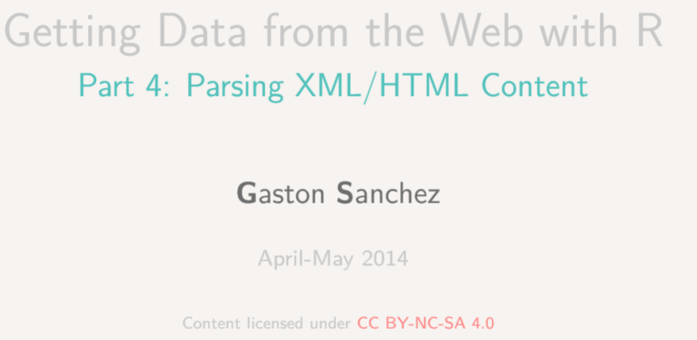

# Das Arbeiten mit OSM Daten
Jan-Philipp Kolb  
22 Februar 2017  


## [OSM Ausschnitte herunterladen](http://www.openstreetmap.org/export)

<www.openstreetmap.org/export>


## Das R-Paket `XML` - Gaston Sanchez


```r
library("XML")
```


Seine Arbeit sieht man [hier](http://gastonsanchez.com/).


## [Das Arbeiten mit XML Daten](https://github.com/gastonstat/tutorial-R-web-data/blob/master/04-parsing-xml/04-parsing-xml.pdf)




## Funktionen im XML Paket


     1                2                                        
---  ---------------  -----------------------------------------
2    xmlName()        name of the node                         
3    xmlSize()        number of subnodes                       
4    xmlAttrs()       named character vector of all attributes 
5    xmlGetAttr()     value of a single attribute              
6    xmlValue()       contents of a leaf node                  
7    xmlParent()      name of parent node                      
8    xmlAncestors()   name of ancestor nodes                   
9    getSibling()     siblings to the right or to the left     
10   xmlNamespace()   the namespace (if there’s one)           

## Beispiel: administrative Grenzen Berlin

[Administrative Grenzen für Deutschland](http://wiki.openstreetmap.org/wiki/DE:Grenze#Bundesl.C3.A4ndergrenze_-_admin_level.3D4)


```r
url <- "http://api.openstreetmap.org/api/0.6/
relation/62422"
```


```r
library(xml2)
# BE <- read_xml.raw(url)
BE <- xmlParse(url)
```


## Das XML analysieren

- [Tobi Bosede - Working with XML Data in R](http://www.informit.com/articles/article.aspx?p=2215520)


```r
xmltop = xmlRoot(BE)
class(xmltop)
```

```
## [1] "XMLInternalElementNode" "XMLInternalNode"       
## [3] "XMLAbstractNode"
```

```r
xmlSize(xmltop)
```

```
## [1] 1
```

```r
xmlSize(xmltop[[1]])
```

```
## [1] 327
```


## Nutzung von Xpath

[Xpath](https://de.wikipedia.org/wiki/XPath), the XML Path Language, is a query language for selecting nodes from an XML document. 


```r
xpathApply(BE,"//tag[@k = 'population']")
```

```
## [[1]]
## <tag k="population" v="3440441"/> 
## 
## attr(,"class")
## [1] "XMLNodeSet"
```


## Quelle für die Bevölkerungsgröße


```r
xpathApply(BE,"//tag[@k = 'source:population']")
```

```
## [[1]]
## <tag k="source:population" v="http://www.statistik-berlin-brandenburg.de/Publikationen/Stat_Berichte/2010/SB_A1-1_A2-4_q01-10_BE.pdf 2010-10-01"/> 
## 
## attr(,"class")
## [1] "XMLNodeSet"
```


## Etwas überraschend: 


```r
xpathApply(BE,"//tag[@k = 'name:ta']")
```

```
## [[1]]
## <tag k="name:ta" v="<U+0BAA><U+0BC6><U+0BB0><U+0BCD><U+0BB2><U+0BBF><U+0BA9><U+0BCD>"/> 
## 
## attr(,"class")
## [1] "XMLNodeSet"
```

## Geographische Region


```r
region <- xpathApply(BE,"//tag[@k = 'geographical_region']")
# regular expressions
region[[1]]
```

```
## <tag k="geographical_region" v="Barnim;Berliner Urstromtal;Teltow;Nauener Platte"/>
```


## Mehr Beispiele, wie man mit XML Daten umgeht:


- [Daten aus XML extrahieren](http://www.stat.berkeley.edu/~statcur/Workshop2/Presentations/XML.pdf)

<http://www.stat.berkeley.edu/~statcur/Workshop2/Presentations/XML.pdf>

- Duncan Temple Lang - [A Short Introduction to the XML package for R](http://www.omegahat.net/RSXML/shortIntro.pdf)

<http://www.omegahat.net/RSXML/shortIntro.pdf>

## Noch mehr Informationen

- [Web Daten manipulieren](http://www.di.fc.ul.pt/~jpn/r/web/index.html#parsing-xml)

<http://www.di.fc.ul.pt/~jpn/r/web/index.html#parsing-xml>

- [Tutorial zu xquery](http://www.w3schools.com/xml/xquery_intro.asp)

<http://www.w3schools.com/xml/xquery_intro.asp>

- [R und das Web (für Anfänger), Teil II: XML und R](http://giventhedata.blogspot.de/2012/06/r-and-web-for-beginners-part-ii-xml-in.html)

<http://giventhedata.blogspot.de/2012/06/r-and-web-for-beginners-part-ii-xml-in.html>

- [String Manipulation](http://gastonsanchez.com/Handling_and_Processing_Strings_in_R.pdf)

<http://gastonsanchez.com/Handling_and_Processing_Strings_in_R.pdf>

## Referenzen


```r
citation("XML")
```

```
## 
## To cite package 'XML' in publications use:
## 
##   Duncan Temple Lang and the CRAN Team (2016). XML: Tools for
##   Parsing and Generating XML Within R and S-Plus. R package
##   version 3.98-1.4. https://CRAN.R-project.org/package=XML
## 
## A BibTeX entry for LaTeX users is
## 
##   @Manual{,
##     title = {XML: Tools for Parsing and Generating XML Within R and S-Plus},
##     author = {Duncan Temple Lang and the CRAN Team},
##     year = {2016},
##     note = {R package version 3.98-1.4},
##     url = {https://CRAN.R-project.org/package=XML},
##   }
## 
## ATTENTION: This citation information has been auto-generated from
## the package DESCRIPTION file and may need manual editing, see
## 'help("citation")'.
```

## Links

- [Nutzung, Vor- und Nachteile OSM](https://www.e-education.psu.edu/geog585/node/738)

- [Forschungsprojekte im Zusammenhang mit OpenStreetMap](http://wiki.openstreetmap.org/wiki/Research)
