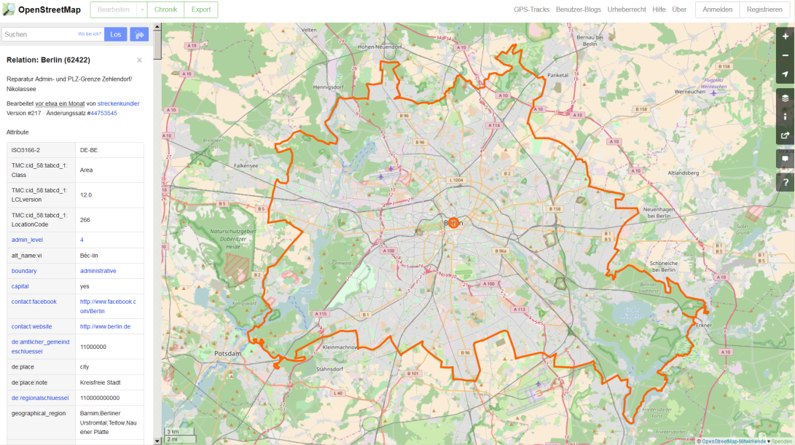
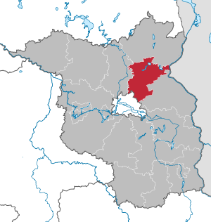

# Das Arbeiten mit OSM Daten
Jan-Philipp Kolb  
22 Februar 2017  


## Das R-Paket `XML` - Gaston Sanchez


```r
library("XML")
```


Seine Arbeit sieht man [hier](http://gastonsanchez.com/).


## [Das Arbeiten mit XML Daten](https://github.com/gastonstat/tutorial-R-web-data/blob/master/04-parsing-xml/04-parsing-xml.pdf)


## Funktionen im XML Paket


     1                2                                        
---  ---------------  -----------------------------------------
2    xmlName()        name of the node                         
3    xmlSize()        number of subnodes                       
4    xmlAttrs()       named character vector of all attributes 
5    xmlGetAttr()     value of a single attribute              
6    xmlValue()       contents of a leaf node                  
7    xmlParent()      name of parent node                      
8    xmlAncestors()   name of ancestor nodes                   
9    getSibling()     siblings to the right or to the left     
10   xmlNamespace()   the namespace (if there’s one)           


## [Einzelne Objekte finden](http://www.openstreetmap.org/export)

<www.openstreetmap.org/export>




## Beispiel: administrative Grenzen Berlin

[Administrative Grenzen für Deutschland](http://wiki.openstreetmap.org/wiki/DE:Grenze#Bundesl.C3.A4ndergrenze_-_admin_level.3D4)


```r
# library(xml2)
# BE <- read_xml.raw(url)
BE <- xmlParse(url)
```


## Das XML analysieren

- [Tobi Bosede - Working with XML Data in R](http://www.informit.com/articles/article.aspx?p=2215520)


```r
xmltop = xmlRoot(BE)
class(xmltop)
```

```
## [1] "XMLInternalElementNode" "XMLInternalNode"       
## [3] "XMLAbstractNode"
```

```r
xmlSize(xmltop)
```

```
## [1] 1
```

```r
xmlSize(xmltop[[1]])
```

```
## [1] 327
```


## Nutzung von Xpath

> [Xpath](https://de.wikipedia.org/wiki/XPath), the XML Path Language, is a query language for selecting nodes from an XML document. 


```r
xpathApply(BE,"//tag[@k = 'population']")
```

```
## [[1]]
## <tag k="population" v="3440441"/> 
## 
## attr(,"class")
## [1] "XMLNodeSet"
```


## Quelle für die Bevölkerungsgröße


```r
xpathApply(BE,"//tag[@k = 'source:population']")
```

```
## [[1]]
## <tag k="source:population" v="http://www.statistik-berlin-brandenburg.de/Publikationen/Stat_Berichte/2010/SB_A1-1_A2-4_q01-10_BE.pdf 2010-10-01"/> 
## 
## attr(,"class")
## [1] "XMLNodeSet"
```

-[Statistik Berlin Brandenburg](https://www.statistik-berlin-brandenburg.de/datenbank/inhalt-datenbank.asp)

## Etwas überraschend: 


```r
xpathApply(BE,"//tag[@k = 'name:ta']")
```

```
## [[1]]
## <tag k="name:ta" v="<U+0BAA><U+0BC6><U+0BB0><U+0BCD><U+0BB2><U+0BBF><U+0BA9><U+0BCD>"/> 
## 
## attr(,"class")
## [1] "XMLNodeSet"
```


## Geographische Region


```r
region <- xpathApply(BE,"//tag[@k = 'geographical_region']")
# regular expressions
region[[1]]
```

```
## <tag k="geographical_region" v="Barnim;Berliner Urstromtal;Teltow;Nauener Platte"/>
```

## Landkreis




## Weiteres Beispiel


```r
url2 <- "http://api.openstreetmap.org/api/0.6/node/25113879"
obj2 <- xmlParse(url2)
obj_amenity <- xpathApply(obj2,"//tag[@k = 'amenity']")[[1]]
obj_amenity
```

```
## <tag k="amenity" v="university"/>
```

## Wikipedia Artikel


```r
xpathApply(obj2,"//tag[@k = 'wikipedia']")[[1]]
```

```
## <tag k="wikipedia" v="de:Universität Mannheim"/>
```

## Das C und das A


```r
url3 <- "http://api.openstreetmap.org/api/0.6/node/303550876"
obj3 <- xmlParse(url3)
xpathApply(obj3,"//tag[@k = 'opening_hours']")[[1]]
```

```
## <tag k="opening_hours" v="Mo-Sa 09:00-20:00; Su,PH off"/>
```

## Hin und weg


```r
url4 <- "http://api.openstreetmap.org/api/0.6/node/25439439"
obj4 <- xmlParse(url4)
xpathApply(obj4,"//tag[@k = 'railway:station_category']")[[1]]
```

```
## <tag k="railway:station_category" v="2"/>
```

- [Bahnhofskategorien](https://de.wikipedia.org/wiki/Bahnhofskategorie)

## Exkurs: Bahnhofskategorien


```r
library(rvest)
```

```
## 
## Attaching package: 'rvest'
```

```
## The following object is masked from 'package:XML':
## 
##     xml
```

```r
html_bhfkat <- read_html("https://de.wikipedia.org/wiki/Bahnhofskategorie")
df_html_bhfkat <- html_table(html_nodes(html_bhfkat, "table")[[1]], fill = TRUE)
```

## Bahnhofskategorien Übersicht


 Stufe  Bahnsteigkanten   Bahnsteiglänge    Reisende/Tag        Zughalte/Tag 
------  ----------------  ----------------  ------------------  -------------
     6  01                > 000 bis 090 m   00000 bis 00049     000 bis 0010 
     5  02                > 090 bis 140 m   00050 bis 00299     011 bis 0050 
     4  03 bis 04         > 140 bis 170 m   00300 bis 00999     051 bis 0100 
     3  05 bis 09         > 170 bis 210 m   01000 bis 09999     101 bis 0500 
     2  10 bis 14         > 210 bis 280 m   10.000 bis 49.999   501 bis 1000 
     1  00i ab 15         > 280 m           00000i ab 50.000    000i ab 1001 


## [OSM Ausschnitte herunterladen](http://www.openstreetmap.org/export)

<www.openstreetmap.org/export>


## Mehr Beispiele, wie man mit XML Daten umgeht:


- [Daten aus XML extrahieren](http://www.stat.berkeley.edu/~statcur/Workshop2/Presentations/XML.pdf)

<http://www.stat.berkeley.edu/~statcur/Workshop2/Presentations/XML.pdf>

- Duncan Temple Lang - [A Short Introduction to the XML package for R](http://www.omegahat.net/RSXML/shortIntro.pdf)

<http://www.omegahat.net/RSXML/shortIntro.pdf>

## Noch mehr Informationen

- [Web Daten manipulieren](http://www.di.fc.ul.pt/~jpn/r/web/index.html#parsing-xml)

<http://www.di.fc.ul.pt/~jpn/r/web/index.html#parsing-xml>

- [Tutorial zu xquery](http://www.w3schools.com/xml/xquery_intro.asp)

<http://www.w3schools.com/xml/xquery_intro.asp>

- [R und das Web (für Anfänger), Teil II: XML und R](http://giventhedata.blogspot.de/2012/06/r-and-web-for-beginners-part-ii-xml-in.html)

<http://giventhedata.blogspot.de/2012/06/r-and-web-for-beginners-part-ii-xml-in.html>

- [String Manipulation](http://gastonsanchez.com/Handling_and_Processing_Strings_in_R.pdf)

<http://gastonsanchez.com/Handling_and_Processing_Strings_in_R.pdf>

## Referenzen


```r
citation("XML")
```

```
## 
## To cite package 'XML' in publications use:
## 
##   Duncan Temple Lang and the CRAN Team (2016). XML: Tools for
##   Parsing and Generating XML Within R and S-Plus. R package
##   version 3.98-1.5. https://CRAN.R-project.org/package=XML
## 
## A BibTeX entry for LaTeX users is
## 
##   @Manual{,
##     title = {XML: Tools for Parsing and Generating XML Within R and S-Plus},
##     author = {Duncan Temple Lang and the CRAN Team},
##     year = {2016},
##     note = {R package version 3.98-1.5},
##     url = {https://CRAN.R-project.org/package=XML},
##   }
## 
## ATTENTION: This citation information has been auto-generated from
## the package DESCRIPTION file and may need manual editing, see
## 'help("citation")'.
```

## Das neuere Paket


```r
citation("xml2")
```

```
## 
## To cite package 'xml2' in publications use:
## 
##   Hadley Wickham, James Hester and Jeroen Ooms (2017). xml2: Parse
##   XML. R package version 1.1.0.
##   https://CRAN.R-project.org/package=xml2
## 
## A BibTeX entry for LaTeX users is
## 
##   @Manual{,
##     title = {xml2: Parse XML},
##     author = {Hadley Wickham and James Hester and Jeroen Ooms},
##     year = {2017},
##     note = {R package version 1.1.0},
##     url = {https://CRAN.R-project.org/package=xml2},
##   }
```


## Links

- [Nutzung, Vor- und Nachteile OSM](https://www.e-education.psu.edu/geog585/node/738)

- [Forschungsprojekte im Zusammenhang mit OpenStreetMap](http://wiki.openstreetmap.org/wiki/Research)
