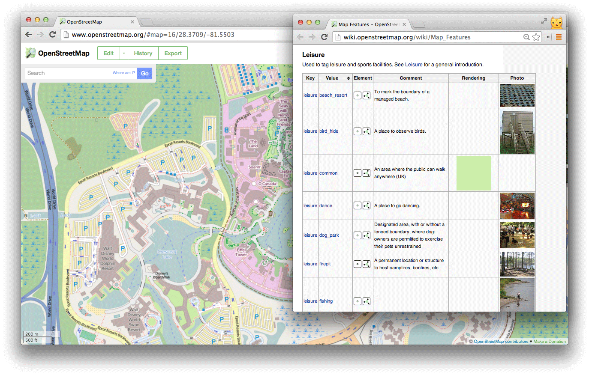
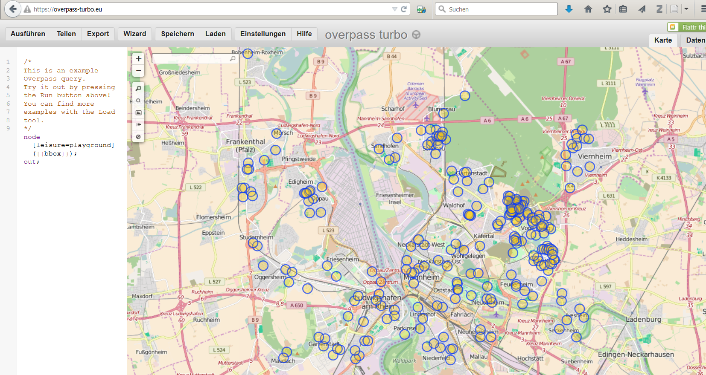

# Die Nutzung von Programmierschnittstellen
Jan-Philipp Kolb  
22 Februar 2017  


## The Overpass API


>The Overpass API is a read-only API that serves up custom selected parts of the OSM map data.

(<http://wiki.openstreetmap.org/wiki/Overpass_API>)

## Wichtige Information 

<http://wiki.openstreetmap.org/wiki/Map_Features>




## Beispiel: Nutzung der Overpass API



## Export der Rohdaten


## Import von der Overpass API zu R


```r
Link1 <- "http://www.overpass-api.de/api/interpreter?
data=[maxsize:1073741824][timeout:900];area[name=\""
```


```r
library(XML)
place <- "Mannheim"
type_obj <- "node"
object <- "leisure=playground"

InfoList <- xmlParse(paste(Link1,place,"\"];",
type_obj,"(area)[",object,
"];out;",sep=""))
```


## XML Output


## Das Arbeiten mit XML Daten (xpath)

Die Liste der ID's mit dem Wert *playground*:


```r
node_id <- xpathApply(InfoList,
"//tag[@v= 'playground']/parent::node/@ id")
## node_id[[1]]
```


## latitude und longitude bekommen


```r
lat_x <- xpathApply(InfoList,
"//tag[@v= 'playground']/parent::node/@ lat")
# lat_x[[1]];lat_x[[2]]
```


```r
lat_x <- xpathApply(InfoList,
"//tag[@v= 'playground']/parent::node/@ lon")
```


## Paket auf Github


```r
library(devtools)
install_github("Japhilko/gosmd")
```


```r
library(gosmd)
```

```
## Loading required package: maptools
```

```
## Loading required package: sp
```

```
## Checking rgeos availability: TRUE
```

```
## Loading required package: RJSONIO
```

```
## Loading required package: stringr
```

```r
pg_MA <- get_osm_nodes(object="leisure=playground",
                       "Mannheim")
info <- extract_osm_nodes(OSM.Data=pg_MA,
                          value="playground")
```

## Ausschnitt der Ergebnisse


           leisure            lat        lon  note                                                     
---------  -----------  ---------  ---------  ---------------------------------------------------------
30560755   playground    49.51910   8.502807  NA                                                       
76468450   playground    49.49633   8.539396  Rutsche, Schaukel, großer Sandkasten, Tischtennis       
76468534   playground    49.49678   8.552959  NA                                                       
76468535   playground    49.49230   8.548750  NA                                                       
76468536   playground    49.50243   8.548140  Schaukel, Rutsche, Sandkasten, Spielhäuser, Tischtennis 
76468558   playground    49.49759   8.542036  NA                                                       


## Link

- [Tutorial zur Nutzung der Overpass API](http://osmlab.github.io/learnoverpass/en/exercises/intro/1/)

- [Vignette xml2](https://cran.r-project.org/web/packages/xml2/vignettes/modification.html)
