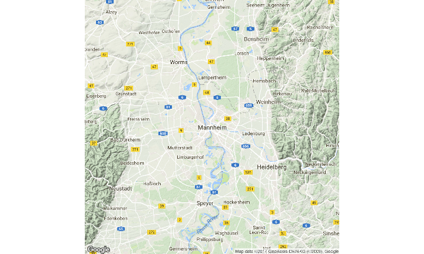
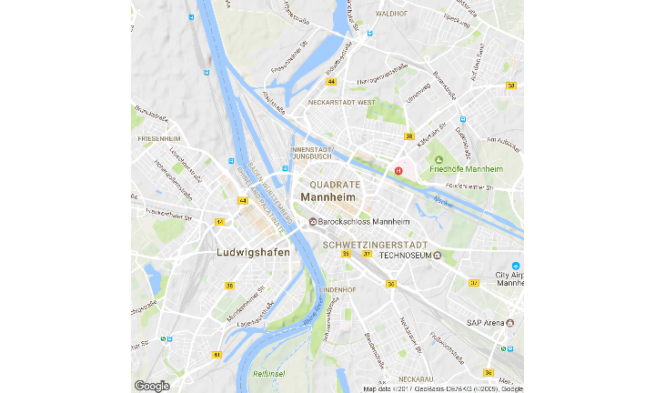
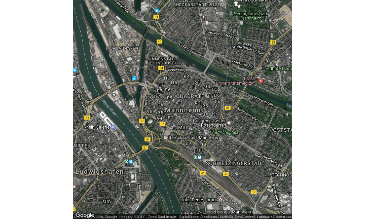

# Nutzung von GeoDaten in den Sozialwissenschaften - Kartentypen mit ggmap
Jan-Philipp Kolb  
07 April 2016  


## Gliederung

Arten von räumlichen Daten: 

- [Straßenkarten](https://www.nceas.ucsb.edu/~frazier/RSpatialGuides/ggmap/ggmapCheatsheet.pdf) 
- [Satelliten Bilder](http://www.mostlymuppet.com/tag/maps/)
- [Physische Daten und Karten](http://gis.stackexchange.com/questions/3083/what-makes-a-map-beautiful/45518#45518)
- [Abstrakte Karten](http://www.designfaves.com/2014/03/abstracted-maps-reveal-cities-personalities)
- ...

Das R-paket [ggmap](http://journal.r-project.org/archive/2013-1/kahle-wickham.pdf) wird im folgenden genutzt um verschiedene Kartentypen darzustellen.

Mit [qmap](http://www.inside-r.org/packages/cran/ggmap/docs/qmap) kann man eine schnelle Karte erzeugen.


## Straßenkarten

- Straßenkarte werden sehr häufig verwendet. 
- Diese Karten zeigen Haupt- und Nebenstraßen (abhängig vom Detail) 
- oft sind auch weitere Informationen enthalten. Wie beispielsweise Flughäfen, Städte, Campingplätze oder andere Orte von Interesse 
- Beispiel einer Straßenkarte für [Mannheim](http://rpubs.com/Japhilko82/OpenStreetMap_Mannheim). 

## Installieren des Paketes

- Zur Erstellung der Karten brauchen wir das Paket `ggmap`:


```r
devtools::install_github("dkahle/ggmap")
devtools::install_github("hadley/ggplot2")
install.packages("ggmap")
```


## Paket ggmap - Hallo Welt

- Um das Paket zu laden verwenden wir den Befehl `library`


```r
library(ggmap)
```

Und schon kann die erste Karte erstellt werden:


```r
qmap("Mannheim")
```

<!-- -->


## Karte für eine Sehenswürdigkeit


```r
BBT <- qmap("Berlin Brandenburger Tor")
BBT
```

<!-- -->


## Karte für einen ganzen Staat


```r
qmap("Germany")
```

<!-- -->

- Wir brauchen ein anderes *zoom level*

## Ein anderes *zoom level*

- level 3 - Kontinent
- level 10 - Stadt
- level 21 - Gebäude


```r
qmap("Germany", zoom = 6)
```

<!-- -->


## Hilfe bekommen wir mit dem Fragezeichen


```r
?qmap
```

Verschiedene Abschnitte in der Hilfe:

- Description
- Usage
- Arguments
- Value
- Author(s)
- See Also
- Examples


## Die Beispiele in der Hilfe

Ausschnitt aus der Hilfe Seite zum Befehl `qmap`:


Das Beispiel kann man direkt in die Konsole kopieren:


```r
# qmap("baylor university")
qmap("baylor university", zoom = 14)
# und so weiter
```

## Ein anderes *zoom level*


```r
qmap("Mannheim", zoom = 12)
```

<!-- -->

## Näher rankommen


```r
qmap('Mannheim', zoom = 13)
```

<!-- -->


## Ganz nah dran


```r
qmap('Mannheim', zoom = 20)
```

<!-- -->


## ggmap - maptype satellite


```r
qmap('Mannheim', zoom = 14, maptype="satellite")
```

<!-- -->

## ggmap - maptype satellite zoom 20


```r
qmap('Mannheim', zoom = 20, maptype="hybrid")
```

<!-- -->


## ggmap - maptype hybrid


```r
qmap("Mannheim", zoom = 14, maptype="hybrid")
```

<!-- -->


## Terrain/physical maps

- Aus Physischen Karten kann man Informationen über Berge, Flüsse und Seen ablesen. 

- Farben werden oft genutzt um Höhenunterschiede zu visualisieren

## ggmap - terrain map


```r
qmap('Schriesheim', zoom = 14,
 maptype="terrain")
```

<!-- -->

## Abstrahierte Karten ([http://www.designfaves.com](http://www.designfaves.com/2014/03/abstracted-maps-reveal-cities-personalities))


- Abstraktion wird genutzt um nur die essentiellen Informationen einer Karte zu zeigen. 

- Bsp. U-Bahn Karten - wichtig sind Richtungen und wenig Infos zur Orientierung

- Im folgenden werden Karten vorgestellt, die sich gut als Hintergrundkarten eignen.

## ggmap - maptype watercolor


```r
qmap('Mannheim', zoom = 14,
 maptype="watercolor",source="stamen")
```

<!-- -->


## ggmap - source stamen


```r
qmap('Mannheim', zoom = 14,
 maptype="toner",source="stamen")
```

<!-- -->


## ggmap - maptype toner-lite


```r
qmap('Mannheim', zoom = 14,
 maptype="toner-lite",source="stamen")
```

<!-- -->

## ggmap - maptype toner-hybrid


```r
qmap('Mannheim', zoom = 14,
 maptype="toner-hybrid",source="stamen")
```

<!-- -->


## ggmap - maptype terrain-lines


```r
qmap('Mannheim', zoom = 14,
 maptype="terrain-lines",source="stamen")
```

<!-- -->


## Graphiken speichern


## ggmap - ein Objekt erzeugen

- `<-` ist der Zuweisungspfeil um ein Objekt zu erzeugen
- Dieses Vorgehen macht bspw. Sinn, wenn mehrere Karten nebeneinander gebraucht werden.


```r
MA_map <- qmap('Mannheim', 
               zoom = 14,
               maptype="toner",
               source="stamen")
```


## Geokodierung

> Geocoding (...) uses a description of a location, most typically a postal address or place name, to find geographic coordinates from spatial reference data ... 

[Wikipedia - Geocoding](https://github.com/adam-p/markdown-here/wiki/Markdown-Cheatsheet#blockquotes)


```r
library(ggmap)
geocode("Mannheim",source="google")
```


     lon        lat
--------  ---------
 8.46321   49.48614


## Latitude und Longitude


[http://modernsurvivalblog.com](http://modernsurvivalblog.com/survival-skills/basic-map-reading-latitude-longitude/)

## Koordinaten verschiedener Orte in Deutschland


cities            lon        lat
---------  ----------  ---------
Hamburg      9.993682   53.55108
Koeln        6.960279   50.93753
Dresden     13.737262   51.05041
Muenchen    11.581981   48.13513


## Reverse Geokodierung

> Reverse geocoding is the process of back (reverse) coding of a point location (latitude, longitude) to a readable address or place name. This permits the identification of nearby street addresses, places, and/or areal subdivisions such as neighbourhoods, county, state, or country.

Quelle: [Wikipedia](https://en.wikipedia.org/wiki/Reverse_geocoding)


```r
revgeocode(c(48,8))
```

```
## [1] "Unnamed Road, Somalia"
```


## Die Distanz zwischen zwei Punkten


```r
mapdist("Q1, 4 Mannheim","B2, 1 Mannheim")
```

```
##             from             to   m    km     miles seconds  minutes
## 1 Q1, 4 Mannheim B2, 1 Mannheim 746 0.746 0.4635644     208 3.466667
##        hours
## 1 0.05777778
```


```r
mapdist("Q1, 4 Mannheim","B2, 1 Mannheim",mode="walking")
```

```
##             from             to   m    km     miles seconds minutes  hours
## 1 Q1, 4 Mannheim B2, 1 Mannheim 546 0.546 0.3392844     423    7.05 0.1175
```


## Eine andere Distanz bekommen


```r
mapdist("Q1, 4 Mannheim","B2, 1 Mannheim",mode="bicycling")
```

```
##             from             to   m    km    miles seconds  minutes
## 1 Q1, 4 Mannheim B2, 1 Mannheim 555 0.555 0.344877     215 3.583333
##        hours
## 1 0.05972222
```


## Geokodierung - verschiedene Punkte von Interesse


```r
POI1 <- geocode("B2, 1 Mannheim",source="google")
POI2 <- geocode("Hbf Mannheim",source="google")
POI3 <- geocode("Mannheim, Friedrichsplatz",source="google")
ListPOI <-rbind(POI1,POI2,POI3)
POI1;POI2;POI3
```

```
##        lon      lat
## 1 8.462844 49.48569
```

```
##        lon      lat
## 1 8.469879 49.47972
```

```
##       lon      lat
## 1 8.47653 49.48379
```


## Punkte in der Karte


```r
MA_map +
geom_point(aes(x = lon, y = lat),
data = ListPOI)
```

<!-- -->

## Punkte in der Karte


```r
MA_map +
geom_point(aes(x = lon, y = lat),col="red",
data = ListPOI)
```

<!-- -->


## ggmap - verschiedene Farben


```r
ListPOI$color <- c("A","B","C")
MA_map +
geom_point(aes(x = lon, y = lat,col=color),
data = ListPOI)
```

<!-- -->

## ggmap - größere Punkte


```r
ListPOI$size <- c(10,20,30)
MA_map +
geom_point(aes(x = lon, y = lat,col=color,size=size),
data = ListPOI)
```

<!-- -->


## Eine Route von Google maps bekommen


```r
from <- "Mannheim Hbf"
to <- "Mannheim B2 , 1"
route_df <- route(from, to, structure = "route")
```

[Mehr Information](http://rpackages.ianhowson.com/cran/ggmap/man/route.html)

<http://rpackages.ianhowson.com/cran/ggmap/man/route.html>

## Eine Karte mit dieser Information zeichnen


```r
qmap("Mannheim Hbf", zoom = 14) +
  geom_path(
    aes(x = lon, y = lat),  colour = "red", size = 1.5,
    data = route_df, lineend = "round"
  )
```

<!-- -->

Wie fügt man Punkte hinzu

- Nutzung von [geom_point](http://zevross.com/blog/2014/07/16/mapping-in-r-using-the-ggplot2-package/)


- Question on [stackoverflow](http://stackoverflow.com/questions/15069963/getting-a-map-with-points-using-ggmap-and-ggplot2)

<http://i.stack.imgur.com>


 
## Cheatsheet

- Cheatsheet zu [data visualisation](https://www.rstudio.com/wp-content/uploads/2015/04/ggplot2-cheatsheet.pdf)

<https://www.rstudio.com/>


## Resourcen und Literatur


- [Artikel von David Kahle und Hadley Wickham](http://journal.r-project.org/archive/2013-1/kahle-wickham.pdf) zur Nutzung von `ggmap`.


- [Schnell eine Karte bekommen ](http://rpackages.ianhowson.com/cran/ggmap/man/get_map.html)


- [Karten machen mit R](http://www.kevjohnson.org/making-maps-in-r-part-2/)

- [Problem mit der Installation von ggmap ](http://stackoverflow.com/questions/40642850/ggmap-error-geomrasterann-was-built-with-an-incompatible-version-of-ggproto)

## Take Home Message

Was klar sein sollte:

- Wie man eine schnelle Karte erzeugt
- Wie man geokodiert
- Wie man eine Distanz berechnet

 
