# R-Paket maps
Jan-Philipp Kolb  
22 Februar 2017  


## Politische Karte:

- Eine politische Karte zeigt keine topographischen Informationen.

- Hauptsächlich sollen adminstrative Grenzen dargestellt werden.

- Teilweise werden auch Städte mit eingezeichnet

- Ein typisches Beispiel ist eine Karte der US-Staaten

## Politische Karte


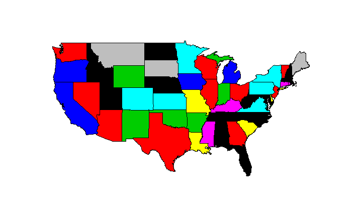<!-- -->


## Das R-Paket maps


```r
library(maps)
```

Wie man Hilfe bekommt:


```r
?map
```


## Hallo Welt


```r
map()
```

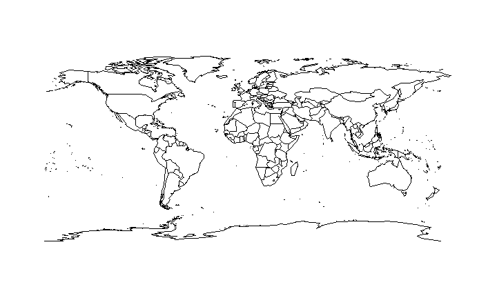<!-- -->


## Ein erstes Argument

Der gleiche Befehl mit einem Argument:


```r
map("usa")
```

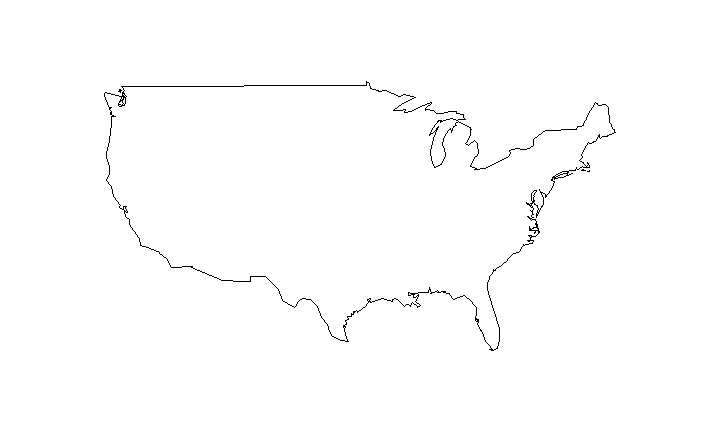<!-- -->

## Eine Frankreichkarte


```r
map("france")
```

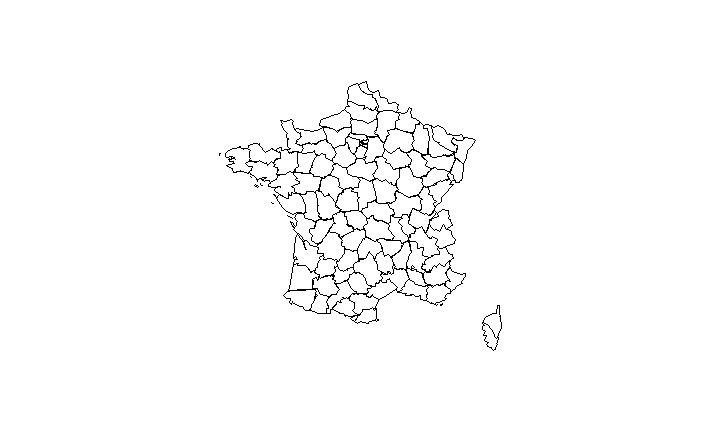<!-- -->

## Politische Karte - Italien

Grenzen in blau:


```r
library ( maps )
map ("italy", col = "blue")
```

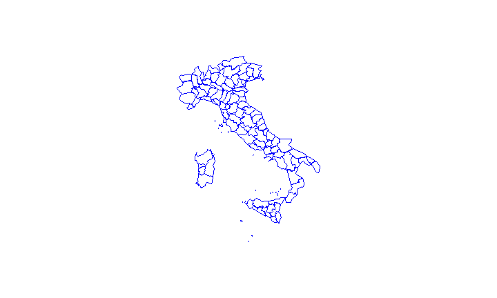<!-- -->

## Add In: Colour Picker

- RStudio Version 0.99.893 oder höher ist notwendig
- Das Paket `shinyjs` muss installiert sein.

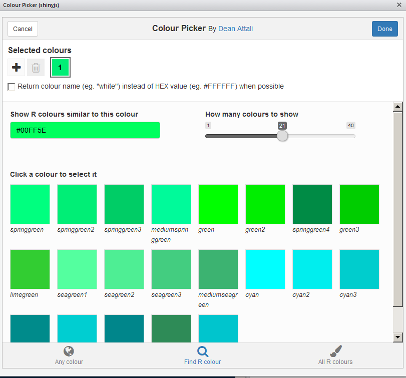


## Choroplethen - R-Paket maps

Wir wollen die Flächen blau einfärben:

```r
map ("italy",fill =T, col = "blue")
```

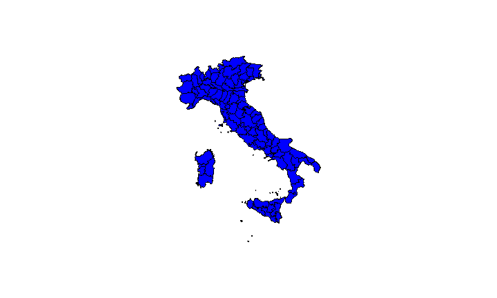<!-- -->

## Mehr Farben

Einen Vektor erzeugen:


```r
colors <- c("blue","red","yellow")
```

nun nutzrn wir den Vektor um die Farbe zu spezifizieren


```r
map ("italy",fill =T, col = colors)
```

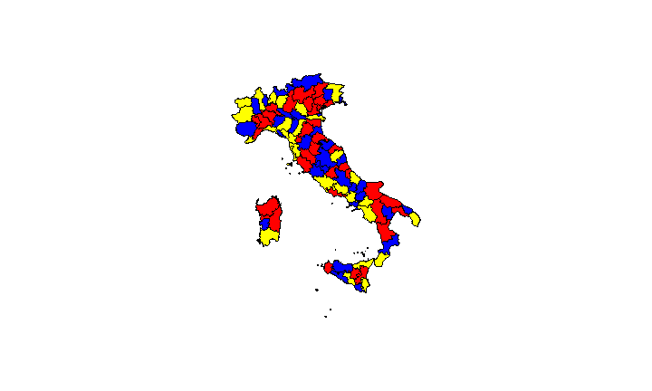<!-- -->

## Excurs: mehr Farben!
Wir können auch den [rgb](https://stat.ethz.ch/R-manual/R-devel/library/grDevices/html/rgb.html) Befehl nutzen um eigene Farben zu erzeugen:


```r
map("italy",fill=T, col = rgb(0,1,0))
```

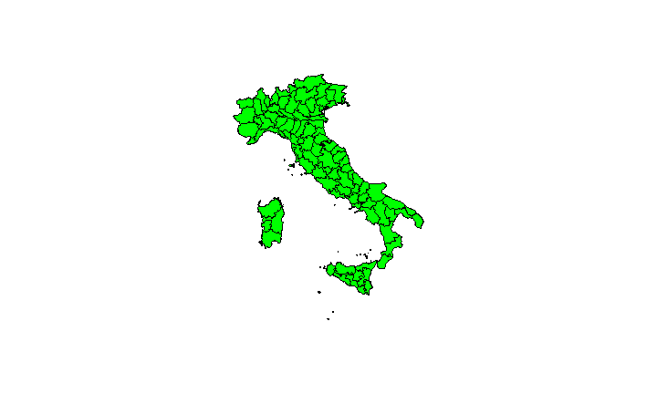<!-- -->

## [Hintergrund](https://dataveld.wordpress.com/2016/02/15/getting-started-with-r-maps-in-microsoft-power-bi/)


```r
map("state", col="#01B8AA", bg="#374649")
```

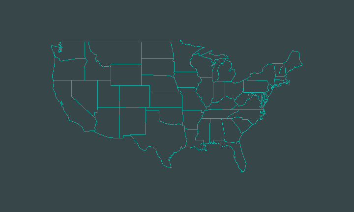<!-- -->


## Auch ausprobieren:


```r
map("italy",fill=T, col = rgb(1,0,0))
map("italy",fill=T, col = rgb(1,1,1))
map("italy",fill=T, col = rgb(1,0.5,0.4))
```


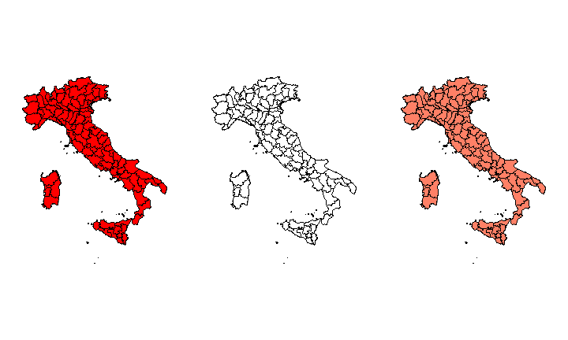<!-- -->


## Choroplethen - R-Paket maps
Wenn man wissen will, welche Region sich wohinter verbirgt:


```r
italy <- map("italy", plot = F)
head(italy$names)
```

```
## [1] "Bolzano-Bozen" "Belluno"       "Udine"         "Sondrio"      
## [5] "Trento"        "Novara"
```

## Karten mit nur einem Argument


```r
map("county")
```


Argument   What                   
---------  -----------------------
county     US Counties            
france     France                 
italy      Italy                  
nz         New Zealand            
state      US States              
usa        USA                    
world      Countries of the world 


## Eine Karte für Deutschland


```r
library(maps)
map("world", "Germany")
```

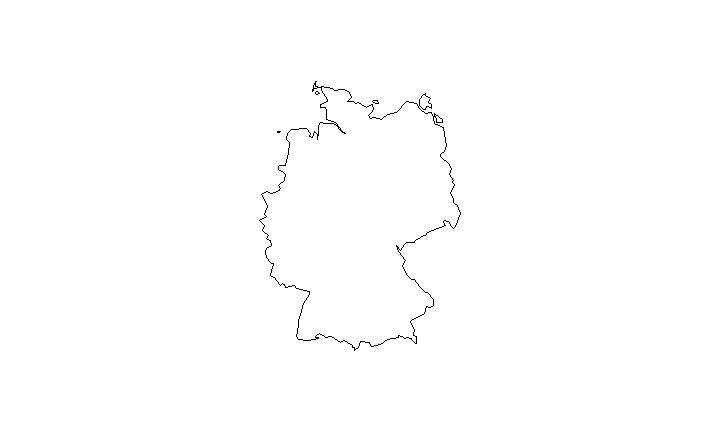<!-- -->

## R-Paket maps - zwei Länder


```r
map("world", c("Germany","Poland"))
```

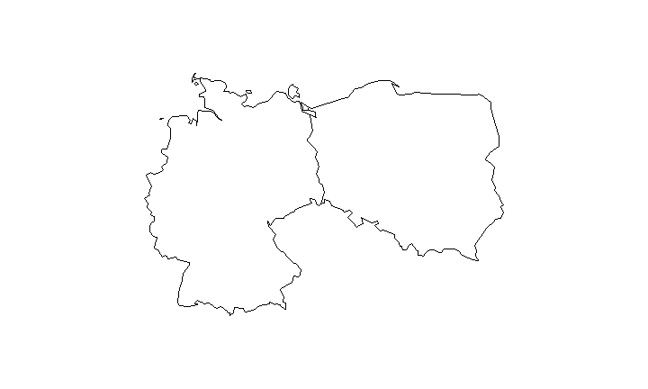<!-- -->


## Zwei Länder mit mehr Farbe 


```r
map("world", c("Germany","Austria"),fill=T,
col=c("red","green"))
```

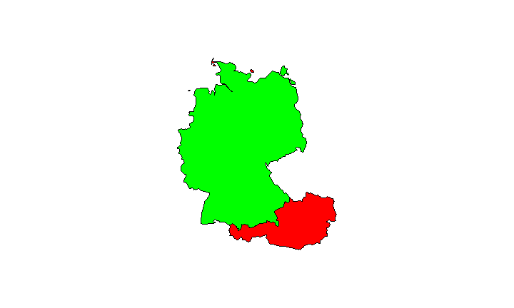<!-- -->


## R-Paket maps - mehr Feature


```r
map("world", "China")
map.scale()
```

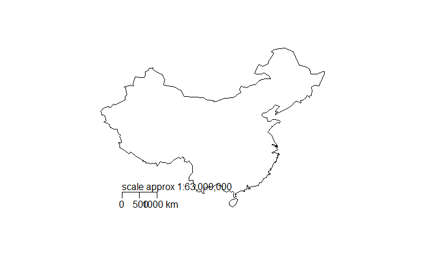<!-- -->

## R-Paket maps - mehr Feature

Wie `map`, aber mit Bezeichnungen für die Regionen:


```r
map.text("county", "penn")
```

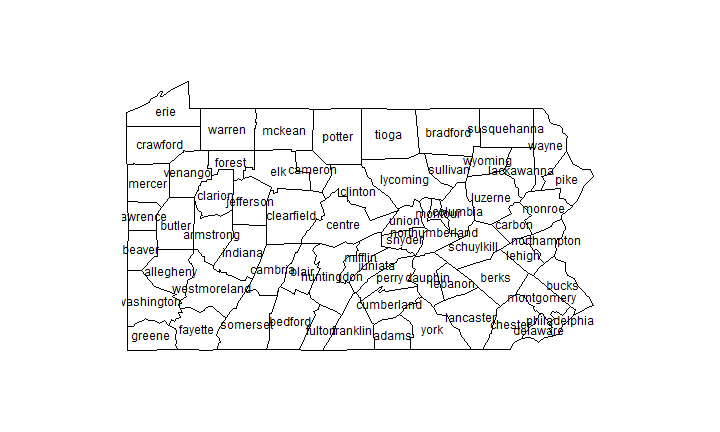<!-- -->

Counties in Pennsylvania 

## R-Paket maps - Städte der Welt

mit dem Befehl `data` kann man spezifische Datensätze einlesen.


```r
data(world.cities)
```

`head` - den ersten Teil eines Objekts zurück geben


```r
head(world.cities)
```


## Überblick über Datensatz Städte der Welt


name                 country.etc      pop     lat    long   capital
-------------------  ------------  ------  ------  ------  --------
'Abasan al-Jadidah   Palestine       5629   31.31   34.34         0
'Abasan al-Kabirah   Palestine      18999   31.32   34.35         0
'Abdul Hakim         Pakistan       47788   30.55   72.11         0
'Abdullah-as-Salam   Kuwait         21817   29.36   47.98         0
'Abud                Palestine       2456   32.03   35.07         0
'Abwein              Palestine       3434   32.03   35.20         0

## Die Städte der Welt kartieren 


```r
map()
map.cities(world.cities)
```

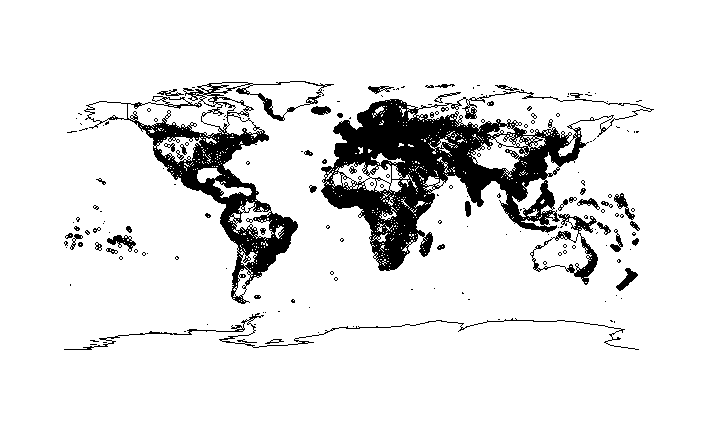<!-- -->

## Frankreichs Städte


```r
data(world.cities)
map("france")
map.cities(world.cities)
```

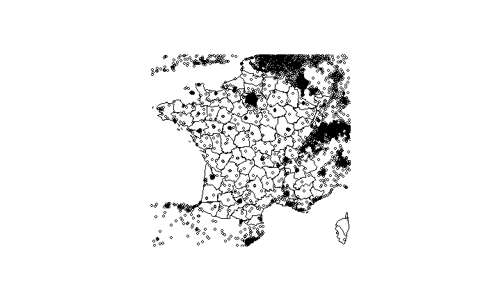<!-- -->

## Nur französische Städte 


```r
FrenchCity <- world.cities$country.etc=="France"
FCit <- world.cities[FrenchCity,]
```


      name        country.etc      pop     lat   long   capital
----  ----------  ------------  ------  ------  -----  --------
195   Abbeville   France         26656   50.12   1.83         0
318   Acheres     France         23219   48.97   2.06         0
477   Agde        France         23477   43.33   3.46         0
479   Agen        France         34742   44.20   0.62         0


## Nur französische Städte 

Jetzt ist es möglich nur die französischen Städte zu kartieren:


```r
map("france")
map.cities(FCit,col="blue",pch=20)
```

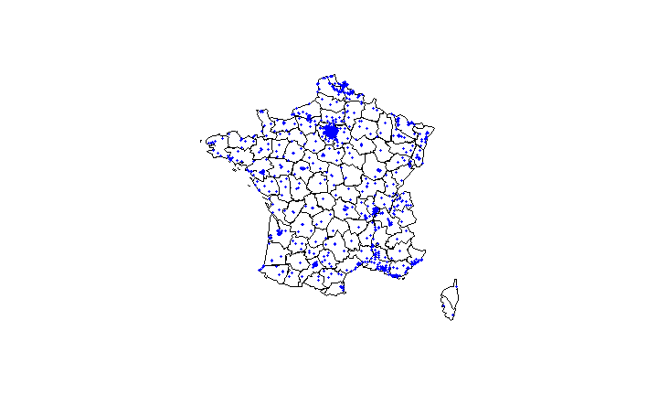<!-- -->

`pch` - plotting character, z.B., das Symbol das genutzt werden soll.


## Verschiedene Größen - verschiedene Farben 


```r
FCit_Bc<-FCit[FCit$pop>50000,]
map("france")
map.cities(FCit,col="blue",pch=20)
map.cities(FCit_Bc,col="red",pch=20)
```

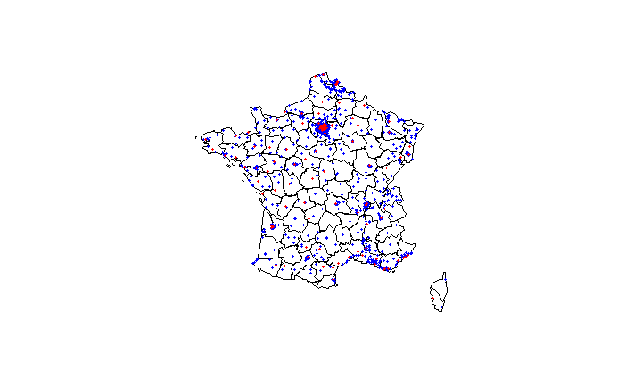<!-- -->

## Beispiel für Fortgeschrittene 

- Arthur Charpentier auf R-bloggers - [Where people live](http://www.r-bloggers.com/where-people-live/)


```r
library(maps)
data("world.cities")
X <- world.cities[,c("lat","pop")]
plot(world.cities$lon,world.cities$lat)
for(i in 1:length(X$lat)) {
  abline(h=X$lat[i],col=rgb(1,0,0,.001),lwd=2.7)  
}
```

## Wo leben viele Menschen


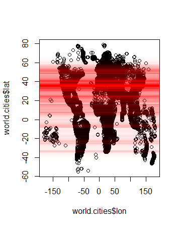

## Thematische Karten mit dem R-Paket maps

Datenbasis - CIA World DataBank II

> The [CIA World DataBank](http://www.evl.uic.edu/pape/data/WDB/) is a collection of world map data, consisting of vector descriptions of land outlines, rivers, political boundaries. It was created by U.S. government in the 1980s.


## Verschiedene Projektionen


```r
library(mapproj)
map("state", col="#01B8AA", bg="#374649", fill=TRUE, 
    proj="mercator")
```

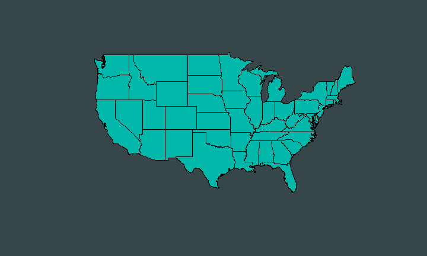<!-- -->

## Eine andere Projektion


```r
map("state", col="#01B8AA", bg="#374649", fill=TRUE, 
    proj="azequalarea")
```

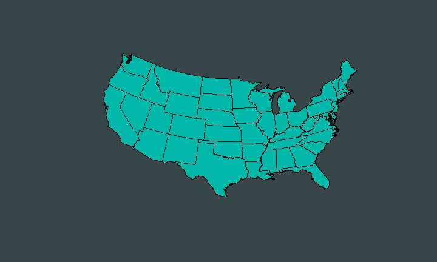<!-- -->

## Eine weitere Projektion


```r
map("state", col="#01B8AA", bg="#374649", fill=TRUE, 
    proj="guyou")
```

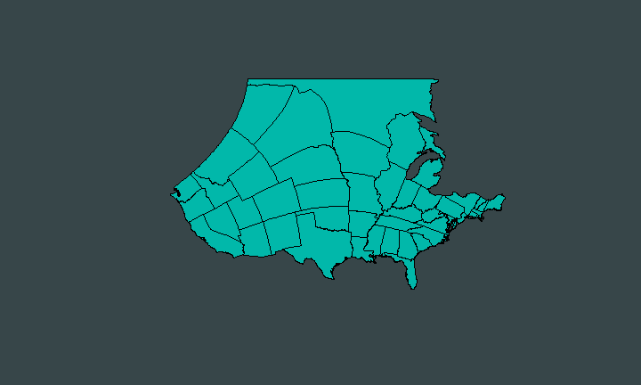<!-- -->

## Mehr Links und Quellen

- Steven Brey - [Using R — Working with Geospatial Data](http://mazamascience.com/WorkingWithData/?p=1277)

- Robin Lovelace, James Cheshire - [Introduction to visualising spatial data in R](https://cran.r-project.org/doc/contrib/intro-spatial-rl.pdf)

- Max Marchi - [Maps in R: Introduction - Drawing the map of Europe](http://www.milanor.net/blog/?p=534)
