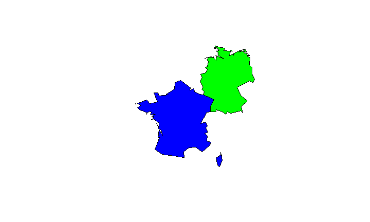
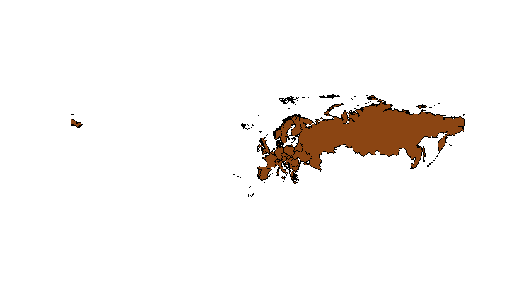
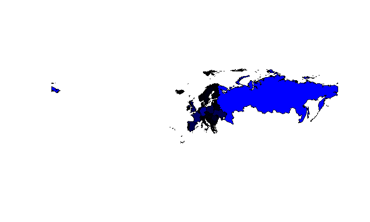
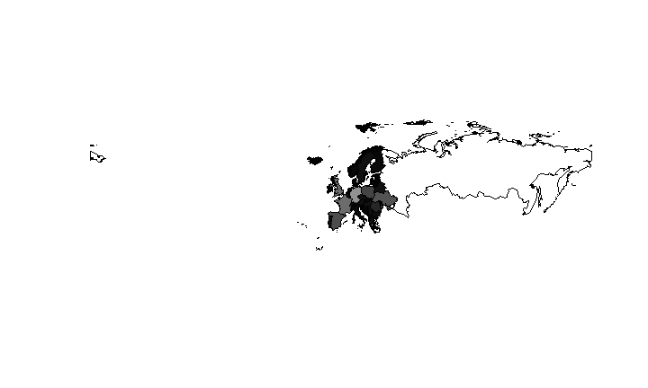
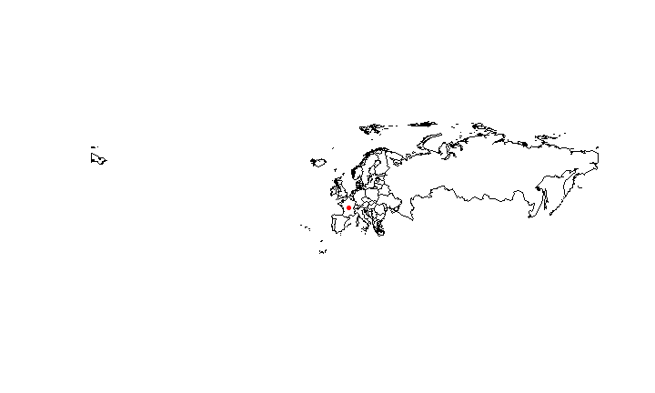

# Das Paket maptools
Jan-Philipp Kolb  
22 Februar 2017  


## Das Paket maptools

- Datensatz `wrld_simpl` aus dem Paket [maptools](https://cran.r-project.org/web/packages/maptools/index.html) 
- Polygone für fast alle Staaten der Erde


```r
library(maptools)
data(wrld_simpl)
```


      FIPS   ISO2   ISO3    UN  NAME                
----  -----  -----  -----  ---  --------------------
ATG   AC     AG     ATG     28  Antigua and Barbuda 
DZA   AG     DZ     DZA     12  Algeria             
AZE   AJ     AZ     AZE     31  Azerbaijan          
ALB   AL     AL     ALB      8  Albania             

## Hello world


```r
data(wrld_simpl)
plot(wrld_simpl)
```

<!-- -->


## Der shapefile

- Es handelt sich um einen `shapefile` 


```r
typeof(wrld_simpl)
```

```
## [1] "S4"
```

- Die Daten sind als `S4` abgespeichert
- Es gibt verschiedene Slots
- In einem davon ist Information als `data.frame` gespeichert.

## Der Datensatz


```r
head(wrld_simpl@data)
```


      FIPS   ISO2   ISO3    UN  NAME                
----  -----  -----  -----  ---  --------------------
ATG   AC     AG     ATG     28  Antigua and Barbuda 
DZA   AG     DZ     DZA     12  Algeria             
AZE   AJ     AZ     AZE     31  Azerbaijan          
ALB   AL     AL     ALB      8  Albania             


## Die Struktur der Daten


```r
head(wrld_simpl@data$NAME)
```

```
## [1] Antigua and Barbuda Algeria             Azerbaijan         
## [4] Albania             Armenia             Angola             
## 246 Levels: Aaland Islands Afghanistan Albania Algeria ... Zimbabwe
```


## Eine logische Abfrage


```r
ind_SA <- wrld_simpl@data$NAME =="South Africa"
head(ind_SA)
```

```
## [1] FALSE FALSE FALSE FALSE FALSE FALSE
```


```r
table(ind_SA)
```

```
## ind_SA
## FALSE  TRUE 
##   245     1
```

## Eine Karte für Süd Afrika

- Ein Land zeichnen


```r
SouthAfrica <- wrld_simpl[ind_SA,]
plot(SouthAfrica)
```

<!-- -->

## Mehr als ein Land zeichnen


```r
EuropeList <- c('Germany', 'France')
my_map <- wrld_simpl[wrld_simpl$NAME %in% EuropeList, ]
par(mai=c(0,0,0,0))
plot(my_map)
```

<!-- -->

## Mehr Farbe


```r
my_map@data$color <- c("blue","green")
plot(my_map,col=my_map@data$color)
```

<!-- -->

## Mehr Farbe für die Welt


```r
plot(wrld_simpl, bg='azure2', col='green',
     border='lightgray')
```

<!-- -->

## Eine Karte für Europa


```r
Europe <- wrld_simpl[wrld_simpl$REGION=="150",]
plot(Europe,col="royalblue")
```

<!-- -->


## Europa ohne Russland


```r
ind <- which(Europe@data$NAME=="Russia")
EU <- Europe[-ind,]
plot(EU,col="blue",border="darkgray")
```

<!-- -->

## Spielen Sie mit Farben


```r
EU$colors <- "green"
plot(EU,col=EU$colors,border="darkgray")
```

<!-- -->

```r
pop05 <- Europe$POP2005
Europe$colors[pop05>mean(pop05)] <- "royalblue"
plot(Europe,col=Europe$colors)
```

<!-- -->

## Mehr über Farben

[Colors in R](http://www.stat.columbia.edu/~tzheng/files/Rcolor.pdf)


```r
Europe$colors[pop05>median(pop05)] <- "chocolate4"
plot(Europe,col=Europe$colors)
```

<!-- -->

## Europa - Farbschattierung blau


```r
val <- Europe$POP2005/max(Europe$POP2005)
plot(Europe,col=rgb(0,0,val))
```

<!-- -->

## Europa - Farbschattierung rot


```r
val <- Europe$POP2005/max(Europe$POP2005)
plot(Europe,col=rgb(val,0,0))
```

<!-- -->

## Europa - Farbschattierung grün


```r
val <- Europe$POP2005/max(Europe$POP2005)
plot(Europe,col=rgb(0,val,0))
```

<!-- -->

## Europa - Farbschattierung grau


```r
val <- Europe$POP2005/max(Europe$POP2005)
plot(Europe,col=rgb(val,val,val))
```

<!-- -->

## Europa - zwei Graphiken nebeneinander


```r
par(mfrow=c(1,2))
plot(Europe,col=rgb(val,0,val))
plot(Europe,col=rgb(val,val,0))
```

<!-- -->

## Europa - Punkte hinzufügen


```r
which(Europe$ISO2=="FR") # 14
```

```
## [1] 10
```

```r
plot(Europe)
points(Europe$LON[14],Europe$LAT[14],col="red",pch=20)
```

<!-- -->

## Europa - Blasen hinzufügen


```r
pop <- Europe$POP2005
pop <- pop/max(pop)*10
plot(Europe)
points(Europe$LON,Europe$LAT,cex=pop,col=rgb(0,0,1,.2),
pch=20)
```

<!-- -->

## Europa - Text hinzufügen


```r
plot(Europe)
text(Europe$LON,Europe$LAT,Europe$ISO2,col="red")
```

<!-- -->

## Europa - Linien hinzufügen


```r
which(Europe$ISO2=="FR") # 15
which(Europe$ISO2=="DE") # 16
```


```r
Dat <- cbind(Europe$LON[15:16],Europe$LAT[15:16])
plot(Europe)
lines(Dat,col="red",lwd=2)
```

<!-- -->

