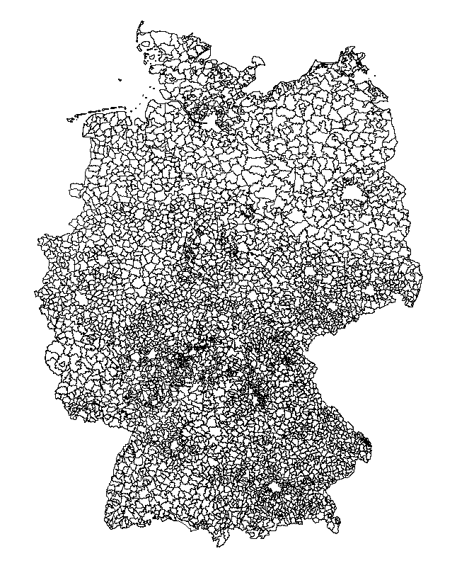
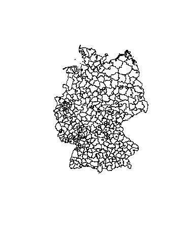
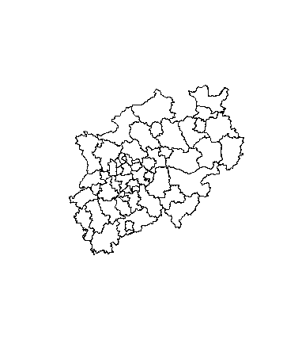
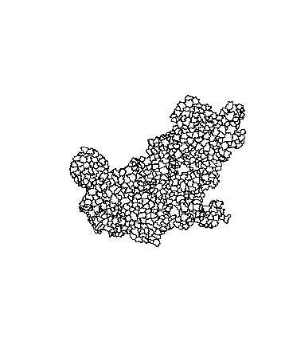
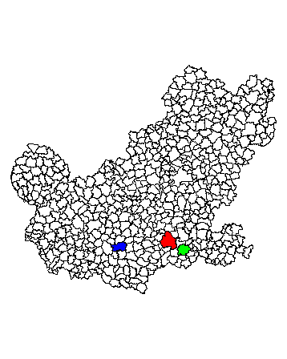
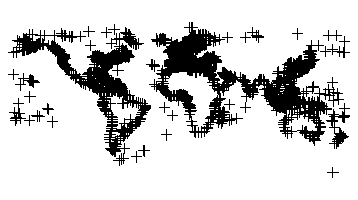

```{r setup, include=FALSE,echo=F}
knitr::opts_chunk$set(echo = TRUE,cache=T,eval=F,warning=F,message=F)
```


```{r,echo=F}
library(knitr)
```

## Das shapefile Format ... 

- ... ist ein beliebtes Format räumlicher Vektordaten für geographisches Informationssysteme (GIS).
- Es wurde entwickelt und reguliert von [ESRI](http://www.esri.com/)

- (meist) offene Spezifikation um Daten Interoperabilität zwischen Esri und anderen Formaten zu sichern. 

- Es können Punkte, Linien und Polygone beschrieben werden

- Jedes Element hat Attribute, wie bspw. Name oder Temperatur die es beschreiben.

Quelle: <https://en.wikipedia.org/wiki/Shapefile>


## Global Adminastrative Boundaries - [GADM](http://www.gadm.org/) - NUTS level 1

```{r}
library(raster)
```


```{r,warning=F,message=F,eval=T}
library(raster)
LUX1 <- getData('GADM', country='LUX', level=1)
plot(LUX1)
```


## Ein Blick auf die Daten

```{r,eval=F,echo=F}
LUXA <- LUX1[1,]
plot(LUXA)
```

Koordinaten im polygon slot
```{r,eval=F}
LUX1@polygons[[1]]@Polygons[[1]]@coords
```

```{r,echo=F,eval=T}
head(LUX1@polygons[[1]]@Polygons[[1]]@coords)
```

## Der Datenslot

```{r,eval=T}
head(LUX1@data)
```

```{r,eval=F,echo=F}
kable(head(LUX1@data))
```

## [GADM](http://www.gadm.org/)- NUTS level 3

```{r LUX3,warning=F,eval=T}
LUX3 <- getData('GADM', country='LUX', level=3)
plot(LUX3)
```

## [GADM](http://www.gadm.org/)- NUTS level 4

```{r LUX4,warning=F,eval=T}
LUX4 <- getData('GADM', country='LUX', level=4)
plot(LUX4)
```

## [GADM](http://www.gadm.org/)- NUTS level 3

```{r DEU3,warning=F,eval=F}
DEU3 <- getData('GADM', country='DEU', level=3)
plot(DEU3)
```



## PLZ für Deutschland

- <http://datahub.io/de/dataset/postal-codes-de>

- datahub.io funktioniert leider nicht mehr
- <http://arnulf.us/PLZ>

```{r,eval=F,echo=F}
setwd("D:/Daten/Daten/GeoDaten")
```

```{r}
library(rgdal)
```


```{r,echo=T,message=F,eval=F}
PLZ <- readOGR ("post_pl.shp","post_pl")
```


```{r,warning=F,message=F,eval=F,echo=F}
library(maptools)
PLZ <- readShapePoly("post_pl.shp")
```

## Der R Befehl readShapePoly

Um Shape-Dateien zu lesen, ist es notwendig, 
die drei Dateien mit den folgenden Dateierweiterungen im gleichen Verzeichnis zu haben:

- .shp
- .dbf
- .shx

## Mannheim zeichnen

```{r,echo=F}
#bbox4 <- bbox(MA)
```

```{r,eval=F,warning=F}
MA <- PLZ[PLZ@data$PLZORT99=="Mannheim",]
plot(MA)
```


## Gemeinden in Deutschland

[Bundesamt für Kartographie und Geodäsie (BKG)](http://www.geodatenzentrum.de/geodaten/gdz_rahmen.gdz_div?gdz_spr=deu&gdz_akt_zeile=5&gdz_anz_zeile=1&gdz_unt_zeile=15&gdz_user_id=0)

```{r,eval=F,echo=F}
setwd("D:/Daten/Daten/GeoDaten/vg250_ebenen")
```


```{r,cache=F,message=F,warning=F,eval=F}
library(maptools)
krs <- readShapePoly("vg250_krs.shp")
plot(krs)
```



## Kreise eines Bundeslandes

```{r,eval=F}
fds <- substr(krs@data$AGS,1,2)

plot(krs[fds=="05",])
```




## [Vorwahlbereiche in Deutschland](http://www.bundesnetzagentur.de/SharedDocs/Downloads/DE/Sachgebiete/Telekommunikation/Unternehmen_Institutionen/Nummerierung/Rufnummern/ONVerzeichnisse/ONBGrenzen/ONB_Grenzen.html)

<http://www.bundesnetzagentur.de/>

```{r,eval=F,echo=F}
setwd("D:/Daten/Daten/GeoDaten")
par(mai=c(0,0,0,0))
```


```{r,eval=F}
onb <- readShapePoly("onb_grenzen.shp")
```

```{r,eval=F,echo=F}
kable(head(onb@data))
```


|   |VORWAHL |NAME                 |KENNUNG |
|:--|:-------|:--------------------|:-------|
|0  |04651   |Sylt                 |NA      |
|1  |04668   |Klanxbüll            |NA      |
|2  |04664   |Neukirchen b Niebüll |NA      |
|3  |04663   |Süderlügum           |NA      |
|4  |04666   |Ladelund             |NA      |
|5  |04631   |Glücksburg Ostsee    |NA      |


## Vorwahlbereich 06

```{r,eval=F}
VW <- substr(onb@data$VORWAHL,1,2)
plot(onb[VW=="06",])
```



## Wo ist Mannheim?

```{r,eval=F}
Com <- onb@data$NAME
plot(onb[VW=="06",])
plot(onb[Com=="Mannheim",],col="red",add=T)
plot(onb[Com=="Heidelberg",],col="green",add=T)
plot(onb[Com=="Kaiserslautern",],col="blue",add=T)
```



## Andere Quellen

- [World Port Index](http://msi.nga.mil/NGAPortal/MSI.portal?_nfpb=true&_pageLabel=msi_portal_page_62&pubCode=0015)

```{r,echo=F,eval=F}
setwd("D:/Daten/Daten/GeoDaten/WPI_Shapefile")
```


```{r,message=F,warning=F,eval=F,echo=T}
library(rgdal)
WPI <- readOGR ("WPI.shp","WPI")
plot(WPI)
```




```{r,eval=F,echo=F}
git.path <- "C:/Users/kolbjp/Documents/GitHub/GeoData"
setwd(git.path)
```

Datenbanken für Karten

```{r,message=F,warning=F}
library(mapdata)
```

## Weitere Quellen

- [Eurostat Karten](http://epp.eurostat.ec.europa.eu/portal/page/portal/gisco_Geographical_information_maps/popups/
references/administrative_units_statistical_units_1)

- [Open linked data](https://www.ordnancesurvey.co.uk/business-and-government/products/opendata-products-grid.html)

- [World Borders Datensatz](http://thematicmapping.org/downloads/world_borders.php)

- [National Historical Information System](https://www.nhgis.org/)

- [Freie polygon Daten für die USA](http://www.freemapdata.com/html/free_polygon_data.html)

- [Spatial Data in R](https://science.nature.nps.gov/im/datamgmt/statistics/r/advanced/spatial.cfm)

- [ggmap und shapefiles](http://www.r-bloggers.com/shapefile-polygons-plotted-on-google-maps-using-ggmap-in-r-throw-some-throw-some-stats-on-that-mappart-2/)
