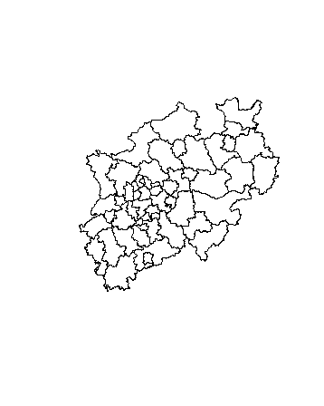

# Quellen für Polygone
Jan-Philipp Kolb  
22 Februar 2017  


## Das shapefile Format ... 

- ... ist ein beliebtes Format räumlicher Vektordaten für geographisches Informationssysteme (GIS).
- Es wurde entwickelt und reguliert von [ESRI](http://www.esri.com/)

- (meist) offene Spezifikation um Daten Interoperabilität zwischen Esri und anderen Formaten zu sichern. 

- Es können Punkte, Linien und Polygone beschrieben werden

- Jedes Element hat Attribute, wie bspw. Name oder Temperatur die es beschreiben.

Quelle: <https://en.wikipedia.org/wiki/Shapefile>


## Global Adminastrative Boundaries - [GADM](http://www.gadm.org/) - NUTS level 1


```r
library(raster)
```


```r
LUX1 <- getData('GADM', country='LUX', level=1)
plot(LUX1)
```

<!-- -->


## Ein Blick auf die Daten


Koordinaten im polygon slot

```r
LUX1@polygons[[1]]@Polygons[[1]]@coords
```

```
##             [,1]     [,2]
##    [1,] 6.026519 50.17767
##    [2,] 6.031361 50.16563
##    [3,] 6.035646 50.16410
##    [4,] 6.042747 50.16157
##    [5,] 6.043894 50.16116
##    [6,] 6.048243 50.16008
##    [7,] 6.058833 50.15779
##    [8,] 6.060411 50.15745
##    [9,] 6.070838 50.15641
##   [10,] 6.077541 50.15807
##   [11,] 6.080800 50.17240
##   [12,] 6.101561 50.17081
##   [13,] 6.107108 50.16858
##   [14,] 6.120430 50.16320
##   [15,] 6.124232 50.15381
##   [16,] 6.125362 50.15102
##   [17,] 6.124943 50.15047
##   [18,] 6.122098 50.14677
##   [19,] 6.121018 50.14440
##   [20,] 6.116489 50.13781
##   [21,] 6.116355 50.13762
##   [22,] 6.122279 50.13591
##   [23,] 6.127972 50.13428
##   [24,] 6.129925 50.13377
##   [25,] 6.129909 50.13396
##   [26,] 6.130544 50.13397
##   [27,] 6.138388 50.13408
##   [28,] 6.138383 50.13398
##   [29,] 6.138566 50.13307
##   [30,] 6.138630 50.13238
##   [31,] 6.138592 50.13188
##   [32,] 6.138363 50.13132
##   [33,] 6.137681 50.12990
##   [34,] 6.137762 50.12913
##   [35,] 6.137778 50.12848
##   [36,] 6.137531 50.12778
##   [37,] 6.137195 50.12708
##   [38,] 6.137173 50.12666
##   [39,] 6.137146 50.12616
##   [40,] 6.137166 50.12548
##   [41,] 6.136801 50.12460
##   [42,] 6.136288 50.12390
##   [43,] 6.135351 50.12343
##   [44,] 6.134352 50.12317
##   [45,] 6.133123 50.12297
##   [46,] 6.131697 50.12252
##   [47,] 6.130187 50.12201
##   [48,] 6.129602 50.12158
##   [49,] 6.129384 50.12106
##   [50,] 6.129343 50.12005
##   [51,] 6.128982 50.11915
##   [52,] 6.128761 50.11817
##   [53,] 6.128407 50.11718
##   [54,] 6.128274 50.11670
##   [55,] 6.128142 50.11620
##   [56,] 6.128367 50.11570
##   [57,] 6.128838 50.11494
##   [58,] 6.129386 50.11430
##   [59,] 6.130310 50.11394
##   [60,] 6.131619 50.11373
##   [61,] 6.132504 50.11379
##   [62,] 6.133610 50.11386
##   [63,] 6.134424 50.11372
##   [64,] 6.134995 50.11332
##   [65,] 6.134905 50.11285
##   [66,] 6.134433 50.11218
##   [67,] 6.133837 50.11141
##   [68,] 6.133229 50.11076
##   [69,] 6.132276 50.11001
##   [70,] 6.131601 50.10912
##   [71,] 6.130884 50.10821
##   [72,] 6.130906 50.10749
##   [73,] 6.131001 50.10695
##   [74,] 6.131363 50.10640
##   [75,] 6.131935 50.10599
##   [76,] 6.133036 50.10563
##   [77,] 6.133772 50.10537
##   [78,] 6.134610 50.10497
##   [79,] 6.135155 50.10437
##   [80,] 6.135557 50.10387
##   [81,] 6.135513 50.10338
##   [82,] 6.135015 50.10299
##   [83,] 6.134192 50.10275
##   [84,] 6.133188 50.10254
##   [85,] 6.132071 50.10259
##   [86,] 6.131166 50.10275
##   [87,] 6.130352 50.10289
##   [88,] 6.129341 50.10277
##   [89,] 6.127860 50.10242
##   [90,] 6.126733 50.10210
##   [91,] 6.126307 50.10184
##   [92,] 6.125934 50.10161
##   [93,] 6.125660 50.10120
##   [94,] 6.125566 50.10076
##   [95,] 6.125504 50.10048
##   [96,] 6.125529 50.09973
##   [97,] 6.125743 50.09885
##   [98,] 6.126365 50.09790
##   [99,] 6.127585 50.09626
##  [100,] 6.128274 50.09555
##  [101,] 6.128934 50.09514
##  [102,] 6.129842 50.09495
##  [103,] 6.131130 50.09497
##  [104,] 6.132022 50.09494
##  [105,] 6.132570 50.09480
##  [106,] 6.132927 50.09429
##  [107,] 6.133017 50.09381
##  [108,] 6.132981 50.09324
##  [109,] 6.132449 50.09273
##  [110,] 6.131628 50.09247
##  [111,] 6.130575 50.09232
##  [112,] 6.129636 50.09237
##  [113,] 6.128778 50.09250
##  [114,] 6.127985 50.09258
##  [115,] 6.127367 50.09285
##  [116,] 6.126470 50.09293
##  [117,] 6.125210 50.09308
##  [118,] 6.124389 50.09331
##  [119,] 6.123687 50.09368
##  [120,] 6.122933 50.09365
##  [121,] 6.121719 50.09332
##  [122,] 6.121093 50.09286
##  [123,] 6.120487 50.09221
##  [124,] 6.119946 50.09134
##  [125,] 6.119676 50.09041
##  [126,] 6.119481 50.08963
##  [127,] 6.119565 50.08871
##  [128,] 6.119585 50.08803
##  [129,] 6.119792 50.08723
##  [130,] 6.119678 50.08654
##  [131,] 6.119804 50.08566
##  [132,] 6.120084 50.08504
##  [133,] 6.120807 50.08444
##  [134,] 6.121524 50.08390
##  [135,] 6.122010 50.08346
##  [136,] 6.122143 50.08298
##  [137,] 6.122089 50.08212
##  [138,] 6.121986 50.08131
##  [139,] 6.121706 50.08050
##  [140,] 6.121331 50.07974
##  [141,] 6.120816 50.07906
##  [142,] 6.120137 50.07824
##  [143,] 6.119181 50.07751
##  [144,] 6.118600 50.07706
##  [145,] 6.118207 50.07650
##  [146,] 6.118211 50.07598
##  [147,] 6.117680 50.07548
##  [148,] 6.116867 50.07513
##  [149,] 6.116275 50.07479
##  [150,] 6.116140 50.07433
##  [151,] 6.116634 50.07381
##  [152,] 6.117359 50.07318
##  [153,] 6.118301 50.07261
##  [154,] 6.119123 50.07239
##  [155,] 6.120055 50.07240
##  [156,] 6.121019 50.07254
##  [157,] 6.121694 50.07294
##  [158,] 6.121998 50.07350
##  [159,] 6.122063 50.07425
##  [160,] 6.122445 50.07492
##  [161,] 6.123088 50.07566
##  [162,] 6.123593 50.07645
##  [163,] 6.124272 50.07679
##  [164,] 6.124929 50.07690
##  [165,] 6.125435 50.07672
##  [166,] 6.126067 50.07615
##  [167,] 6.126961 50.07561
##  [168,] 6.127890 50.07518
##  [169,] 6.128550 50.07478
##  [170,] 6.128954 50.07425
##  [171,] 6.129286 50.07355
##  [172,] 6.129115 50.07300
##  [173,] 6.128273 50.07248
##  [174,] 6.127007 50.07175
##  [175,] 6.126411 50.07146
##  [176,] 6.125747 50.07095
##  [177,] 6.124512 50.07036
##  [178,] 6.123525 50.06998
##  [179,] 6.122629 50.06957
##  [180,] 6.121904 50.06923
##  [181,] 6.121449 50.06887
##  [182,] 6.121262 50.06849
##  [183,] 6.121223 50.06795
##  [184,] 6.121145 50.06591
##  [185,] 6.120982 50.06528
##  [186,] 6.120575 50.06486
##  [187,] 6.119841 50.06463
##  [188,] 6.119007 50.06451
##  [189,] 6.118155 50.06459
##  [190,] 6.117378 50.06482
##  [191,] 6.116674 50.06522
##  [192,] 6.116017 50.06560
##  [193,] 6.115467 50.06578
##  [194,] 6.114664 50.06581
##  [195,] 6.114185 50.06570
##  [196,] 6.113724 50.06540
##  [197,] 6.113664 50.06508
##  [198,] 6.113852 50.06416
##  [199,] 6.113854 50.06351
##  [200,] 6.113730 50.06293
##  [201,] 6.113397 50.06221
##  [202,] 6.112864 50.06124
##  [203,] 6.112355 50.06051
##  [204,] 6.112418 50.05983
##  [205,] 6.112563 50.05923
##  [206,] 6.113066 50.05859
##  [207,] 6.113758 50.05784
##  [208,] 6.114678 50.05751
##  [209,] 6.116015 50.05699
##  [210,] 6.117162 50.05660
##  [211,] 6.118116 50.05638
##  [212,] 6.119309 50.05645
##  [213,] 6.120002 50.05665
##  [214,] 6.120486 50.05719
##  [215,] 6.120509 50.05790
##  [216,] 6.120385 50.05876
##  [217,] 6.120319 50.05947
##  [218,] 6.120532 50.06005
##  [219,] 6.121081 50.06036
##  [220,] 6.122147 50.06037
##  [221,] 6.123140 50.06021
##  [222,] 6.123938 50.05975
##  [223,] 6.124140 50.05901
##  [224,] 6.123914 50.05809
##  [225,] 6.123363 50.05684
##  [226,] 6.122679 50.05607
##  [227,] 6.121828 50.05518
##  [228,] 6.121276 50.05441
##  [229,] 6.121309 50.05359
##  [230,] 6.121508 50.05288
##  [231,] 6.122053 50.05227
##  [232,] 6.123168 50.05174
##  [233,] 6.124266 50.05141
##  [234,] 6.125147 50.05101
##  [235,] 6.125796 50.05024
##  [236,] 6.126415 50.04930
##  [237,] 6.127184 50.04820
##  [238,] 6.127936 50.04728
##  [239,] 6.128856 50.04646
##  [240,] 6.129740 50.04555
##  [241,] 6.130893 50.04462
##  [242,] 6.131938 50.04389
##  [243,] 6.132632 50.04311
##  [244,] 6.133469 50.04192
##  [245,] 6.134030 50.04097
##  [246,] 6.134330 50.04012
##  [247,] 6.134307 50.03940
##  [248,] 6.133925 50.03873
##  [249,] 6.133093 50.03764
##  [250,] 6.132492 50.03693
##  [251,] 6.132320 50.03638
##  [252,] 6.132191 50.03537
##  [253,] 6.131991 50.03465
##  [254,] 6.131339 50.03402
##  [255,] 6.130613 50.03322
##  [256,] 6.129989 50.03228
##  [257,] 6.129617 50.03149
##  [258,] 6.129600 50.03072
##  [259,] 6.129668 50.02998
##  [260,] 6.130216 50.02934
##  [261,] 6.131151 50.02884
##  [262,] 6.133934 50.02757
##  [263,] 6.134910 50.02709
##  [264,] 6.135866 50.02684
##  [265,] 6.136775 50.02662
##  [266,] 6.137528 50.02616
##  [267,] 6.138359 50.02582
##  [268,] 6.139289 50.02537
##  [269,] 6.140432 50.02501
##  [270,] 6.141429 50.02480
##  [271,] 6.142593 50.02470
##  [272,] 6.143419 50.02441
##  [273,] 6.144266 50.02390
##  [274,] 6.145437 50.02310
##  [275,] 6.145884 50.02273
##  [276,] 6.145832 50.02233
##  [277,] 6.145522 50.02183
##  [278,] 6.145041 50.02127
##  [279,] 6.144485 50.02056
##  [280,] 6.143657 50.01990
##  [281,] 6.142564 50.01923
##  [282,] 6.141822 50.01860
##  [283,] 6.140891 50.01810
##  [284,] 6.140038 50.01773
##  [285,] 6.139369 50.01728
##  [286,] 6.138799 50.01671
##  [287,] 6.138318 50.01615
##  [288,] 6.137420 50.01577
##  [289,] 6.136483 50.01582
##  [290,] 6.135660 50.01608
##  [291,] 6.135048 50.01645
##  [292,] 6.134407 50.01714
##  [293,] 6.133419 50.01822
##  [294,] 6.133057 50.01878
##  [295,] 6.132447 50.01913
##  [296,] 6.131629 50.01933
##  [297,] 6.130833 50.01929
##  [298,] 6.130227 50.01913
##  [299,] 6.129768 50.01880
##  [300,] 6.129639 50.01828
##  [301,] 6.129939 50.01791
##  [302,] 6.130962 50.01741
##  [303,] 6.132153 50.01654
##  [304,] 6.133338 50.01573
##  [305,] 6.134432 50.01494
##  [306,] 6.135253 50.01423
##  [307,] 6.135931 50.01362
##  [308,] 6.136582 50.01282
##  [309,] 6.136830 50.01253
##  [310,] 6.137128 50.01218
##  [311,] 6.137516 50.01172
##  [312,] 6.138242 50.01119
##  [313,] 6.139124 50.01077
##  [314,] 6.140116 50.01061
##  [315,] 6.141415 50.01049
##  [316,] 6.143690 50.01037
##  [317,] 6.145208 50.01029
##  [318,] 6.146358 50.01033
##  [319,] 6.147287 50.01036
##  [320,] 6.148056 50.01022
##  [321,] 6.148670 50.00982
##  [322,] 6.149157 50.00935
##  [323,] 6.149644 50.00888
##  [324,] 6.149707 50.00820
##  [325,] 6.149554 50.00745
##  [326,] 6.149394 50.00630
##  [327,] 6.148072 50.00473
##  [328,] 6.147287 50.00361
##  [329,] 6.146780 50.00285
##  [330,] 6.146609 50.00230
##  [331,] 6.146583 50.00161
##  [332,] 6.146560 50.00090
##  [333,] 6.146282 50.00005
##  [334,] 6.145796 49.99906
##  [335,] 6.145279 49.99841
##  [336,] 6.144777 49.99808
##  [337,] 6.144020 49.99811
##  [338,] 6.143332 49.99834
##  [339,] 6.142491 49.99879
##  [340,] 6.141690 49.99931
##  [341,] 6.140167 49.99994
##  [342,] 6.139711 50.00006
##  [343,] 6.139313 50.00005
##  [344,] 6.138978 49.99983
##  [345,] 6.137987 49.99902
##  [346,] 6.137841 49.99867
##  [347,] 6.138016 49.99822
##  [348,] 6.138743 49.99756
##  [349,] 6.139495 49.99662
##  [350,] 6.140258 49.99605
##  [351,] 6.141266 49.99523
##  [352,] 6.141875 49.99488
##  [353,] 6.142648 49.99468
##  [354,] 6.143624 49.99469
##  [355,] 6.145297 49.99484
##  [356,] 6.146708 49.99495
##  [357,] 6.147694 49.99484
##  [358,] 6.150273 49.99431
##  [359,] 6.150728 49.99419
##  [360,] 6.151179 49.99363
##  [361,] 6.151733 49.99291
##  [362,] 6.152364 49.99184
##  [363,] 6.153522 49.98942
##  [364,] 6.154434 49.98889
##  [365,] 6.155241 49.98856
##  [366,] 6.156017 49.98816
##  [367,] 6.156507 49.98766
##  [368,] 6.157251 49.98721
##  [369,] 6.158114 49.98707
##  [370,] 6.159044 49.98701
##  [371,] 6.160195 49.98696
##  [372,] 6.161546 49.98716
##  [373,] 6.162586 49.98719
##  [374,] 6.163600 49.98704
##  [375,] 6.165022 49.98674
##  [376,] 6.166281 49.98641
##  [377,] 6.167601 49.98595
##  [378,] 6.168456 49.98573
##  [379,] 6.169447 49.98564
##  [380,] 6.170588 49.98553
##  [381,] 6.171593 49.98528
##  [382,] 6.172373 49.98480
##  [383,] 6.172560 49.98436
##  [384,] 6.172437 49.98411
##  [385,] 6.171999 49.98406
##  [386,] 6.171060 49.98412
##  [387,] 6.170009 49.98433
##  [388,] 6.169531 49.98419
##  [389,] 6.169145 49.98357
##  [390,] 6.168866 49.98286
##  [391,] 6.168923 49.98169
##  [392,] 6.168828 49.98112
##  [393,] 6.168426 49.98069
##  [394,] 6.167596 49.98009
##  [395,] 6.167164 49.97944
##  [396,] 6.166790 49.97870
##  [397,] 6.166802 49.97803
##  [398,] 6.166526 49.97729
##  [399,] 6.165970 49.97638
##  [400,] 6.165467 49.97545
##  [401,] 6.165147 49.97464
##  [402,] 6.164791 49.97371
##  [403,] 6.164751 49.97254
##  [404,] 6.164852 49.97143
##  [405,] 6.164933 49.97055
##  [406,] 6.165558 49.96962
##  [407,] 6.166341 49.96911
##  [408,] 6.167260 49.96820
##  [409,] 6.167767 49.96695
##  [410,] 6.168256 49.96589
##  [411,] 6.168770 49.96510
##  [412,] 6.168866 49.96495
##  [413,] 6.169339 49.96423
##  [414,] 6.169885 49.96350
##  [415,] 6.170674 49.96296
##  [416,] 6.171566 49.96250
##  [417,] 6.172620 49.96230
##  [418,] 6.173473 49.96226
##  [419,] 6.174405 49.96218
##  [420,] 6.175088 49.96199
##  [421,] 6.175586 49.96179
##  [422,] 6.175965 49.96128
##  [423,] 6.176032 49.96101
##  [424,] 6.176190 49.96020
##  [425,] 6.176301 49.95963
##  [426,] 6.176674 49.95878
##  [427,] 6.176880 49.95774
##  [428,] 6.177014 49.95667
##  [429,] 6.177147 49.95563
##  [430,] 6.177330 49.95473
##  [431,] 6.177346 49.95466
##  [432,] 6.177785 49.95404
##  [433,] 6.178698 49.95327
##  [434,] 6.179660 49.95293
##  [435,] 6.180643 49.95285
##  [436,] 6.182042 49.95308
##  [437,] 6.183461 49.95356
##  [438,] 6.185162 49.95437
##  [439,] 6.187275 49.95551
##  [440,] 6.187855 49.95596
##  [441,] 6.188217 49.95638
##  [442,] 6.187962 49.95674
##  [443,] 6.187416 49.95689
##  [444,] 6.186283 49.95716
##  [445,] 6.185276 49.95750
##  [446,] 6.184517 49.95804
##  [447,] 6.183914 49.95882
##  [448,] 6.183748 49.95967
##  [449,] 6.183496 49.96049
##  [450,] 6.183077 49.96119
##  [451,] 6.182224 49.96227
##  [452,] 6.181938 49.96298
##  [453,] 6.181772 49.96383
##  [454,] 6.182001 49.96473
##  [455,] 6.182565 49.96535
##  [456,] 6.184029 49.96680
##  [457,] 6.185493 49.96778
##  [458,] 6.186913 49.96826
##  [459,] 6.188344 49.96863
##  [460,] 6.189797 49.96874
##  [461,] 6.190994 49.96876
##  [462,] 6.191735 49.96841
##  [463,] 6.192317 49.96786
##  [464,] 6.192741 49.96711
##  [465,] 6.192858 49.96631
##  [466,] 6.192657 49.96559
##  [467,] 6.192590 49.96487
##  [468,] 6.192613 49.96413
##  [469,] 6.192766 49.96342
##  [470,] 6.193195 49.96260
##  [471,] 6.193707 49.96185
##  [472,] 6.193915 49.96103
##  [473,] 6.194047 49.96006
##  [474,] 6.193990 49.95923
##  [475,] 6.193607 49.95855
##  [476,] 6.193162 49.95759
##  [477,] 6.193196 49.95674
##  [478,] 6.193656 49.95607
##  [479,] 6.194633 49.95507
##  [480,] 6.195415 49.95427
##  [481,] 6.195969 49.95355
##  [482,] 6.196530 49.95274
##  [483,] 6.196995 49.95201
##  [484,] 6.197336 49.95120
##  [485,] 6.197624 49.95047
##  [486,] 6.197722 49.94987
##  [487,] 6.197696 49.94918
##  [488,] 6.197593 49.94858
##  [489,] 6.197562 49.94841
##  [490,] 6.198252 49.94843
##  [491,] 6.198454 49.94859
##  [492,] 6.199617 49.94951
##  [493,] 6.199569 49.95087
##  [494,] 6.199667 49.95142
##  [495,] 6.199975 49.95170
##  [496,] 6.200376 49.95217
##  [497,] 6.200664 49.95266
##  [498,] 6.201100 49.95315
##  [499,] 6.202612 49.95399
##  [500,] 6.203521 49.95457
##  [501,] 6.203675 49.95464
##  [502,] 6.204656 49.95503
##  [503,] 6.205202 49.95519
##  [504,] 6.205867 49.95519
##  [505,] 6.208096 49.95457
##  [506,] 6.208445 49.95448
##  [507,] 6.208440 49.95371
##  [508,] 6.208582 49.95338
##  [509,] 6.208722 49.95305
##  [510,] 6.209517 49.95244
##  [511,] 6.211040 49.95071
##  [512,] 6.211638 49.95023
##  [513,] 6.217448 49.95014
##  [514,] 6.220069 49.95006
##  [515,] 6.221376 49.95002
##  [516,] 6.223907 49.94994
##  [517,] 6.223606 49.94906
##  [518,] 6.221334 49.94784
##  [519,] 6.220117 49.94719
##  [520,] 6.218634 49.94601
##  [521,] 6.218423 49.94548
##  [522,] 6.216877 49.94542
##  [523,] 6.216597 49.94443
##  [524,] 6.218511 49.94370
##  [525,] 6.219947 49.94334
##  [526,] 6.219810 49.94281
##  [527,] 6.220921 49.94238
##  [528,] 6.221215 49.94158
##  [529,] 6.221702 49.94150
##  [530,] 6.223046 49.94093
##  [531,] 6.223210 49.94034
##  [532,] 6.224020 49.93997
##  [533,] 6.224750 49.93925
##  [534,] 6.224470 49.93867
##  [535,] 6.225388 49.93873
##  [536,] 6.225709 49.93831
##  [537,] 6.226058 49.93785
##  [538,] 6.227318 49.93658
##  [539,] 6.225680 49.93574
##  [540,] 6.225023 49.93540
##  [541,] 6.223549 49.93413
##  [542,] 6.223895 49.93357
##  [543,] 6.225244 49.93336
##  [544,] 6.225042 49.93273
##  [545,] 6.224301 49.93275
##  [546,] 6.224006 49.93193
##  [547,] 6.224858 49.93148
##  [548,] 6.225101 49.93136
##  [549,] 6.225887 49.93002
##  [550,] 6.226168 49.92939
##  [551,] 6.225963 49.92877
##  [552,] 6.225604 49.92844
##  [553,] 6.224545 49.92780
##  [554,] 6.224354 49.92781
##  [555,] 6.223886 49.92783
##  [556,] 6.223145 49.92714
##  [557,] 6.222184 49.92675
##  [558,] 6.221076 49.92632
##  [559,] 6.220033 49.92602
##  [560,] 6.219147 49.92561
##  [561,] 6.218497 49.92503
##  [562,] 6.218052 49.92423
##  [563,] 6.217967 49.92354
##  [564,] 6.218166 49.92297
##  [565,] 6.218716 49.92261
##  [566,] 6.219584 49.92241
##  [567,] 6.221622 49.92191
##  [568,] 6.221850 49.92185
##  [569,] 6.224547 49.92142
##  [570,] 6.225632 49.92127
##  [571,] 6.226965 49.92123
##  [572,] 6.228410 49.92119
##  [573,] 6.228968 49.92113
##  [574,] 6.229539 49.92094
##  [575,] 6.229942 49.92058
##  [576,] 6.230997 49.91952
##  [577,] 6.231752 49.91852
##  [578,] 6.232368 49.91742
##  [579,] 6.232933 49.91607
##  [580,] 6.233437 49.91512
##  [581,] 6.233467 49.91506
##  [582,] 6.233824 49.91419
##  [583,] 6.234043 49.91358
##  [584,] 6.234084 49.91312
##  [585,] 6.234003 49.91279
##  [586,] 6.233697 49.91249
##  [587,] 6.232890 49.91203
##  [588,] 6.232082 49.91157
##  [589,] 6.231776 49.91127
##  [590,] 6.231642 49.91123
##  [591,] 6.231274 49.91111
##  [592,] 6.230685 49.91109
##  [593,] 6.230016 49.91114
##  [594,] 6.228402 49.91143
##  [595,] 6.227726 49.91155
##  [596,] 6.227363 49.91149
##  [597,] 6.227087 49.91127
##  [598,] 6.227022 49.91076
##  [599,] 6.227091 49.91041
##  [600,] 6.227376 49.91011
##  [601,] 6.227909 49.90994
##  [602,] 6.228776 49.90932
##  [603,] 6.230422 49.90827
##  [604,] 6.231380 49.90747
##  [605,] 6.231880 49.90685
##  [606,] 6.232084 49.90621
##  [607,] 6.232047 49.90540
##  [608,] 6.232265 49.90462
##  [609,] 6.232696 49.90351
##  [610,] 6.233005 49.90295
##  [611,] 6.233140 49.90226
##  [612,] 6.233453 49.90084
##  [613,] 6.233643 49.90038
##  [614,] 6.234006 49.90003
##  [615,] 6.234590 49.89970
##  [616,] 6.235444 49.89923
##  [617,] 6.236381 49.89867
##  [618,] 6.237252 49.89801
##  [619,] 6.237534 49.89777
##  [620,] 6.238130 49.89728
##  [621,] 6.238997 49.89667
##  [622,] 6.239957 49.89625
##  [623,] 6.241424 49.89595
##  [624,] 6.243102 49.89572
##  [625,] 6.243747 49.89568
##  [626,] 6.245091 49.89563
##  [627,] 6.246106 49.89560
##  [628,] 6.246720 49.89534
##  [629,] 6.247128 49.89490
##  [630,] 6.247569 49.89410
##  [631,] 6.248174 49.89353
##  [632,] 6.249077 49.89292
##  [633,] 6.249725 49.89228
##  [634,] 6.250118 49.89160
##  [635,] 6.250288 49.89094
##  [636,] 6.250475 49.89049
##  [637,] 6.250988 49.89013
##  [638,] 6.253531 49.88894
##  [639,] 6.255798 49.88792
##  [640,] 6.256432 49.88745
##  [641,] 6.257395 49.88658
##  [642,] 6.257931 49.88595
##  [643,] 6.258286 49.88528
##  [644,] 6.258584 49.88443
##  [645,] 6.259113 49.88359
##  [646,] 6.259217 49.88312
##  [647,] 6.259766 49.88276
##  [648,] 6.260458 49.88245
##  [649,] 6.261007 49.88209
##  [650,] 6.261480 49.88174
##  [651,] 6.261639 49.88120
##  [652,] 6.262069 49.88093
##  [653,] 6.262709 49.88079
##  [654,] 6.263271 49.88069
##  [655,] 6.264070 49.88044
##  [656,] 6.266454 49.87976
##  [657,] 6.267924 49.87941
##  [658,] 6.269172 49.87908
##  [659,] 6.270237 49.87871
##  [660,] 6.271243 49.87820
##  [661,] 6.272094 49.87775
##  [662,] 6.272426 49.87734
##  [663,] 6.272891 49.87709
##  [664,] 6.273524 49.87702
##  [665,] 6.274195 49.87695
##  [666,] 6.274894 49.87698
##  [667,] 6.275572 49.87681
##  [668,] 6.276163 49.87681
##  [669,] 6.277024 49.87708
##  [670,] 6.277910 49.87749
##  [671,] 6.278824 49.87801
##  [672,] 6.279448 49.87846
##  [673,] 6.280084 49.87877
##  [674,] 6.281002 49.87883
##  [675,] 6.281966 49.87877
##  [676,] 6.282612 49.87855
##  [677,] 6.283079 49.87828
##  [678,] 6.283573 49.87770
##  [679,] 6.284319 49.87680
##  [680,] 6.285161 49.87602
##  [681,] 6.285995 49.87536
##  [682,] 6.286561 49.87511
##  [683,] 6.286971 49.87505
##  [684,] 6.287581 49.87516
##  [685,] 6.288412 49.87528
##  [686,] 6.289206 49.87531
##  [687,] 6.290001 49.87518
##  [688,] 6.290879 49.87491
##  [689,] 6.291530 49.87457
##  [690,] 6.291874 49.87418
##  [691,] 6.291920 49.87366
##  [692,] 6.291744 49.87266
##  [693,] 6.291726 49.87185
##  [694,] 6.292057 49.87112
##  [695,] 6.292358 49.87022
##  [696,] 6.293000 49.86947
##  [697,] 6.293841 49.86847
##  [698,] 6.294898 49.86754
##  [699,] 6.295397 49.86717
##  [700,] 6.295939 49.86678
##  [701,] 6.296540 49.86648
##  [702,] 6.297355 49.86628
##  [703,] 6.298244 49.86623
##  [704,] 6.299254 49.86633
##  [705,] 6.300604 49.86657
##  [706,] 6.301413 49.86695
##  [707,] 6.302686 49.86757
##  [708,] 6.303737 49.86813
##  [709,] 6.304123 49.86834
##  [710,] 6.305612 49.86902
##  [711,] 6.306937 49.86956
##  [712,] 6.307973 49.86985
##  [713,] 6.309154 49.87001
##  [714,] 6.310034 49.87007
##  [715,] 6.311001 49.86995
##  [716,] 6.311970 49.86920
##  [717,] 6.312830 49.86848
##  [718,] 6.313474 49.86771
##  [719,] 6.313998 49.86678
##  [720,] 6.314336 49.86597
##  [721,] 6.314409 49.86514
##  [722,] 6.314354 49.86425
##  [723,] 6.313884 49.86306
##  [724,] 6.313651 49.86219
##  [725,] 6.313724 49.86137
##  [726,] 6.314064 49.86052
##  [727,] 6.314536 49.85968
##  [728,] 6.315470 49.85863
##  [729,] 6.316367 49.85749
##  [730,] 6.317436 49.85590
##  [731,] 6.317827 49.85548
##  [732,] 6.318443 49.85501
##  [733,] 6.320589 49.85396
##  [734,] 6.321324 49.85329
##  [735,] 6.322110 49.85258
##  [736,] 6.322510 49.85205
##  [737,] 6.322744 49.85140
##  [738,] 6.322719 49.85068
##  [739,] 6.322301 49.84889
##  [740,] 6.321909 49.84731
##  [741,] 6.321565 49.84669
##  [742,] 6.321013 49.84592
##  [743,] 6.320495 49.84528
##  [744,] 6.320229 49.84478
##  [745,] 6.320142 49.84426
##  [746,] 6.320067 49.84360
##  [747,] 6.319765 49.84302
##  [748,] 6.319726 49.84245
##  [749,] 6.319855 49.84199
##  [750,] 6.319920 49.84125
##  [751,] 6.320089 49.84034
##  [752,] 6.320455 49.83970
##  [753,] 6.320939 49.83923
##  [754,] 6.321560 49.83871
##  [755,] 6.322637 49.83803
##  [756,] 6.324897 49.83697
##  [757,] 6.325908 49.83655
##  [758,] 6.326685 49.83627
##  [759,] 6.326852 49.83623
##  [760,] 6.312281 49.83550
##  [761,] 6.311520 49.84294
##  [762,] 6.317110 49.84692
##  [763,] 6.316876 49.84919
##  [764,] 6.316730 49.85063
##  [765,] 6.315773 49.85115
##  [766,] 6.315490 49.85073
##  [767,] 6.314039 49.84713
##  [768,] 6.313209 49.84605
##  [769,] 6.312673 49.84557
##  [770,] 6.311388 49.84475
##  [771,] 6.309841 49.84412
##  [772,] 6.308823 49.84388
##  [773,] 6.306700 49.84364
##  [774,] 6.303394 49.84359
##  [775,] 6.290839 49.84404
##  [776,] 6.286313 49.84428
##  [777,] 6.284100 49.84450
##  [778,] 6.281958 49.84485
##  [779,] 6.276210 49.84625
##  [780,] 6.275156 49.84532
##  [781,] 6.274245 49.84437
##  [782,] 6.272662 49.84208
##  [783,] 6.270860 49.84001
##  [784,] 6.270054 49.83893
##  [785,] 6.269528 49.83784
##  [786,] 6.268550 49.83505
##  [787,] 6.267947 49.83398
##  [788,] 6.267006 49.83296
##  [789,] 6.263642 49.83028
##  [790,] 6.262798 49.82936
##  [791,] 6.262534 49.82886
##  [792,] 6.262432 49.82833
##  [793,] 6.262528 49.82780
##  [794,] 6.263139 49.82684
##  [795,] 6.264539 49.82555
##  [796,] 6.272968 49.81944
##  [797,] 6.272037 49.81581
##  [798,] 6.271406 49.81457
##  [799,] 6.270946 49.81399
##  [800,] 6.269167 49.81242
##  [801,] 6.263498 49.80866
##  [802,] 6.261525 49.80719
##  [803,] 6.260425 49.80613
##  [804,] 6.258237 49.80337
##  [805,] 6.257137 49.80239
##  [806,] 6.253468 49.79960
##  [807,] 6.252364 49.79863
##  [808,] 6.251447 49.79754
##  [809,] 6.250278 49.79582
##  [810,] 6.248500 49.79375
##  [811,] 6.247712 49.79268
##  [812,] 6.247147 49.79145
##  [813,] 6.246308 49.78895
##  [814,] 6.245669 49.78773
##  [815,] 6.244750 49.78669
##  [816,] 6.242424 49.78479
##  [817,] 6.238343 49.78491
##  [818,] 6.238727 49.78969
##  [819,] 6.238657 49.79102
##  [820,] 6.238348 49.79232
##  [821,] 6.238039 49.79295
##  [822,] 6.237128 49.79403
##  [823,] 6.235885 49.79494
##  [824,] 6.235151 49.79532
##  [825,] 6.234342 49.79563
##  [826,] 6.232485 49.79603
##  [827,] 6.231532 49.79612
##  [828,] 6.229614 49.79613
##  [829,] 6.227723 49.79594
##  [830,] 6.226808 49.79576
##  [831,] 6.222865 49.79448
##  [832,] 6.222043 49.79425
##  [833,] 6.220184 49.79393
##  [834,] 6.218240 49.79377
##  [835,] 6.216264 49.79374
##  [836,] 6.214288 49.79383
##  [837,] 6.212341 49.79405
##  [838,] 6.210464 49.79448
##  [839,] 6.209588 49.79480
##  [840,] 6.207984 49.79558
##  [841,] 6.205791 49.79696
##  [842,] 6.198694 49.80204
##  [843,] 6.196330 49.80413
##  [844,] 6.194964 49.80562
##  [845,] 6.193471 49.80798
##  [846,] 6.191492 49.81069
##  [847,] 6.190897 49.81195
##  [848,] 6.190509 49.81410
##  [849,] 6.190517 49.81704
##  [850,] 6.190816 49.82001
##  [851,] 6.191469 49.82339
##  [852,] 6.186681 49.82442
##  [853,] 6.184825 49.82454
##  [854,] 6.183895 49.82448
##  [855,] 6.182983 49.82434
##  [856,] 6.181399 49.82385
##  [857,] 6.177279 49.82181
##  [858,] 6.175883 49.82128
##  [859,] 6.174361 49.82102
##  [860,] 6.173579 49.82106
##  [861,] 6.172102 49.82137
##  [862,] 6.169043 49.82222
##  [863,] 6.163537 49.82322
##  [864,] 6.161834 49.82372
##  [865,] 6.158706 49.82491
##  [866,] 6.156961 49.82537
##  [867,] 6.154065 49.82575
##  [868,] 6.150072 49.82598
##  [869,] 6.147075 49.82460
##  [870,] 6.145438 49.82408
##  [871,] 6.144516 49.82389
##  [872,] 6.142621 49.82368
##  [873,] 6.135985 49.82339
##  [874,] 6.134097 49.82306
##  [875,] 6.133275 49.82279
##  [876,] 6.131818 49.82208
##  [877,] 6.130614 49.82121
##  [878,] 6.129683 49.82018
##  [879,] 6.128525 49.81852
##  [880,] 6.127007 49.81702
##  [881,] 6.125124 49.81566
##  [882,] 6.122998 49.81446
##  [883,] 6.121437 49.81382
##  [884,] 6.119690 49.81337
##  [885,] 6.115014 49.81284
##  [886,] 6.113185 49.81250
##  [887,] 6.111571 49.81197
##  [888,] 6.108596 49.81055
##  [889,] 6.105773 49.81099
##  [890,] 6.104031 49.81145
##  [891,] 6.100135 49.81293
##  [892,] 6.097629 49.81373
##  [893,] 6.096813 49.81405
##  [894,] 6.095409 49.81481
##  [895,] 6.094234 49.81573
##  [896,] 6.093350 49.81679
##  [897,] 6.092816 49.81800
##  [898,] 6.092017 49.82113
##  [899,] 6.091727 49.82175
##  [900,] 6.090936 49.82283
##  [901,] 6.089910 49.82385
##  [902,] 6.088112 49.82529
##  [903,] 6.086130 49.82666
##  [904,] 6.083355 49.82838
##  [905,] 6.082120 49.82656
##  [906,] 6.081132 49.82557
##  [907,] 6.079984 49.82471
##  [908,] 6.078689 49.82403
##  [909,] 6.077971 49.82377
##  [910,] 6.077195 49.82360
##  [911,] 6.076355 49.82355
##  [912,] 6.075462 49.82367
##  [913,] 6.074659 49.82390
##  [914,] 6.073236 49.82460
##  [915,] 6.071922 49.82548
##  [916,] 6.067982 49.82846
##  [917,] 6.065808 49.82984
##  [918,] 6.064136 49.83055
##  [919,] 6.063210 49.83080
##  [920,] 6.061288 49.83108
##  [921,] 6.059337 49.83112
##  [922,] 6.058368 49.83106
##  [923,] 6.056483 49.83074
##  [924,] 6.055653 49.83047
##  [925,] 6.054133 49.82981
##  [926,] 6.050623 49.82787
##  [927,] 6.049155 49.82716
##  [928,] 6.047542 49.82659
##  [929,] 6.046644 49.82639
##  [930,] 6.045720 49.82625
##  [931,] 6.043824 49.82612
##  [932,] 6.040915 49.82614
##  [933,] 6.038065 49.82633
##  [934,] 6.033381 49.82681
##  [935,] 6.027617 49.82478
##  [936,] 6.025105 49.82245
##  [937,] 6.023852 49.82092
##  [938,] 6.023334 49.81964
##  [939,] 6.023213 49.81899
##  [940,] 6.023210 49.81767
##  [941,] 6.023543 49.81637
##  [942,] 6.024268 49.81520
##  [943,] 6.025270 49.81419
##  [944,] 6.028001 49.81197
##  [945,] 6.028819 49.81106
##  [946,] 6.029069 49.81056
##  [947,] 6.029145 49.81001
##  [948,] 6.028999 49.80947
##  [949,] 6.028676 49.80898
##  [950,] 6.028222 49.80855
##  [951,] 6.027038 49.80783
##  [952,] 6.025550 49.80731
##  [953,] 6.022229 49.80643
##  [954,] 6.020590 49.80576
##  [955,] 6.018209 49.80455
##  [956,] 6.015914 49.80323
##  [957,] 6.013746 49.80183
##  [958,] 6.012427 49.80083
##  [959,] 6.011298 49.79976
##  [960,] 6.010848 49.79916
##  [961,] 6.010260 49.79789
##  [962,] 6.009904 49.79591
##  [963,] 6.009947 49.79318
##  [964,] 6.010555 49.78965
##  [965,] 6.007829 49.78928
##  [966,] 6.002719 49.78827
##  [967,] 6.001015 49.78782
##  [968,] 5.997002 49.78655
##  [969,] 5.995162 49.78624
##  [970,] 5.993274 49.78603
##  [971,] 5.990877 49.78419
##  [972,] 5.989923 49.78313
##  [973,] 5.989552 49.78252
##  [974,] 5.988938 49.78057
##  [975,] 5.988815 49.77924
##  [976,] 5.988875 49.77790
##  [977,] 5.989394 49.77593
##  [978,] 5.990184 49.77471
##  [979,] 5.991291 49.77362
##  [980,] 5.993664 49.77164
##  [981,] 5.994594 49.77062
##  [982,] 5.994892 49.77007
##  [983,] 5.995002 49.76946
##  [984,] 5.994872 49.76885
##  [985,] 5.994549 49.76829
##  [986,] 5.993527 49.76729
##  [987,] 5.991454 49.76598
##  [988,] 5.989022 49.76490
##  [989,] 5.985591 49.76398
##  [990,] 5.983986 49.76344
##  [991,] 5.982587 49.76271
##  [992,] 5.981417 49.76180
##  [993,] 5.980578 49.76066
##  [994,] 5.980315 49.76004
##  [995,] 5.980026 49.75874
##  [996,] 5.979951 49.75740
##  [997,] 5.980026 49.75604
##  [998,] 5.980496 49.75350
##  [999,] 5.982200 49.75188
## [1000,] 5.986144 49.74841
## [1001,] 5.987048 49.74736
## [1002,] 5.988218 49.74548
## [1003,] 5.988975 49.74448
## [1004,] 5.990000 49.74345
## [1005,] 5.993468 49.74047
## [1006,] 5.994499 49.73944
## [1007,] 5.995257 49.73843
## [1008,] 5.996361 49.73653
## [1009,] 5.997999 49.73437
## [1010,] 5.998711 49.73325
## [1011,] 5.999100 49.73225
## [1012,] 5.999455 49.73071
## [1013,] 5.997127 49.72882
## [1014,] 5.996205 49.72778
## [1015,] 5.995843 49.72717
## [1016,] 5.995336 49.72593
## [1017,] 5.994591 49.72338
## [1018,] 5.992929 49.71941
## [1019,] 5.988688 49.71985
## [1020,] 5.985817 49.72002
## [1021,] 5.982812 49.72005
## [1022,] 5.980852 49.71995
## [1023,] 5.978964 49.71967
## [1024,] 5.978123 49.71947
## [1025,] 5.974117 49.71826
## [1026,] 5.972301 49.71796
## [1027,] 5.967622 49.71741
## [1028,] 5.965844 49.71694
## [1029,] 5.964221 49.71626
## [1030,] 5.962697 49.71545
## [1031,] 5.954741 49.71043
## [1032,] 5.951755 49.70873
## [1033,] 5.949354 49.70771
## [1034,] 5.946764 49.70700
## [1035,] 5.945072 49.70645
## [1036,] 5.942692 49.70532
## [1037,] 5.938943 49.70310
## [1038,] 5.933084 49.69933
## [1039,] 5.929104 49.70219
## [1040,] 5.923679 49.70326
## [1041,] 5.920444 49.70440
## [1042,] 5.916480 49.70671
## [1043,] 5.911072 49.71106
## [1044,] 5.908281 49.71231
## [1045,] 5.904775 49.71291
## [1046,] 5.902961 49.71292
## [1047,] 5.899532 49.71239
## [1048,] 5.891976 49.70977
## [1049,] 5.887047 49.70846
## [1050,] 5.889624 49.71011
## [1051,] 5.882627 49.71611
## [1052,] 5.876872 49.72215
## [1053,] 5.869064 49.72721
## [1054,] 5.860460 49.72802
## [1055,] 5.851987 49.72604
## [1056,] 5.848493 49.72523
## [1057,] 5.831935 49.72578
## [1058,] 5.831954 49.72635
## [1059,] 5.832017 49.72825
## [1060,] 5.827349 49.74523
## [1061,] 5.826678 49.74612
## [1062,] 5.794256 49.78923
## [1063,] 5.792281 49.79042
## [1064,] 5.782797 49.79613
## [1065,] 5.782459 49.79633
## [1066,] 5.768496 49.79638
## [1067,] 5.758751 49.79641
## [1068,] 5.757694 49.79642
## [1069,] 5.757602 49.79770
## [1070,] 5.757108 49.80459
## [1071,] 5.754362 49.81312
## [1072,] 5.753273 49.81400
## [1073,] 5.749579 49.81700
## [1074,] 5.747794 49.81845
## [1075,] 5.748942 49.82019
## [1076,] 5.751540 49.82414
## [1077,] 5.749722 49.83175
## [1078,] 5.748223 49.83467
## [1079,] 5.746118 49.83877
## [1080,] 5.750223 49.84066
## [1081,] 5.750579 49.84580
## [1082,] 5.753318 49.84573
## [1083,] 5.753322 49.84851
## [1084,] 5.753330 49.85362
## [1085,] 5.750109 49.85498
## [1086,] 5.753332 49.85527
## [1087,] 5.755500 49.85546
## [1088,] 5.757740 49.85566
## [1089,] 5.759565 49.85875
## [1090,] 5.758203 49.86237
## [1091,] 5.758098 49.86265
## [1092,] 5.757266 49.86830
## [1093,] 5.758082 49.86950
## [1094,] 5.768019 49.86924
## [1095,] 5.773461 49.86909
## [1096,] 5.775018 49.86905
## [1097,] 5.776657 49.86988
## [1098,] 5.782471 49.87613
## [1099,] 5.782749 49.87642
## [1100,] 5.782332 49.87658
## [1101,] 5.781986 49.87769
## [1102,] 5.785317 49.87725
## [1103,] 5.786361 49.87724
## [1104,] 5.788490 49.87603
## [1105,] 5.788075 49.87722
## [1106,] 5.787906 49.87771
## [1107,] 5.786120 49.88286
## [1108,] 5.773842 49.88851
## [1109,] 5.758537 49.89337
## [1110,] 5.756096 49.89428
## [1111,] 5.745097 49.89841
## [1112,] 5.744578 49.90067
## [1113,] 5.744249 49.90210
## [1114,] 5.744140 49.90258
## [1115,] 5.746311 49.90457
## [1116,] 5.753683 49.91133
## [1117,] 5.759871 49.91224
## [1118,] 5.766617 49.91985
## [1119,] 5.767329 49.92139
## [1120,] 5.768825 49.92462
## [1121,] 5.772483 49.93232
## [1122,] 5.778143 49.93843
## [1123,] 5.779319 49.94443
## [1124,] 5.778380 49.95050
## [1125,] 5.778992 49.95263
## [1126,] 5.781014 49.95968
## [1127,] 5.791535 49.96042
## [1128,] 5.795302 49.96423
## [1129,] 5.798164 49.96386
## [1130,] 5.801381 49.96344
## [1131,] 5.801556 49.96339
## [1132,] 5.810860 49.96092
## [1133,] 5.815623 49.96481
## [1134,] 5.816182 49.96894
## [1135,] 5.816674 49.97258
## [1136,] 5.827108 49.97401
## [1137,] 5.827370 49.97405
## [1138,] 5.836931 49.97554
## [1139,] 5.843355 49.97995
## [1140,] 5.843308 49.98331
## [1141,] 5.843251 49.98710
## [1142,] 5.839046 49.99097
## [1143,] 5.835201 49.99450
## [1144,] 5.827700 49.99947
## [1145,] 5.826968 50.00306
## [1146,] 5.826232 50.00666
## [1147,] 5.827960 50.01313
## [1148,] 5.833934 50.01558
## [1149,] 5.845753 50.02042
## [1150,] 5.855449 50.03042
## [1151,] 5.861655 50.04631
## [1152,] 5.859608 50.05872
## [1153,] 5.859366 50.06018
## [1154,] 5.859116 50.06171
## [1155,] 5.863943 50.06754
## [1156,] 5.874896 50.07390
## [1157,] 5.877115 50.07451
## [1158,] 5.883430 50.07623
## [1159,] 5.889813 50.07829
## [1160,] 5.891564 50.08622
## [1161,] 5.891685 50.08677
## [1162,] 5.894246 50.09442
## [1163,] 5.899429 50.10030
## [1164,] 5.899872 50.10210
## [1165,] 5.901382 50.10821
## [1166,] 5.902342 50.10977
## [1167,] 5.905460 50.11127
## [1168,] 5.925416 50.12087
## [1169,] 5.936615 50.12626
## [1170,] 5.951639 50.13350
## [1171,] 5.954149 50.13470
## [1172,] 5.967641 50.17080
## [1173,] 5.969772 50.17130
## [1174,] 5.987989 50.17551
## [1175,] 5.989902 50.17545
## [1176,] 6.002239 50.17652
## [1177,] 6.020686 50.18063
## [1178,] 6.024930 50.18162
## [1179,] 6.026519 50.17767
```


```
##          [,1]     [,2]
## [1,] 6.026519 50.17767
## [2,] 6.031361 50.16563
## [3,] 6.035646 50.16410
## [4,] 6.042747 50.16157
## [5,] 6.043894 50.16116
## [6,] 6.048243 50.16008
```

## Der Datenslot


```r
head(LUX1@data)
```


 OBJECTID   ID_0  ISO   NAME_0        ID_1  NAME_1         HASC_1    CCN_1  CCA_1   TYPE_1     ENGTYPE_1   NL_NAME_1   VARNAME_1            
---------  -----  ----  -----------  -----  -------------  -------  ------  ------  ---------  ----------  ----------  ---------------------
        1    131  LUX   Luxembourg       1  Diekirch       LU.DI        NA          District   District                Dikrech|Dikkrich     
        2    131  LUX   Luxembourg       2  Grevenmacher   LU.GR        NA          District   District                Gréivemaacher        
        3    131  LUX   Luxembourg       3  Luxembourg     LU.LU        NA          District   District                Lëtzebuerg|Luxemburg 

## [GADM](http://www.gadm.org/)- NUTS level 3

<http://www.gadm.org/>


```r
LUX3 <- getData('GADM', country='LUX', level=3)
plot(LUX3)
```

<!-- -->

## [GADM](http://www.gadm.org/)- NUTS level 4


```r
LUX4 <- getData('GADM', country='LUX', level=4)
plot(LUX4)
```

<!-- -->

## [GADM](http://www.gadm.org/)- NUTS level 3


```r
DEU3 <- getData('GADM', country='DEU', level=3)
plot(DEU3)
```


## PLZ für Deutschland

<http://datahub.io/de/dataset/postal-codes-de>


```r
library(rgdal)
```


```r
PLZ <- readOGR ("post_pl.shp","post_pl")
```


## Der R Befehl readShapePoly

Um Shape-Dateien zu lesen, ist es notwendig, 
die drei Dateien mit den folgenden Dateierweiterungen im gleichen Verzeichnis zu haben:

- .shp
- .dbf
- .shx

## Mannheim zeichnen


```r
MA <- PLZ[PLZ@data$PLZORT99=="Mannheim",]
plot(MA)
```


## Gemeinden in Deutschland

[Bundesamt für Kartographie und Geodäsie (BKG)](http://www.geodatenzentrum.de/geodaten/gdz_rahmen.gdz_div?gdz_spr=deu&gdz_akt_zeile=5&gdz_anz_zeile=1&gdz_unt_zeile=15&gdz_user_id=0)


```r
library(maptools)
krs <- readShapePoly("vg250_krs.shp")
plot(krs)
```


## Kreise eines Bundeslandes


```r
fds <- substr(krs@data$AGS,1,2)

plot(krs[fds=="05",])
```




## [Vorwahlbereiche in Deutschland](http://www.bundesnetzagentur.de/SharedDocs/Downloads/DE/Sachgebiete/Telekommunikation/Unternehmen_Institutionen/Nummerierung/Rufnummern/ONVerzeichnisse/ONBGrenzen/ONB_Grenzen.html)

<http://www.bundesnetzagentur.de/>


```r
onb <- readShapePoly("onb_grenzen.shp")

kable(head(onb@data))
```

|   |VORWAHL |NAME                 |KENNUNG |
|:--|:-------|:--------------------|:-------|
|0  |04651   |Sylt                 |NA      |
|1  |04668   |Klanxbüll            |NA      |
|2  |04664   |Neukirchen b Niebüll |NA      |
|3  |04663   |Süderlügum           |NA      |
|4  |04666   |Ladelund             |NA      |
|5  |04631   |Glücksburg Ostsee    |NA      |


## Vorwahlbereich 06


```r
VW <- substr(onb@data$VORWAHL,1,2)
plot(onb[VW=="06",])
```


## Wo ist Mannheim?


```r
Com <- onb@data$NAME
plot(onb[VW=="06",])
plot(onb[Com=="Mannheim",],col="red",add=T)
plot(onb[Com=="Heidelberg",],col="green",add=T)
plot(onb[Com=="Kaiserslautern",],col="blue",add=T)
```


## Andere Quellen

- [World Port Index](http://msi.nga.mil/NGAPortal/MSI.portal?_nfpb=true&_pageLabel=msi_portal_page_62&pubCode=0015)


```r
library(rgdal)
WPI <- readOGR ("WPI.shp","WPI")
plot(WPI)
```


Datenbanken für Karten


```r
library(mapdata)
```

## Weitere Quellen

- [Eurostat Karten](http://epp.eurostat.ec.europa.eu/portal/page/portal/gisco_Geographical_information_maps/popups/
references/administrative_units_statistical_units_1)

- [Open linked data](https://www.ordnancesurvey.co.uk/business-and-government/products/opendata-products-grid.html)

- [World Borders Datensatz](http://thematicmapping.org/downloads/world_borders.php)

- [National Historical Information System](https://www.nhgis.org/)

- [Freie polygon Daten für die USA](http://www.freemapdata.com/html/free_polygon_data.html)

- [Spatial Data in R](https://science.nature.nps.gov/im/datamgmt/statistics/r/advanced/spatial.cfm)

- [ggmap und shapefiles](http://www.r-bloggers.com/shapefile-polygons-plotted-on-google-maps-using-ggmap-in-r-throw-some-throw-some-stats-on-that-mappart-2/)
