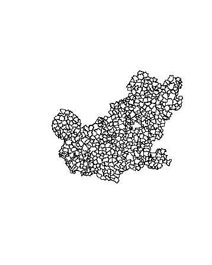

# Quellen für Polygone
Jan-Philipp Kolb  
22 Februar 2017  


## Das shapefile Format ... 

- ... ist ein beliebtes Format räumlicher Vektordaten für geographisches Informationssysteme (GIS).
- Es wurde entwickelt und reguliert von [ESRI](http://www.esri.com/)

- (meist) offene Spezifikation um Daten Interoperabilität zwischen Esri und anderen Formaten zu sichern. 

- Es können Punkte, Linien und Polygone beschrieben werden

- Jedes Element hat Attribute, wie bspw. Name oder Temperatur die es beschreiben.

Quelle: <https://en.wikipedia.org/wiki/Shapefile>


## Global Adminastrative Boundaries - [GADM](http://www.gadm.org/) - NUTS level 1


```r
library(raster)
```


```r
library(raster)
LUX1 <- getData('GADM', country='LUX', level=1)
plot(LUX1)
```

<!-- -->


## Ein Blick auf die Daten


Koordinaten im polygon slot

```r
LUX1@polygons[[1]]@Polygons[[1]]@coords
```


```
##          [,1]     [,2]
## [1,] 6.026519 50.17767
## [2,] 6.031361 50.16563
## [3,] 6.035646 50.16410
## [4,] 6.042747 50.16157
## [5,] 6.043894 50.16116
## [6,] 6.048243 50.16008
```

## Der Datenslot


```r
head(LUX1@data)
```

```
##   OBJECTID ID_0 ISO     NAME_0 ID_1       NAME_1 HASC_1 CCN_1 CCA_1
## 1        1  131 LUX Luxembourg    1     Diekirch  LU.DI    NA      
## 2        2  131 LUX Luxembourg    2 Grevenmacher  LU.GR    NA      
## 3        3  131 LUX Luxembourg    3   Luxembourg  LU.LU    NA      
##     TYPE_1 ENGTYPE_1 NL_NAME_1            VARNAME_1
## 1 District  District               Dikrech|Dikkrich
## 2 District  District                  Gréivemaacher
## 3 District  District           Lëtzebuerg|Luxemburg
```


## [GADM](http://www.gadm.org/)- NUTS level 3


```r
LUX3 <- getData('GADM', country='LUX', level=3)
plot(LUX3)
```

<!-- -->

## [GADM](http://www.gadm.org/)- NUTS level 4


```r
LUX4 <- getData('GADM', country='LUX', level=4)
plot(LUX4)
```

<!-- -->

## [GADM](http://www.gadm.org/)- NUTS level 3


```r
DEU3 <- getData('GADM', country='DEU', level=3)
plot(DEU3)
```


## PLZ für Deutschland

- <http://datahub.io/de/dataset/postal-codes-de>

- datahub.io funktioniert leider nicht mehr
- <http://arnulf.us/PLZ>


```r
library(rgdal)
```


```r
PLZ <- readOGR ("post_pl.shp","post_pl")
```


## Der R Befehl readShapePoly

Um Shape-Dateien zu lesen, ist es notwendig, 
die drei Dateien mit den folgenden Dateierweiterungen im gleichen Verzeichnis zu haben:

- .shp
- .dbf
- .shx

## Mannheim zeichnen


```r
MA <- PLZ[PLZ@data$PLZORT99=="Mannheim",]
plot(MA)
```


## Gemeinden in Deutschland

[Bundesamt für Kartographie und Geodäsie (BKG)](http://www.geodatenzentrum.de/geodaten/gdz_rahmen.gdz_div?gdz_spr=deu&gdz_akt_zeile=5&gdz_anz_zeile=1&gdz_unt_zeile=15&gdz_user_id=0)


```r
library(maptools)
krs <- readShapePoly("vg250_krs.shp")
plot(krs)
```


## Kreise eines Bundeslandes


```r
fds <- substr(krs@data$AGS,1,2)

plot(krs[fds=="05",])
```


## [Vorwahlbereiche in Deutschland](http://www.bundesnetzagentur.de/SharedDocs/Downloads/DE/Sachgebiete/Telekommunikation/Unternehmen_Institutionen/Nummerierung/Rufnummern/ONVerzeichnisse/ONBGrenzen/ONB_Grenzen.html)

<http://www.bundesnetzagentur.de/>


```r
onb <- readShapePoly("onb_grenzen.shp")
```


|   |VORWAHL |NAME                 |KENNUNG |
|:--|:-------|:--------------------|:-------|
|0  |04651   |Sylt                 |NA      |
|1  |04668   |Klanxbüll            |NA      |
|2  |04664   |Neukirchen b Niebüll |NA      |
|3  |04663   |Süderlügum           |NA      |
|4  |04666   |Ladelund             |NA      |
|5  |04631   |Glücksburg Ostsee    |NA      |


## Vorwahlbereich 06


```r
VW <- substr(onb@data$VORWAHL,1,2)
plot(onb[VW=="06",])
```



## Wo ist Mannheim?


```r
Com <- onb@data$NAME
plot(onb[VW=="06",])
plot(onb[Com=="Mannheim",],col="red",add=T)
plot(onb[Com=="Heidelberg",],col="green",add=T)
plot(onb[Com=="Kaiserslautern",],col="blue",add=T)
```


## Andere Quellen

- [World Port Index](http://msi.nga.mil/NGAPortal/MSI.portal?_nfpb=true&_pageLabel=msi_portal_page_62&pubCode=0015)


```r
library(rgdal)
WPI <- readOGR ("WPI.shp","WPI")
plot(WPI)
```


Datenbanken für Karten


```r
library(mapdata)
```

## Weitere Quellen

- [Eurostat Karten](http://epp.eurostat.ec.europa.eu/portal/page/portal/gisco_Geographical_information_maps/popups/
references/administrative_units_statistical_units_1)

- [Open linked data](https://www.ordnancesurvey.co.uk/business-and-government/products/opendata-products-grid.html)

- [World Borders Datensatz](http://thematicmapping.org/downloads/world_borders.php)

- [National Historical Information System](https://www.nhgis.org/)

- [Freie polygon Daten für die USA](http://www.freemapdata.com/html/free_polygon_data.html)

- [Spatial Data in R](https://science.nature.nps.gov/im/datamgmt/statistics/r/advanced/spatial.cfm)

- [ggmap und shapefiles](http://www.r-bloggers.com/shapefile-polygons-plotted-on-google-maps-using-ggmap-in-r-throw-some-throw-some-stats-on-that-mappart-2/)
