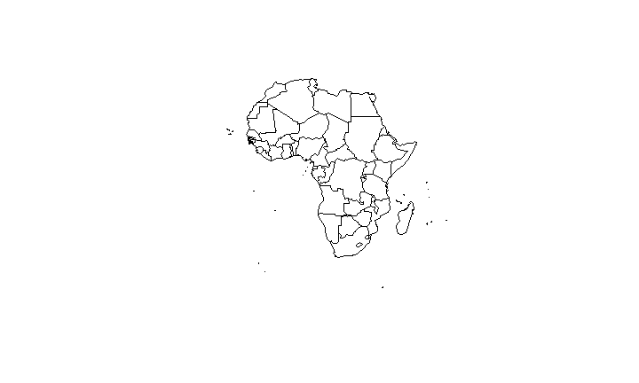
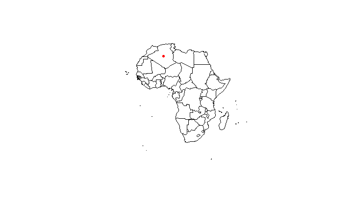
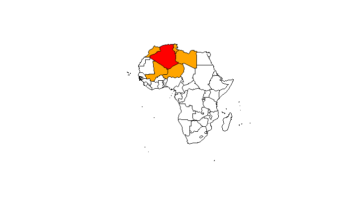
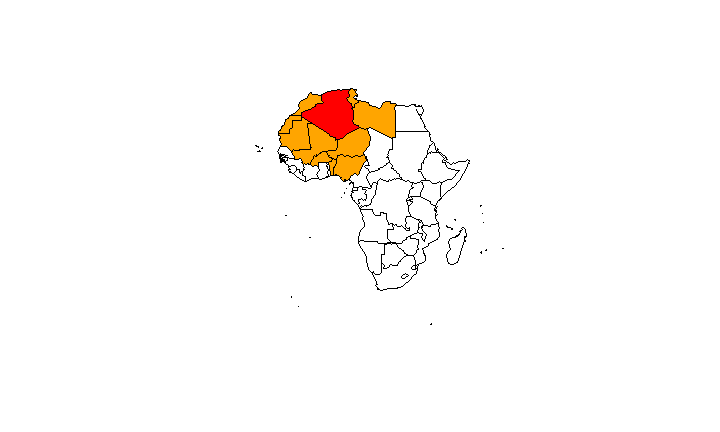
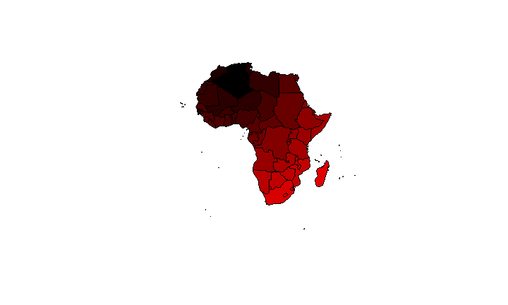

# R-Paket spdep
Jan-Philipp Kolb  
22 Februar 2017  


## Das erste Gesetz der Geographie (TFLG)


> "All things are related, but nearby things are more related than distant things"
[Tobler, 1970]


## Eine Karte von Afrika


```r
library(maptools)
data(wrld_simpl)
Africa <- wrld_simpl[wrld_simpl@data$REGION==2,]
plot(Africa)
```

<!-- -->


## Das Zentrum eines Polygonzuges


```r
library(sp)
Af <- coordinates(Africa)
plot(Africa)
points(x=Af[1,1],y=Af[1,2],col="red",pch=20)
```

<!-- -->

## Die nächsten Nachbarn finden


```r
library(spdep)
Af_nb <- tri2nb(Af)
```

Die Nachbarn für das erste Land:


```r
Af_nb[1]
```

```
## [[1]]
## [1] 24 26 27 32 48
```

## Die Nachbarn finden


```r
plot(Africa)
plot(Africa[1,],col="red",add=T)
plot(Africa[Af_nb[1][[1]],],col="orange",add=T)
```

<!-- -->

## Die 10 nächsten Nachbarn finden


```r
IDs <- row.names(as(Africa, "data.frame"))
Af10_nb <- knn2nb(knearneigh(Af, k = 10), row.names = IDs)
plot(Africa)
plot(Africa[1,],col="red",add=T)
plot(Africa[Af10_nb[1][[1]],],col="orange",add=T)
```

<!-- -->

## Die Distanz berechnen


```r
Af <- coordinates(Africa) # get centroid
library(raster)
pointDistance(Af[1:4,], lonlat=TRUE) # compute distance
```

```
##         [,1]    [,2]    [,3] [,4]
## [1,]       0      NA      NA   NA
## [2,] 4763231       0      NA   NA
## [3,] 2055609 2954497       0   NA
## [4,] 3484053 1295173 1839191    0
```

## Berechnen/zeichnen einer Distanzmatrix


```r
Dist_Af <- pointDistance(Af, lonlat=TRUE)
Af_color <- Dist_Af[,1]
Af_color <- Af_color/max(Af_color)
Af_color <- rgb(Af_color,0,0)
plot(Africa,col=Af_color)
```

<!-- -->


## Links

- [Raster, CMSAF and solaR](https://procomun.wordpress.com/2011/06/17/raster-cmsaf-and-solar/)

<https://procomun.wordpress.com/2011/06/17/raster-cmsaf-and-solar/>

- [Getting rasters into shape from R](https://johnbaumgartner.wordpress.com/2012/07/26/getting-rasters-into-shape-from-r/)

<https://johnbaumgartner.wordpress.com/2012/07/26/getting-rasters-into-shape-from-r/>
