# Das R-Paket tmap
Jan-Philipp Kolb  
22 Februar 2017  


## Das Paket [tmap](https://cran.r-project.org/web/packages/tmap/index.html)

- Laden Sie das Paket [tmap](http://twitter.com/sharon000/status/593028906820599808/photo/1?ref_src=twsrc%5Etfw)
- Die folgenden Beispiele sind auf der [Vignette](https://cran.r-project.org/web/packages/tmap/vignettes/tmap-nutshell.html) des Paketes basiert.


```r
# install.packages("tmap")
library(tmap)
```


## Schnelle thematische Karte

- [qtm](https://cran.r-project.org/web/packages/tmap/vignettes/tmap-nutshell.html) - Quick thematic map plot

<https://cran.r-project.org/web/packages/tmap/vignettes/tmap-nutshell.html>


```r
data(Europe)
qtm(Europe)
```

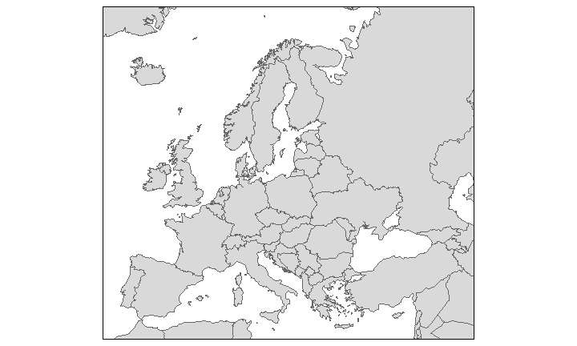<!-- -->


## Der Europa-Datensatz


      iso_a3   name               sovereignt               continent     
----  -------  -----------------  -----------------------  --------------
5     ALB      Albania            Albania                  Europe        
6     ALA      Aland              Finland                  Europe        
7     AND      Andorra            Andorra                  Europe        
10    ARM      Armenia            Armenia                  Asia          
17    AUT      Austria            Austria                  Europe        
18    AZE      Azerbaijan         Azerbaijan               Asia          
20    BEL      Belgium            Belgium                  Europe        
24    BGR      Bulgaria           Bulgaria                 Europe        
27    BIH      Bosnia and Herz.   Bosnia and Herzegovina   Europe        
29    BLR      Belarus            Belarus                  Europe        
40    CHE      Switzerland        Switzerland              Europe        
56    CYP      Cyprus             Cyprus                   Asia          
57    CZE      Czech Rep.         Czech Republic           Europe        
58    DEU      Germany            Germany                  Europe        
61    DNK      Denmark            Denmark                  Europe        
63    DZA      Algeria            Algeria                  Africa        
67    ESP      Spain              Spain                    Europe        
68    EST      Estonia            Estonia                  Europe        
70    FIN      Finland            Finland                  Europe        
73    FRA      France             France                   Europe        
74    FRO      Faeroe Is.         Denmark                  Europe        
77    GBR      United Kingdom     United Kingdom           Europe        
78    GEO      Georgia            Georgia                  Asia          
79    GGY      Guernsey           United Kingdom           Europe        
85    GRC      Greece             Greece                   Europe        
87    GRL      Greenland          Denmark                  North America 
94    HRV      Croatia            Croatia                  Europe        
96    HUN      Hungary            Hungary                  Europe        
98    IMN      Isle of Man        United Kingdom           Europe        
102   IRL      Ireland            Ireland                  Europe        
103   IRN      Iran               Iran                     Asia          
104   IRQ      Iraq               Iraq                     Asia          
105   ISL      Iceland            Iceland                  Europe        
106   ISR      Israel             Israel                   Asia          
107   ITA      Italy              Italy                    Europe        
109   JEY      Jersey             United Kingdom           Europe        
110   JOR      Jordan             Jordan                   Asia          
113   KAZ      Kazakhstan         Kazakhstan               Asia          
120   NA       Kosovo             Kosovo                   Europe        
123   LBN      Lebanon            Lebanon                  Asia          
127   LIE      Liechtenstein      Liechtenstein            Europe        
130   LTU      Lithuania          Lithuania                Europe        
131   LUX      Luxembourg         Luxembourg               Europe        
132   LVA      Latvia             Latvia                   Europe        
135   MAR      Morocco            Morocco                  Africa        
136   MCO      Monaco             Monaco                   Europe        
137   MDA      Moldova            Moldova                  Europe        
142   MKD      Macedonia          Macedonia                Europe        
144   MLT      Malta              Malta                    Europe        
146   MNE      Montenegro         Montenegro               Europe        
162   NLD      Netherlands        Netherlands              Europe        
163   NOR      Norway             Norway                   Europe        
175   POL      Poland             Poland                   Europe        
178   PRT      Portugal           Portugal                 Europe        
180   PSE      Palestine          Israel                   Asia          
183   ROU      Romania            Romania                  Europe        
184   RUS      Russia             Russia                   Europe        
187   SAU      Saudi Arabia       Saudi Arabia             Asia          
197   SMR      San Marino         San Marino               Europe        
201   SRB      Serbia             Republic of Serbia       Europe        
204   SVK      Slovakia           Slovakia                 Europe        
205   SVN      Slovenia           Slovenia                 Europe        
206   SWE      Sweden             Sweden                   Europe        
210   SYR      Syria              Syria                    Asia          
220   TUN      Tunisia            Tunisia                  Africa        
221   TUR      Turkey             Turkey                   Asia          
225   UKR      Ukraine            Ukraine                  Europe        
229   VAT      Vatican            Vatican                  Europe        

## Um mehr Farbe in die Karte zu bekommen

- Visualisierung von  [Natural Earth](http://www.naturalearthdata.com/) Daten

<http://www.naturalearthdata.com/>


```r
qtm(Europe, fill="gdp_cap_est")
```

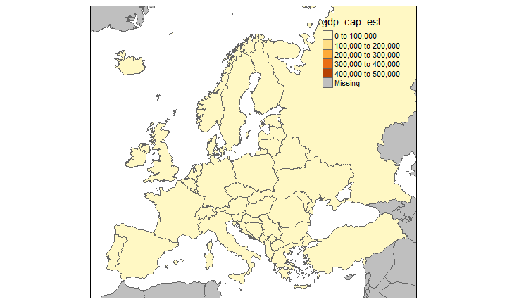<!-- -->


## Eine Karte mit Text 


```r
qtm(Europe, fill="gdp_cap_est", text="iso_a3")
```

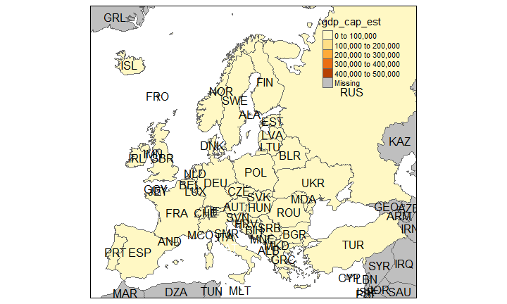<!-- -->

## Dieses Schema passt besser:


```r
qtm(Europe, fill="gdp_cap_est", text="iso_a3", 
    text.size="AREA", root=5, fill.title="GDP per capita", 
    fill.textNA="Non-European countries", theme="Europe")
```

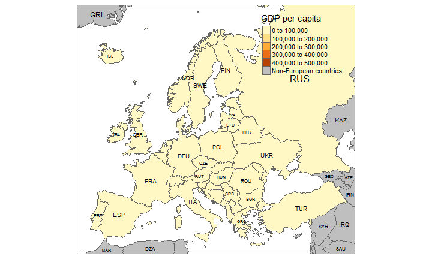<!-- -->


## [Bevölkerungsdichte](https://en.wikipedia.org/wiki/Population_density)


```r
qtm(Europe, fill="pop_est_dens", 
    fill.title="Population density")
```

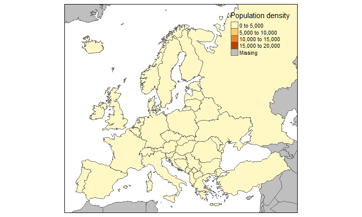<!-- -->

## Themen des Europa-Datensatzes

- [ISO Klassifikation](http://userpage.chemie.fu-berlin.de/diverse/doc/ISO_3166.html)
- Ländername
- Teil Europas 
- Fläche, Bevölkerung, Bevölkerungsdichte, 
- [Bruttoinlandsprodukt](https://en.wikipedia.org/wiki/Gross_domestic_product)
- Bruttoinlandsprodukt [zu Kaufkraftparitäten](https://en.wikipedia.org/wiki/List_of_countries_by_GDP_%28PPP%29_per_capita)
- Ökonomie, Einkommensgruppe

## Namen und Themen


     iso_a3   name         sovereignt   continent   part              EU_Schengen       
---  -------  -----------  -----------  ----------  ----------------  ------------------
5    ALB      Albania      Albania      Europe      Southern Europe   NA                
6    ALA      Aland        Finland      Europe      Northern Europe   NA                
7    AND      Andorra      Andorra      Europe      Southern Europe   NA                
10   ARM      Armenia      Armenia      Asia        NA                NA                
17   AUT      Austria      Austria      Europe      Western Europe    EU Schengen       
18   AZE      Azerbaijan   Azerbaijan   Asia        NA                NA                
20   BEL      Belgium      Belgium      Europe      Western Europe    EU Schengen       
24   BGR      Bulgaria     Bulgaria     Europe      Eastern Europe    EU Schengen cand. 


## Die ISO Kodierung: 


```
##   [1] "AALAND ISLANDS                                  AX      ALA     248"      
##   [2] "AFGHANISTAN                                     AF      AFG     004"      
##   [3] "ALBANIA                                         AL      ALB     008"      
##   [4] "ALGERIA                                         DZ      DZA     012"      
##   [5] "AMERICAN SAMOA                                  AS      ASM     016"      
##   [6] "ANDORRA                                         AD      AND     020"      
##   [7] "ANGOLA                                          AO      AGO     024"      
##   [8] "ANGUILLA                                        AI      AIA     660"      
##   [9] "ANTARCTICA                                      AQ      ATA     010"      
##  [10] "ANTIGUA AND BARBUDA                             AG      ATG     028"      
##  [11] "ARGENTINA                                       AR      ARG     032"      
##  [12] "ARMENIA                                         AM      ARM     051  "    
##  [13] "ARUBA                                           AW      ABW     533"      
##  [14] "AUSTRALIA                                       AU      AUS     036"      
##  [15] "AUSTRIA                                         AT      AUT     040"      
##  [16] "AZERBAIJAN                                      AZ      AZE     031  "    
##  [17] "BAHAMAS                                         BS      BHS     044"      
##  [18] "BAHRAIN                                         BH      BHR     048"      
##  [19] "BANGLADESH                                      BD      BGD     050"      
##  [20] "BARBADOS                                        BB      BRB     052"      
##  [21] "BELARUS                                         BY      BLR     112  "    
##  [22] "BELGIUM                                         BE      BEL     056"      
##  [23] "BELIZE                                          BZ      BLZ     084"      
##  [24] "BENIN                                           BJ      BEN     204"      
##  [25] "BERMUDA                                         BM      BMU     060"      
##  [26] "BHUTAN                                          BT      BTN     064"      
##  [27] "BOLIVIA                                         BO      BOL     068"      
##  [28] "BOSNIA AND HERZEGOWINA                          BA      BIH     070"      
##  [29] "BOTSWANA                                        BW      BWA     072"      
##  [30] "BOUVET ISLAND                                   BV      BVT     074"      
##  [31] "BRAZIL                                          BR      BRA     076"      
##  [32] "BRITISH INDIAN OCEAN TERRITORY                  IO      IOT     086"      
##  [33] "BRUNEI DARUSSALAM                               BN      BRN     096"      
##  [34] "BULGARIA                                        BG      BGR     100"      
##  [35] "BURKINA FASO                                    BF      BFA     854"      
##  [36] "BURUNDI                                         BI      BDI     108"      
##  [37] "CAMBODIA                                        KH      KHM     116"      
##  [38] "CAMEROON                                        CM      CMR     120"      
##  [39] "CANADA                                          CA      CAN     124"      
##  [40] "CAPE VERDE                                      CV      CPV     132"      
##  [41] "CAYMAN ISLANDS                                  KY      CYM     136"      
##  [42] "CENTRAL AFRICAN REPUBLIC                        CF      CAF     140"      
##  [43] "CHAD                                            TD      TCD     148"      
##  [44] "CHILE                                           CL      CHL     152"      
##  [45] "CHINA                                           CN      CHN     156"      
##  [46] "CHRISTMAS ISLAND                                CX      CXR     162"      
##  [47] "COCOS (KEELING) ISLANDS                         CC      CCK     166"      
##  [48] "COLOMBIA                                        CO      COL     170"      
##  [49] "COMOROS                                         KM      COM     174"      
##  [50] "CONGO, Democratic Republic of (was Zaire)       CD      COD     180"      
##  [51] "CONGO, Republic of                              CG      COG     178"      
##  [52] "COOK ISLANDS                                    CK      COK     184"      
##  [53] "COSTA RICA                                      CR      CRI     188"      
##  [54] "COTE D'IVOIRE                                   CI      CIV     384"      
##  [55] "CROATIA (local name: Hrvatska)                  HR      HRV     191      "
##  [56] "CUBA                                            CU      CUB     192"      
##  [57] "CYPRUS                                          CY      CYP     196"      
##  [58] "CZECH REPUBLIC                                  CZ      CZE     203  "    
##  [59] "DENMARK                                         DK      DNK     208"      
##  [60] "DJIBOUTI                                        DJ      DJI     262"      
##  [61] "DOMINICA                                        DM      DMA     212"      
##  [62] "DOMINICAN REPUBLIC                              DO      DOM     214"      
##  [63] "ECUADOR                                         EC      ECU     218"      
##  [64] "EGYPT                                           EG      EGY     818"      
##  [65] "EL SALVADOR                                     SV      SLV     222"      
##  [66] "EQUATORIAL GUINEA                               GQ      GNQ     226"      
##  [67] "ERITREA                                         ER      ERI     232"      
##  [68] "ESTONIA                                         EE      EST     233  "    
##  [69] "ETHIOPIA                                        ET      ETH     231"      
##  [70] "FALKLAND ISLANDS (MALVINAS)                     FK      FLK     238"      
##  [71] "FAROE ISLANDS                                   FO      FRO     234"      
##  [72] "FIJI                                            FJ      FJI     242"      
##  [73] "FINLAND                                         FI      FIN     246"      
##  [74] "FRANCE                                          FR      FRA     250"      
##  [75] "FRENCH GUIANA                                   GF      GUF     254"      
##  [76] "FRENCH POLYNESIA                                PF      PYF     258"      
##  [77] "FRENCH SOUTHERN TERRITORIES                     TF      ATF     260"      
##  [78] "GABON                                           GA      GAB     266"      
##  [79] "GAMBIA                                          GM      GMB     270"      
##  [80] "GEORGIA                                         GE      GEO     268  "    
##  [81] "GERMANY                                         DE      DEU     276"      
##  [82] "GHANA                                           GH      GHA     288"      
##  [83] "GIBRALTAR                                       GI      GIB     292"      
##  [84] "GREECE                                          GR      GRC     300"      
##  [85] "GREENLAND                                       GL      GRL     304"      
##  [86] "GRENADA                                         GD      GRD     308"      
##  [87] "GUADELOUPE                                      GP      GLP     312"      
##  [88] "GUAM                                            GU      GUM     316"      
##  [89] "GUATEMALA                                       GT      GTM     320"      
##  [90] "GUINEA                                          GN      GIN     324"      
##  [91] "GUINEA-BISSAU                                   GW      GNB     624"      
##  [92] "GUYANA                                          GY      GUY     328"      
##  [93] "HAITI                                           HT      HTI     332"      
##  [94] "HEARD AND MC DONALD ISLANDS                     HM      HMD     334"      
##  [95] "HONDURAS                                        HN      HND     340"      
##  [96] "HONG KONG                                       HK      HKG     344"      
##  [97] "HUNGARY                                         HU      HUN     348"      
##  [98] "ICELAND                                         IS      ISL     352"      
##  [99] "INDIA                                           IN      IND     356"      
## [100] "INDONESIA                                       ID      IDN     360"      
## [101] "IRAN (ISLAMIC REPUBLIC OF)                      IR      IRN     364"      
## [102] "IRAQ                                            IQ      IRQ     368"      
## [103] "IRELAND                                         IE      IRL     372"      
## [104] "ISRAEL                                          IL      ISR     376"      
## [105] "ITALY                                           IT      ITA     380"      
## [106] "JAMAICA                                         JM      JAM     388"      
## [107] "JAPAN                                           JP      JPN     392"      
## [108] "JORDAN                                          JO      JOR     400"      
## [109] "KAZAKHSTAN                                      KZ      KAZ     398  "    
## [110] "KENYA                                           KE      KEN     404"      
## [111] "KIRIBATI                                        KI      KIR     296"      
## [112] "KOREA, DEMOCRATIC PEOPLE'S REPUBLIC OF          KP      PRK     408"      
## [113] "KOREA, REPUBLIC OF                              KR      KOR     410"      
## [114] "KUWAIT                                          KW      KWT     414"      
## [115] "KYRGYZSTAN                                      KG      KGZ     417  "    
## [116] "LAO PEOPLE'S DEMOCRATIC REPUBLIC                LA      LAO     418"      
## [117] "LATVIA                                          LV      LVA     428  "    
## [118] "LEBANON                                         LB      LBN     422"      
## [119] "LESOTHO                                         LS      LSO     426"      
## [120] "LIBERIA                                         LR      LBR     430"      
## [121] "LIBYAN ARAB JAMAHIRIYA                          LY      LBY     434"      
## [122] "LIECHTENSTEIN                                   LI      LIE     438"      
## [123] "LITHUANIA                                       LT      LTU     440  "    
## [124] "LUXEMBOURG                                      LU      LUX     442"      
## [125] "MACAU                                           MO      MAC     446"      
## [126] "MACEDONIA, THE FORMER YUGOSLAV REPUBLIC OF      MK      MKD     807 "     
## [127] "MADAGASCAR                                      MG      MDG     450"      
## [128] "MALAWI                                          MW      MWI     454"      
## [129] "MALAYSIA                                        MY      MYS     458"      
## [130] "MALDIVES                                        MV      MDV     462"      
## [131] "MALI                                            ML      MLI     466"      
## [132] "MALTA                                           MT      MLT     470"      
## [133] "MARSHALL ISLANDS                                MH      MHL     584"      
## [134] "MARTINIQUE                                      MQ      MTQ     474"      
## [135] "MAURITANIA                                      MR      MRT     478"      
## [136] "MAURITIUS                                       MU      MUS     480"      
## [137] "MAYOTTE                                         YT      MYT     175  "    
## [138] "MEXICO                                          MX      MEX     484"      
## [139] "MICRONESIA, FEDERATED STATES OF                 FM      FSM     583"      
## [140] "MOLDOVA, REPUBLIC OF                            MD      MDA     498  "    
## [141] "MONACO                                          MC      MCO     492"      
## [142] "MONGOLIA                                        MN      MNG     496"      
## [143] "MONTSERRAT                                      MS      MSR     500"      
## [144] "MOROCCO                                         MA      MAR     504"      
## [145] "MOZAMBIQUE                                      MZ      MOZ     508"      
## [146] "MYANMAR                                         MM      MMR     104"      
## [147] "NAMIBIA                                         NA      NAM     516"      
## [148] "NAURU                                           NR      NRU     520"      
## [149] "NEPAL                                           NP      NPL     524"      
## [150] "NETHERLANDS                                     NL      NLD     528"      
## [151] "NETHERLANDS ANTILLES                            AN      ANT     530"      
## [152] "NEW CALEDONIA                                   NC      NCL     540"      
## [153] "NEW ZEALAND                                     NZ      NZL     554"      
## [154] "NICARAGUA                                       NI      NIC     558"      
## [155] "NIGER                                           NE      NER     562"      
## [156] "NIGERIA                                         NG      NGA     566"      
## [157] "NIUE                                            NU      NIU     570"      
## [158] "NORFOLK ISLAND                                  NF      NFK     574"      
## [159] "NORTHERN MARIANA ISLANDS                        MP      MNP     580"      
## [160] "NORWAY                                          NO      NOR     578"      
## [161] "OMAN                                            OM      OMN     512"      
## [162] "PAKISTAN                                        PK      PAK     586"      
## [163] "PALAU                                           PW      PLW     585"      
## [164] "PALESTINIAN TERRITORY, Occupied                 PS      PSE     275"      
## [165] "PANAMA                                          PA      PAN     591"      
## [166] "PAPUA NEW GUINEA                                PG      PNG     598"      
## [167] "PARAGUAY                                        PY      PRY     600"      
## [168] "PERU                                            PE      PER     604"      
## [169] "PHILIPPINES                                     PH      PHL     608"      
## [170] "PITCAIRN                                        PN      PCN     612"      
## [171] "POLAND                                          PL      POL     616"      
## [172] "PORTUGAL                                        PT      PRT     620"      
## [173] "PUERTO RICO                                     PR      PRI     630"      
## [174] "QATAR                                           QA      QAT     634"      
## [175] "REUNION                                         RE      REU     638"      
## [176] "ROMANIA                                         RO      ROU     642"      
## [177] "RUSSIAN FEDERATION                              RU      RUS     643"      
## [178] "RWANDA                                          RW      RWA     646"      
## [179] "SAINT HELENA                                    SH      SHN     654"      
## [180] "SAINT KITTS AND NEVIS                           KN      KNA     659"      
## [181] "SAINT LUCIA                                     LC      LCA     662"      
## [182] "SAINT PIERRE AND MIQUELON                       PM      SPM     666"      
## [183] "SAINT VINCENT AND THE GRENADINES                VC      VCT     670"      
## [184] "SAMOA                                           WS      WSM     882"      
## [185] "SAN MARINO                                      SM      SMR     674"      
## [186] "SAO TOME AND PRINCIPE                           ST      STP     678"      
## [187] "SAUDI ARABIA                                    SA      SAU     682"      
## [188] "SENEGAL                                         SN      SEN     686"      
## [189] "SERBIA AND MONTENEGRO                           CS      SCG     891"      
## [190] "SEYCHELLES                                      SC      SYC     690"      
## [191] "SIERRA LEONE                                    SL      SLE     694"      
## [192] "SINGAPORE                                       SG      SGP     702"      
## [193] "SLOVAKIA                                        SK      SVK     703  "    
## [194] "SLOVENIA                                        SI      SVN     705  "    
## [195] "SOLOMON ISLANDS                                 SB      SLB     090"      
## [196] "SOMALIA                                         SO      SOM     706"      
## [197] "SOUTH AFRICA                                    ZA      ZAF     710"      
## [198] "SOUTH GEORGIA AND THE SOUTH SANDWICH ISLANDS    GS      SGS     239"      
## [199] "SPAIN                                           ES      ESP     724"      
## [200] "SRI LANKA                                       LK      LKA     144"      
## [201] "SUDAN                                           SD      SDN     736"      
## [202] "SURINAME                                        SR      SUR     740"      
## [203] "SVALBARD AND JAN MAYEN ISLANDS                  SJ      SJM     744"      
## [204] "SWAZILAND                                       SZ      SWZ     748"      
## [205] "SWEDEN                                          SE      SWE     752"      
## [206] "SWITZERLAND                                     CH      CHE     756"      
## [207] "SYRIAN ARAB REPUBLIC                            SY      SYR     760"      
## [208] "TAIWAN                                          TW      TWN     158"      
## [209] "TAJIKISTAN                                      TJ      TJK     762  "    
## [210] "TANZANIA, UNITED REPUBLIC OF                    TZ      TZA     834"      
## [211] "THAILAND                                        TH      THA     764"      
## [212] "TIMOR-LESTE                                     TL      TLS     626"      
## [213] "TOGO                                            TG      TGO     768"      
## [214] "TOKELAU                                         TK      TKL     772"      
## [215] "TONGA                                           TO      TON     776"      
## [216] "TRINIDAD AND TOBAGO                             TT      TTO     780"      
## [217] "TUNISIA                                         TN      TUN     788"      
## [218] "TURKEY                                          TR      TUR     792"      
## [219] "TURKMENISTAN                                    TM      TKM     795  "    
## [220] "TURKS AND CAICOS ISLANDS                        TC      TCA     796"      
## [221] "TUVALU                                          TV      TUV     798"      
## [222] "UGANDA                                          UG      UGA     800"      
## [223] "UKRAINE                                         UA      UKR     804"      
## [224] "UNITED ARAB EMIRATES                            AE      ARE     784"      
## [225] "UNITED KINGDOM                                  GB      GBR     826"      
## [226] "UNITED STATES                                   US      USA     840"      
## [227] "UNITED STATES MINOR OUTLYING ISLANDS            UM      UMI     581"      
## [228] "URUGUAY                                         UY      URY     858"      
## [229] "UZBEKISTAN                                      UZ      UZB     860  "    
## [230] "VANUATU                                         VU      VUT     548"      
## [231] "VATICAN CITY STATE (HOLY SEE)                   VA      VAT     336"      
## [232] "VENEZUELA                                       VE      VEN     862"      
## [233] "VIET NAM                                        VN      VNM     704"      
## [234] "VIRGIN ISLANDS (BRITISH)                        VG      VGB     092"      
## [235] "VIRGIN ISLANDS (U.S.)                           VI      VIR     850"      
## [236] "WALLIS AND FUTUNA ISLANDS                       WF      WLF     876"      
## [237] "WESTERN SAHARA                                  EH      ESH     732"      
## [238] "YEMEN                                           YE      YEM     887"      
## [239] "ZAMBIA                                          ZM      ZMB     894"      
## [240] "ZIMBABWE                                        ZW      ZWE     716"
```


## Teil Europas?


```r
qtm(Europe, fill="continent")
```

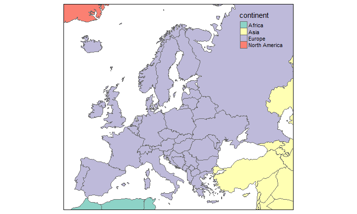<!-- -->


## Teil Europas?


```r
qtm(Europe, fill="part",fill.title="part of Europe")
```

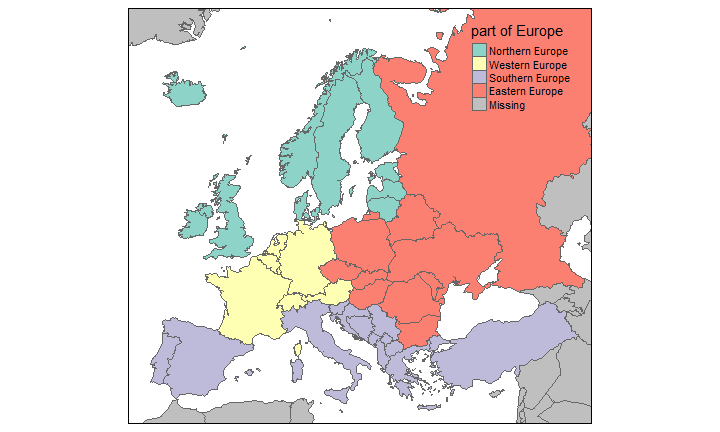<!-- -->

## Fläche


```r
qtm(Europe, fill="area") # Russia is huge
```

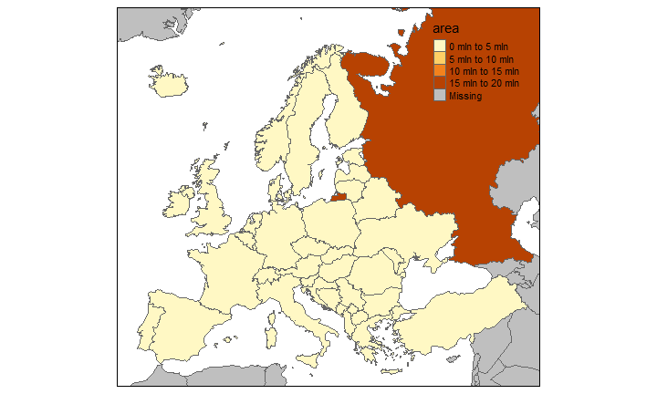<!-- -->


## Bevölkerung


```r
qtm(Europe, fill="pop_est",fill.title="Population") 
```

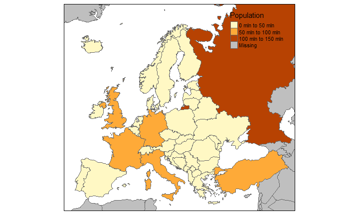<!-- -->

## Bevölkerungsdichte


```r
qtm(Europe, fill="pop_est_dens",
    fill.title="Population density") 
```

<!-- -->


## Ökonomie


```r
qtm(Europe, fill="economy") 
```

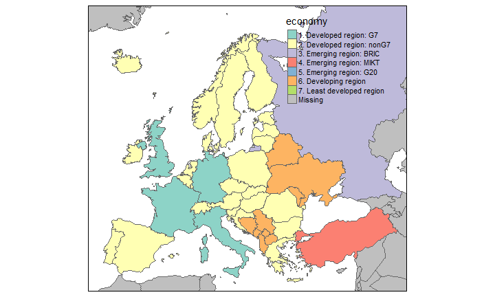<!-- -->

## Einkommensgruppe


```r
qtm(Europe, fill="income_grp",fill.title="Income group") 
```

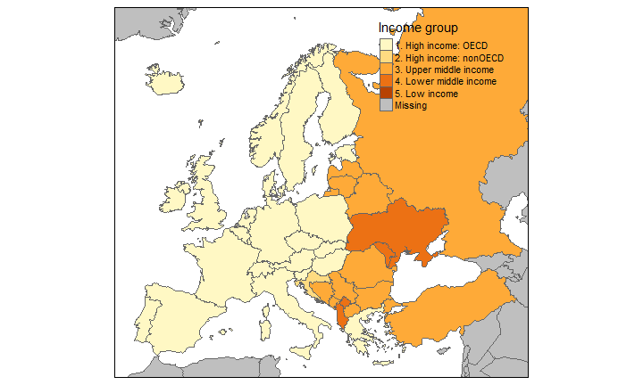<!-- -->


## Der Welt-Datensatz im Paket `tmap`


     iso_a3   name                     sovereignt             continent                 subregion                            area    pop_est   pop_est_dens   gdp_md_est   gdp_cap_est  economy                      income_grp                 life_exp   well_being        HPI
---  -------  -----------------------  ---------------------  ------------------------  --------------------------  -------------  ---------  -------------  -----------  ------------  ---------------------------  ------------------------  ---------  -----------  ---------
2    AFG      Afghanistan              Afghanistan            Asia                      Southern Asia                  652860.000   28400000     43.5009037        22270      784.1549  7. Least developed region    5. Low income                  48.7     4.758381   36.75366
3    AGO      Angola                   Angola                 Africa                    Middle Africa                 1246700.000   12799293     10.2665381       110300     8617.6635  7. Least developed region    3. Upper middle income         51.1     4.206092   33.20143
5    ALB      Albania                  Albania                Europe                    Southern Europe                 27400.000    3639453    132.8267518        21810     5992.6588  6. Developing region         4. Lower middle income         76.9     5.268937   54.05118
8    ARE      United Arab Emirates     United Arab Emirates   Asia                      Western Asia                    83600.000    4798491     57.3982177       184300    38407.9078  6. Developing region         2. High income: nonOECD        76.5     7.196803   31.77827
9    ARG      Argentina                Argentina              South America             South America                 2736690.000   40913584     14.9500250       573900    14027.1261  5. Emerging region: G20      3. Upper middle income         75.9     6.441067   54.05504
10   ARM      Armenia                  Armenia                Asia                      Western Asia                    28470.000    2967004    104.2151036        18770     6326.2469  6. Developing region         4. Lower middle income         74.2     4.367811   46.00319
12   ATA      Antarctica               Antarctica             Antarctica                Antarctica                   10866664.407       3802      0.0003499           NA            NA  6. Developing region         2. High income: nonOECD          NA           NA         NA
14   ATF      Fr. S. Antarctic Lands   France                 Seven seas (open ocean)   Seven seas (open ocean)          6187.205        140      0.0226273           16   114285.7143  6. Developing region         2. High income: nonOECD          NA           NA         NA
16   AUS      Australia                Australia              Oceania                   Australia and New Zealand     7682300.000   21262641      2.7677442       800200    37634.0832  2. Developed region: nonG7   1. High income: OECD           81.9     7.405616   41.97981
17   AUT      Austria                  Austria                Europe                    Western Europe                  82409.000    8210281     99.6284508       329500    40132.6093  2. Developed region: nonG7   1. High income: OECD           80.9     7.346036   47.08514
18   AZE      Azerbaijan               Azerbaijan             Asia                      Western Asia                    82658.000    8238672     99.6718043        77610     9420.2075  6. Developing region         3. Upper middle income         70.7     4.218611   40.88457
19   BDI      Burundi                  Burundi                Africa                    Eastern Africa                  25680.000    8988091    350.0035436         3102      345.1233  7. Least developed region    5. Low income                  50.4     3.791681   30.51501
20   BEL      Belgium                  Belgium                Europe                    Western Europe                  30280.000   10414336    343.9344782       389300    37381.1638  2. Developed region: nonG7   1. High income: OECD           80.0     6.853514   37.09053
21   BEN      Benin                    Benin                  Africa                    Western Africa                 112760.000    8791832     77.9694218        12830     1459.3090  7. Least developed region    5. Low income                  56.1     3.667140   31.08321
22   BFA      Burkina Faso             Burkina Faso           Africa                    Western Africa                 273600.000   15746232     57.5520175        17820     1131.6993  7. Least developed region    5. Low income                  55.4     4.035560   31.79385


## Welt - Länder nach Einkommensgruppe


```r
qtm(World, fill="income_grp",fill.title="Income group") 
```

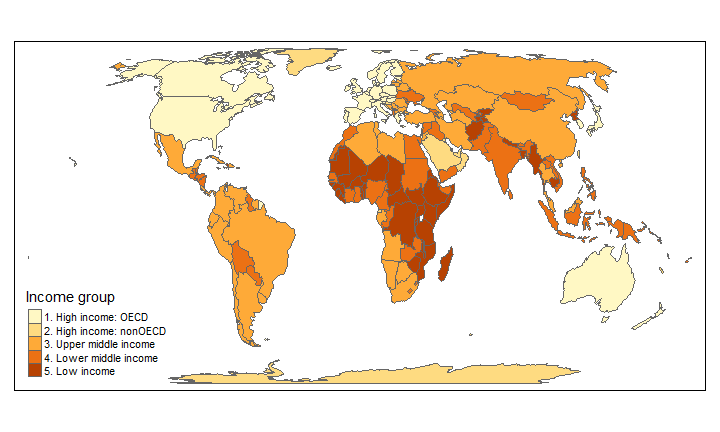<!-- -->

## Ein Datensatz zu den Provinzen in den Niederlanden (R-Paket `tmap`)


     code   name          population   pop_men   pop_women
---  -----  -----------  -----------  --------  ----------
0    20     Groningen         582705    289795      292875
1    21     Friesland         646290    323215      323055
2    22     Drenthe           488970    242225      246755
3    23     Overijssel       1139680    570185      569465
4    24     Flevoland         399885    199940      199940
5    25     Gelderland       2019635    997805     1021790

## Niederlande - Bevölkerung in den Provinzen


```r
qtm(NLD_prov, fill="population",fill.title="population") 
```

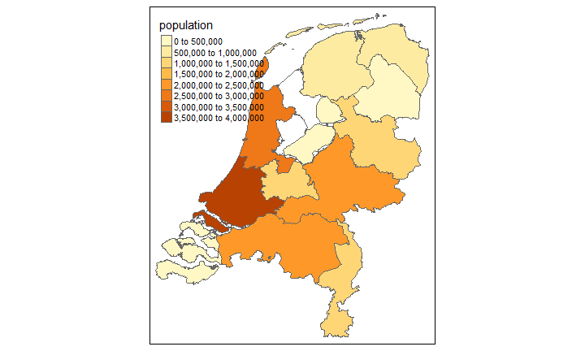<!-- -->

## Anteile berechnen


```r
pop <- NLD_prov@data$population
pop
```

```
##  [1]  582705  646290  488970 1139680  399885 2019635 1253645 2741320
##  [9] 3576960  380610 2479220 1119980
```


```r
popmen <- NLD_prov@data$pop_men
popmen
```

```
##  [1]  289795  323215  242225  570185  199940  997805  613645 1349610
##  [9] 1764855  188655 1238600  555450
```


```r
prop <- popmen/pop
prop
```

```
##  [1] 0.4973271 0.5001083 0.4953780 0.5003027 0.4999937 0.4940521 0.4894887
##  [8] 0.4923212 0.4933952 0.4956649 0.4995926 0.4959464
```

## Exkurs: Barplot vom Männeranteil


```r
barplot(prop)
```

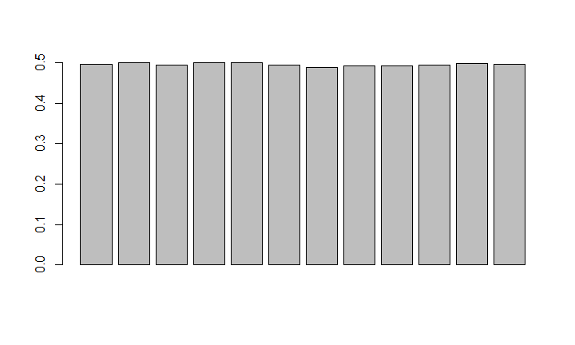<!-- -->

Barplot mit Farbe


```r
barplot(prop,col="blue")
```

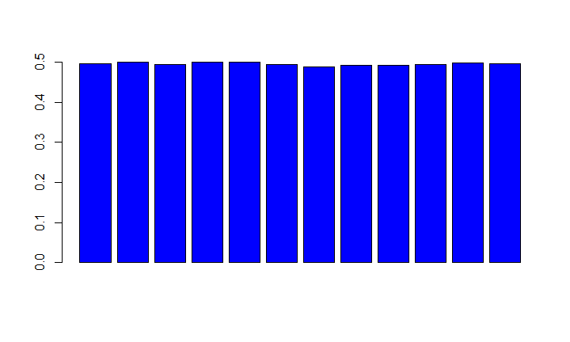<!-- -->

## Niederlnade - Anteil Männer

Information in Datensatz einspeisen


```r
NLD_prov@data$proportion <- prop
```


```r
qtm(NLD_prov, fill="proportion",fill.title="proportion") 
```

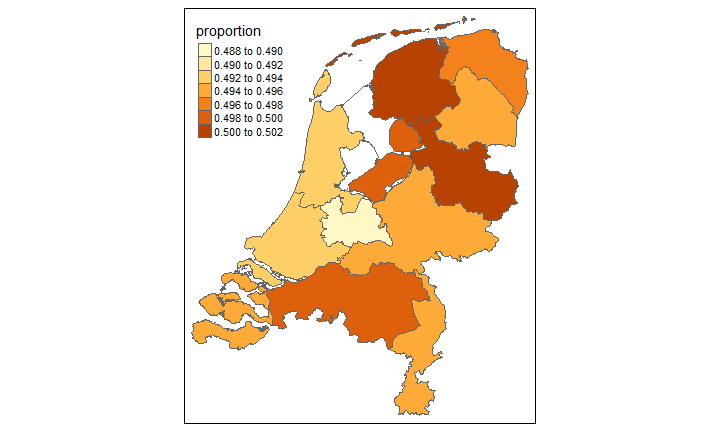<!-- -->

## Niederlande - Anteil der Personen 65 plus

(kleiner Trick notwendig - Die Daten hatten sich verändert)


```r
ant <- runif(length(NLD_prov),.18,.28)
NLD_prov@data$pop_65plus <- 
  round(NLD_prov@data$population*ant)
pop65plus <- NLD_prov@data$pop_65plus
prop65plus <- pop65plus/pop
NLD_prov@data$proportion65plus <- prop65plus
```

## Den Anteil der über 65-jährigen visualisieren


```r
qtm(NLD_prov, fill="proportion",fill.title="proportion") 
```

<!-- -->


## Ein Datensatz zu den Gemeinden in den Niederlanden (R-Paket `tmap`)


```r
data(NLD_muni)
```


      name                             province         population
----  -------------------------------  --------------  -----------
0     Appingedam                       Groningen             12065
1     Bedum                            Groningen             10495
2     Bellingwedde                     Groningen              8920
3     Ten Boer                         Groningen              7480
4     Delfzijl                         Groningen             25695
5     Groningen                        Groningen            198315
6     Grootegast                       Groningen             12165
7     Haren                            Groningen             18780
8     Hoogezand-Sappemeer              Groningen             34305
9     Leek                             Groningen             19595
10    Loppersum                        Groningen             10195
11    Marum                            Groningen             10375
12    Almere                           Flevoland            196010
13    Stadskanaal                      Groningen             32800
14    Slochteren                       Groningen             15545
15    Veendam                          Groningen             27790
16    Vlagtwedde                       Groningen             15905
17    Zeewolde                         Flevoland             21500
18    Winsum                           Groningen             13850
19    Zuidhorn                         Groningen             18775
20    Dongeradeel                      Friesland             24160
21    Achtkarspelen                    Friesland             28015
22    Ameland                          Friesland              3575
23    het Bildt                        Friesland             10625
24    Franekeradeel                    Friesland             20445
25    Harlingen                        Friesland             15820
26    Heerenveen                       Friesland             49900
27    Kollumerland en Nieuwkruisland   Friesland             12875
28    Leeuwarden                       Friesland            107340
29    Leeuwarderadeel                  Friesland             10275
30    Ooststellingwerf                 Friesland             25670
31    Opsterland                       Friesland             29860
32    Schiermonnikoog                  Friesland               940
33    Smallingerland                   Friesland             55465
34    Terschelling                     Friesland              4780
35    Vlieland                         Friesland              1110
36    Weststellingwerf                 Friesland             25455
37    Assen                            Drenthe               67190
38    Coevorden                        Drenthe               35770
39    Emmen                            Drenthe              108050
40    Hoogeveen                        Drenthe               54665
41    Meppel                           Drenthe               32865
42    Littenseradiel                   Friesland             10925
43    Almelo                           Overijssel            72460
44    Borne                            Overijssel            21885
45    Dalfsen                          Overijssel            27675
46    Deventer                         Overijssel            98320
47    Enschede                         Overijssel           158585
48    Haaksbergen                      Overijssel            24345
49    Hardenberg                       Overijssel            59575
50    Hellendoorn                      Overijssel            35710
51    Hengelo                          Overijssel            80955
52    Kampen                           Overijssel            51090
53    Losser                           Overijssel            22610
54    Noordoostpolder                  Flevoland             46355
55    Oldenzaal                        Overijssel            32135
56    Ommen                            Overijssel            17360
57    Raalte                           Overijssel            36520
58    Staphorst                        Overijssel            16365
59    Tubbergen                        Overijssel            21205
60    Urk                              Flevoland             19470
61    Wierden                          Overijssel            23910
62    Zwolle                           Overijssel           123160
63    Rijnwaarden                      Gelderland            10915
64    Aalten                           Gelderland            27010
65    Apeldoorn                        Gelderland           157545
66    Arnhem                           Gelderland           150820
67    Barneveld                        Gelderland            54150
68    Beuningen                        Gelderland            25285
69    Brummen                          Gelderland            21175
70    Buren                            Gelderland            26020
71    Culemborg                        Gelderland            27590
72    Doesburg                         Gelderland            11435
73    Doetinchem                       Gelderland            56345
74    Druten                           Gelderland            18210
75    Duiven                           Gelderland            25610
76    Ede                              Gelderland           110655
77    Elburg                           Gelderland            22645
78    Epe                              Gelderland            32350
79    Ermelo                           Gelderland            26045
80    Geldermalsen                     Gelderland            26300
81    Groesbeek                        Gelderland            18975
82    Harderwijk                       Gelderland            45730
83    Hattem                           Gelderland            11730
84    Heerde                           Gelderland            18490
85    Heumen                           Gelderland            16335
86    Lochem                           Gelderland            33245
87    Maasdriel                        Gelderland            24155
88    Millingen aan de Rijn            Gelderland             5875
89    Nijkerk                          Gelderland            40635
90    Nijmegen                         Gelderland           168290
91    Oldebroek                        Gelderland            22835
92    Putten                           Gelderland            23870
93    Renkum                           Gelderland            31580
94    Rheden                           Gelderland            43640
95    Rozendaal                        Gelderland             1500
96    Scherpenzeel                     Gelderland             9495
97    Tiel                             Gelderland            41775
98    Ubbergen                         Gelderland             9450
99    Voorst                           Gelderland            23765
100   Wageningen                       Gelderland            37430
101   Westervoort                      Gelderland            15135
102   Winterswijk                      Gelderland            28880
103   Wijchen                          Gelderland            41040
104   Zaltbommel                       Gelderland            27180
105   Zevenaar                         Gelderland            32280
106   Zutphen                          Gelderland            47165
107   Nunspeet                         Gelderland            26680
108   Dronten                          Flevoland             40410
109   Neerijnen                        Gelderland            12020
110   Amersfoort                       Utrecht              150895
111   Baarn                            Utrecht               24315
112   De Bilt                          Utrecht               42035
113   Bunnik                           Utrecht               14625
114   Bunschoten                       Utrecht               20490
115   Eemnes                           Utrecht                8780
116   Houten                           Utrecht               48420
117   Leusden                          Utrecht               28995
118   Lopik                            Utrecht               14000
119   Montfoort                        Utrecht               13640
120   Renswoude                        Utrecht                4925
121   Rhenen                           Utrecht               19115
122   Soest                            Utrecht               45490
123   Utrecht                          Utrecht              328165
124   Veenendaal                       Utrecht               63250
125   Woudenberg                       Utrecht               12420
126   Wijk bij Duurstede               Utrecht               23040
127   IJsselstein                      Utrecht               34275
128   Zeist                            Utrecht               61250
129   Nieuwegein                       Utrecht               61035
130   Aalsmeer                         Noord-Holland         30760
131   Alkmaar                          Noord-Holland         94865
132   Amstelveen                       Noord-Holland         85015
133   Amsterdam                        Noord-Holland        810935
134   Graft-De Rijp                    Noord-Holland          6450
135   Beemster                         Noord-Holland          8910
136   Bergen (NH.)                     Noord-Holland         30075
137   Beverwijk                        Noord-Holland         40090
138   Blaricum                         Noord-Holland          9095
139   Bloemendaal                      Noord-Holland         22060
140   Bussum                           Noord-Holland         32630
141   Castricum                        Noord-Holland         34285
142   Diemen                           Noord-Holland         25930
143   Edam-Volendam                    Noord-Holland         28920
144   Enkhuizen                        Noord-Holland         18375
145   Haarlem                          Noord-Holland        155145
146   Haarlemmerliede en Spaarnwoude   Noord-Holland          5535
147   Haarlemmermeer                   Noord-Holland        144060
148   Heemskerk                        Noord-Holland         39085
149   Heemstede                        Noord-Holland         26365
150   Heerhugowaard                    Noord-Holland         53305
151   Heiloo                           Noord-Holland         22635
152   Den Helder                       Noord-Holland         56595
153   Hilversum                        Noord-Holland         86425
154   Hoorn                            Noord-Holland         71700
155   Huizen                           Noord-Holland         41245
156   Landsmeer                        Noord-Holland         10445
157   Langedijk                        Noord-Holland         26935
158   Laren                            Noord-Holland         10860
159   Medemblik                        Noord-Holland         43320
160   Muiden                           Noord-Holland          6285
161   Naarden                          Noord-Holland         17205
162   Oostzaan                         Noord-Holland          9140
163   Opmeer                           Noord-Holland         11365
164   Ouder-Amstel                     Noord-Holland         13270
165   Purmerend                        Noord-Holland         79575
166   Schagen                          Noord-Holland         45975
167   Texel                            Noord-Holland         13550
168   Uitgeest                         Noord-Holland         13235
169   Uithoorn                         Noord-Holland         28415
170   Velsen                           Noord-Holland         67220
171   Weesp                            Noord-Holland         18170
172   Schermer                         Noord-Holland          5540
173   Zandvoort                        Noord-Holland         16575
174   Zeevang                          Noord-Holland          6340
175   Zaanstad                         Noord-Holland        150595
176   Alblasserdam                     Zuid-Holland          19800
177   Alphen aan den Rijn              Zuid-Holland         106785
178   Barendrecht                      Zuid-Holland          47375
179   Bergambacht                      Zuid-Holland           9970
180   Drechterland                     Noord-Holland         19250
181   Brielle                          Zuid-Holland          16310
182   Capelle aan den IJssel           Zuid-Holland          66175
183   Delft                            Zuid-Holland         100045
184   Dordrecht                        Zuid-Holland         118690
185   Gorinchem                        Zuid-Holland          35240
186   Gouda                            Zuid-Holland          70940
187   's-Gravenhage                    Zuid-Holland         508940
188   Hardinxveld-Giessendam           Zuid-Holland          17755
189   Hellevoetsluis                   Zuid-Holland          38950
190   Hendrik-Ido-Ambacht              Zuid-Holland          28910
191   Stede Broec                      Noord-Holland         21485
192   Hillegom                         Zuid-Holland          20945
193   Katwijk                          Zuid-Holland          62780
194   Krimpen aan den IJssel           Zuid-Holland          28825
195   Leerdam                          Zuid-Holland          20590
196   Leiden                           Zuid-Holland         121160
197   Leiderdorp                       Zuid-Holland          26810
198   Lisse                            Zuid-Holland          22335
199   Maassluis                        Zuid-Holland          32080
200   Bernisse                         Zuid-Holland          12365
201   Nieuwkoop                        Zuid-Holland          27105
202   Noordwijk                        Zuid-Holland          25690
203   Noordwijkerhout                  Zuid-Holland          15955
204   Oegstgeest                       Zuid-Holland          22910
205   Oud-Beijerland                   Zuid-Holland          23715
206   Binnenmaas                       Zuid-Holland          28710
207   Korendijk                        Zuid-Holland          10700
208   Oudewater                        Utrecht                9870
209   Papendrecht                      Zuid-Holland          32115
210   Ridderkerk                       Zuid-Holland          45250
211   Rotterdam                        Zuid-Holland         618355
212   Rijswijk                         Zuid-Holland          47635
213   Schiedam                         Zuid-Holland          76450
214   Schoonhoven                      Zuid-Holland          11900
215   Sliedrecht                       Zuid-Holland          24525
216   Cromstrijen                      Zuid-Holland          12735
217   Spijkenisse                      Zuid-Holland          72560
218   Albrandswaard                    Zuid-Holland          25070
219   Westvoorne                       Zuid-Holland          13965
220   Strijen                          Zuid-Holland           8680
221   Vianen                           Utrecht               19595
222   Vlaardingen                      Zuid-Holland          70980
223   Vlist                            Zuid-Holland           9695
224   Voorschoten                      Zuid-Holland          24950
225   Waddinxveen                      Zuid-Holland          25505
226   Wassenaar                        Zuid-Holland          25675
227   Woerden                          Utrecht               50575
228   Zoetermeer                       Zuid-Holland         123560
229   Zoeterwoude                      Zuid-Holland           8075
230   Zwijndrecht                      Zuid-Holland          44545
231   Nederlek                         Zuid-Holland          14075
232   Ouderkerk                        Zuid-Holland           8210
233   Borsele                          Zeeland               22580
234   Goes                             Zeeland               36955
235   West Maas en Waal                Gelderland            18420
236   Hulst                            Zeeland               27385
237   Kapelle                          Zeeland               12500
238   Middelburg                       Zeeland               47640
239   Giessenlanden                    Zuid-Holland          14440
240   Reimerswaal                      Zeeland               21925
241   Zederik                          Zuid-Holland          13655
242   Terneuzen                        Zeeland               54710
243   Tholen                           Zeeland               25405
244   Veere                            Zeeland               21865
245   Vlissingen                       Zeeland               44445
246   Lingewaal                        Gelderland            11060
247   De Ronde Venen                   Utrecht               42640
248   Tytsjerksteradiel                Friesland             31970
249   Aalburg                          Noord-Brabant         12845
250   Asten                            Noord-Brabant         16440
251   Baarle-Nassau                    Noord-Brabant          6610
252   Bergen op Zoom                   Noord-Brabant         66420
253   Best                             Noord-Brabant         28615
254   Boekel                           Noord-Brabant         10090
255   Boxmeer                          Noord-Brabant         28145
256   Boxtel                           Noord-Brabant         30320
257   Breda                            Noord-Brabant        179620
258   Deurne                           Noord-Brabant         31660
259   Pekela                           Groningen             12705
260   Dongen                           Noord-Brabant         25355
261   Eersel                           Noord-Brabant         18180
262   Eindhoven                        Noord-Brabant        220920
263   Etten-Leur                       Noord-Brabant         42355
264   Geertruidenberg                  Noord-Brabant         21570
265   Gilze en Rijen                   Noord-Brabant         26070
266   Goirle                           Noord-Brabant         23095
267   Grave                            Noord-Brabant         12695
268   Haaren                           Noord-Brabant         13585
269   Helmond                          Noord-Brabant         89255
270   's-Hertogenbosch                 Noord-Brabant        143730
271   Heusden                          Noord-Brabant         43165
272   Hilvarenbeek                     Noord-Brabant         15090
273   Loon op Zand                     Noord-Brabant         23080
274   Mill en Sint Hubert              Noord-Brabant         10850
275   Nuenen. Gerwen en Nederwetten    Noord-Brabant         22620
276   Oirschot                         Noord-Brabant         17980
277   Oisterwijk                       Noord-Brabant         25800
278   Oosterhout                       Noord-Brabant         53715
279   Oss                              Noord-Brabant         84955
280   Rucphen                          Noord-Brabant         22180
281   Schijndel                        Noord-Brabant         23360
282   Sint-Michielsgestel              Noord-Brabant         28120
283   Sint-Oedenrode                   Noord-Brabant         17935
284   Someren                          Noord-Brabant         18690
285   Son en Breugel                   Noord-Brabant         16235
286   Steenbergen                      Noord-Brabant         23375
287   Waterland                        Noord-Holland         17135
288   Tilburg                          Noord-Brabant        210270
289   Uden                             Noord-Brabant         40910
290   Valkenswaard                     Noord-Brabant         30335
291   Veghel                           Noord-Brabant         37465
292   Veldhoven                        Noord-Brabant         44155
293   Vught                            Noord-Brabant         25635
294   Waalre                           Noord-Brabant         16765
295   Waalwijk                         Noord-Brabant         46495
296   Werkendam                        Noord-Brabant         26385
297   Woensdrecht                      Noord-Brabant         21620
298   Woudrichem                       Noord-Brabant         14425
299   Zundert                          Noord-Brabant         21400
300   Wormerland                       Noord-Holland         15775
301   Onderbanken                      Limburg                7880
302   Landgraaf                        Limburg               37570
303   Beek                             Limburg               16270
304   Beesel                           Limburg               13615
305   Bergen (L.)                      Limburg               13235
306   Brunssum                         Limburg               28955
307   Gennep                           Limburg               17285
308   Heerlen                          Limburg               88260
309   Kerkrade                         Limburg               46785
310   Maastricht                       Limburg              122485
311   Meerssen                         Limburg               19255
312   Mook en Middelaar                Limburg                7795
313   Nederweert                       Limburg               16750
314   Nuth                             Limburg               15580
315   Roermond                         Limburg               56930
316   Schinnen                         Limburg               12900
317   Simpelveld                       Limburg               10845
318   Stein                            Limburg               25390
319   Vaals                            Limburg                9685
320   Venlo                            Limburg              100425
321   Venray                           Limburg               43110
322   Voerendaal                       Limburg               12455
323   Weert                            Limburg               48720
324   Valkenburg aan de Geul           Limburg               16675
325   Lelystad                         Flevoland             76140
326   Horst aan de Maas                Limburg               41725
327   Oude IJsselstreek                Gelderland            39595
328   Teylingen                        Zuid-Holland          35735
329   Utrechtse Heuvelrug              Utrecht               47950
330   Oost Gelre                       Gelderland            29700
331   Koggenland                       Noord-Holland         22485
332   Lansingerland                    Zuid-Holland          57120
333   Leudal                           Limburg               36220
334   Maasgouw                         Limburg               23905
335   Eemsmond                         Groningen             15925
336   Gemert-Bakel                     Noord-Brabant         29315
337   Halderberge                      Noord-Brabant         29340
338   Heeze-Leende                     Noord-Brabant         15350
339   Laarbeek                         Noord-Brabant         21800
340   De Marne                         Groningen             10210
341   Reusel-De Mierden                Noord-Brabant         12710
342   Roerdalen                        Limburg               20830
343   Maasdonk                         Noord-Brabant         11240
344   Roosendaal                       Noord-Brabant         77025
345   Schouwen-Duiveland               Zeeland               33850
346   Aa en Hunze                      Drenthe               25355
347   Borger-Odoorn                    Drenthe               25625
348   Cuijk                            Noord-Brabant         24780
349   Landerd                          Noord-Brabant         15265
350   De Wolden                        Drenthe               23580
351   Noord-Beveland                   Zeeland                7530
352   Wijdemeren                       Noord-Holland         23185
353   Noordenveld                      Drenthe               31085
354   Twenterand                       Overijssel            33930
355   Westerveld                       Drenthe               18930
356   Sint Anthonis                    Noord-Brabant         11690
357   Lingewaard                       Gelderland            45775
358   Cranendonck                      Noord-Brabant         20345
359   Steenwijkerland                  Overijssel            43350
360   Moerdijk                         Noord-Brabant         36730
361   Echt-Susteren                    Limburg               31975
362   Sluis                            Zeeland               23820
363   Drimmelen                        Noord-Brabant         26695
364   Bernheze                         Noord-Brabant         29690
365   Ferwerderadiel                   Friesland              8790
366   Alphen-Chaam                     Noord-Brabant          9715
367   Bergeijk                         Noord-Brabant         18255
368   Bladel                           Noord-Brabant         19835
369   Gulpen-Wittem                    Limburg               14485
370   Tynaarlo                         Drenthe               32490
371   Midden-Drenthe                   Drenthe               33365
372   Overbetuwe                       Gelderland            46665
373   Hof van Twente                   Overijssel            34995
374   Neder-Betuwe                     Gelderland            22555
375   Rijssen-Holten                   Overijssel            37660
376   Geldrop-Mierlo                   Noord-Brabant         38855
377   Olst-Wijhe                       Overijssel            17770
378   Dinkelland                       Overijssel            25945
379   Westland                         Zuid-Holland         103240
380   Midden-Delfland                  Zuid-Holland          18455
381   Berkelland                       Gelderland            44665
382   Bronckhorst                      Gelderland            36930
383   Sittard-Geleen                   Limburg               93690
384   Kaag en Braassem                 Zuid-Holland          25745
385   Dantumadiel                      Friesland             19030
386   Zuidplas                         Zuid-Holland          40890
387   Peel en Maas                     Limburg               43315
388   Oldambt                          Groningen             38560
389   Zwartewaterland                  Overijssel            22165
390   Sudwest-Fryslan                  Friesland             84180
391   Bodegraven-Reeuwijk              Zuid-Holland          32910
392   Eijsden-Margraten                Limburg               24980
393   Stichtse Vecht                   Utrecht               63855
394   Menameradiel                     Friesland             13670
395   Hollands Kroon                   Noord-Holland         47500
396   Leidschendam-Voorburg            Zuid-Holland          73355
397   De Friese Meren                  Friesland             51415
398   Goeree-Overflakkee               Zuid-Holland          48245
399   Pijnacker-Nootdorp               Zuid-Holland          51070
400   Molenwaard                       Zuid-Holland          29030
401   Montferland                      Gelderland            34985
402   Menterwolde                      Groningen             12255

## Bevölkerung der Gemeinden in den Niederlanden


```r
qtm(NLD_muni, fill="population") 
```

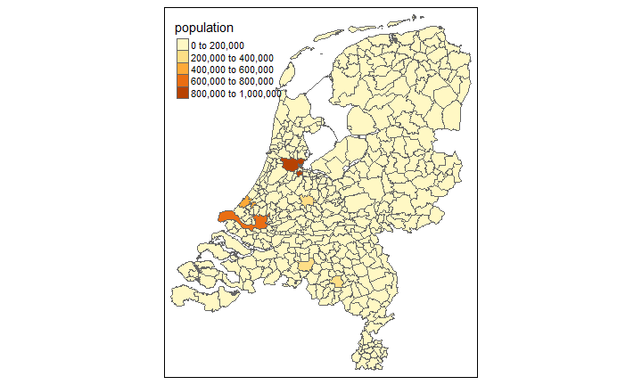<!-- -->


## Zwei Karten


```r
tm_shape(Europe) +
    tm_fill(c("pop_est_dens", "gdp_cap_est"), 
        title=c("Population density", "GDP per capita"))
# + tm_layout_Europe()
```

## Zwei Karten

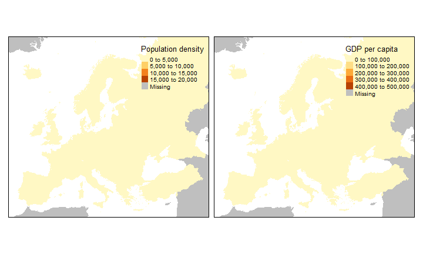<!-- -->


## Räumliche Daten zur Flächennutzung


cover          cover_cls    trees   elevation
-------------  ----------  ------  ----------
Water bodies   Water           NA          NA
Water bodies   Water           NA          NA
Water bodies   Water           NA          NA
Water bodies   Water           NA          NA
Water bodies   Water           NA          NA
Water bodies   Water           NA          NA
Water bodies   Water           NA          NA
Water bodies   Water           NA          NA
Water bodies   Water           NA          NA
Water bodies   Water           NA          NA
Water bodies   Water           NA          NA
Water bodies   Water           NA          NA
Water bodies   Water           NA          NA
Water bodies   Water           NA          NA
Water bodies   Water           NA          NA

## Weltweite Flächennutzung


```r
data(land)
data(World)
tm_shape(land,  relative=FALSE) +
    tm_raster("cover_cls", title="Global Land Cover")
```

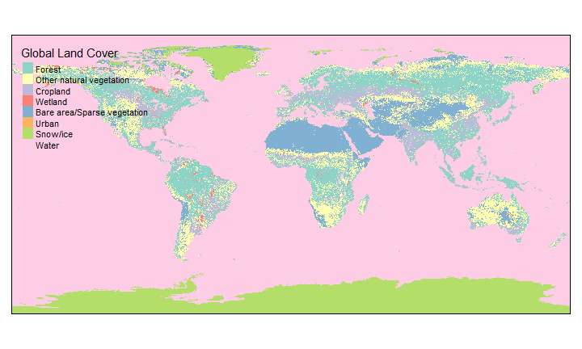<!-- -->


## Räumliche Daten zu Metropolregionen


      name               name_long                 iso_a3    pop1950   pop1960   pop1970    pop1980    pop1990    pop2000    pop2010    pop2020    pop2030
----  -----------------  ------------------------  -------  --------  --------  --------  ---------  ---------  ---------  ---------  ---------  ---------
2     Kabul              Kabul                     AFG        170784    285352    471891     977824    1549320    2401109    3722320    5721697    8279607
8     Algiers            El Djazair  (Algiers)     DZA        516450    871636   1281127    1621442    1797068    2140577    2432023    2835218    3404575
13    Luanda             Luanda                    AGO        138413    219427    459225     771349    1390240    2591388    4508434    6836849   10428756
16    Buenos Aires       Buenos Aires              ARG       5097612   6597634   8104621    9422362   10513284   12406780   14245871   15894307   16956491
17    Cordoba            Cordoba                   ARG        429249    605309    809794    1009521    1200168    1347561    1459268    1562509    1718192
25    Rosario            Rosario                   ARG        554483    671349    816230     953491    1083819    1152387    1298073    1453814    1606993
32    Yerevan            Yerevan                   ARM        341432    537759    778158    1041587    1174524    1111301    1065597    1023703    1057459
33    Adelaide           Adelaide                  AUS        429277    571822    850168     971856    1081618    1141623    1217990    1320783    1505422
34    Brisbane           Brisbane                  AUS        441718    602999    904777    1134833    1381306    1666203    2033617    2388517    2721325
37    Melbourne          Melbourne                 AUS       1331966   1851220   2499109    2839019    3154314    3460541    3951216    4500501    5070873
39    Perth              Perth                     AUS        310759    409131    687856     921623    1194665    1432387    1697517    2036118    2329184
41    Sydney             Sydney                    AUS       1689935   2134673   2892477    3252111    3631940    4052499    4364380    4729406    5300933
42    Vienna             Wien (Vienna)             AUT       1615058   1626724   1620537    1538780    1539106    1549227    1699888    1807617    1959109
43    Baku               Baku                      AZE        896761   1005297   1274298    1574287    1733452    1805977    2061843    2629468    2971498
49    Chittagong         Chittagong                BGD        288853    359898    723324    1339829    2022825    3308476    4106060    5154787    6718801
51    Dhaka              Dhaka                     BGD        335760    507921   1373718    3265663    6620697   10284947   14730537   20988559   27373593
52    Khulna             Khulna                    BGD         61259    122844    309875     627393     985412    1247303    1098087    1038960    1336055
60    Minsk              Minsk                     BLR        284222    550710    931566    1319711    1617544    1700376    1846994    1953396    1941714
64    Bruxelles          Bruxelles-Brussel         BEL       1414671   1484676   1567635    1653780    1695478    1792495    1958115    2115468    2202566
70    Cochabamba         Cochabamba                BOL         93973    133986    191016     289320     484583     720840    1042197    1400728    1703163
71    La Paz             La Paz                    BOL        319247    437687    600016     809218    1061850    1389662    1671931    1931681    2308274
72    Santa Cruz         Santa Cruz                BOL         42220     83737    166047     324144     616172    1053645    1684180    2454968    2989471
77    Baixada Santista   Baixada Santista          BRA        242441    385861    602128     896946    1094611    1308961    1460971    1608513    1768738
79    Belem              Belem                     BRA        242091    378260    601027     826894    1179160    1724260    2022566    2314534    2540446
80    Belo Horizonte     Belo Horizonte            BRA        411868    781970   1485350    2440572    3548079    4807277    5409346    5968949    6438830
83    Brasilia           Brasilia                  BRA         35528    136643    525335    1293179    1863282    2931823    3710360    4510111    4929044
85    Campinas           Campinas                  BRA        151977    293174    540430    1108903    1693359    2332076    2792846    3253997    3559550
91    Curitiba           Curitiba                  BRA        157548    378588    650523    1309560    1829370    2493606    3118137    3758909    4115999
93    Florianopolis      Florianopolis             BRA         67630     97227    150102     325902     502629     733915    1010091    1321405    1480573
94    Fortaleza          Fortaleza                 BRA        263818    499873    867408    1487814    2225860    2875488    3519526    4169191    4550936
96    Goiania            Goiania                   BRA         53389    148420    374837     736680    1132125    1634532    2048878    2476864    2729645
97    Grande Sao Luis    Grande Sao Luis           BRA        119785    157559    263164     445442     672390    1064231    1303803    1547470    1714400
98    Grande Vitoria     Grande Vitoria            BRA         84772    171404    339260     716456    1052209    1314260    1524280    1731670    1907583
99    Joao Pessoa        Joao Pessoa               BRA        117404    183568    289451     452869     652055     842016    1004369    1168777    1297881
100   Joinville          Joinville                 BRA         64273    115944    204533     377834     603432     923015    1114002    1306963    1450023
106   Maceio             Maceio                    BRA        123438    182212    277836     420383     660386     952309    1154403    1359755    1508261
107   Manaus             Manaus                    BRA         89612    151087    280707     603851     954659    1392428    1788998    2218020    2454074
110   Natal              Natal                     BRA        102450    173076    284867     469615     658203     860282    1056387    1258761    1399318
115   Porto Alegre       Porto Alegre              BRA        488319    881603   1397546    2132777    2727619    3215828    3476065    3718877    4028310
117   Recife             Recife                    BRA        660569   1073635   1638263    2122422    2689620    3204924    3559092    3892825    4222465
120   Rio de Janeiro     Rio de Janeiro            BRA       3026195   4493182   6790519    8783870    9697487   11306768   12373884   13326122   14173748
121   Salvador           Salvador                  BRA        403275    670874   1068734    1683321    2330725    2891087    3343124    3780413    4114902
124   Sao Paulo          Sao Paulo                 BRA       2334038   3969759   7620490   12089454   14775840   17014078   19659808   22118900   23444363
132   Sofia              Sofia                     BGR        521938    708061    888449    1074414    1190742    1128266    1199651    1240977    1229925
135   Ouagadougou        Ouagadougou               BFA         33035     59126    115374     265200     537441     920808    1914162    3695437    5853943
137   Phnom Penh         Phnum Penh (Phnom Penh)   KHM        364000    389280    900000     238267     615000    1148703    1509715    1978642    2584336
140   Douala             Douala                    CMR         94769    152612    297687     570741     940489    1490263    2361114    3502730    4774365
143   Yaounde            Yaounde                   CMR         31644     75455    183364     415116     777062    1351047    2348656    3759268    5157957
144   Calgary            Calgary                   CAN        132073    262078    388860     567917     737990     927453    1190362    1463528    1630262
145   Edmonton           Edmonton                  CAN        163473    317634    476845     622570     830538     924300    1137346    1388625    1546963
150   Montreal           Montreal                  CAN       1343463   2031108   2684215    2823607    3153675    3428971    3791073    4158292    4517425
152   Ottawa             Ottawa-Gatineau           CAN        282326    414858    581060     728873     917822    1055418    1218013    1421851    1576927
155   Toronto            Toronto                   CAN       1068305   1744328   2534788    3008032    3806957    4607142    5499233    6406527    6956552
156   Vancouver          Vancouver                 CAN        556369    620415   1044661    1247252    1558991    1959037    2278216    2664516    2929898
161   N'Djamena          N'Djamena                 TCD         24604     71280    155419     323593     476883     703344    1037509    1535423    2346978
166   Santiago           Santiago                  CHL       1321647   1979927   2646661    3720640    4615919    5658363    6269330    6706769    7122444
173   Anshan             Anshan                    CHN        455250    850045    812636     967176    1233986    1384345    1500959    1640592    1886382
179   Baoding            Baoding                   CHN        173700    264249    337913     384904     471351     883638    1033306    1187346    1377007
181   Baotou             Baotou                    CHN        104231    346543    754485     835227    1044173    1406034    1757126    2153996    2494597
185   Beijing            Beijing                   CHN       1671365   3900441   4426045    5366115    6787737   10162386   16189572   24201465   27706032
194   Changchun          Changchun                 CHN        764622   1110918   1254799    1655415    2192320    2730167    3386544    4129638    4742114
199   Changsha           Changsha                  CHN        577078    860796    730949     830056    1089378    2182246    3155126    4321679    5013202
203   Changzhou          Changzhou, Jiangsu        CHN        149237    220761    326528     469103     729893    1477986    2234966    2913413    3380623
206   Chaozhou           Chaozhou                  CHN         98714    107789    126938     157229     333620     691239    1232245    1426533    1649534
208   Chengdu            Chengdu                   CHN        646157   1580303   1750000    2150000    2954909    4222276    6234260    8765741   10104406
212   Chongqing          Chongqing                 CHN       1566966   2275158   2237344    2961400    4010602    7862976   11243667   15232821   17380364
215   Cixi               Cixi                      CHN          3160      8993     25589      72832     207243     650453    1043987    1545555    1828772
218   Dalian             Dalian                    CHN        715898    938450   1176959    1423770    1884310    2833270    3862366    5073094    5850602
221   Daqing             Daqing                    CHN        180888    258693    369926     529040     756518    1081914    1420734    1813744    2112875
223   Datong             Datong                    CHN        200618    358246    431922     565225     917322    1048919    1350571    1706595    1987673
231   Dongguan           Dongguan                  CHN         91558     98868    113950     137169     552613    3630941    7118368    7731364    8700622
242   Foshan             Foshan                    CHN        103298    182574    322640     570252    1007947    3832248    6653209    7399346    8353315
245   Fushun             Fushun, Liaoning          CHN        636879    726844    829487     991234    1288977    1357527    1320171    1318799    1507924
249   Fuzhou             Fuzhou, Fujian            CHN        301109    406631    549086     741509    1402584    2008540    2793287    3738637    4335389
261   Guangzhou          Guangzhou, Guangdong      CHN       1049031   1271981   1542233    1870003    3072144    7330099    9620379   15174267   17574395
265   Guiyang            Guiyang                   CHN        249496    424606    702266     808904    1080013    1860321    2495945    3224600    3733956
266   Haerbin            Haerbin                   CHN        726527   1422692   1695540    1991988    2392404    3887637    4896299    5998973    6860038
268   Haikou             Haikou                    CHN        106982    168237    247304     347595     488512     907462    1492393    2287440    2702173
273   Handan             Handan                    CHN         68823    114411    190169     316134     525453     810591    1295960    1950206    2304432
274   Hangzhou           Hangzhou                  CHN        610498    948198   1026735    1141430    1476223    3159778    5081771    7596584    8821757
277   Hefei              Hefei                     CHN        145407    316240    517863     750527    1099523    1532292    3027190    3622260    4152230
281   Hengyang           Hengyang                  CHN         97371    146862    221481     334052     503788     792749    1103074    1487814    1746245
286   Hohhot             Hohhot                    CHN        122096    234223    365233     480799     634594    1004651    1477887    2070751    2429052
288   Huai'an            Huai'an                   CHN         64308     96825    145768     219476     330461     817569    1493549    2481933    2950852
291   Huainan            Huainan                   CHN        252858    385439    507550     606285     724231    1049379    1232107    1430716    1657041
294   Huizhou            Huizhou                   CHN         48633     69643     99721     142802     204543    1003069    1775499    2817033    3329825
299   Jiangmen           Jiangmen                  CHN         87915    106655    129382     156961     190475     834095    1454125    1683836    1943442
306   Jilin              Jilin                     CHN        393798    550469    606008     777151    1090384    1310546    1450233    1609672    1853881
308   Ji'nan             Ji'nan, Shandong          CHN        575915   1002979   1060000    1260000    1923150    2591790    3492952    4536893    5234047
315   Jining             Jining, Shandong          CHN         71550    133246    248100     462032     871170    1112289    1290574    1488763    1722382
326   Kaohsiung          Kaohsiung                 CHN        255525    454017    806570    1159943    1372484    1488415    1514281    1568916    1796094
330   Kunming            Kunming                   CHN        334294    397321    472208     561237    1100130    2599955    3365405    4177743    4804552
338   Lanzhou            Lanzhou                   CHN        335740    589272    862851    1033170    1289891    1889948    2418782    3016503    3484521
351   Linyi              Linyi, Shandong           CHN         15075     30735     62651     127735     260433    1129602    1509740    1895884    2204013
357   Liuzhou            Liuzhou                   CHN        117585    231629    314444     435177     636911    1026975    1396452    1829962    2136669
365   Luoyang            Luoyang                   CHN        145415    250515    392016     538304     725462    1212823    1707961    2302310    2687563
376   Nanchang           Nanchang                  CHN        343221    563654    614703     787955     912020    1647940    2202789    2833724    3285277
378   Nanjing            Nanjing, Jiangsu          CHN       1037123   1230229   1459221    1730919    2892833    4278637    6162151    8475650    9754280
380   Nanning            Nanning                   CHN        143045    323292    431886     621437     759258    1623980    2619101    3800364    4438356
381   Nantong            Nantong                   CHN        243191    305496    291767     371079     469908    1006340    1588342    2341546    2755401


## Nur ein Land visualisieren


```r
tm_shape(Europe[Europe$name=="Austria", ]) +
    tm_polygons()
```

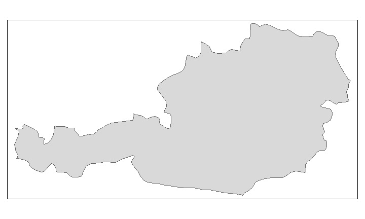<!-- -->


## Die Daten laden


```r
url <- "https://raw.githubusercontent.com/Japhilko/
GeoData/master/2015/data/Unemployment07a13.csv"

Unemp <- read.csv(url) 
```

## Überblick über die Daten


GEO     Val2007M12   Val2013M01
-----  -----------  -----------
EU28           6.9         10.9
EU27           6.9         10.9
EU25           6.9         11.0
EU15           6.9         11.1
EA             7.3         12.0
EA19           7.3         12.0
EA18           7.4         12.0
EA17           7.4         12.0


## Nutzung des Paketes `tmap` mit eigenen Daten


```r
library("tmap")
data(Europe)
```

## Die Daten matchen


```r
iso_a2<- substr(Europe@data$iso_a3,1,2)
ind <- match(iso_a2,Unemp$GEO)
Europe@data$Val2007M12 <- Unemp$Val2007M12[ind]
Europe@data$Val2013M01 <- Unemp$Val2013M01[ind]
```

## Eine Karte erzeugen


```r
qtm(Europe,c("Val2007M12","Val2013M01"))
```

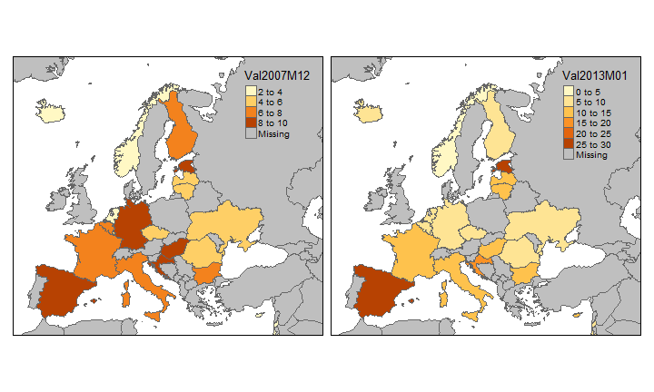<!-- -->


## Kleine und viele Karten


```r
tm_shape(Europe[Europe$continent=="Europe",]) +
    tm_fill("part", thres.poly = 0) +
    tm_facets("name", free.coords=TRUE)
```

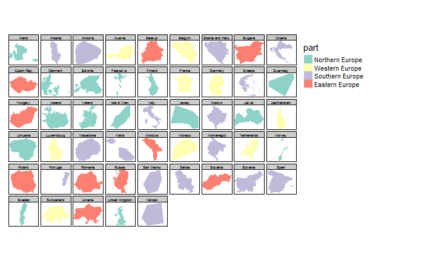<!-- -->


## tmap zitieren


```r
citation("tmap")
```

```
## 
## To cite package 'tmap' in publications use:
## 
##   Martijn Tennekes (2016). tmap: Thematic Maps. R package version
##   1.4-1. https://CRAN.R-project.org/package=tmap
## 
## A BibTeX entry for LaTeX users is
## 
##   @Manual{,
##     title = {tmap: Thematic Maps},
##     author = {Martijn Tennekes},
##     year = {2016},
##     note = {R package version 1.4-1},
##     url = {https://CRAN.R-project.org/package=tmap},
##   }
```


