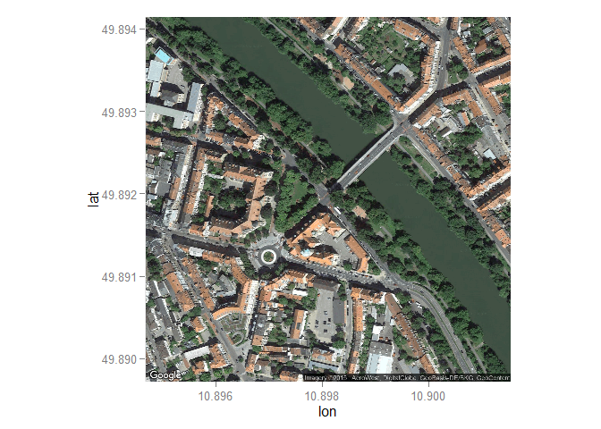

Allgemein
---------

Unter dem Vorgang der Georeferenzierung, Geokodierung, Geotagging oder
Verortung versteht man die Zuweisung raumbezogener Informationen, der
Georeferenz, zu einem Datensatz.

<http://de.wikipedia.org/wiki/Georeferenzierung>

    library(ggmap)

    ## Loading required package: ggplot2

    coord_lifbi <- geocode("Bamberg Wilhelmplatz",source="google")

    ## Information from URL : http://maps.googleapis.com/maps/api/geocode/json?address=Bamberg%20Wilhelmplatz&sensor=false

    coord_lifbi

    ##       lon      lat
    ## 1 10.8981 49.89193

    library(ggmap)
    Bamb1 <- qmap("Bamberg Wilhelmplatz", zoom = 17, 
    maptype="satellite")

    ## Map from URL : http://maps.googleapis.com/maps/api/staticmap?center=Bamberg+Wilhelmplatz&zoom=17&size=640x640&scale=2&maptype=satellite&language=en-EN&sensor=false

    Bamb1

    MA <- geocode("Mannheim Hbf")

    ## Information from URL : http://www.datasciencetoolkit.org/maps/api/geocode/json?address=Mannheim%20Hbf&sensor=false

    ## Warning: geocode failed with status ZERO_RESULTS, location = "Mannheim Hbf"

    MA2 <- geocode("Mannheim Neckarstadt")

    ## Information from URL : http://www.datasciencetoolkit.org/maps/api/geocode/json?address=Mannheim%20Neckarstadt&sensor=false

    ## Warning: geocode failed with status ZERO_RESULTS, location = "Mannheim
    ## Neckarstadt"

    mapdist("Hbf Mannheim","Hbf Koeln")

    ## by using this function you are agreeing to the terms at :
    ## http://code.google.com/apis/maps/documentation/distancematrix/
    ## 
    ## Information from URL : http://maps.googleapis.com/maps/api/distancematrix/json?origins=Hbf+Mannheim&destinations=Hbf+Koeln&mode=driving&sensor=false

    ##           from        to      m      km    miles seconds  minutes    hours
    ## 1 Hbf Mannheim Hbf Koeln 247919 247.919 154.0569    8821 147.0167 2.450278

    library(SoDA)
    googleDist <- geoDist(MA$lat,MA$lon,MA2$lat,MA2$lon)

Geokodierung geocodeHERE
------------------------

    library(geocodeHERE)
    citation("geocodeHERE")

    ## 
    ## To cite package 'geocodeHERE' in publications use:
    ## 
    ##   Cory Nissen (2015). geocodeHERE: Wrapper for Nokia's HERE
    ##   Geocoding API. R package version 0.1.3.
    ##   http://CRAN.R-project.org/package=geocodeHERE
    ## 
    ## A BibTeX entry for LaTeX users is
    ## 
    ##   @Manual{,
    ##     title = {geocodeHERE: Wrapper for Nokia's HERE Geocoding API},
    ##     author = {Cory Nissen},
    ##     year = {2015},
    ##     note = {R package version 0.1.3},
    ##     url = {http://CRAN.R-project.org/package=geocodeHERE},
    ##   }
    ## 
    ## ATTENTION: This citation information has been auto-generated from
    ## the package DESCRIPTION file and may need manual editing, see
    ## 'help("citation")'.
