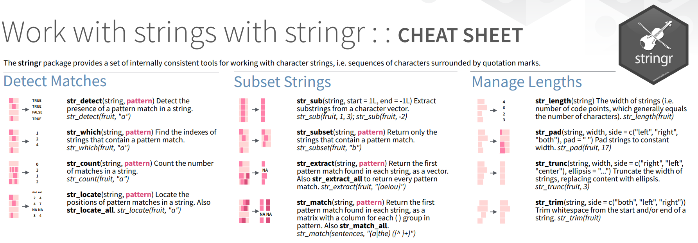

```{r setup, include=FALSE}
knitr::opts_chunk$set(echo = FALSE,cache=T)
```

<!--
wie du R in deinem Arbeitsalltag einbindest und wie du die Zukunft von R in der Wissenschaft siehst. 
-->

## R in meinem Arbeitsalltag

- Datenaufbereitung
- Datendokumentation
- Codebook, Wave Report (Rmarkdown)
- Versionskontrolle

## [Reguläre Ausdrücke](https://www.rstudio.com/resources/cheatsheets/)



## HTML Dateien auslesen

- [Cheatsheet zum Umgang mit Strings](file:///D:/Eigene%20Dateien/Downloads/strings.pdf)


## Was ich in Zukunft nutzen möchte

- [flexdashboard](https://www.r-bloggers.com/explore-predictive-maintenance-with-flexdashboard/)


## Die Zukunft von R in der Wissenschaft

- [Beliebtheit von Programmiersprachen](https://www.r-bloggers.com/r-the-least-disliked-programming-language/)

- [Daten bekommen](https://www.r-bloggers.com/recent-r-data-packages/)

- [A Future for R](https://cran.r-project.org/web/packages/future/vignettes/future-1-overview.html)


<!--
https://www.r-bloggers.com/deep-learning-and-the-german-data-science-job-market/
-->

## Das Paket `ggmap`

```{r,eval=F}
devtools::install_github("dkahle/ggmap")
install.packages("ggmap")
```

## Eine erste Karte erzeugen

```{r stuttgart1}
library(ggmap)
qmap("Stuttgart")
```


## Karte für einen ganzen Staat

```{r,message=F}
qmap("Germany")
```

- Wir brauchen ein anderes *zoom level*

## Ein anderes *zoom level*

- level 3 - Kontinent
- level 10 - Stadt
- level 21 - Gebäude

```{r,message=F}
qmap("Germany", zoom = 6)
```

```{r,echo=F}
# https://www.nceas.ucsb.edu/~frazier/RSpatialGuides/ggmap/ggmapCheatsheet.pdf
```


## Karte für eine Sehenswürdigkeit

- ggmap - maptype satellite

```{r,message=F}
WIL <- qmap("Wilhelma",zoom=20, maptype="satellite")
WIL
```

## ggmap - maptype satellite zoom 20

```{r,message=F}
qmap('Stuttgart Hauptbahnhof', zoom = 15, maptype="hybrid")
```


```{r,message=F,cache=T}
qmap('Stuttgart Fernsehturm', zoom = 14,
 maptype="terrain")
```

## ggmap - maptype watercolor

```{r,message=F}
qmap('Stuttgart', zoom = 14,
 maptype="watercolor",source="stamen")
```

## ggmap - source stamen

```{r,message=F}
qmap('Stuttgart', zoom = 14,
 maptype="toner",source="stamen")
```

## ggmap - maptype toner-lite

```{r,message=F}
qmap('Mannheim', zoom = 14,
 maptype="toner-lite",source="stamen")
```

## ggmap - maptype toner-hybrid

```{r,message=F}
qmap('Mannheim', zoom = 14,
 maptype="toner-hybrid",source="stamen")
```


## ggmap - maptype terrain-lines

```{r,message=F}
qmap('Mannheim', zoom = 14,
 maptype="terrain-lines",source="stamen")
```


## Geokodierung

> Geocoding (...) uses a description of a location, most typically a postal address or place name, to find geographic coordinates from spatial reference data ... 

[Wikipedia - Geocoding](https://github.com/adam-p/markdown-here/wiki/Markdown-Cheatsheet#blockquotes)

```{r,message=F,eval=F,warning=F}
library(ggmap)
geocode("Mannheim",source="google")
```

```{r,echo=F,message=F,warning=F}
MAgc <- geocode("Mannheim B2,5",source="google")
kable(MAgc)
```


## Reverse Geokodierung

> Reverse geocoding is the process of back (reverse) coding of a point location (latitude, longitude) to a readable address or place name. This permits the identification of nearby street addresses, places, and/or areal subdivisions such as neighbourhoods, county, state, or country.

Quelle: [Wikipedia](https://en.wikipedia.org/wiki/Reverse_geocoding)

```{r,cache=T,message=F}
revgeocode(c(48,8))
```


## Die Distanz zwischen zwei Punkten

```{r,message=F}
mapdist("Marienplatz Stuttgart","Hauptbahnhof Stuttgart")
```

```{r,message=F}
mapdist("Marienplatz Stuttgart","Hauptbahnhof Stuttgart",mode="walking")
```


## Eine andere Distanz bekommen

```{r,message=F}
mapdist("Marienplatz Stuttgart","Hauptbahnhof Stuttgart",mode="bicycling")
```

## Geokodierung - verschiedene Punkte von Interesse

```{r,message=F,warning=F}
POI1 <- geocode("B2, 1 Mannheim",source="google")
POI2 <- geocode("Hbf Mannheim",source="google")
POI3 <- geocode("Mannheim, Friedrichsplatz",source="google")
ListPOI <-rbind(POI1,POI2,POI3)
POI1;POI2;POI3
```


## Punkte in der Karte

```{r,message=F,warning=F }
MA_map +
geom_point(aes(x = lon, y = lat),
data = ListPOI)
```

## Punkte in der Karte

```{r,message=F,warning=F }
MA_map +
geom_point(aes(x = lon, y = lat),col="red",
data = ListPOI)
```


## ggmap - verschiedene Farben

```{r }
ListPOI$color <- c("A","B","C")
MA_map +
geom_point(aes(x = lon, y = lat,col=color),
data = ListPOI)
```

## ggmap - größere Punkte

```{r }
ListPOI$size <- c(10,20,30)
MA_map +
geom_point(aes(x = lon, y = lat,col=color,size=size),
data = ListPOI)
```


## Eine Route von Google maps bekommen

```{r,message=F,warning=F,cache=T}
from <- "Mannheim Hbf"
to <- "Mannheim B2 , 1"
route_df <- route(from, to, structure = "route")
```

[Mehr Information](http://rpackages.ianhowson.com/cran/ggmap/man/route.html)

<http://rpackages.ianhowson.com/cran/ggmap/man/route.html>

## Eine Karte mit dieser Information zeichnen

```{r,message=F,warning=F,cache=T}
qmap("Mannheim Hbf", zoom = 14) +
  geom_path(
    aes(x = lon, y = lat),  colour = "red", size = 1.5,
    data = route_df, lineend = "round"
  )
```

Wie fügt man Punkte hinzu

- Nutzung von [geom_point](http://zevross.com/blog/2014/07/16/mapping-in-r-using-the-ggplot2-package/)


- Question on [stackoverflow](http://stackoverflow.com/questions/15069963/getting-a-map-with-points-using-ggmap-and-ggplot2)

<http://i.stack.imgur.com>


 
## Cheatsheet

- Cheatsheet zu [data visualisation](https://www.rstudio.com/wp-content/uploads/2015/04/ggplot2-cheatsheet.pdf)

<https://www.rstudio.com/>


